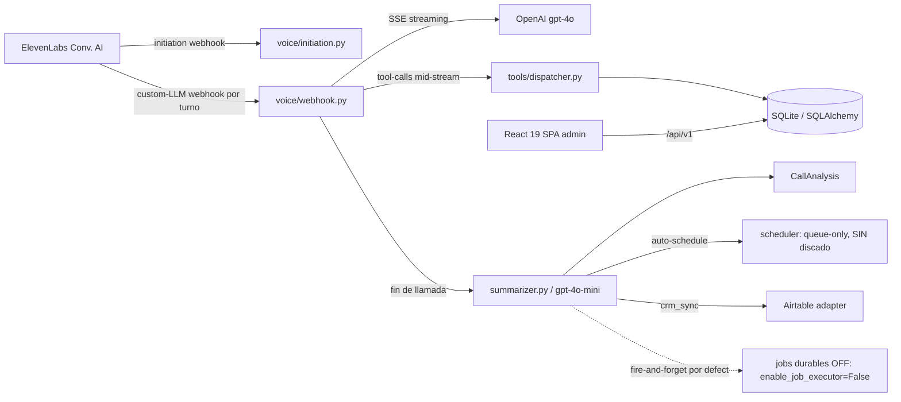

# 00 — Resumen Ejecutivo

> Auditoría técnica de estado actual de **Qora**, plataforma de call-center outbound asistido por IA.
> Documento de entrada: la profundidad vive en los documentos 01–19. Aquí va lo esencial, denso y anclado a evidencia.
> Fecha de auditoría: 2026-06-26. Alcance: solo lectura del código en `HEAD` de la rama `docs/current-state-audit`.

**Convención de etiquetas de evidencia:** `[Confirmado por codigo]` = verificado en fuente · `[Inferido razonablemente]` = deducido de señales fuertes · `[Necesita validacion humana]` = requiere confirmación operativa/de despliegue.

---

> **Nota de revisión temporal (2026-06-26).** Esta auditoría es **estática de code-state** y, como tal, no observa la **intención ni la secuencia de roadmap** detrás de cada hallazgo. Antes de leer los riesgos como defectos, contextualizar con `20-historia-y-evolucion.md` (historia datada por PR#/commit/Engram) y `21-revision-temporal-y-ajustes.md` (revisión de framing). Los hechos de código de este documento **se conservan verbatim**; lo que sigue solo **añade contexto temporal y suaviza framing**, citando fechas y fuente:
>
> - **Discador inexistente (Riesgo #1):** es **roadmap Phase C (Real Outbound Calls)**, con C1–C8 todos `[ ]` y explícitamente "after B deployed". El comentario `scheduler/models.py:43` "Twilio dialing is Phase 8" mapea a esa Phase C. El propio `docs/ROADMAP.md` (2026-06-10/23) declara "Scheduler queue (creates scheduled calls, does not dial)" y "No real phone calls yet". Es una **brecha conocida y secuenciada por diseño**, no un defecto oculto ni una pregunta abierta: la respuesta a "¿quién marca?" es "nadie todavía, a propósito".
> - **Durabilidad post-llamada OFF (Riesgo #3):** los jobs durables DB-backed **se implementaron** en B10 (PRs #119–#122, 2026-06-25); `ENABLE_JOB_EXECUTOR=false` es un **rollout gateado por diseño** con paso de roadmap explícito "set true after merge & deploy" (Engram #2139/#2142). La durabilidad **existe**, está **pendiente de activación**. El riesgo real es recordar el flip al/antes del deploy, no que esté "roto".
> - **Defaults de seguridad abiertos (Riesgo #2):** B5/B6/B7 (PRs #107/#109/#111, 2026-06-22/23) **construyeron** auth de API admin, secreto de webhook opt-in y `QORA_ALLOWED_ORIGINS` configurable (reemplaza el allow-all hardcodeado para producción). La capacidad de lock-down **ya existe**; los valores abiertos son **defaults de desarrollo** y el producto **aún no está desplegado** (B2 "do last after security hardening"). El hallazgo se mantiene (defaults abiertos) pero como **postura pre-deploy con hardening ya disponible**, no como una vulnerabilidad activa en producción.
> - **Capas de datación en `docs/ROADMAP.md`:** la **tabla de fases** es la fuente de verdad vigente (B5/B6/B7 = `[x]`); la **prosa "Current State" con "No authentication"** quedó **STALE** tras B5 (auth completada 2026-06-22/23). `README.md:11` también desfasa. Es **layering temporal**, de menor severidad que una contradicción.
> - **Ítems re-descubiertos ya rastreados:** "tipos TS manuales con drift" (Recomendación #8) = roadmap **P4**; "turnos agent/user duplicados en webhook" y endpoints de historial débiles = roadmap **P3**; conflación `leads.status` CRM vs interno = roadmap **P2**. Son known-issues **ya trackeados**, no hallazgos novedosos.

---

## 1. Qué hace HOY el producto (realidad enviada)

Qora es, en su forma actual, un **servidor de webhook "Custom LLM" en FastAPI** que actúa como cerebro conversacional para agentes de voz de **ElevenLabs Conversational AI**. Cuando ElevenLabs atiende/coloca una llamada, invoca a Qora en dos puntos: (a) un webhook de *initiation* que inyecta contexto del lead antes de hablar, y (b) un webhook *custom-LLM* que, turno a turno, hace streaming SSE contra **GPT-4o** de OpenAI, interceptando *tool-calls* a mitad de stream para ejecutar herramientas de negocio (capturar datos, leer perfil del lead, historial, pain points, cargar skill). Este núcleo de voz está **implementado y es la pieza más madura del producto**. `[Confirmado por codigo]` `backend/app/voice/webhook.py`, `backend/app/voice/initiation.py`, `backend/app/ai/llm_streaming.py`, `backend/app/tools/registry.py`.

Al cerrarse una llamada, corre un **pipeline post-llamada**: un *summarizer* analiza la transcripción en múltiples dimensiones usando **gpt-4o-mini** (no gpt-4o), persiste un `CallAnalysis`, actualiza memoria/perfil del lead, puede auto-agendar un seguimiento y sincronizar el resultado al CRM. El único CRM integrado es **Airtable**, con patrón puerto/adaptador (push, pull e import), activo en la práctica solo para el tenant `quintana-seguros`. `[Confirmado por codigo]` `backend/app/summarizer.py`, `backend/app/analysis/universal/*`, `backend/app/integrations/` (CRMPort + AirtableAdapter).

Alrededor del núcleo hay una **UI admin React 19** que cubre dashboard, gestión de leads, detalle de llamada con análisis, analytics, y un panel de administración de clientes/agentes/integraciones multi-tenant. La capa `api/*` del frontend está alineada 1:1 con los routers del backend. `[Confirmado por codigo]` `frontend/src/features/*`, `frontend/src/api/*`.

**Dos limitaciones definen el estado real del producto frente a su promesa de "outbound call center":**

1. **No existe discador.** El scheduler es *queue-only*: promueve `ScheduledCall` de `pending` a `in_progress`, pero **ningún componente coloca la llamada saliente real** — el discado por Twilio está marcado como "Phase 8" no implementada. El lazo de automatización de seguimientos NO se cierra end-to-end. `[Confirmado por codigo]` `backend/app/scheduler/models.py:43`, `backend/app/scheduler/service.py` (`mark_due_calls_in_progress`).
2. **La durabilidad post-llamada está apagada por defecto.** Existe una infraestructura de *jobs durables* DB-backed (tabla `background_jobs`, executor con retry/backoff/recovery), pero está gateada por `enable_job_executor=False`; en el camino por defecto summarize/crm_sync/transcript_flush corren *fire-and-forget*, y un crash entre el fin de llamada y el análisis pierde el resultado. `[Confirmado por codigo]` `backend/app/core/config.py:152`, `backend/app/calls/service.py`.

> **Nota de revisión temporal (2026-06-26):** ambas limitaciones son **estado de roadmap conocido y datado**, no defectos ocultos. (1) El discado es **Phase C (Real Outbound Calls)**, C1–C8 todos `[ ]` "after B deployed"; el propio `docs/ROADMAP.md` documenta el scheduler como "queue (does not dial)" — el lazo abierto es **deliberado y secuenciado**, no una omisión. (2) Los jobs durables **se implementaron** en B10 (PRs #119–#122, 2026-06-25); `enable_job_executor=False` es un **gating de rollout por diseño** con paso de activación post-deploy documentado (Engram #2139/#2142). El camino fire-and-forget descrito es **correcto como hecho de código**; la durabilidad está **construida y pendiente de activar**, no ausente. Detalle en `20-historia-y-evolucion.md`.

Funciones anunciadas en la UI pero **no implementadas**: import CSV de leads (placeholder "Coming Soon"), analytics "Custom" sin date pickers, creación de leads desde UI. El import de Airtable existe en backend pero **no tiene consumidor en el frontend**. `[Confirmado por codigo]` `frontend/src/features/import/page.tsx`, `backend/app/integrations/crm_router.py`.

---

## 2. Cómo está armado (stack + arquitectura en breve)

**Stack:** Backend **FastAPI** (Python 3.11) · **SQLite/SQLAlchemy async** (aiosqlite, WAL) gestionado por **Alembic** · Frontend **React 19 + Vite + React Router 7 + TanStack Query** · IA: **OpenAI GPT-4o** (voz en vivo, streaming) y **gpt-4o-mini** (análisis post-llamada) · Voz: **ElevenLabs Conversational AI** · CRM: **Airtable**. Despliegue: contenedor único multi-stage (node22 build + python3.11-slim), puerto `:8000`, SQLite en volumen nombrado. `[Confirmado por codigo]` `Dockerfile`, `docker-compose.yml`, `backend/app/core/database.py`.

**Arquitectura:** monorepo organizado por dominio (no por capas técnicas; `app/api/routes/` está vacío, los routers viven por dominio bajo `/api/v1`). El arranque (`lifespan`) valida secretos con fail-fast, inicializa SQLite con WAL, siembra datos y lanza **tres tareas background de 60s** (cleanup de sesiones TTL, sweeper de sesiones stale, scheduler tick). `[Confirmado por codigo]` `backend/app/main.py`.

**Datos:** 11 tablas SQLAlchemy sobre una única `Base`, **sin relaciones ORM** (solo FKs a nivel de columna) y **sin enforcement de FK en runtime** (no se ejecuta `PRAGMA foreign_keys=ON`). Hay *schema-drift* significativo entre los modelos ORM y la migración baseline de Alembic (p.ej. `background_jobs` no importada en `env.py`, `broker_name` solo en DB), lo que hace **inseguro `alembic autogenerate` hoy**. Conviven ~14 scripts `migrate_*.py` legacy ya superados por Alembic. `[Confirmado por codigo]` `backend/app/**/models.py`, `backend/alembic/`, `backend/scripts/migrate_*.py`.

**Auth:** la única autenticación aplicada es **una sola API key estática compartida** (`QORA_API_KEY`) vía `Authorization: Bearer`, validada por `require_api_key` en rutas admin. **No hay usuarios, login, JWT, roles ni permisos.** El multi-tenancy por `client_id` es *scoping de datos*, NO un límite de autorización: cualquier portador de la key opera sobre cualquier `client_id`. `[Confirmado por codigo]` `backend/app/core/auth.py`, `backend/app/core/config.py`.

---

## 3. Estado de madurez por área

| Área | Estado | Nota |
|---|---|---|
| Núcleo de voz (custom-LLM SSE + tool-calling) | ✅ Implementado | Pieza más madura; función monolítica `_process_custom_llm_request` (~530 líneas, 3 caminos de contexto). `02`, `06` |
| Webhook initiation (contexto pre-llamada) | ✅ Implementado | Inyecta perfil del lead antes de hablar. `09` |
| Pipeline post-llamada (análisis + memoria) | ✅ Implementado | gpt-4o-mini, multi-dimensión; fan-out de ~10+ llamadas OpenAI por llamada. `03` |
| Integración Airtable (push/pull/import) | ✅ Implementado | Puerto/adaptador; activo solo en `quintana-seguros`. `09` |
| CRUD multi-tenant (clients/agents/leads) | ✅ Implementado | REST bajo `/api/v1`, ~50 endpoints en 12 routers. `06` |
| Frontend admin (dashboard/leads/analytics) | ✅ Implementado | SPA bien estructurada, 47 archivos de test, `api/*` alineado 1:1. `05` |
| Jobs durables (executor B10) | ⚠️ Implementado pero OFF | Gateado por `enable_job_executor=False`; default = fire-and-forget. `10` |
| Scheduler de seguimientos | ⚠️ Parcial (queue-only) | Promueve estado pero NO disca; "Phase 8" ausente. **Lazo abierto.** `04` |
| Import de leads (CSV / Airtable) | ⚠️ Parcial / gap | CSV = placeholder UI; import Airtable existe en backend sin UI. `03`, `12` |
| Selector de tools del admin | 🔴 Desincronizado | Ofrece 3 tools removidas, omite las 5 activas. `03` |
| Auth / roles / permisos | 🔴 Mínimo | Una key estática compartida; sin usuarios ni RBAC. `08` |
| Seguridad de endpoints de voz/demo | 🔴 Defaults inseguros | Webhook auth OFF, CORS `*`, `/demo/leads` expone PII. `13` |
| Observabilidad | ⚠️ Parcial | structlog JSON, pero sin request/correlation ID ni handlers 500. `13` |
| Storage / uploads | ✅ N/A por diseño | Sin object storage; todo en SQLite; sin grabaciones persistidas. `12` |

---

## 4. Top riesgos

| # | Riesgo | Sev. | Evidencia |
|---|---|---|---|
| 1 | **Producto incompleto vs promesa:** el scheduler nunca disca (queue-only), el lazo outbound de seguimientos no cierra end-to-end | 🔴 Alta | `scheduler/service.py mark_due_calls_in_progress`; `scheduler/models.py:43` |
| 2 | **Endpoints de voz sin auth por defecto + CORS `*`:** el webhook que dispara GPT-4o e inyecta contexto de tenant está abierto | 🔴 Alta | `core/config.py:135,141`; `webhook.py require_webhook_secret` no-op |
| 3 | **Durabilidad post-llamada apagada:** summarize/crm_sync/transcript fire-and-forget; un crash pierde el análisis de la llamada | 🔴 Alta | `core/config.py:152`; `calls/service.py` |
| 4 | **Auth sin frontera de autorización:** una sola key estática da acceso a todos los `client_id`; bearer estático embebido en el bundle del frontend | 🔴 Alta | `core/auth.py require_api_key`; `frontend/src/api/client.ts` |
| 5 | **No escala horizontalmente:** `session_store` y `JobExecutor` son singletons in-process + SQLite single-file; varios workers fragmentan sesiones y arriesgan doble procesamiento en `recover()` | 🟠 Media | `voice/session.py:204`; `jobs/executor.py:463` |
| 6 | **Schema-drift ORM vs Alembic baseline:** `autogenerate` inseguro; `background_jobs` no importada en `env.py`, FKs/índices desalineados | 🟠 Media | `backend/alembic/env.py`; `**/models.py` |
| 7 | **`/demo` y `/api/v1/demo/*` auth-exempt** exponen leads (PII) del cliente demo a cualquiera con la URL | 🟠 Media | `demo/router.py` |
| 8 | **Backups de DB no automatizados:** `migrate.py` solo verifica presencia de `qora.db.bak-*` y `docker-compose` fija `QORA_SKIP_BACKUP_CHECK=1`, saltando el guard en cada restart | 🟠 Media | `scripts/migrate.py`; `docker-compose.yml:35` |

> **Nota de revisión temporal (2026-06-26):** los riesgos de la tabla siguen siendo válidos a nivel código, pero tres deben leerse con su **contexto de roadmap** (no como defectos):
> - **#1 (scheduler no disca):** es **Phase C** del roadmap, C1–C8 `[ ]` "after B deployed"; brecha **planificada**, no defecto. La severidad como "producto incompleto vs promesa" aplica al *estado de entrega*, no a un fallo del código existente.
> - **#2 (voz sin auth + CORS `*`):** la auth de webhook (opt-in, #111) y `QORA_ALLOWED_ORIGINS` (#111, 2026-06-23) **ya están construidas**; los valores abiertos son **defaults de dev** sobre un producto **aún no desplegado** (B2 último). Postura **pre-deploy** con hardening disponible; requiere el flip antes de B2.
> - **#3 (durabilidad apagada):** los jobs durables **existen** (B10, #119–#122, 2026-06-25); `enable_job_executor=False` es **gating por diseño** con activación post-deploy planificada (Engram #2139/#2142). Riesgo real = recordar activarlo, no "roto".
>
> El **#6 (schema-drift Alembic)** y los `migrate_*.py` que la Recomendación #6 propone archivar quedaron **DEPRECATED el 2026-06-19** al aterrizar la fundación Alembic (#103, commit `177819b` "docs(db): deprecate legacy scripts"): se retienen por historia, superados por el baseline Alembic. El gap de observabilidad (área "Observabilidad" / sin correlation ID ni handlers 500) corresponde a **roadmap B9** (Structured logging + error monitoring), el **próximo ítem `[ ]`**, no un descuido. Fuentes y fechas en `20-historia-y-evolucion.md` y `21-revision-temporal-y-ajustes.md`.

---

## 5. Top recomendaciones

| # | Acción | Tipo | Prioridad |
|---|---|---|---|
| 1 | **Cerrar el lazo outbound o marcar el scheduler como no-GA:** implementar el discado ("Phase 8") o documentar explícitamente que los seguimientos no se ejecutan solos | feature-gap | 🔴 Alta |
| 2 | **Endurecer defaults de seguridad:** activar `qora_webhook_auth_enabled` por defecto, restringir CORS, proteger/segregar `/demo` y `/api/v1/tenants/{id}` | seguridad | 🔴 Alta |
| 3 | **Encender y validar el executor durable** (`enable_job_executor=true`) o retirar la pila legacy fire-and-forget para no mantener dos caminos paralelos | resiliencia | 🔴 Alta |
| 4 | **Sincronizar el selector de tools del admin con `tools/registry.py`** (hoy ofrece 3 removidas y omite las 5 activas) | corrección | 🟠 Media |
| 5 | **Eliminar código muerto** confirmado: tools legacy (`schedule_followup.py`, `mark_not_interested.py`), helpers huérfanos de `memory.py`, paneles muertos del frontend (`ClientsPanel`, `AnalysisPanel`, `AgentsPanel`), dir vacío `static/admin/` | limpieza | 🟠 Media |
| 6 | **Resolver el schema-drift Alembic** (registrar `background_jobs` en `env.py`, alinear FKs/índices) y archivar los ~14 `migrate_*.py` legacy | mantenibilidad | 🟠 Media |
| 7 | **Reducir/batchear el fan-out post-call** (~10+ llamadas OpenAI por llamada) y cachear `crm.yaml`/contexto leído en cada turno del custom-LLM | rendimiento | 🟠 Media |
| 8 | **Generar tipos del frontend por codegen** desde el OpenAPI del backend en lugar de mantener `types.ts` a mano (riesgo de drift) | robustez | 🟠 Media |

> Limpieza menor adicional: consolidar los tres almacenes de planning (`.sdd/`, `sdd/`, `openspec/`), unificar rutas duplicadas del scheduler y rutas legacy del custom-LLM webhook, retirar o reconvertir la página `/import` placeholder. Ver `15` y `16`.

---

## 6. Límites de esta auditoría (validación humana pendiente)

Esta auditoría es **estática y de solo lectura sobre el código**; no se ejecutó el producto, no se inspeccionó el entorno de despliegue ni la base de datos viva. Requieren confirmación humana/operativa:

- **`[Necesita validacion humana]`** `DATABASE_URL` real en producción y ubicación física del `qora.db` (volumen `qora-data`); comportamiento de WAL bajo concurrencia real de múltiples workers sobre el mismo archivo.
- **`[Necesita validacion humana]`** Existencia/cadencia de un proceso externo que cree los backups `qora.db.bak-YYYYMMDD` (el repo solo verifica su presencia, no los crea).
- **`[Necesita validacion humana]`** Política de retención/purga de `transcript_turns` y `call_sessions` (sin TTL observado; crecimiento ilimitado de la DB).
- **`[Necesita validacion humana]`** Estado real de despliegue de los flags (`enable_job_executor`, `qora_webhook_auth_enabled`): los valores auditados son los *defaults del código*; el `.env` de producción podría sobrescribirlos. `enable_job_executor` **no figura en `.env.example`**, así que su valor productivo es desconocido desde el repo.
- **`[Necesita validacion humana]`** Configuración de Airtable por tenant (API keys/base IDs) — los valores de secretos no se inspeccionaron; solo se documentaron NOMBRES de variables.
- **`[Necesita validacion humana]`** Intención de producto detrás de los placeholders (import CSV, analytics "Custom") y de los directorios residuales: ¿roadmap activo o deuda a retirar?
- **Nota documental:** la documentación existente en `docs/` presenta desfases con el código (p.ej. `README.md` declara Phase B7 mientras el código corre Phase B10; `docs/architecture.md` afirma que el scheduler disca). **En todos los casos, el código es la fuente de verdad** y esta auditoría se ancló a él. Ver `11` y `17`.

---

*Detalle por área en los documentos 01–19 de este directorio. Inventario archivo por archivo en `14-inventario-archivo-por-archivo.md` y `file-inventory.csv`; código muerto en `15`; riesgos y deuda en `17`; preguntas abiertas en `18`.*
