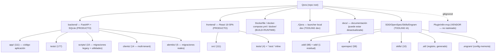

# Área 1 — Mapa general del repositorio Qora

> Auditoría read-only del layout del repositorio Qora: estructura top-level, propósito de cada directorio, stack declarado con versiones, entry points, conteos por área y clasificación (producto / tooling / generado-vendor). Todo el contenido se verificó contra el código; donde un documento del repo contradice al código, gana el código.

Repo root: `/Users/mati/Desktop/Qora` — rama actual `docs/current-state-audit`. Ground truth de archivos vía `git ls-files` (656 archivos rastreados).

---

## 1. Resumen ejecutivo del layout

Qora es un monorepo de dos artefactos de producto (backend FastAPI + frontend React) más una capa grande de tooling de desarrollo asistido por IA (SDD, OpenSpec, skills, Engram, n8n). El producto real vive en `backend/` y `frontend/`; el resto es documentación, planificación e instrumentación de agentes.

Conteo de archivos rastreados por área top-level [Confirmado por codigo — `git ls-files | awk -F/ '{print $1}' | sort | uniq -c`]:

| Área top-level | Archivos | Clasificación |
|---|---|---|
| `backend/` | 331 | Producto (app + tests + scripts + clients + alembic) |
| `frontend/` | 135 | Producto (SPA React) |
| `.sdd/` | 88 | Tooling (artefactos SDD / planning) |
| `openspec/` | 58 | Tooling (specs y propuestas OpenSpec) |
| `docs/` | 21 | Documentación |
| `skills/` | 10 | Tooling (skills de desarrollo) |
| `.atl/` | 2 | Tooling (registro de skills, generado) |
| `sdd/` | 1 | Tooling (residual — ver §7 anomalías) |
| `docker/` | 1 | Producto (entrypoint de runtime) |
| `.engram/` | 1 | Tooling (config de memoria) |
| Raíz: `docker-compose.yml`, `Dockerfile`, `.dockerignore`, `README.md`, `AGENTS.md`, `Qora`, `.env.example`, `.gitignore` | 8 | Mixto (build/runtime + docs) |

Volumen de código de producto [Confirmado por codigo — `wc -l`]: `backend/app/**/*.py` = 22.064 líneas; `frontend/src/**/*.{ts,tsx}` = 19.427 líneas.

`Plugin/` aparece en `AGENTS.md` y en el scope, pero **está gitignored** (`.gitignore` línea `Plugin/`) y existe en disco como un árbol vendorizado `Plugin/n8n-mcp/` (proyecto de terceros n8n-mcp). No forma parte del build ni de los 656 archivos rastreados → **no auditar salvo referencia** [Confirmado por codigo — `fd . Plugin` lista `Plugin/n8n-mcp/...`; `.gitignore`].

---

## 2. Backend (`backend/`) — Producto

331 archivos. Desglose por subdirectorio [Confirmado por codigo — `git ls-files backend`]:

| Subárea | Archivos | Propósito |
|---|---|---|
| `app/` | 111 | Código de la aplicación FastAPI |
| `tests/` | 177 | Suite de tests (unit 117, integration 23, jobs 5, core 4, scripts 3, otros) |
| `scripts/` | 18 | CLI de migración/seed/smoke (mayoría legacy, ver §7) |
| `clients/` | 14 | Configuración multi-tenant (prompts, agentes, skills runtime, crm.yaml) |
| `alembic/` | 5 | Sistema de migraciones real (env + 3 versiones) |
| raíz backend | `pyproject.toml`, `uv.lock`, `pytest.ini`, `alembic.ini`, `qora_cli.py`, `README.md` | Config y CLI |

### 2.1 `backend/app/` — módulos de dominio

Estructura por paquete [Confirmado por codigo — `git ls-files backend/app`]:

- `main.py` — entry point FastAPI (factory `create_app`, lifespan, routers).
- `core/` (6): `config.py` (Settings pydantic), `auth.py`, `credentials.py`, `database.py`, `logging.py`.
- `voice/` (5): `initiation.py`, `webhook.py`, `session.py`, `context.py` — flujo de llamada custom-LLM.
- `analysis/` (19): pipeline post-llamada `universal/*` (interest, outcome, objections, next_action, profile_facts, summary, data_corrections, etc.) + `schema.py`, `enums.py`.
- `tools/` (11): herramientas del agente (`capture_data`, `get_lead_*`, `schedule_followup`, `mark_not_interested`) + `dispatcher.py`, `registry.py`, `skill_loader.py`.
- `integrations/` (11): CRM port/adapters (`adapters/airtable/adapter.py`), `crm_config.py`, `crm_import_service.py`, `crm_sync_service.py`, `field_mapping.py` + routers.
- `jobs/` (9): ejecutor durable de jobs (`executor.py`, `registry.py`, `models.py`, `queries.py`, `handlers/{summarize,crm_sync,transcript_flush}.py`) — fundación de background jobs (Phase B10).
- `scheduler/` (5), `leads/` (5), `calls/` (5), `analytics/` (5), `prompts/` (4), `tenants/` (4), `agents/` (3), `elevenlabs/` (3), `clients/` (3), `ai/` (2: `llm_streaming.py`), `demo/` (2).
- Sueltos: `sweeper.py`, `summarizer.py`, `memory.py`, `analysis_schema.py`, `static/` (página demo de voz).

[Inferido razonablemente] La aplicación está organizada por dominio (screaming-architecture parcial): cada paquete agrupa `models/router/service/schemas`. Hay duplicación nominal de "clients" (paquete `app/clients/` de dominio vs `backend/clients/` de configuración tenant) y de "skill_loader" (`app/tools/skill_loader.py` y `app/prompts/skill_loader.py`) — verificar si convergen o divergen (no es scope de Área 1).

### 2.2 `backend/clients/` — multi-tenant

Tres tenants en disco: `_template/`, `qora-demo/`, `quintana-seguros/` [Confirmado por codigo]. Cada uno aporta `system-prompt.md`, `skills/registry.yaml`, `*.agent-skill.md`; `quintana-seguros/crm.yaml` declara integración CRM. `main.py` siembra `seed_quintana` y `seed_qora_demo` al arranque.

### 2.3 Migraciones — dos sistemas coexistiendo

- **Real / vigente**: Alembic (`alembic.ini`, `alembic/versions/2024…_baseline`, `20260624_…add_background_jobs`, `20260625_…transcript_finalization`). El arranque depende de `scripts/migrate.py` (= `alembic upgrade head`) tanto en `./Qora` como en `docker/entrypoint.sh` [Confirmado por codigo — `docker/entrypoint.sh:15`, `Qora:280`].
- **Legacy**: 16 scripts `backend/scripts/migrate_*.py` one-off (p. ej. `migrate_phase2.py`, `migrate_bi_columns.py`, `migrate_extraction_v2.py`). [Inferido razonablemente] superados por Alembic; candidatos a dead code (ver §7).

---

## 3. Frontend (`frontend/`) — Producto

135 archivos; `src/` = 111 [Confirmado por codigo]. Estructura:

| Subárea | Archivos | Propósito |
|---|---|---|
| `src/features/` | 54 | Vistas por feature: `leads` (15), `admin` (15), `dashboard` (10), `analytics` (9), `calls` (4), `import` (1) |
| `src/design/` | 30 | Design system: `components/` (26), `tokens.css`, `globals.css`, `qora-design-system.md` |
| `src/api/` | 18 | Clientes HTTP + hooks TanStack Query (`client.ts`, `clients.ts`, `leads.ts`, `calls.ts`, `analytics.ts`, `integrations.ts`, `agents.ts`, `hooks.ts`, `types.ts`) con tests `.test.ts(x)` colocalizados |
| `src/` raíz | `main.tsx`, `router.tsx`, `app-layout.tsx`, `router.test.tsx` | Bootstrap + routing |
| `src/lib/`, `src/config/`, `src/hooks/` | 2/2/1 | Utilidades |
| `tests/` | 4 | Tests fuera de `src` |
| raíz frontend | `package.json`, `vite.config.ts`, `vitest.config.ts`, 3× `tsconfig*.json`, `eslint.config.js`, `index.html`, `.env.example` | Config |

[Inferido razonablemente] Arquitectura feature-first con design system propio y data-layer centralizado en `api/`; tests unitarios colocalizados (patrón `*.test.tsx`) + carpeta `tests/`.

---

## 4. Stack declarado (versiones)

### Backend [Confirmado por codigo — `backend/pyproject.toml`]
- Python `>=3.11`; build `hatchling`; gestor de entorno `uv` (`uv.lock`, pin `uv==0.7.12` en Dockerfile).
- Runtime: `fastapi>=0.115.0`, `uvicorn[standard]>=0.32.0`, `pydantic>=2.0`, `pydantic-settings>=2.0`, `openai>=1.50.0`, `sqlalchemy[asyncio]>=2.0.0`, `aiosqlite>=0.20.0`, `structlog>=24.4.0`, `click>=8.0`, `pyyaml>=6.0`, `pyairtable>=2.3.0`, `alembic>=1.13.0`.
- Dev: `pytest>=8.3.0`, `pytest-asyncio>=0.24.0`, `pytest-mock`, `httpx`, `respx`. `asyncio_mode = auto`, `testpaths=["tests"]`.

> Nota: ElevenLabs se integra vía HTTP (no hay SDK declarado en `pyproject.toml`); `app/elevenlabs/service.py` lo confirma como cliente propio [Inferido razonablemente].

### Frontend [Confirmado por codigo — `frontend/package.json`]
- `react ^19.1.0`, `react-dom ^19.1.0`, `react-router ^7.5.2`, `@tanstack/react-query ^5.74.4`, Radix UI (`dialog`, `dropdown-menu`, `tabs`, `toggle-group`, `tooltip`).
- Dev: `vite ^6.3.3`, `vitest ^3.1.2`, `typescript ^5.8.3`, `tailwindcss ^4.1.4` (`@tailwindcss/vite`), `eslint ^9.25.1`, `@testing-library/*`, `msw ^2.7.5`, `jsdom`, `prettier ^3.5.3`.
- Scripts: `dev` (vite), `build` (`tsc -b && vite build`), `test` (`vitest run`), `lint`.

---

## 5. Entry points y build

| Entry point | Archivo | Rol |
|---|---|---|
| Backend ASGI | `backend/app/main.py` → `app = create_app()` | Factory FastAPI; registra routers `/api/v1/*`, mounts `/demo`, redirect `/admin`, catch-all SPA en Docker [Confirmado por codigo — `main.py:271-297, 396, 456`] |
| Frontend SPA | `frontend/src/main.tsx` | `createRoot` + `RouterProvider` + `QueryClientProvider` [Confirmado por codigo] |
| CLI backend | `backend/app/qora_cli.py` (sí: `backend/qora_cli.py` rastreado) | Click CLI [Inferido razonablemente, no leído en detalle] |
| Build imagen | `Dockerfile` | Multi-stage: `node:22-alpine` compila frontend → `python:3.11-slim` corre uvicorn y sirve `static-frontend/` [Confirmado por codigo] |
| Orquestación | `docker-compose.yml` | Servicio único `qora` puerto 8000, volumen `qora-data` (SQLite), healthcheck `/api/v1/health`, fuerza `DATABASE_URL=sqlite+aiosqlite:////app/data/qora.db` y `QORA_SKIP_BACKUP_CHECK=1` [Confirmado por codigo] |
| Entrypoint runtime | `docker/entrypoint.sh` | `python scripts/migrate.py` y `exec uvicorn app.main:app` [Confirmado por codigo] |
| Launcher local | `./Qora` (script bash ejecutable en raíz) | Levanta backend (uvicorn `--reload`), `ngrok http 8000` y frontend (`vite`); corre Alembic antes; resuelve symlink para usarse desde PATH [Confirmado por codigo — `Qora:280-299`] |

Observaciones de arranque [Confirmado por codigo — `main.py` lifespan]:
- El lifespan **no** crea schema (`create_all` removido); depende de migración previa. Hace seed de tenants+leads, lanza tareas de fondo: `_session_store_cleanup_task`, `stale_session_sweeper`, `scheduler_tick`, y `job_executor.recover()` solo si `ENABLE_JOB_EXECUTOR=true` (flag-off = no-op) [Confirmado por codigo — `main.py:198-217`].
- Despliegue single-container sirve API + SPA en el mismo puerto 8000; en dev local el SPA corre aparte en Vite :5173 y el backend redirige `/admin` a `frontend_url` [Confirmado por codigo — `main.py:414-424`].

---

## 6. Variables de entorno (solo nombres)

`.env.example` raíz [Confirmado por codigo — nombres únicamente, sin valores]: `ELEVENLABS_AGENT_ID`, `ELEVENLABS_API_KEY`, `ELEVENLABS_VOICE_ID`, `OPENAI_API_KEY`, `QORA_API_KEY`, `QUINTANA_AIRTABLE_API_KEY`.

`frontend/.env.example` [Confirmado por codigo]: `VITE_API_BASE_URL`, `VITE_API_KEY`.

Variables adicionales referenciadas en código (no en `.env.example`) [Confirmado por codigo — `main.py`/`docker-compose.yml`]: `DATABASE_URL`, `QORA_SKIP_BACKUP_CHECK`, `ENABLE_JOB_EXECUTOR`, `QORA_ALLOWED_ORIGINS`, `QORA_DOCS_ENABLED`, `QORA_WEBHOOK_AUTH_ENABLED`, `FRONTEND_URL`. Su validación vive en `app/core/config.py` y `credentials.py` (fuera de scope de Área 1). El `.env` se carga desde la raíz del repo (`load_dotenv(repo-root/.env)`), única fuente declarada (B8) [Confirmado por codigo — `main.py:48`].

> Secrets: ningún valor fue impreso ni copiado; solo nombres de variables.

---

## 7. Tooling, generados/vendor y anomalías

### 7.1 Tooling de desarrollo (no es producto)
- `.sdd/` (88): artefactos SDD por cambio (`archive/`, `qora-phase0..2`, `airtable-crm-integration`, etc.). Tooling de planificación.
- `openspec/` (58): 7 cambios con `proposal/design/specs/tasks/verify-report` (`phase-b-*`, `post-call-analysis-bi-friendly`, `cubora-accumulated-dimension-rankings`). Tooling de specs.
- `skills/` (10): skills de desarrollo (`skill-creator`, `qora-client-agent-setup`, `qora-agent-designer`, `elevenlabs-config`). `AGENTS.md` aclara que NO son features de producto.
- `.atl/` (2): `skill-registry.md` + `.skill-registry.cache.json` — índice **auto-generado** (`Auto-generated by gentle-ai skill-registry refresh`). Ambos aparecen modificados en `git status` inicial.
- `.engram/config.json`: `{"project_name": "Qora"}` — config de memoria persistente.

### 7.2 Generado / vendor — "no auditar salvo referencia"
- `Plugin/n8n-mcp/` — árbol vendorizado de terceros, **gitignored**, presente en disco. No entra en build de producto.
- Gitignored adicionales (no presentes como rastreados): `node_modules/`, `frontend/dist/`, `.venv/`, `__pycache__/`, `*.db`, `.env`, `*.log`, `.mcp.json` [Confirmado por codigo — `.gitignore`].

### 7.3 Anomalías detectadas
1. **`sdd/` (top-level, 1 archivo)** vs **`.sdd/` (88)** vs **`openspec/` (58)**: tres almacenes de artefactos de planificación coexisten. `sdd/` solo contiene `sdd/post-call-analysis-bi-friendly/exploration.md`, que duplica un cambio ya presente en `openspec/changes/post-call-analysis-bi-friendly/` → residual/legacy, candidato a remoción [Confirmado por codigo].
2. **16 scripts `backend/scripts/migrate_*.py`** one-off conviven con Alembic (sistema vigente). Probable dead code post-migración a Alembic [Inferido razonablemente — `docker/entrypoint.sh` y `Qora` solo invocan `scripts/migrate.py`, no los `migrate_*.py` individuales].
3. **Desfase docs vs código de "fase"**: `README.md` declara "Phase B7 Complete", pero `main.py` referencia "Phase B10" (job executor) y el último commit de roadmap marca B10 completo. Los docs van por detrás del código [Confirmado por codigo — `README.md:11` vs `main.py:195`, `git log`].
4. **No hay manifiesto de monorepo en la raíz** (sin `pyproject.toml`/`package.json` raíz ni workspace manager): backend y frontend se gestionan por separado; la unión ocurre solo en el `Dockerfile` y en `./Qora`. [Inferido razonablemente]
5. **`./Qora` exige `ngrok` obligatorio** (falla si no está instalado/autenticado), acoplando el dev local a un túnel público para los webhooks de ElevenLabs [Confirmado por codigo — `Qora:256`].

---

## 8. Cobertura y límites

- [Confirmado por codigo] Layout top-level, conteos por área, stack y versiones, entry points, Dockerfile/compose/entrypoint, launcher `./Qora`, nombres de env vars y clasificación producto/tooling/vendor.
- [Necesita validacion humana] Si los 16 `backend/scripts/migrate_*.py` son efectivamente dead code o aún se ejecutan manualmente en algún runbook no versionado.
- [Necesita validacion humana] Estado real de `sdd/` (1 archivo): confirmar que es residual y eliminable, no un store activo de otra herramienta.
- [Necesita validacion humana] Contenido y rol exacto de `Plugin/n8n-mcp/` (gitignored): no auditado por estar fuera del repo rastreado; confirmar si se usa en producción o es experimento local.
- [Necesita validacion humana] Versión/fase real del producto frente a la documentada (README dice B7; código sugiere B10).
- [Inferido razonablemente] La caracterización funcional de cada módulo backend/frontend se basa en nombres de archivos y `main.py`; el detalle de comportamiento corresponde a otras áreas de la auditoría.
</content>
</invoke>
