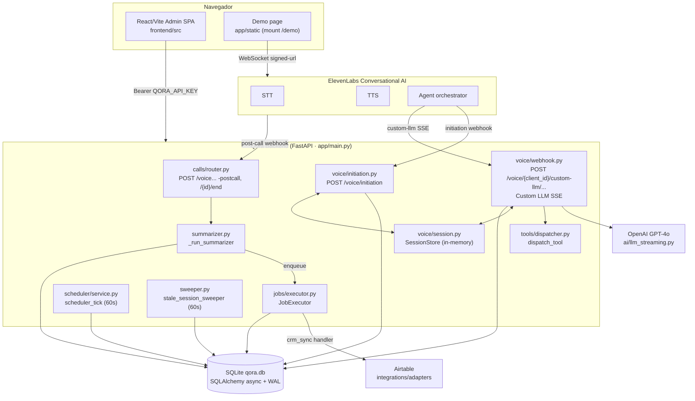
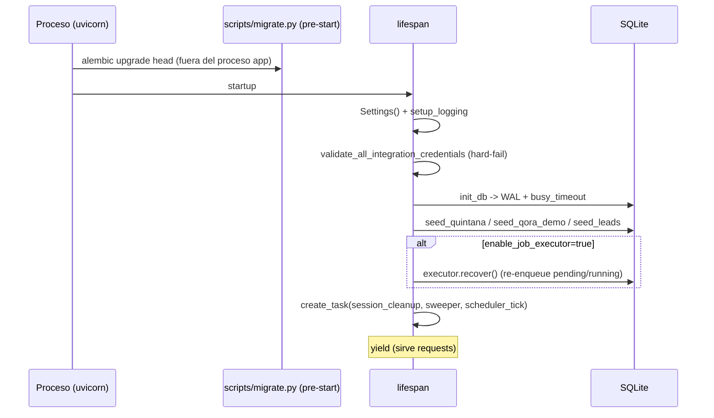
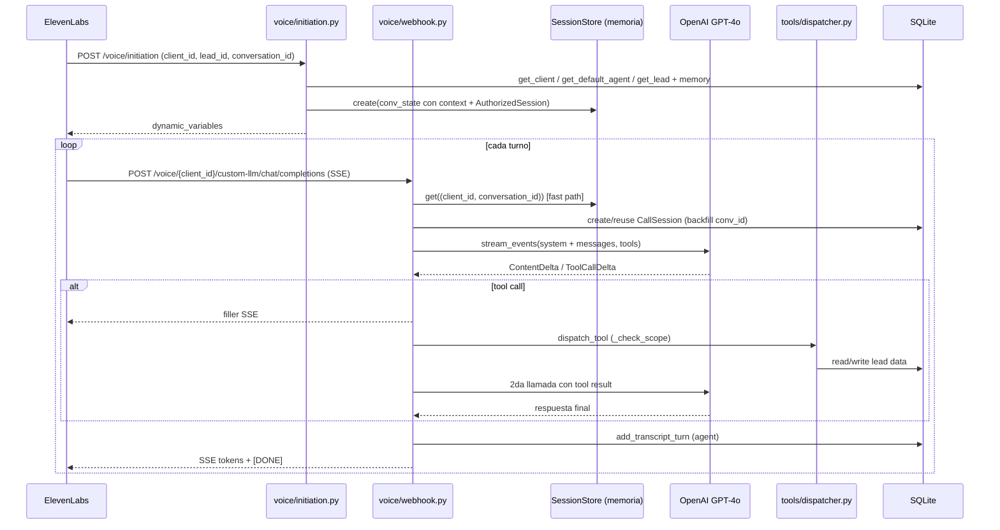
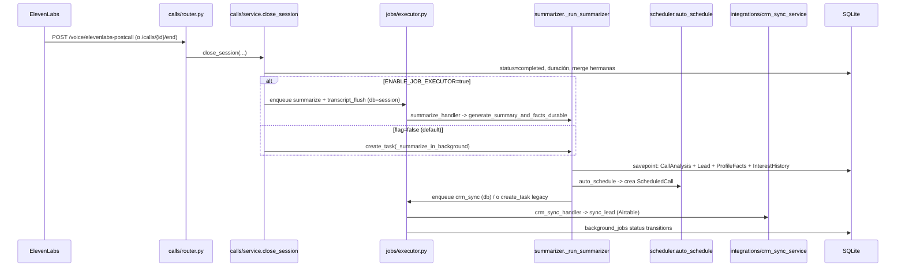
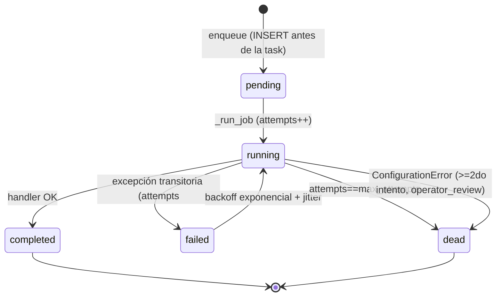

# Auditoría Qora — Área 2: Arquitectura general del sistema

> Propósito: documentar, contra el código real, la arquitectura end-to-end de Qora — arranque de la aplicación, capas, modelo multi-tenant, el ciclo de vida completo de una llamada de voz saliente, el pipeline post-llamada, la infraestructura de jobs durables y el scheduler. Cada afirmación relevante lleva evidencia (archivo + símbolo) y una etiqueta de clasificación. Las discrepancias entre la documentación existente y el código se señalan explícitamente; ante conflicto, **gana el código**.

Convención de etiquetas:
- `[Confirmado por codigo]` — verificado leyendo el código fuente.
- `[Inferido razonablemente]` — deducido de evidencia parcial pero sólida.
- `[Necesita validacion humana]` — requiere confirmar con infraestructura externa, runtime o personas.

---

## 1. Vista de alto nivel

Qora es un servidor de webhook "Custom LLM" para ElevenLabs Conversational AI, escrito en **FastAPI (Python 3.11)**, que conecta el motor de voz de ElevenLabs con **OpenAI GPT-4o**, una base de datos **SQLite vía SQLAlchemy async (aiosqlite)** y, opcionalmente, un CRM externo (**Airtable**) por cliente. La UI de administración es un SPA **React 19 / Vite**. `[Confirmado por codigo]` — `backend/app/main.py` (docstring, `create_app`), `backend/app/core/config.py` (`Settings`), `backend/app/core/database.py` (`create_async_engine`).

Piezas principales:

| Pieza | Rol | Evidencia |
|-------|-----|-----------|
| Frontend React/Vite | UI admin (`/admin`), llama a la API REST con Bearer token | `frontend/src/api/client.ts` (`BASE`, `API_KEY`); `main.py` `redirect_to_frontend_admin` |
| FastAPI app | App factory + routers de dominio + middleware + lifespan | `backend/app/main.py` `create_app`, `lifespan` |
| ElevenLabs Conversational AI | STT + TTS + orquestación de la conversación; invoca los webhooks de Qora | `backend/app/voice/initiation.py`, `backend/app/voice/webhook.py` |
| OpenAI GPT-4o | LLM real detrás del "Custom LLM" (streaming SSE) | `webhook.py` `OpenAIStreamingClient`, `_stream_llm_response` |
| SQLite (`qora.db`) | Persistencia multi-tenant (clients, agents, leads, calls, jobs, scheduler) | `core/database.py`, modelos en `*/models.py` |
| CRM (Airtable) | Sync de leads post-llamada, configurado por cliente en `crm.yaml` | `backend/clients/quintana-seguros/crm.yaml`, `app/integrations/crm_sync_service.py` |
| Background Job Executor | Ejecución durable de jobs post-llamada (DB-backed) | `backend/app/jobs/executor.py` |
| Scheduler | Cola de llamadas programadas (tick de 60s) | `backend/app/scheduler/service.py` |

### Diagrama de componentes



`[Confirmado por codigo]` para todos los nodos y aristas salvo el flujo de salida real hacia ElevenLabs para *iniciar* llamadas (ver §9: el scheduler NO disca).

---

## 2. Organización en capas del backend

El backend está organizado por **dominio (screaming-ish architecture)** bajo `backend/app/`, no por capa técnica horizontal. Cada dominio agrupa típicamente `models.py` (ORM), `service.py` (lógica), `router.py` (HTTP) y `schemas.py` (Pydantic). `[Confirmado por codigo]` — estructura de `backend/app/` (tenants, leads, calls, scheduler, jobs, voice, analytics, integrations, agents, demo).

Capas transversales en `app/core/`:
- `config.py` — `Settings` (pydantic-settings): única autoridad de variables de entorno declaradas. `[Confirmado por codigo]`
- `database.py` — motor async, `async_session_factory`, `get_session()` context manager, pragmas WAL. `[Confirmado por codigo]`
- `auth.py` — tres mecanismos de auth (admin Bearer, sesión de voz, secreto de webhook). `[Confirmado por codigo]`
- `credentials.py` — validación al arranque de credenciales CRM por cliente. `[Confirmado por codigo]`
- `logging.py` — logging estructurado JSON con structlog (`setup_logging`). `[Confirmado por codigo]` — `main.py` `setup_logging`.

Subsistemas relevantes a esta área:
- `voice/` — initiation, webhook (custom-llm), session (store en memoria), context (cache por sesión). `[Confirmado por codigo]`
- `jobs/` — executor, registry, models (`BackgroundJob`), handlers (summarize/crm_sync/transcript_flush), queries. `[Confirmado por codigo]`
- `scheduler/` — models (`ScheduledCall`), service (tick + reglas auto-schedule), router. `[Confirmado por codigo]`
- `summarizer.py` — pipeline de análisis post-llamada (fan-out de dimensiones + merge a Lead + CRM hook). `[Confirmado por codigo]`

---

## 3. Arranque de la aplicación (app factory + lifespan)

### 3.1 App factory

`create_app(docs_enabled)` construye la instancia FastAPI. `api_v1_router` es un singleton a nivel de módulo (stateless) con prefijo `/api/v1`; se comparte entre instancias. `[Confirmado por codigo]` — `main.py:253` (`api_v1_router`), `main.py:325` (`create_app`).

- `docs_url`/`redoc_url` se montan solo si `settings.qora_docs_enabled` es `True` (default `True` en dev). `[Confirmado por codigo]` — `main.py:359-373`.
- Middleware registrado: `RequestLoggingMiddleware` (log método/path/status/latencia) y `CORSMiddleware`. `[Confirmado por codigo]` — `main.py:381-387`.
- CORS por defecto `allow_origins=["*"]` (abierto), salvo que se setee `QORA_ALLOWED_ORIGINS`. `[Confirmado por codigo]` — `_parse_allowed_origins`, `config.py:141` (`qora_allowed_origins = "*"`).
- El singleton de producción `app = create_app()` se crea en import (`main.py:396`). Tests pueden invocar `create_app()` directamente; ese path expone la API v1 pero NO el redirect `/admin` ni los mounts estáticos. `[Confirmado por codigo]` — comentario en `create_app` y `main.py:396-459`.

Routers registrados en `api_v1_router` (orden en `main.py:284-297`): clients, agents (`/clients/{client_id}/agents`), tenants (alias backward-compat), leads, calls, voice initiation, voice webhook, scheduler, analytics, crm import, crm config, demo. `[Confirmado por codigo]`

Mounts adicionales sobre el singleton: `/demo` (StaticFiles, si existe `app/static`), redirect `/admin` → frontend, y un catch-all SPA (`/{full_path:path}`) que solo existe dentro de la imagen Docker cuando `app/../static-frontend/` está presente. `[Confirmado por codigo]` — `main.py:402-459`.

### 3.2 Lifespan (startup/shutdown)

Secuencia de `lifespan` (`main.py:134-246`): `[Confirmado por codigo]`

1. `Settings()` → cargado en `app.state.settings`.
2. `setup_logging(settings.log_level)`.
3. `validate_all_integration_credentials()` — escanea `backend/clients/*/crm.yaml` y hace **hard-fail** (`sys.exit`) si una integración activa referencia un env var ausente o placeholder débil.
4. `db_module.init_db(settings)` — crea engine/sesión y aplica `PRAGMA journal_mode=WAL` + `PRAGMA busy_timeout=5000`. **No** crea el esquema: el esquema lo garantiza una migración pre-start (Alembic).
5. Seed: `seed_quintana`, `seed_qora_demo`, `seed_leads` en una sola transacción.
6. Recovery del job executor — **solo si `settings.enable_job_executor` es True** (`job_executor.recover()`); si está en False es no-op.
7. Arranca 3 tareas background con `asyncio.create_task`:
   - `_session_store_cleanup_task` (TTL del store en memoria, cada 60s, expira >300s).
   - `stale_session_sweeper` (cada 60s, marca `initiated` >10min como `abandoned`).
   - `scheduler_tick` (cada 60s, promueve `ScheduledCall` vencidos a `in_progress`).

Shutdown: si el executor está habilitado, `job_executor.shutdown()`; luego cancela las 3 tareas y cierra la DB (`close_db`). `[Confirmado por codigo]` — `main.py:222-246`.

> Observación importante: `import app.jobs.handlers` se ejecuta como side-effect en `main.py:56` para **registrar** los handlers (`summarize`, `crm_sync`, `transcript_flush`) en el registry global al importar. `[Confirmado por codigo]` — `main.py:56`, `jobs/handlers/__init__.py:24-26`.



### 3.3 Migraciones / esquema

El esquema NO se crea en runtime (`init_db` ya no llama `create_all`). Se delega a una migración pre-start (`python scripts/migrate.py` → Alembic `upgrade head`). `[Confirmado por codigo]` — docstring de `main.py:10-14`, `database.py:61-71`, existe `backend/scripts/migrate.py` y `backend/alembic/` con 3 versiones.

> Hay además ~17 scripts ad-hoc `backend/scripts/migrate_*.py` (p.ej. `migrate_phase2.py`, `migrate_bi_columns.py`) que preceden a Alembic. Parecen **legacy/posible dead code** una vez que Alembic es la fuente de verdad. `[Inferido razonablemente]` — coexistencia de Alembic (3 versiones) con scripts numerados por fase.

---

## 4. Configuración y credenciales

`Settings` (pydantic-settings) lee `.env` y env vars; es la **única autoridad** para los campos declarados. Adicionalmente `main.py:48` hace `load_dotenv(repo-root/.env)` para que credenciales por-cliente (p.ej. `QUINTANA_AIRTABLE_API_KEY`) queden en `os.environ`, ya que pydantic-settings solo lee sus campos declarados. `[Confirmado por codigo]` — `config.py`, `main.py:42-48`.

Validaciones de arranque (model_validators en `Settings`): `[Confirmado por codigo]` — `config.py:169-245`
- `OPENAI_API_KEY`, `ELEVENLABS_API_KEY` (CRITICAL) y `QORA_API_KEY` (HIGH, requerido en todos los entornos) deben estar presentes, no vacíos y no ser placeholders débiles; si no, **startup aborta**.
- Si `QORA_WEBHOOK_AUTH_ENABLED=true` pero `QORA_WEBHOOK_SECRET` ausente/vacío → aborta.
- Las credenciales CRM por cliente se validan aparte en `validate_all_integration_credentials` (`credentials.py`), que solo valida valores que parecen nombre de env var (ALL_CAPS); valores literales se usan tal cual.

Variables de entorno relevantes (solo NOMBRE + propósito; nunca valores): `OPENAI_API_KEY`, `OPENAI_MODEL`, `OPENAI_MODEL_FAST`, `ELEVENLABS_API_KEY`, `ELEVENLABS_AGENT_ID`, `ELEVENLABS_VOICE_ID`, `ELEVENLABS_MODEL`, `DATABASE_URL`, `FRONTEND_URL`, `QORA_API_KEY`, `QORA_DOCS_ENABLED`, `QORA_DEMO_CLIENT_ID`, `QORA_DEMO_AGENT_ID`, `QORA_SESSION_TTL_SECONDS`, `QORA_WEBHOOK_SECRET`, `QORA_WEBHOOK_AUTH_ENABLED`, `QORA_ALLOWED_ORIGINS`, `ENABLE_JOB_EXECUTOR`, y credenciales CRM por cliente referenciadas en `crm.yaml` (`api_key_env`, p.ej. `QUINTANA_AIRTABLE_API_KEY`). `[Confirmado por codigo]` — `config.py`, `clients/quintana-seguros/crm.yaml`.

---

## 5. Modelo multi-tenant

Un **tenant = Client** (un bróker, p.ej. Quintana Seguros). El `Client.id` es un slug legible (`"quintana-seguros"`). Un Client tiene N **Agents** (entidad de primera clase); exactamente uno es `is_default=True` (regla a nivel de aplicación). `[Confirmado por codigo]` — `tenants/models.py:34` (`Agent`), `:112` (`Client`), docstrings.

El estado de tenancy vive en **dos lugares complementarios**:

1. **Base de datos** (`clients`, `agents`): identidad, routing, config de modelo/TTS, scheduler, flags. `[Confirmado por codigo]` — `tenants/models.py`.
2. **Filesystem** bajo `backend/clients/{client_id}/`: prompts y skills por agente, y `crm.yaml`. La resolución del system prompt es **filesystem-first**: `clients/{client_id}/agents/{agent_slug}/system-prompt.md` → DB `agent.system_prompt` → legacy client → template. `[Confirmado por codigo]` — `voice/context.py` `build_voice_context` (`load_agent_system_prompt`), docstring de `webhook.py:990-994`, layout real:

```
backend/clients/
├── _template/prompt.md
├── qora-demo/
│   ├── agents/qora-explainer/   (system-prompt.md + skills/registry.yaml)
│   └── README.md
└── quintana-seguros/
    ├── agents/jaumpablo/        (system-prompt.md + skills/registry.yaml)
    ├── agents/leads-agent/      (system-prompt.md + skills/*.agent-skill.md + registry.yaml)
    └── crm.yaml
```

`[Confirmado por codigo]` — `eza` sobre `backend/clients`.

Aislamiento de tenant:
- El `SessionStore` está keyado por la tupla `(client_id, conversation_id)` para evitar fuga de estado entre tenants que compartan `conversation_id`. `[Confirmado por codigo]` — `voice/session.py:74`, `:109`.
- La validación de scope de herramientas (`_check_scope`) rechaza tool calls cuyo `authorized_session.client_id` no coincide con el `client_id` de la llamada. `[Confirmado por codigo]` — `tools/dispatcher.py:84-93`.
- `validate_all_integration_credentials` recorre por-cliente. `[Confirmado por codigo]`.

> El router `tenants` se describe como "backward-compat read-only alias". `[Confirmado por codigo]` — `main.py:288`.

---

## 6. Ciclo de vida completo de una llamada de voz

El flujo de **una conversación** es: ElevenLabs (signed-url / WebSocket) → webhook de initiation (contexto de lead) → webhook custom-llm por turno (GPT-4o SSE + tool calls) → cierre de sesión → pipeline post-llamada (summarizer) → jobs durables (summarize / transcript_flush / crm_sync). `[Confirmado por codigo]`.

### 6.1 Initiation (pre-llamada)

`POST /api/v1/voice/initiation` (`voice/initiation.py:65`). ElevenLabs lo invoca antes de hablar para obtener `dynamic_variables` que se inyectan en el system prompt del agente. `[Confirmado por codigo]`
- Resuelve `client_id`/`lead_id` desde query params o body; 422 si falta `client_id`.
- Carga Client (404 si no existe) y el Agent default.
- Si hay lead: bloquea si `lead.do_not_call` (403), carga car/insurance desde `lead_custom_fields`, arma memoria cross-call (`build_memory_context`), y transiciona el lead a `called` (idempotente).
- Si llega `conversation_id`, **pre-construye y cachea** el `VoiceSessionContext` (`build_voice_context`) y crea la entrada en `session_store` con un `AuthorizedSession` (`is_demo=False`). Esto habilita el "fast path" de cero queries por turno.
- Devuelve `dynamic_variables` (lead_name, car_*, company_name, memory vars, y variantes `_x_` para el template de ElevenLabs). Nota: emite `broker_name`/`_broker_name_` **DEPRECATED** además de `company_name`. `[Confirmado por codigo]` — `initiation.py:248-272`.

### 6.2 Turno de conversación (Custom LLM webhook)

Rutas en `voice/webhook.py`: `[Confirmado por codigo]`
- `POST /voice/{client_id}/custom-llm/chat/completions` (path-based, ruta canónica — CAP-1).
- Rutas legacy `POST /voice/custom-llm`, `/voice/custom-llm/chat/completions`, `/voice/chat/completions` (emiten warning `custom_llm_legacy_route_used`).
- `GET /voice/signed-url` (genera signed URL de WebSocket para el demo).

Todas dependen de `require_webhook_secret`, **deshabilitado por defecto** (ver §8). `[Confirmado por codigo]` — `webhook.py:539,619,71`.

`_process_custom_llm_request` es el handler compartido. Lógica clave: `[Confirmado por codigo]` — `webhook.py:732-1309`
1. Resuelve `lead_id` y `conversation_id` desde `elevenlabs_extra_body` → top-level → `model_extra`.
2. **Lookup de sesión estable (VSC-8)**: si ElevenLabs no manda `conversation_id` (flujo signed-url), usa `session_store.find_by_client_lead(client_id, lead_id)` para reusar una sesión existente y evitar fragmentación (4 turnos = 4 sesiones). Si no hay, genera un id `demo-<uuid12>`.
3. **Fast path**: si `conv_state.context` está cacheado, ensambla el system message sin tocar DB (`_assemble_context_system_content`). **Per-turn path** (lazy/new-session): construye `VoiceSessionContext` o, en último fallback, renderiza con `PromptLoader`.
4. Crea/reusa el `CallSession` en DB (backfill del `conversation_id` real cuando aplica; `demo-*` no se persiste como conversation_id).
5. Devuelve `StreamingResponse` (text/event-stream). `generate()` dispara persistencia fire-and-forget del turno de usuario (`schedule_user_turn_persist`) y delega a `_stream_llm_response`.

`_stream_llm_response` (`webhook.py:257-523`): `[Confirmado por codigo]`
- Stream de GPT-4o con timeout de 60s (`asyncio.timeout(60.0)`).
- Emite tokens de contenido como SSE (`_sse_chunk`).
- Ante `ToolCallDelta`: emite filler de voz, espera `FILLER_PAUSE_SECONDS` (0.7s), ejecuta la tool (`_execute_tool` → `dispatch_tool`), persiste turnos `tool_call`/`tool_result`, y hace una **segunda llamada a GPT-4o** con el resultado para la respuesta final.
- Cache de `load_skill`: si el skill ya está en `conv_state.loaded_skills`, salta filler+sleep+ejecución e inyecta el contenido cacheado.
- Persiste el turno `agent` y cierra con `_sse_stop()` + `_sse_done()` (`data: [DONE]`).

Tools reales (Phase 2): `get_lead_details`, `get_lead_profile`, `get_lead_history`, `get_lead_pain_points` (read) y `capture_data` (write, routing especial vía `agent_tool_config`/`crm_config`), más `load_skill` (infra). `register_interest`, `mark_not_interested`, `schedule_followup` fueron **removidas** y se filtran con `strip_deprecated_tools`. `[Confirmado por codigo]` — `tools/registry.py:58-71`, `tools/dispatcher.py:116-121`, `agents/schemas.py:42`. (Ver §10: la doc todavía lista las tools viejas.)

> **Inconsistencia residual de `schedule_followup` (Phase 2 incompleta).** La eliminación de `schedule_followup` quedó a medias y produce una incongruencia entre la implementación y los datos seed:
> - El módulo `tools/schedule_followup.py` **sigue existiendo** con su implementación completa y su constante `TOOL_DEFINITION` (`:24`), pero **no se importa** en `tools/registry.py`: está incluido en `_REMOVED_TOOLS` (`tools/registry.py:70-71`) y nunca entra en `TOOL_DEFINITIONS`. Es, en la práctica, **código muerto / sin uso**. `[Confirmado por codigo]`
> - El dispatcher rechaza cualquier tool-call a `schedule_followup` con un error estructurado `tool_removed` (`tools/dispatcher.py:170-178`: `{"error": "tool_removed", "detail": "...was removed in Phase 2..."}`). `[Confirmado por codigo]`
> - Sin embargo, los **defaults de seed todavía incluyen `schedule_followup`** en `tools_enabled`: `tenants/models.py:59` y `:140` (`default='["get_lead_details","mark_not_interested","schedule_followup"]'`) y `tenants/service.py:27`. `[Confirmado por codigo]` (Nota: el rango `models.py:151-152` citado en revisión es incorrecto; las líneas reales son `:59` y `:140`.)
> - **Consecuencia:** un agente recién creado con los defaults queda configurado con una tool (`schedule_followup`) que el dispatcher rechaza en runtime con `tool_removed`. La tool se filtra del schema expuesto a OpenAI vía `strip_deprecated_tools`, por lo que el modelo no debería invocarla normalmente, pero la configuración persistida queda inconsistente con la lista de tools soportadas.
> - **Recomendación (a validar con el equipo):** actualizar los defaults de seed para eliminar `schedule_followup` y/o agregar una migración que lo remueva de `tools_enabled` en agentes existentes (existe ya precedente: `tenants/service.py:351-361` remueve idempotentemente `register_interest`). `[Inferido razonablemente]`



### 6.3 Cierre de la llamada

Tres caminos de cierre, todos convergen en `calls/service.py` `close_session` / `_reconcile_session`: `[Confirmado por codigo]`
- `POST /api/v1/voice/elevenlabs-postcall` (webhook post-call de ElevenLabs): si la sesión está `initiated`, la cierra con `closed_reason="network_drop"`; si está `completed`, mergea turnos extra del transcript de ElevenLabs y re-dispara summarize. `[Confirmado por codigo]` — `calls/router.py:156-220`.
- `POST /api/v1/calls/{conversation_id}/end` (admin, requiere `require_api_key`). `[Confirmado por codigo]` — `calls/router.py:228`.
- `POST /api/v1/demo/sessions/{session_id}/end` (demo, sin admin key). `[Confirmado por codigo]` — `demo/router.py:212`.
- Background: `stale_session_sweeper` marca `initiated` >10min como `abandoned` (sin incrementar `call_count`). `[Confirmado por codigo]` — `sweeper.py`.

`close_session` es idempotente (si ya está `completed` retorna temprano), computa duración/billable_minutes, incrementa contadores del lead solo en el primer cierre, mergea sesiones hermanas (Issue #22) y **dispara el pipeline post-llamada**. `[Confirmado por codigo]` — `calls/service.py:604-718`.

### 6.4 Pipeline post-llamada (summarizer)

Al cerrar, según el flag `ENABLE_JOB_EXECUTOR`: `[Confirmado por codigo]` — `calls/service.py:590-599`, `:707-716`
- **Durable (flag=true)**: `executor.enqueue("summarize", {...}, db=session)` + `executor.enqueue("transcript_flush", {...}, max_attempts=2, db=session)` en la misma sesión/commit.
- **Legacy (flag=false, default)**: `_schedule_summarize(session_id)` → `asyncio.create_task(_summarize_in_background(...))` fire-and-forget, **sin durabilidad**.

El summarizer (`summarizer.py` `_run_summarizer`): `[Confirmado por codigo]` — `summarizer.py:237-496`
1. Carga `transcript_turns`; si 0 turnos, skip sin llamar a GPT.
2. Carga estado previo del lead (interest_level, profile facts, misc_notes, snapshot).
3. Corre dimensiones de análisis en paralelo (`asyncio.gather`) — la doc lo describe como ~13 dimensiones + pipeline `next_action` (detalle pertenece al Área de pipeline de análisis).
4. Escribe atómicamente en un **savepoint** (nested transaction): `CallSession.summary/extracted_facts`, `CallAnalysis`, merge a `Lead`, `LeadProfileFact`, `LeadInterestHistory`.
5. `_auto_schedule_if_needed` → `scheduler.auto_schedule` (crea `ScheduledCall` si el lead aplica).
6. Tras el savepoint, `_schedule_crm_sync(client_id, lead_id, db)` — durable (`executor.enqueue("crm_sync", ...)`) o legacy (`create_task(_run_crm_sync_in_background)`).

La variante durable `generate_summary_and_facts_durable` **re-lanza** excepciones (para que el executor vea fallos, reintente y dead-letter), mientras que `generate_summary_and_facts` las **traga** (fire-and-forget). `[Confirmado por codigo]` — `summarizer.py:186-234`, `jobs/handlers/summarize.py`.



---

## 7. Arquitectura de jobs durables (Phase B10)

Es una infraestructura **in-process, DB-backed** que reemplaza las llamadas fire-and-forget `asyncio.create_task` por jobs con reintentos, recovery ante crash y dead-letter. Activada por `ENABLE_JOB_EXECUTOR` (**default False**). `[Confirmado por codigo]` — `jobs/executor.py`, `config.py:152`.

Componentes:
- **`BackgroundJob`** (`jobs/models.py`): tabla `background_jobs` con `id` (UUID4), `job_type`, `payload` (JSON), `status` (`pending→running→completed|failed|dead`), `attempts`/`max_attempts`, timestamps y `error` (JSON con `operator_review`). Índices por `status` y `(job_type, status)`. `[Confirmado por codigo]`
- **Registry** (`jobs/registry.py`): mapea `job_type → handler async`. `register` falla (`ConfigurationError`) ante registro duplicado; `get_handler` falla ante tipo desconocido. `[Confirmado por codigo]`
- **Handlers** (`jobs/handlers/`): `summarize`, `crm_sync`, `transcript_flush`, auto-registrados al importar el paquete. `[Confirmado por codigo]`
- **`JobExecutor`** (singleton de módulo `executor`):
  - `enqueue()`: inserta la fila `pending` **antes** de despachar la coroutine. Si recibe `db`, hace `flush` y registra un listener `after_commit` en la sync session para despachar la tarea **solo cuando el commit del caller es durable** (evita `job_not_found` por leer una fila no commiteada); un listener `after_rollback` limpia para no disparar jobs de filas revertidas. `[Confirmado por codigo]` — `executor.py:99-221`.
  - `_run_job()`: máquina de estados con sesión fresca por intento; `ConfigurationError` → máximo 1 retry y luego `dead` con `operator_review=True`; otras excepciones → retry hasta `max_attempts` con backoff exponencial + jitter (`calculate_backoff`). `[Confirmado por codigo]` — `executor.py:223-384`.
  - `recover()`: al arranque (solo si flag on) toma `pending`/`running`, resetea `running→pending` (evita doble disparo por crash) y re-despacha. Guard de idempotencia con `_active_job_ids`. `[Confirmado por codigo]` — `executor.py:386-439`, `main.py:198-202`.
  - `shutdown()`: cancela tareas activas (sin drain gracioso — decisión MVP). `[Confirmado por codigo]` — `executor.py:441-455`.

Clasificación de errores en CRM sync (`crm_sync.py`): reclasifica por nombre de tipo de excepción (`AuthenticationError`, `SchemaError`, `MappingError`, `ValidationError`) o por HTTP status (400/401/403/404/422) a `ConfigurationError` (dead-letter rápido + `operator_review`); el resto se trata como transitorio (retry con backoff). `[Confirmado por codigo]` — `crm_sync.py:36-143`.



> Coexistencia legacy/durable: ambos caminos siguen presentes (`_schedule_summarize`, `_summarize_in_background`, `_run_crm_sync_in_background` vs. handlers durables). Con el flag en su default (False), la ruta durable y todo `background_jobs` **no se usan en runtime por defecto**. `[Confirmado por codigo]` — `config.py:152`, `calls/service.py:584-599`.

---

## 8. Seguridad / capas de autenticación

Tres mecanismos independientes (`core/auth.py`): `[Confirmado por codigo]`
1. **Admin Bearer (`require_api_key`)**: `Authorization: Bearer <QORA_API_KEY>`, comparación constante (`secrets.compare_digest`); devuelve `CallerIdentity` con solo un hash de auditoría. Protege rutas admin (clients, agents, leads, calls, analytics, scheduler). Existe un bypass de tests vía la flag de módulo `_TESTING_BYPASS` (declarada en `auth.py:50` como estado global mutable, default `False`): cuando está en `True`, `require_api_key` retorna un `CallerIdentity(api_key_hash="test-bypass")` sin validar el header. La flag la conmuta exclusivamente el fixture autouse `_auto_bypass_api_key` de `tests/conftest.py` (la pone en `True` para la mayoría de los tests y la fuerza a `False` para las clases que verifican auth real). Es seguro para el MVP porque solo es alcanzable bajo pytest (el proceso de producción nunca importa conftest ni setea la flag), pero **debe marcarse para refactor** cuando evolucione la arquitectura de tests: el estado global mutable compartido entre módulo de producción y suite de tests es frágil (orden/aislamiento de tests, concurrencia) y sería preferible un override por dependency-injection de FastAPI (`app.dependency_overrides`) en lugar de una flag global. `[Confirmado por codigo]` — `auth.py:50,110-115`; `tests/conftest.py:95-127`.
2. **Sesión de voz (`AuthorizedSession`)**: creada una vez al inicio de la sesión (initiation o demo), cacheada en `session_store.auth`, leída por turno sin DB/red. Scopes `pipeline:write/read`; las sesiones demo nunca reciben `admin:*`. La validación ocurre en `_check_scope` del dispatcher. `[Confirmado por codigo]` — `auth.py:174-247`, `tools/dispatcher.py:62-108`.
3. **Secreto de webhook (`require_webhook_secret`)**: valida `X-Webhook-Secret` contra `QORA_WEBHOOK_SECRET`. **Deshabilitado por defecto** (`QORA_WEBHOOK_AUTH_ENABLED=false`); cuando off es no-op. `[Confirmado por codigo]` — `auth.py:260-331`, `config.py:135`.

> Implicancia: con la config por defecto (webhook auth off + CORS `*`), los endpoints de voz (`/voice/initiation`, `/voice/{client_id}/custom-llm/...`) son accesibles sin autenticación. `[Confirmado por codigo]` — defaults en `config.py`, dependencias en `webhook.py`/`initiation.py`.

---

## 9. Scheduler y el lazo de llamadas salientes

`scheduler_tick()` corre cada 60s y llama `mark_due_calls_in_progress`, que solo cambia `ScheduledCall` vencidos de `pending` a `in_progress`. `[Confirmado por codigo]` — `scheduler/service.py:505-556`.

`auto_schedule()` (invocado por el summarizer) aplica reglas (scheduler habilitado, outcome elegible, lead no opt-out, sin duplicado activo, < max_attempts) y crea un `ScheduledCall(trigger_reason="auto_retry")` con `scheduled_at` clampeado a las horas permitidas del cliente (`calculate_scheduled_at`, TZ-aware). `[Confirmado por codigo]` — `scheduler/service.py:314-497`.

> **Hallazgo crítico (lazo NO cerrado)**: NO existe código que efectivamente **disque** la llamada saliente. El scheduler es **queue-only**: marca due → `in_progress`, pero no hay integración de discado (sin Twilio, sin batch-calling, sin POST a `/convai/conversations`). El propio modelo lo declara: "Phase 6: Queue-only. Actual Twilio dialing is Phase 8." `app/elevenlabs/service.py` solo sincroniza configuración de agente (PATCH de soft-timeout, `sync_to_elevenlabs`), no inicia llamadas. `[Confirmado por codigo]` — `scheduler/models.py:43`, búsqueda exhaustiva de `twilio|batch_call|outbound|/convai/conversations` en `backend/app` sin resultados de discado; `elevenlabs/service.py` (`sync_soft_timeout`, `sync_to_elevenlabs`). Esto contradice a `docs/architecture.md`, que afirma que el tick "dispatches pending ScheduledCall entries to the ElevenLabs outbound call API".

---

## 10. Discrepancias documentación vs. código

Verificado contra `docs/architecture.md` y `docs/DESIGN.md` (código gana):

| # | Doc | Realidad en código | Sev. |
|---|-----|--------------------|------|
| 1 | `docs/architecture.md` (diagrama de componentes) muestra `POST /api/v1/voice/webhook` y base `/api/v1/voice/custom-llm/chat/completions` | No existe ruta `/voice/webhook`. Rutas reales: `/voice/{client_id}/custom-llm/chat/completions` (canónica) + 3 legacy. `[Confirmado por codigo]` — `webhook.py:531-535,614` | Media |
| 2 | `docs/architecture.md` (Tool Dispatcher) lista `register_interest`, `mark_not_interested`, `schedule_followup` como tools activas | Removidas en Phase 2; se filtran con `strip_deprecated_tools`. Tools reales: `get_lead_details`, `get_lead_profile/history/pain_points`, `capture_data`, `load_skill`. `[Confirmado por codigo]` — `tools/registry.py`, `dispatcher.py` | Alta |
| 3 | `docs/architecture.md` (Scheduler) dice que el tick "dispatches pending ScheduledCall entries to the ElevenLabs outbound call API" | El tick solo marca `pending→in_progress`; no hay discado (queue-only, "Twilio dialing is Phase 8"). `[Confirmado por codigo]` — `scheduler/service.py`, `scheduler/models.py:43` | Alta |
| 4 | `docs/architecture.md` (Post-Call) describe el trigger como `asyncio.create_task` | Real solo si `ENABLE_JOB_EXECUTOR=false`. Con flag on usa el executor durable (`enqueue`). La doc no menciona el flag ni la ruta durable. `[Confirmado por codigo]` — `calls/service.py:590-599` | Media |
| 5 | `docs/DESIGN.md` | NO es un documento de arquitectura de sistema: es el **design system visual** ("The Sovereign Interface", colores/tipografía/elevación) del frontend. El scope pedía compararlo como doc de arquitectura; aquí se aclara su naturaleza real. `[Confirmado por codigo]` — `docs/DESIGN.md:1-60` | Info |

Nota positiva: `docs/architecture.md` ya documenta correctamente las 3 capas de auth, el modelo Agent-first, la resolución filesystem-first de prompts y el flujo de un turno (prosa). Esas secciones coinciden con el código.

---

## 11. Persistencia y escalabilidad

- SQLite con `aiosqlite`, WAL + `busy_timeout=5000ms`. `[Confirmado por codigo]` — `database.py:84-87`.
- `get_session()` context manager hace commit al salir o rollback ante excepción. `[Confirmado por codigo]` — `database.py:100-118`.
- **Estado in-memory por proceso**: `SessionStore` y `JobExecutor._active_job_ids/_tasks` son singletons de módulo (estado en RAM del proceso). `[Confirmado por codigo]` — `voice/session.py:204`, `executor.py:463`.

> Implicancia de escalabilidad: la combinación SQLite single-file + store de sesiones en memoria + executor in-process implica un **modelo de despliegue de un solo proceso/worker**. Con múltiples workers, cada uno tendría su propio `session_store` (los turnos de una misma llamada podrían caer en workers distintos sin el contexto cacheado) y su propio executor (riesgo de doble procesamiento en recovery, ya que `recover()` toma todos los `pending/running` sin partición). `[Inferido razonablemente]` — diseño in-process documentado en docstrings de `session.py` ("single-threaded async context") y `executor.py` ("single instance per process").

---

## 12. Hallazgos (resumen para documentos transversales)

### Posible dead code / removable
- `get_authorized_session` (`core/auth.py:334`) — definido como dependencia FastAPI pero **sin uso**: el webhook lee `conv_state.auth` directamente. `[Confirmado por codigo]` — única referencia es su propia definición/docstring.
- Scripts ad-hoc `backend/scripts/migrate_*.py` (~17) — legacy previos a Alembic. `[Inferido razonablemente]`.
- Caminos legacy fire-and-forget (`_schedule_summarize`/`_summarize_in_background`/`_run_crm_sync_in_background`) coexisten con los handlers durables; uno de los dos sobra a futuro. `[Confirmado por codigo]` — `calls/service.py`, `summarizer.py`.
- Variables dinámicas DEPRECATED `broker_name`/`_broker_name_` aún emitidas en initiation. `[Confirmado por codigo]` — `initiation.py:250-261`.
- Campo `VoiceSessionContext.skills_content` — "always None in registry mode", solo backward-compat. `[Confirmado por codigo]` — `context.py:96-99`.
- Flag `_TESTING_BYPASS` (`auth.py:50`) — **solo para tests**: estado global mutable que conmuta el fixture autouse de `tests/conftest.py`. No es dead code (lo usa la suite activa), pero queda **flageada para refactor** en una futura evolución de la arquitectura de tests, donde un `app.dependency_overrides` sobre `require_api_key` reemplazaría a la flag global. `[Confirmado por codigo]` — `auth.py:50,110-115`, `tests/conftest.py:95-127`.

### Riesgos
- **Lazo de salida no cerrado**: el scheduler nunca disca (queue-only). Producto incompleto vs. "outbound call center". `[Confirmado por codigo]` — `scheduler/service.py`, `scheduler/models.py:43`.
- **Durabilidad off por defecto**: `ENABLE_JOB_EXECUTOR=false` → summarize/crm_sync/transcript_flush corren fire-and-forget; un crash pierde el análisis post-llamada. `[Confirmado por codigo]` — `config.py:152`, `calls/service.py:584-599`.
- **Endpoints de voz sin auth por defecto**: webhook auth off + CORS `*` exponen el streaming GPT-4o e inyección de contexto de tenant sin credencial. `[Confirmado por codigo]` — `config.py:135,141`, `webhook.py`.
- **No escala horizontalmente**: session_store y executor in-process + SQLite single-file. `[Inferido razonablemente]`.
- `_check_scope` se **omite** cuando `authorized_session is None` (path legacy), debilitando el guard de tenant en llamadas sin sesión auth. `[Confirmado por codigo]` — `dispatcher.py:80-82`.

### Optimizaciones / deuda
- El `VoiceSessionContext` cacheado ya elimina queries por turno (fast path); la ruta per-turn fallback aún rinde múltiples queries — consolidar fallbacks reduciría complejidad. `[Confirmado por codigo]` — `webhook.py:861-1062`.
- `auto_schedule` cuenta TODOS los intentos históricos con un `SELECT` que materializa la lista solo para `len()` — podría ser un `COUNT`. `[Confirmado por codigo]` — `scheduler/service.py:409-415`.
- Tres tareas background separadas de 60s (cleanup, sweeper, scheduler_tick) podrían unificarse en un tick coordinado. `[Inferido razonablemente]` — `main.py:207-217`.

---

## 13. Cobertura y límites

Validado leyendo el código (read-only): app factory/lifespan, config/credenciales, voice initiation+webhook+session+context, jobs (executor/registry/models/handlers), scheduler service, summarizer (orquestación), auth, multi-tenant (clients/* y modelos), y comparación con `docs/architecture.md` y `docs/DESIGN.md`.

No validable solo desde el repo (`[Necesita validacion humana]`):
- Comportamiento real de ElevenLabs: qué payload exacto envía en initiation/custom-llm/post-call, si manda `conversation_id`, y si está configurado el `X-Webhook-Secret`. Solo inferible de schemas y comentarios.
- Si en producción se corre con `ENABLE_JOB_EXECUTOR=true` y cuántos workers/procesos. El default del código es False y un solo proceso.
- Cómo/si se efectúan las llamadas salientes hoy (¿discado manual?, ¿integración externa fuera del repo?). El código no disca.
- Que la migración pre-start (`scripts/migrate.py` → Alembic) se ejecute siempre antes del proceso app en el deploy real.
- Detalle interno del pipeline de análisis (número exacto y semántica de "dimensiones") — corresponde al área de pipeline de análisis; aquí solo se documentó la orquestación.
- Contenido/valores de `.env` y credenciales CRM por cliente (no inspeccionados por política de secretos; solo se documentaron NOMBRES).
