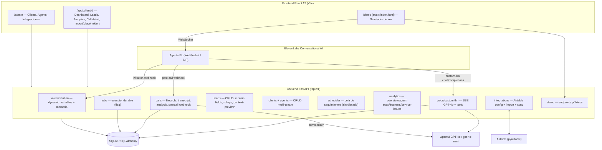

# Área 3 — Inventario completo de features

> Propósito: catalogar de forma exhaustiva TODAS las features (de cara al usuario y de
> sistema) realmente presentes en el código de Qora, distinguiendo lo implementado de lo
> que es intención/roadmap, y marcando cada afirmación con evidencia (archivo + símbolo) y
> una etiqueta de confianza. Este documento alimenta los entregables transversales
> (15/16/17/18) y el resumen ejecutivo. El código manda sobre la documentación existente.

Convenciones de etiquetas: `[Confirmado por codigo]` = verificado leyendo el código;
`[Inferido razonablemente]` = deducido de evidencia indirecta consistente;
`[Necesita validacion humana]` = no verificable solo desde el repo.

---

## Mapa general del sistema

Routers registrados en `backend/app/main.py:271-297`: `clients`, `agents`,
`tenants` (alias compat), `leads`, `calls`, `initiation`, `webhook`, `scheduler`,
`analytics`, `crm` (import), `crm_config` (integraciones), `demo`. `[Confirmado por codigo]`

Rutas del frontend en `frontend/src/router.tsx:36-96`: `/app/:clientId/{dashboard,leads,
leads/:leadId,import,analytics,calls/:sessionId}` y `/admin{,/clients/:clientId}`.
`[Confirmado por codigo]`

---

## Llamada de voz saliente vía ElevenLabs (Custom LLM)

- Estado: implementada (núcleo del producto)
- Descripcion funcional: ElevenLabs gestiona la telefonía/voz y delega el "cerebro"
  conversacional a Qora mediante un webhook Custom LLM compatible con OpenAI. Qora
  resuelve el tenant, arma el contexto del lead y del agente, transmite la respuesta de
  GPT-4o por SSE token a token, intercepta tool calls a mitad de stream y persiste el
  transcript.
- Quien la usa: el agente de voz de ElevenLabs en tiempo real durante una llamada; en demo,
  el navegador abre el WebSocket directo a ElevenLabs.
- Donde aparece en UI: no hay panel de "discado" en la app React. La llamada real se
  origina en ElevenLabs (telefonía) o en el simulador `/demo`. El frontend solo muestra el
  resultado (Dashboard, Leads, Call detail).
- Flujo de usuario: ElevenLabs → `POST /api/v1/voice/{client_id}/custom-llm/chat/completions`
  → Qora resuelve `client_id`/`lead_id`/`conversation_id` → arma `system_content` →
  streamea GPT-4o → si hay tool call: emite filler, ejecuta tool, re-llama GPT-4o →
  persiste turnos → `data: [DONE]`.
- Backend involucrado: `app/voice/webhook.py` (`custom_llm_path_route`,
  `_process_custom_llm_request`, `_stream_llm_response`), `app/ai/llm_streaming.py`
  (`OpenAIStreamingClient`), `app/voice/session.py` (`session_store`).
- Datos que lee: `Client`/`Agent` (tenant + config), `Lead` + `lead_custom_fields`, memoria
  (call history), `crm.yaml` para schema de `capture_data`.
- Datos que escribe: `CallSession` (creación/backfill), `TranscriptTurn` (turnos user/agent/
  tool_call/tool_result), `session_store` en memoria.
- Integraciones involucradas: ElevenLabs (telefonía/voz, fuera del repo), OpenAI (GPT-4o).
- Archivos principales: `backend/app/voice/webhook.py`,
  `backend/app/ai/llm_streaming.py`, `backend/app/voice/session.py`,
  `backend/app/voice/context.py`.
- Evidencia: `webhook.py:531-535` define 3 rutas POST (`/custom-llm`,
  `/custom-llm/chat/completions`, `/chat/completions`) más la ruta path-based
  `/{client_id}/custom-llm/chat/completions` (`webhook.py:614`). El streaming SSE y la
  re-llamada tras tool en `_stream_llm_response` (`webhook.py:257-523`). `[Confirmado por codigo]`
- Riesgos: la ruta legacy sin `client_id` en path sigue activa y solo emite warning de
  deprecación (`webhook.py:596-602`); el contexto in-memory `session_store` se pierde en
  reinicio (limpieza TTL en `main.py:114-126`); auth del webhook desactivada por defecto
  (`QORA_WEBHOOK_AUTH_ENABLED=false`, `config.py:135`). `[Confirmado por codigo]`
- Cosas a sacar/optimizar: existe lógica de fallback "per-turn" muy extensa
  (`webhook.py:861-1062`) que duplica el camino de `build_voice_context`; candidata a
  simplificación. `[Inferido razonablemente]`
- Preguntas abiertas: ¿se sigue usando la ruta legacy en producción o ya se migró todo a
  path-based? `[Necesita validacion humana]`

## Streaming SSE de GPT-4o con tool-calling mid-stream + filler

- Estado: implementada
- Descripcion funcional: cliente OpenAI en modo streaming que emite `ContentDelta`,
  `ToolCallDelta`, `StreamDone`. Cuando detecta un tool call, emite una frase "filler"
  (relleno hablado) antes de ejecutar la tool, espera `FILLER_PAUSE_SECONDS=0.7s`, ejecuta
  la tool y re-llama a GPT-4o con el resultado para la respuesta final.
- Quien la usa: el webhook custom-LLM internamente.
- Donde aparece en UI: indirecta (el caller escucha el filler durante la llamada).
- Flujo de usuario: token streaming → si tool: filler → pausa → ejecución → segunda llamada
  GPT-4o → tokens finales → stop + done.
- Backend involucrado: `_stream_llm_response` (`webhook.py:257`),
  `OpenAIStreamingClient.stream_events` (`ai/llm_streaming.py`).
- Datos que lee: `TOOL_FILLER_PHRASES`, `DEFAULT_FILLER` (`tools/registry.py:80-86`),
  `registry_entries` por skill (`filler_text`).
- Datos que escribe: `TranscriptTurn` (`tool_call`/`tool_result`); para `load_skill`
  persiste un marcador mínimo "Skill X cargada" en vez del markdown completo
  (`webhook.py:417-423`).
- Integraciones involucradas: OpenAI.
- Archivos principales: `backend/app/voice/webhook.py`, `backend/app/ai/llm_streaming.py`.
- Evidencia: timeout de 60s por turno (`webhook.py:298`); cache de `load_skill` por
  conversación en `conv_state.loaded_skills` (`webhook.py:320-406`). `[Confirmado por codigo]`
- Riesgos: solo se soporta UN tool call por turno antes de la respuesta final (la segunda
  llamada pasa `tools=None`, `webhook.py:471-474`); no hay tool-calling encadenado.
  `[Confirmado por codigo]`
- Cosas a sacar/optimizar: el `_persisted_tool_result = json.dumps(tool_result)` puede ser
  voluminoso para tools que devuelven dicts grandes. `[Inferido razonablemente]`
- Preguntas abiertas: ninguna relevante.

## Webhook de iniciación de conversación (pre-call lead injection)

- Estado: implementada
- Descripcion funcional: ElevenLabs llama a este endpoint antes de hablar para obtener las
  `dynamic_variables` (nombre del lead, auto, seguro, memoria, etc.) que se inyectan en el
  prompt del agente vía plantillas `{{var}}`. Pre-construye y cachea el `VoiceSessionContext`
  cuando viene `conversation_id`.
- Quien la usa: ElevenLabs al iniciar la conversación.
- Donde aparece en UI: indirecta (afecta el primer mensaje del agente).
- Flujo de usuario: EL → `POST /api/v1/voice/initiation` (body o query) → carga tenant +
  agente default + lead → construye memoria → devuelve `dynamic_variables` (con variantes
  `_var_` envueltas en guión bajo para la plantilla EL).
- Backend involucrado: `app/voice/initiation.py` (`initiation_webhook`).
- Datos que lee: `Client`, `Agent` default, `Lead`, `lead_custom_fields`,
  `build_memory_context`.
- Datos que escribe: `session_store` (contexto + `AuthorizedSession`); transición de estado
  `new→called` idempotente (`initiation.py:181-185`).
- Integraciones involucradas: ElevenLabs.
- Archivos principales: `backend/app/voice/initiation.py`, `backend/app/memory.py`,
  `backend/app/voice/context.py`.
- Evidencia: bloqueo de leads `do_not_call` con HTTP 403 ANTES de la llamada
  (`initiation.py:140-150`); variables de memoria `call_history`, `is_returning_caller`,
  `call_number` (`initiation.py:263-272`). `[Confirmado por codigo]`
- Riesgos: variables `broker_name`/`_broker_name_` marcadas DEPRECATED pero aún emitidas
  (`initiation.py:249-261`). `[Confirmado por codigo]`
- Cosas a sacar/optimizar: el doble juego de variables (plano + `_envuelto_`) duplica el
  payload; consolidable cuando la plantilla EL se actualice. `[Inferido razonablemente]`
- Preguntas abiertas: ¿qué plantilla EL real consume estas variables? (vive en ElevenLabs,
  no en el repo). `[Necesita validacion humana]`

---

## Tools del agente de voz (function calling)

- Estado: implementada (5 tools activas) — 3 tools legacy ELIMINADAS pero con archivos
  residuales
- Descripcion funcional: registro central de definiciones OpenAI function-calling y
  despachador que ejecuta cada tool con guardas de scope/tenant. Tools activas:
  `get_lead_details`, `get_lead_profile`, `get_lead_history`, `get_lead_pain_points`,
  `load_skill` y `capture_data` (schema dinámico por agente/CRM).
- Quien la usa: GPT-4o durante la llamada (el modelo decide invocarlas).
- Donde aparece en UI: el selector de tools del agente en el panel admin
  (`agents-section.tsx`), pero ese selector está DESINCRONIZADO (ver Riesgos).
- Flujo de usuario: GPT-4o emite tool_call → `dispatch_tool` valida scope/tenant → ejecuta
  handler → devuelve dict/string → re-llamada GPT-4o.
- Backend involucrado: `app/tools/registry.py` (`TOOL_DEFINITIONS`,
  `build_tool_definitions`, `build_capture_data_from_field_definitions`),
  `app/tools/dispatcher.py` (`dispatch_tool`, `_check_scope`), handlers individuales en
  `app/tools/*.py`.
- Datos que lee: `Lead`, `LeadProfileFact`, `CallSession`/`CallAnalysis` (historia/pain
  points), `crm.yaml` (custom_fields), `AuthorizedSession.scopes`.
- Datos que escribe: `capture_data` escribe `lead_custom_fields` (única tool de escritura;
  scope `pipeline:write`). El resto son de lectura (scope `pipeline:read`).
- Integraciones involucradas: ninguna externa (todo DB + filesystem de skills).
- Archivos principales: `backend/app/tools/registry.py`, `backend/app/tools/dispatcher.py`,
  `backend/app/tools/capture_data.py`, `backend/app/tools/get_lead_*.py`,
  `backend/app/tools/skill_loader.py`.
- Evidencia: `TOOL_DEFINITIONS` lista las 6 tools activas (`registry.py:58-67`); guardas de
  scope `_WRITE_TOOLS`/`_READ_TOOLS` (`dispatcher.py:51-59`); `load_skill` exento de scope
  (`dispatcher.py:165`). `[Confirmado por codigo]`
- Riesgos: el guard de scope se SALTEA cuando `authorized_session is None` (camino legacy,
  `dispatcher.py:80-82`) — backward compat que debilita la aislación si la sesión no quedó
  autorizada. `[Confirmado por codigo]`
- Cosas a sacar/optimizar: ver feature "Tools legacy removidas" (archivos muertos).
- Preguntas abiertas: ¿hay agentes en producción cuyo `tools_enabled` aún liste las tools
  removidas? Se filtran con `strip_deprecated_tools` (`context.py:357-362`) pero conviene
  auditar la data. `[Necesita validacion humana]`

## Tool capture_data (captura dinámica de campos)

- Estado: implementada
- Descripcion funcional: captura datos del lead según un schema dinámico construido desde
  `crm.yaml` (`custom_fields`/`field_definitions`) o, como fallback, desde
  `agent.tool_config`. Solo `lead_id` es required en el schema para permitir capturas
  parciales mid-call.
- Quien la usa: GPT-4o cuando el lead aporta datos (ej. marca/modelo de auto, seguro
  actual).
- Donde aparece en UI: los campos capturados se ven luego en Lead detail (`custom_fields`,
  `quote_fields`).
- Flujo de usuario: el modelo llama `capture_data(lead_id, campo1=..., campo2=...)` →
  handler coacciona tipos según `field_type_map` → upsert en `lead_custom_fields`.
- Backend involucrado: `dispatch_tool` rama `capture_data` (`dispatcher.py:182-229`),
  `app/tools/capture_data.py`, `app/leads/lead_custom_fields_service.py`.
- Datos que lee: `crm.yaml` custom_fields, `agent.tool_config`.
- Datos que escribe: `lead_custom_fields` (tabla por tenant/lead).
- Integraciones involucradas: ninguna externa.
- Archivos principales: `backend/app/tools/capture_data.py`,
  `backend/app/tools/registry.py:154-210`,
  `backend/app/leads/lead_custom_fields_service.py`.
- Evidencia: schema desde field_definitions con mapeo de tipos JSON
  (`registry.py:171-210`); prioridad CRMConfig > agent_tool_config (`dispatcher.py:186-206`).
  `[Confirmado por codigo]`
- Riesgos: si no hay `crm.yaml` ni `tool_config`, `capture_data` se excluye silenciosamente
  de la lista de tools (`registry.py:255-261`) → el agente "pierde" la tool sin error
  visible. `[Confirmado por codigo]`
- Cosas a sacar/optimizar: la doble fuente (CRM vs tool_config) agrega complejidad; con la
  migración a `crm.yaml` el camino `tool_config` queda como legacy. `[Inferido razonablemente]`
- Preguntas abiertas: ninguna relevante.

## Tools de lectura del lead (get_lead_details/profile/history/pain_points)

- Estado: implementada
- Descripcion funcional: cuatro tools de solo lectura que devuelven al agente, mid-call,
  detalles del lead, perfil acumulado, historial de llamadas y pain points detectados.
- Quien la usa: GPT-4o durante la conversación.
- Donde aparece en UI: indirecta.
- Flujo de usuario: tool_call → validación de pertenencia del lead al tenant
  (`_validate_lead_scope`, `dispatcher.py:262-271`) → handler → dict.
- Backend involucrado: `app/tools/get_lead_details.py`, `get_lead_profile.py`,
  `get_lead_history.py`, `get_lead_pain_points.py`.
- Datos que lee: `Lead`, `LeadProfileFact`, `CallSession`/`CallAnalysis`.
- Datos que escribe: nada (read-only).
- Integraciones involucradas: ninguna.
- Archivos principales: `backend/app/tools/get_lead_*.py`, `backend/app/tools/dispatcher.py`.
- Evidencia: registradas en `TOOL_DEFINITIONS` (`registry.py:59-62`) y `_TOOL_REGISTRY`
  (`dispatcher.py:116-121`). `[Confirmado por codigo]`
- Riesgos: no aparecen en el selector de tools del admin (ver desincronización UI).
- Cosas a sacar/optimizar: ninguna evidente.
- Preguntas abiertas: ninguna.

## Tool load_skill + sistema de skills por agente (registry.yaml)

- Estado: implementada
- Descripcion funcional: carga bajo demanda de "skills" (conocimiento especializado en
  markdown) declaradas en `registry.yaml` por agente. Se inyecta un índice "## Available
  Skills" en el system prompt y el modelo invoca `load_skill(skill_name)` para traer el
  contenido completo, que se cachea por conversación.
- Quien la usa: GPT-4o cuando el tema matchea un trigger_hint del registry.
- Donde aparece en UI: no hay editor de skills en la UI; se gestionan por filesystem en
  `backend/clients/{client}/agents/{agent}/skills/`.
- Flujo de usuario: índice en el prompt → `load_skill` → handler valida allowlist del
  registry → lee `.agent-skill.md` → inyecta como "## Loaded Skill: {name}".
- Backend involucrado: `app/prompts/skill_loader.py` (`load_skill_registry`,
  `build_skills_index`), `app/tools/skill_loader.py` (`handle_load_skill`),
  `dispatch_tool` rama `load_skill` (`dispatcher.py:231-253`).
- Datos que lee: `clients/{c}/agents/{a}/skills/registry.yaml` y archivos `.agent-skill.md`.
- Datos que escribe: nada en DB; cachea en `conv_state.loaded_skills` (memoria).
- Integraciones involucradas: ninguna.
- Archivos principales: `backend/app/prompts/skill_loader.py`,
  `backend/app/tools/skill_loader.py`,
  `backend/clients/*/agents/*/skills/registry.yaml`.
- Evidencia: modo "registry-only" sin fallback a glob (`skill_loader.py:8-13,98-101`);
  skills sembradas para `qora-demo` (qora-explainer) y `quintana-seguros` (leads-agent).
  `[Confirmado por codigo]`
- Riesgos: cualquier campo faltante en una entrada del registry hace que se ignoren TODAS
  las skills de ese agente (`skill_loader.py:151-160` retorna lista vacía). `[Confirmado por codigo]`
- Cosas a sacar/optimizar: gestión solo por filesystem; no hay CRUD de skills en la UI.
- Preguntas abiertas: ninguna.

## Tools legacy removidas (register_interest / mark_not_interested / schedule_followup)

- Estado: posible legacy (código muerto parcial)
- Descripcion funcional: tres tools que en su día transicionaban el estado del lead. En la
  Fase 2 (`configurable-agent-tools`) fueron RETIRADAS del registro y el despachador
  devuelve `tool_removed`. Las transiciones de estado ahora las maneja el pipeline post-call.
- Quien la usa: nadie en runtime (el despachador las rechaza).
- Donde aparece en UI: PROBLEMA — el selector `AVAILABLE_TOOLS` del admin todavía las
  ofrece (`frontend/src/features/admin/agents-section.tsx:45-50`:
  `get_lead_details`, `register_interest`, `mark_not_interested`, `schedule_followup`) y NO
  ofrece las tools activas (`capture_data`, `get_lead_profile/history/pain_points`,
  `load_skill`).
- Flujo de usuario: si un agente las tuviera habilitadas, `strip_deprecated_tools` las
  filtra antes de construir las definiciones (`agents/schemas.py`); si aun así llegaran al
  despachador, devuelve `{"error": "tool_removed"}`.
- Backend involucrado: `_REMOVED_TOOLS` (`registry.py:70-72`), `_LEGACY_REMOVED_TOOLS`
  (`dispatcher.py:111,171-179`).
- Datos que lee/escribe: n/a (rechazadas).
- Integraciones involucradas: ninguna.
- Archivos principales (muertos): `backend/app/tools/schedule_followup.py`,
  `backend/app/tools/mark_not_interested.py` — definen `TOOL_DEFINITION` y handlers pero NO
  se importan en ningún módulo de `app/` (solo en tests).
- Evidencia: búsqueda `rg "tools.schedule_followup|tools.mark_not_interested" backend/app`
  no arroja imports en `app/`; ambos archivos solo aparecen referenciados en `backend/tests`.
  `[Confirmado por codigo]`
- Riesgos: drift UI↔backend (el admin puede asignar tools inexistentes y omitir las reales);
  archivos muertos que confunden el mantenimiento. `[Confirmado por codigo]`
- Cosas a sacar/optimizar: eliminar `schedule_followup.py` y `mark_not_interested.py` (y sus
  tests), y actualizar `AVAILABLE_TOOLS` del admin a las tools reales. `[Inferido razonablemente]`
- Preguntas abiertas: ¿`register_interest` tiene archivo propio? No existe
  `tools/register_interest.py`; solo figura como nombre removido. `[Confirmado por codigo]`

---

## Pipeline de análisis post-call (multi-dimensión)

- Estado: implementada
- Descripcion funcional: tras cerrar una llamada, se analiza el transcript con múltiples
  llamadas a `gpt-4o-mini` en paralelo. Arquitectura actual: 6 dimensiones independientes
  (`summary`, `objections`, `outcome`, `problem`, `service_issues`, `commitments`) +
  pipeline de interés (2 fases) + pipeline de profile_facts + pipeline de misc_notes +
  pipeline de data_corrections + post-análisis de next_action. Fallos por dimensión se
  loguean sin matar el análisis.
- Quien la usa: el sistema (disparado al cerrar sesión o vía webhook post-call); resultados
  consumidos por Analytics, Lead detail y Call detail.
- Donde aparece en UI: Call detail (`GET /calls/{id}/analysis`), Lead detail (rollups,
  interest history), Analytics.
- Flujo de usuario: cierre de sesión → `_schedule_summarize`/job durable →
  `generate_summary_and_facts` → `_call_gpt_summarize` (gather paralelo) → `PostCallAnalysis`
  → persiste `CallAnalysis` + merge a `Lead` + dual-write a tablas relacionales.
- Backend involucrado: `app/summarizer.py` (orquestador), `app/analysis/universal/*`
  (dimensiones + pipelines), `app/analysis/schema.py` (`PostCallAnalysis`).
- Datos que lee: `TranscriptTurn`, `CallSession`, `Lead` (interest previo, facts previos),
  `LeadProfileFact`, `ClientRules` (config de next_action/scheduler), `analysis_language`.
- Datos que escribe: `CallSession.summary/extracted_facts`, `CallAnalysis` (todas las
  columnas BI), `LeadProfileFact`, `LeadInterestHistory`, `lead_custom_fields`
  (correcciones), transición de estado del lead, auto-schedule, CRM sync.
- Integraciones involucradas: OpenAI (`gpt-4o-mini` por defecto, `openai_model_fast`).
- Archivos principales: `backend/app/summarizer.py`,
  `backend/app/analysis/universal/__init__.py` (`DIMENSION_MODULES`),
  `backend/app/analysis/schema.py`.
- Evidencia: `DIMENSION_MODULES` con 6 entradas (`universal/__init__.py:101-108`); fan-out
  con `asyncio.gather(return_exceptions=True)` (`summarizer.py:587-647`); atomicidad por
  savepoint (`summarizer.py:447-475`). `[Confirmado por codigo]`
- Riesgos: discrepancia de documentación — `calls/router.py:362` y el response model dicen
  "all 12 dimensions" y `summarizer.py:3` menciona "13 analyze coroutines", pero la
  realidad es 6 dimensiones + pipelines; los docstrings están desactualizados.
  `[Confirmado por codigo]`. Costo: muchas llamadas a OpenAI por llamada (≈10+).
  `[Inferido razonablemente]`
- Cosas a sacar/optimizar: consolidar dimensiones de baja señal o batch-prompts para reducir
  costo/latencia del post-call. `[Inferido razonablemente]`
- Preguntas abiertas: ¿la latencia/costo del fan-out es aceptable a volumen?
  `[Necesita validacion humana]`

## Sub-pipeline de interés (interests → interest_level con fórmula 70/30)

- Estado: implementada
- Descripcion funcional: dos agentes secuenciales: el primero detecta intereses
  (`InterestsAxis`, catálogo de productos/needs), el segundo computa un `interest_level`
  0–100 combinando el score nuevo con el previo (fórmula 70/30).
- Quien la usa: el summarizer; resultado en Analytics (interests) y Lead detail.
- Donde aparece en UI: Analytics → Interests; Lead detail → evolución de interés.
- Flujo de usuario: `run_interest_pipeline(transcript, previous_score)` → tupla
  (interests, level) → merge en facts.
- Backend involucrado: `app/analysis/universal/interest/` (`pipeline.py`, `interests.py`,
  `interest_level.py`, `catalog.py`).
- Datos que lee: `Lead.interest_level` previo, `PRODUCT_CATALOG`/`NEED_TAGS` (`catalog.py`).
- Datos que escribe: `interest_level` en `Lead`/`CallAnalysis`, `LeadInterestHistory`.
- Integraciones involucradas: OpenAI.
- Archivos principales: `backend/app/analysis/universal/interest/*.py`.
- Evidencia: `run_interest_pipeline` (`interest/pipeline.py:69`); manejo de errores por fase
  en `summarizer.py:680-741`. `[Confirmado por codigo]`
- Riesgos: el catálogo (`PRODUCT_CATALOG`, `NEED_TAGS`) parece orientado a seguros; para
  otros verticales requeriría reconfiguración. `[Inferido razonablemente]`
- Cosas a sacar/optimizar: ninguna evidente.
- Preguntas abiertas: ¿el catálogo es configurable por tenant o hardcodeado? `[Necesita validacion humana]`

## Sub-pipelines stateful: profile_facts, misc_notes, data_corrections

- Estado: implementada
- Descripcion funcional: pipelines que reciben el estado actual del lead y devuelven
  operaciones acumulativas. `profile_facts` (máx 5 updates, categorías de perfil),
  `misc_notes` (notas operativas tipadas) y `data_corrections` (correcciones validadas de
  campos correctables como auto/seguro/edad con gate de confianza).
- Quien la usa: el summarizer cuando hay `lead_id`.
- Donde aparece en UI: Lead detail (`profile_facts` agrupados, notas), Call detail.
- Flujo de usuario: cargan estado previo desde `Lead.extracted_facts`/`LeadProfileFact` →
  pipeline → aplican operaciones (DELETE/superseded para profile facts; setattr + custom
  field para correcciones).
- Backend involucrado: `app/analysis/universal/profile_facts.py`, `misc_notes.py`,
  `data_corrections.py`; aplicación en `summarizer._merge_facts_into_lead` (`:893-1090`),
  `_apply_structured_corrections` (`:1235`), `_apply_custom_field_corrections` (`:1310`).
- Datos que lee: `LeadProfileFact` activos, `Lead.extracted_facts.misc_notes`, snapshot de
  campos correctables (Lead ORM + custom fields).
- Datos que escribe: `LeadProfileFact` (DELETE/supersede), `lead_custom_fields`, columnas
  legacy del `Lead` (dual-write).
- Integraciones involucradas: OpenAI.
- Archivos principales: `backend/app/analysis/universal/{profile_facts,misc_notes,data_corrections}.py`.
- Evidencia: `run_profile_facts_pipeline`/`run_misc_notes_pipeline`/
  `run_data_corrections_pipeline` (`universal/__init__.py:53-84`); `CORRECTABLE_FIELDS`
  registry (`data_corrections.py`). `[Confirmado por codigo]`
- Riesgos: dual-write a columnas legacy del `Lead` + `lead_custom_fields` puede divergir si
  falla un lado del savepoint. `[Inferido razonablemente]`
- Cosas a sacar/optimizar: completar la transición que elimine columnas legacy del `Lead`
  (WU-7 menciona removerlas pero el dual-write sigue). `[Confirmado por codigo]`
- Preguntas abiertas: ninguna.

## Post-análisis next_action (motor de reglas)

- Estado: implementada
- Descripcion funcional: tras las dimensiones paralelas, un pipeline secuencial decide la
  próxima acción (`close_lead`, `follow_up`, `schedule_call`, `retry_call`, `human_review`,
  etc.) y un `next_action_at`, combinando outcome, interés, objeciones, problema, estado del
  lead y reglas del cliente. De ahí se derivan transiciones de estado y auto-scheduling.
- Quien la usa: el summarizer; consumido por scheduler y por el estado del lead.
- Donde aparece en UI: Lead detail (`next_action`, `next_action_at`,
  `next_scheduled_call_at`).
- Flujo de usuario: dimensiones → `run_next_action_pipeline(ctx)` → `NextActionResult` →
  `apply_status_from_next_action` mapea a estado del lead.
- Backend involucrado: `app/analysis/universal/next_action.py`,
  `summarizer.apply_status_from_next_action` (`:112-178`), `_merge_facts_into_lead`.
- Datos que lee: `LeadSnapshot` (call_count, do_not_call, last_called_at), `ClientRules`
  (max_attempts, thresholds, config scheduler).
- Datos que escribe: `Lead.status`, `Lead.next_action`, `Lead.next_action_at`,
  `Lead.do_not_call`.
- Integraciones involucradas: OpenAI.
- Archivos principales: `backend/app/analysis/universal/next_action.py`,
  `backend/app/summarizer.py`.
- Evidencia: reglas de transición config-driven con `quote_ready_fields`
  (`summarizer.py:112-178,1036-1082`). `[Confirmado por codigo]`
- Riesgos: la transición a "quoted" depende de `crm.yaml.quote_ready_fields`; sin crm.yaml
  nunca se infiere "quoted" (`is_quote_ready` → False, `summarizer.py:102-104`). `[Confirmado por codigo]`
- Cosas a sacar/optimizar: ninguna evidente.
- Preguntas abiertas: ninguna.

## Resumen de llamada (call summary) y memoria entre llamadas

- Estado: implementada
- Descripcion funcional: cada llamada genera un `summary` textual que se persiste y alimenta
  la memoria de futuras llamadas (`call_history`, `is_returning_caller`, `call_number`).
- Quien la usa: el agente en la próxima llamada (via initiation) y los operadores en la UI.
- Donde aparece en UI: Lead detail (resumen última llamada, historial), Call detail.
- Flujo de usuario: summarizer escribe `CallSession.summary` → `build_memory_context` lee las
  últimas 3 sesiones completas con summary → se inyecta en el prompt.
- Backend involucrado: `app/memory.py` (`build_memory_context`, `_format_call_history`),
  `app/summarizer.py`.
- Datos que lee: `CallSession` completas con summary (límite 3, `memory.py:126-141`).
- Datos que escribe: nada (memory.py es read-only de armado).
- Integraciones involucradas: ninguna directa.
- Archivos principales: `backend/app/memory.py`.
- Evidencia: `build_memory_context` retorna `MemoryContext` TypedDict (`memory.py:93-168`);
  fechas convertidas a `America/Argentina/Buenos_Aires` (`memory.py:41`). `[Confirmado por codigo]`
- Riesgos: `confirmed_facts` está intencionalmente vacío en runtime (`memory.py:147`); el
  perfil acumulado NO se inyecta vía memory.py (ver código muerto). `[Confirmado por codigo]`
- Cosas a sacar/optimizar: funciones `_format_confirmed_facts`, `_format_misc_notes`,
  `_format_accumulated_profile`, `_coerce_extracted_facts` NO se invocan desde ningún camino
  productivo (solo desde tests) — código muerto u orfanado. La inyección de misc_notes y
  lead_profile la hace en su lugar `voice/context.py`. `[Inferido razonablemente]`
- Preguntas abiertas: ¿se planea reactivar `_format_accumulated_profile` o eliminarlo?
  `[Necesita validacion humana]`

---

## Gestión de leads (CRUD + custom fields)

- Estado: implementada (con asimetrías UI/backend)
- Descripcion funcional: listado, detalle, creación y transición de estado de leads, con
  campos dinámicos (`lead_custom_fields`), perfil acumulado, historial de interés,
  enriquecimiento de próxima llamada agendada y quote_fields.
- Quien la usa: operadores en el panel `/app/:clientId/leads`.
- Donde aparece en UI: `LeadsPage` (tabla) y `LeadDetailPage` (detalle, secciones,
  transcript viewer, rankings de dimensiones).
- Flujo de usuario: lista → seleccionar lead → detalle con campos, facts, historial.
- Backend involucrado: `app/leads/router.py` (list/get/create/patch-status/history/
  context-preview/dimension-rollups), `app/leads/service.py`,
  `app/leads/lead_custom_fields_service.py`.
- Datos que lee: `Lead`, `lead_custom_fields`, `LeadProfileFact`, `LeadInterestHistory`,
  `ScheduledCall` (next), `crm.yaml` (quote_fields).
- Datos que escribe: crea `Lead`, escribe `lead_custom_fields`, transición de estado vía
  máquina de estados (`transition_lead_status`).
- Integraciones involucradas: ninguna directa (Airtable es aparte).
- Archivos principales: `backend/app/leads/router.py`, `backend/app/leads/service.py`,
  `frontend/src/features/leads/*`.
- Evidencia: endpoints en `leads/router.py` (list `:272`, get `:306`, create `:352`,
  patch-status `:391`, history `:427`, context-preview `:730`, dimension-rollups `:650`);
  consumo frontend solo de list/get/create/context-preview/dimension-rollups
  (`frontend/src/api/leads.ts`). `[Confirmado por codigo]`
- Riesgos: `PATCH /leads/{id}/status` y `GET /leads/{id}/history` NO tienen consumidor en el
  frontend (búsqueda en `frontend/src` sin resultados) — endpoints sin UI. El historial en
  la UI se arma vía `/calls?lead_id=`. `[Confirmado por codigo]`
- Cosas a sacar/optimizar: el router `leads` requiere `require_api_key`
  (`leads/router.py:48`), pero el frontend usa el mismo origen sin clave evidente — revisar
  cómo se inyecta la API key (transversal de seguridad). `[Necesita validacion humana]`
- Preguntas abiertas: ¿la transición manual de estado se hará desde la UI en el futuro?
  `[Necesita validacion humana]`

## Custom fields dinámicos del lead

- Estado: implementada
- Descripcion funcional: almacenamiento clave-valor tipado por tenant/lead, definido por el
  mapeo de campos del CRM (`crm.yaml.custom_fields`). Alimenta el schema de `capture_data`,
  la evaluación quote-ready y la UI de detalle.
- Quien la usa: el agente (captura), el operador (lectura), el pipeline (correcciones).
- Donde aparece en UI: Lead detail (`custom_fields`, `quote_fields` con estado "filled").
- Flujo de usuario: definición en admin/Integraciones → captura/corrección por agente →
  visualización en detalle.
- Backend involucrado: `app/leads/lead_custom_fields_service.py` (`get_all`, `batch_get`,
  `upsert`, `upsert_many`), `app/leads/router.py:_compute_quote_fields` (`:128`).
- Datos que lee/escribe: tabla `lead_custom_fields`.
- Integraciones involucradas: definición proviene de `crm.yaml`.
- Archivos principales: `backend/app/leads/lead_custom_fields_service.py`.
- Evidencia: batch load en list (`leads/router.py:295`), quote_fields ordenados por
  readiness (`leads/router.py:128-175`). `[Confirmado por codigo]`
- Riesgos: claves deben ser snake_case (se valida en backend y front,
  `crm_config_router.py:152`, `integrations-section.tsx:61`). `[Confirmado por codigo]`
- Cosas a sacar/optimizar: ninguna evidente.
- Preguntas abiertas: ninguna.

## Vista previa de contexto de próxima llamada (context-preview)

- Estado: implementada
- Descripcion funcional: muestra el contexto NO-prompt exacto que recibirá el agente en la
  próxima llamada (lead_profile, call_history, misc_notes, índice de skills, tools, config
  del modelo), construido por el MISMO camino runtime (`build_voice_context`). El system
  prompt solo se indica como presente (nunca se devuelve su contenido).
- Quien la usa: operadores (inspección/debug).
- Donde aparece en UI: Lead detail (la página consume `getLeadContextPreview`,
  `frontend/src/api/leads.ts:44`).
- Flujo de usuario: abrir lead → ver bloque de "contexto de próxima llamada".
- Backend involucrado: `get_lead_context_preview` (`leads/router.py:730-846`).
- Datos que lee: `build_memory_context`, `get_default_agent`, `build_voice_context`.
- Datos que escribe: nada.
- Integraciones involucradas: ninguna.
- Archivos principales: `backend/app/leads/router.py`,
  `frontend/src/features/leads/detail-page.tsx`.
- Evidencia: el endpoint redacta el system prompt (`system_prompt_present`,
  `leads/router.py:811`). `[Confirmado por codigo]`
- Riesgos: ninguno relevante (read-only).
- Cosas a sacar/optimizar: ninguna.
- Preguntas abiertas: ninguna.

## Rankings/rollups de dimensiones por lead

- Estado: implementada
- Descripcion funcional: agrega por lead (desde `call_analyses`) los conteos de intereses,
  service issues, objeciones y pain points, con scoping estricto por tenant para evitar IDOR.
- Quien la usa: operadores en Lead detail.
- Donde aparece en UI: Lead detail (`DetectedInterestsRanking`, `ServiceIssuesRanking`).
- Flujo de usuario: detalle del lead → rankings acumulados.
- Backend involucrado: `_build_dimension_rollups` + `get_dimension_rollups`
  (`leads/router.py:488-697`).
- Datos que lee: `CallAnalysis` (columnas BI escalares + JSON), `PRODUCT_CATALOG`/`NEED_TAGS`.
- Datos que escribe: nada.
- Integraciones involucradas: ninguna.
- Archivos principales: `backend/app/leads/router.py`,
  `frontend/src/features/leads/detail-page.tsx`.
- Evidencia: filtros por `lead_id AND client_id` siempre (`leads/router.py:537-588`); 404
  oracle-safe ante tenant ajeno (`:694-695`). `[Confirmado por codigo]`
- Riesgos: parsing de columnas JSON en Python (no agregable en SQLite portable),
  costo lineal por número de análisis. `[Confirmado por codigo]`
- Cosas a sacar/optimizar: ninguna evidente.
- Preguntas abiertas: ninguna.

---

## Multi-tenancy: clientes y agentes (CRUD)

- Estado: implementada
- Descripcion funcional: CRUD completo de clientes (tenants) y de agentes anidados por
  cliente, incluyendo agente default atómico, soft-delete, config de TTS, tools, prompt,
  modelo, y config de scheduler a nivel cliente.
- Quien la usa: administradores en `/admin`.
- Donde aparece en UI: `AdminPage` (lista/crea/edita clientes), `ClientDetailPage` con
  `AgentsSection` e `IntegrationsSection`.
- Flujo de usuario: admin → cliente → agentes (crear/editar/activar default/desactivar).
- Backend involucrado: `app/clients/router.py` (CRUD cliente),
  `app/agents/router.py` (CRUD agente + make-default + deactivate + sync-elevenlabs),
  `app/tenants/service.py`.
- Datos que lee/escribe: `Client`, `Agent` (modelos `tenants/models.py`).
- Integraciones involucradas: ElevenLabs (sync de soft timeout al crear/actualizar agente).
- Archivos principales: `backend/app/clients/router.py`, `backend/app/agents/router.py`,
  `frontend/src/features/admin/*`.
- Evidencia: create_client bootstrapea un Agent default (`clients/router.py:99-148`); swap
  atómico de default (`agents/router.py:466`); soft-delete cliente (`:309`). `[Confirmado por codigo]`
- Riesgos: el endpoint `POST /agents/{id}/sync-elevenlabs` (`agents/router.py:283`) NO tiene
  consumidor en el frontend (sin resultados en `frontend/src`) — solo se ejecuta el sync
  fire-and-forget automático al crear/editar. `[Confirmado por codigo]`. El selector de tools
  del admin ofrece tools removidas (ver "Tools legacy removidas").
- Cosas a sacar/optimizar: alinear `AVAILABLE_TOOLS` del admin con `TOOL_DEFINITIONS`.
  `[Inferido razonablemente]`
- Preguntas abiertas: ¿se expondrá el re-sync manual de ElevenLabs en la UI? `[Necesita validacion humana]`

## Sincronización/provisión de agentes en ElevenLabs (soft timeout)

- Estado: parcial (solo sincroniza soft-timeout; no aprovisiona el agente completo)
- Descripcion funcional: al crear/actualizar un agente con `elevenlabs_agent_id` y campos de
  soft timeout, se hace PATCH a la API de ElevenLabs para sincronizar el comportamiento de
  timeout. Hay un endpoint manual de re-sync y campos de estado (`elevenlabs_sync_status`).
- Quien la usa: el backend (fire-and-forget) y, en teoría, un admin vía endpoint manual.
- Donde aparece en UI: estado expuesto en `AgentResponse` (`elevenlabs_sync_status`), pero el
  re-sync manual no se invoca desde la UI.
- Flujo de usuario: crear/editar agente → si aplica → `sync_to_elevenlabs` PATCH a EL.
- Backend involucrado: `app/elevenlabs/service.py` (`sync_soft_timeout`,
  `sync_to_elevenlabs`, `_patch_with_retry`), `agents/router.py:_should_trigger_sync`.
- Datos que lee: `Agent` (soft_timeout_*), settings (`elevenlabs_api_key`).
- Datos que escribe: `Agent.elevenlabs_sync_status`, `elevenlabs_last_synced_at`; PATCH a EL.
- Integraciones involucradas: ElevenLabs REST (`https://api.elevenlabs.io/v1`).
- Archivos principales: `backend/app/elevenlabs/service.py`, `backend/app/agents/router.py`.
- Evidencia: solo `sync_soft_timeout`/`sync_to_elevenlabs` existen — NO hay creación de
  agente, voz, knowledge base ni number provisioning desde el código
  (`grep "def " elevenlabs/service.py`). `[Confirmado por codigo]`
- Riesgos: el `elevenlabs_agent_id` debe crearse manualmente en ElevenLabs; Qora solo
  parchea timeout. `[Inferido razonablemente]`
- Cosas a sacar/optimizar: el endpoint manual sin UI es candidato a exponer o documentar.
- Preguntas abiertas: ¿la provisión completa del agente EL es manual? `[Necesita validacion humana]`

## Prompts y skills por agente (filesystem multi-tenant)

- Estado: implementada
- Descripcion funcional: cada agente tiene un `system-prompt.md` y un directorio de skills en
  `backend/clients/{client}/agents/{agent}/`. El `PromptLoader` renderiza el prompt con
  variables de lead/memoria; el prompt de DB (`agent.system_prompt`) es fallback.
- Quien la usa: el runtime de voz al construir el contexto.
- Donde aparece en UI: el system_prompt es editable por agente en el admin
  (`agents-section.tsx`), pero las skills se gestionan por filesystem.
- Flujo de usuario: filesystem prompt (canónico) → `render_for_agent` → system_content.
- Backend involucrado: `app/prompts/loader.py` (`PromptLoader`),
  `app/prompts/skill_loader.py`, `app/prompts/insurance_agent.py`.
- Datos que lee: `clients/{c}/agents/{a}/system-prompt.md`, `registry.yaml`, skills md.
- Datos que escribe: nada (render).
- Integraciones involucradas: ninguna.
- Archivos principales: `backend/app/prompts/*`, `backend/clients/*`.
- Evidencia: tenants seedeados: `quintana-seguros` (agentes `jaumpablo`, `leads-agent`) y
  `qora-demo` (`qora-explainer`), con `system-prompt.md` y `registry.yaml`
  (`git ls-files backend/clients`). `[Confirmado por codigo]`
- Riesgos: prioridad de resolución compleja (filesystem > DB) con múltiples fallbacks
  (`webhook.py:996-1019`). `[Confirmado por codigo]`
- Cosas a sacar/optimizar: `insurance_agent.py` sugiere acoplamiento al vertical seguros;
  revisar si es genérico. `[Necesita validacion humana]`
- Preguntas abiertas: ¿`_template/prompt.md` (`backend/clients/_template/`) se usa al crear
  clientes nuevos? `[Necesita validacion humana]`

---

## Dashboard de métricas de llamadas

- Estado: implementada
- Descripcion funcional: tablero con totales de llamadas, duración, minutos facturables y
  breakdown por estado, con selector de período.
- Quien la usa: operadores en `/app/:clientId/dashboard`.
- Donde aparece en UI: `DashboardPage` + `MetricsGrid` + `StatusBreakdown`.
- Flujo de usuario: seleccionar período → métricas agregadas.
- Backend involucrado: `GET /api/v1/calls/metrics` (`calls/router.py:57`),
  `app/calls/service.py:get_call_metrics`.
- Datos que lee: `CallSession` (agregados por cliente/lead/fechas).
- Datos que escribe: nada.
- Integraciones involucradas: ninguna.
- Archivos principales: `backend/app/calls/router.py`,
  `frontend/src/features/dashboard/*`.
- Evidencia: `useCallMetrics`/`getCallMetrics` (`frontend/src/api/calls.ts:16`); el endpoint
  requiere `require_api_key` (`calls/router.py:57`). `[Confirmado por codigo]`
- Riesgos: ninguno relevante.
- Cosas a sacar/optimizar: ninguna.
- Preguntas abiertas: ninguna.

## Analytics (overview, agent-stats, interests, service-issues)

- Estado: implementada
- Descripcion funcional: cuatro endpoints analíticos por tenant con períodos
  (`day|week|month|custom`) y filtro opcional por agente: overview agregado, estadísticas por
  agente, top intereses con tendencia y service issues rankeados.
- Quien la usa: operadores en `/app/:clientId/analytics`.
- Donde aparece en UI: `AnalyticsDashboardPage` con `OverviewSection`, `AgentStatsSection`,
  `InterestsSection`, `ServiceIssuesSection`, `PeriodSelector`, `AgentFilter`.
- Flujo de usuario: seleccionar período/agente → 4 secciones.
- Backend involucrado: `app/analytics/router.py`, `app/analytics/service.py`,
  `app/analytics/crm_parity.py`.
- Datos que lee: `CallAnalysis`, `CallSession`, `Agent`/`Client`.
- Datos que escribe: nada.
- Integraciones involucradas: ninguna.
- Archivos principales: `backend/app/analytics/*`, `frontend/src/features/analytics/*`.
- Evidencia: 4 rutas en `analytics/router.py:87,132,179,224`; consumo frontend en
  `frontend/src/api/analytics.ts:29-80`. `[Confirmado por codigo]`
- Riesgos: el filtro `agent_id` se pasa a `interests` pero la query no lo usa
  (`analytics/router.py:193`). `[Confirmado por codigo]`
- Cosas a sacar/optimizar: revisar utilidad de `crm_parity.py` (no se ve consumido por la UI
  directamente). `[Necesita validacion humana]`
- Preguntas abiertas: ninguna.

## Inspección de llamada: detalle, transcript y análisis

- Estado: implementada
- Descripcion funcional: endpoints de admin/debug para inspeccionar una sesión de llamada, su
  transcript turn-by-turn y el análisis completo (todas las dimensiones persistidas).
- Quien la usa: operadores en `/app/:clientId/calls/:sessionId`.
- Donde aparece en UI: `CallDetailPage` (+ `CallAnalysisPanel`).
- Flujo de usuario: desde Lead/Dashboard → call detail → transcript + análisis.
- Backend involucrado: `calls/router.py` (`get_call_session`, `get_call_transcript`,
  `get_call_analysis_endpoint`).
- Datos que lee: `CallSession`, `TranscriptTurn`, `CallAnalysis`.
- Datos que escribe: nada.
- Integraciones involucradas: ninguna.
- Archivos principales: `backend/app/calls/router.py`, `frontend/src/features/calls/*`.
- Evidencia: rutas en `calls/router.py:303,316,360`; consumo en `frontend/src/api/calls.ts`.
  `[Confirmado por codigo]`
- Riesgos: el listado de sesiones filtra "ghost sessions" (initiated sin turnos) en backend
  (`calls/router.py:139-148`). `[Confirmado por codigo]`
- Cosas a sacar/optimizar: ninguna.
- Preguntas abiertas: ninguna.

## Ciclo de vida de la sesión de llamada + webhook post-call de ElevenLabs

- Estado: implementada
- Descripcion funcional: cierre de sesión (cálculo de duración/minutos facturables,
  incremento de contadores del lead), idempotente; y webhook post-call de ElevenLabs que
  cierra sesiones huérfanas (`network_drop`) o mergea turnos extra y re-dispara el summarizer.
- Quien la usa: el frontend demo (cierre demo-scoped) y ElevenLabs (post-call).
- Donde aparece en UI: indirecta; el demo usa `/demo/sessions/{id}/end`.
- Flujo de usuario: fin de WebSocket → `POST /calls/{id}/end` (admin) o
  `/demo/sessions/{id}/end` (demo) o webhook EL `/calls/elevenlabs-postcall`.
- Backend involucrado: `calls/router.py` (`end_call_session`,
  `elevenlabs_postcall_webhook`), `app/calls/service.py` (`close_session`).
- Datos que lee: `CallSession` por id/elevenlabs_conversation_id.
- Datos que escribe: `CallSession` (status/ended_at/duration), `Lead.call_count`,
  `last_called_at`; dispara summarizer.
- Integraciones involucradas: ElevenLabs (post-call webhook).
- Archivos principales: `backend/app/calls/router.py`, `backend/app/calls/service.py`.
- Evidencia: cierre idempotente con `was_already_closed` (`calls/router.py:228-295`); merge
  de transcript si EL tiene más turnos (`:194-211`). `[Confirmado por codigo]`
- Riesgos: `/calls/{id}/end` requiere `require_api_key` y NO debe llamarse desde el browser
  (por eso existe el demo-scoped, `demo/router.py:14-16`). `[Confirmado por codigo]`
- Cosas a sacar/optimizar: ninguna evidente.
- Preguntas abiertas: ¿el webhook post-call de EL está configurado en producción? `[Necesita validacion humana]`

---

## Integración CRM: importación desde Airtable

- Estado: implementada en backend — SIN consumidor en UI
- Descripcion funcional: importación batch de leads desde la base Airtable del cliente hacia
  Qora; crea leads para teléfonos nuevos y actualiza existentes; devuelve conteos
  created/updated/skipped/errors.
- Quien la usa: en teoría un operador/admin; en la práctica solo invocable vía API/curl/docs.
- Donde aparece en UI: NO aparece. La página `/import` es un placeholder "Coming Soon" (CSV)
  y NO llama a este endpoint; no hay botón "Importar de Airtable".
- Flujo de usuario: `POST /api/v1/clients/{client_id}/crm/import` → `import_leads_from_crm`.
- Backend involucrado: `app/integrations/crm_router.py`,
  `app/integrations/crm_import_service.py` (`import_leads_from_crm`),
  `app/integrations/adapters/airtable/adapter.py`.
- Datos que lee: Airtable (vía `crm.yaml` + `field_mappings`/`import_status_mapping`).
- Datos que escribe: `Lead` + `lead_custom_fields` (created/updated).
- Integraciones involucradas: Airtable (pyairtable).
- Archivos principales: `backend/app/integrations/crm_router.py`,
  `backend/app/integrations/crm_import_service.py`,
  `backend/app/integrations/adapters/airtable/adapter.py`.
- Evidencia: endpoint en `crm_router.py:64-93`; búsqueda `crm/import` en `frontend/src` sin
  resultados. El endpoint requiere `require_api_key` (`crm_router.py:32`). `[Confirmado por codigo]`
- Riesgos: feature backend completa pero inaccesible desde la app — gap de UI; el docstring
  del router dice "No auth required for now" pero el router SÍ tiene `require_api_key`
  (`crm_router.py:11-12` vs `:29-33`), discrepancia comentario↔código. `[Confirmado por codigo]`
- Cosas a sacar/optimizar: exponer el trigger de import en la UI (o reemplazar el placeholder
  CSV). `[Inferido razonablemente]`
- Preguntas abiertas: ¿cómo se dispara hoy el import en producción? `[Necesita validacion humana]`

## Integración CRM: sincronización Qora → Airtable (post-call)

- Estado: implementada
- Descripcion funcional: tras el análisis post-call, Qora empuja el estado del lead al CRM
  (Airtable) como espejo downstream. Con `ENABLE_JOB_EXECUTOR=true` es durable (job
  `crm_sync`); por defecto es fire-and-forget.
- Quien la usa: el sistema (hook post-call).
- Donde aparece en UI: indirecta (el lead se refleja en Airtable). El estado de la integración
  se ve en admin/Integraciones.
- Flujo de usuario: summarizer commit → `_schedule_crm_sync` → `crm_sync_service.sync_lead`.
- Backend involucrado: `summarizer._schedule_crm_sync` (`:1133`),
  `app/integrations/crm_sync_service.py` (`sync_lead`),
  `app/jobs/handlers/crm_sync.py`.
- Datos que lee: `Lead` + custom fields, `crm.yaml` (`status_mapping`, `field_mappings`).
- Datos que escribe: registros en Airtable (update/create).
- Integraciones involucradas: Airtable.
- Archivos principales: `backend/app/integrations/crm_sync_service.py`,
  `backend/app/jobs/handlers/crm_sync.py`, `backend/app/summarizer.py`.
- Evidencia: ruteo durable vs legacy según `enable_job_executor` (`summarizer.py:1174-1196`);
  no-op si no hay `crm.yaml`. `[Confirmado por codigo]`
- Riesgos: en modo legacy (default) la sync no es durable; fallos se loguean y descartan
  (`summarizer.py:1199-1227`). `[Confirmado por codigo]`
- Cosas a sacar/optimizar: el CRM es espejo; nunca debe afectar el análisis (CS-5). OK.
- Preguntas abiertas: ¿está `ENABLE_JOB_EXECUTOR` activo en producción? `[Necesita validacion humana]`

## Configuración de integraciones CRM (admin)

- Estado: implementada
- Descripcion funcional: panel para conectar/desconectar Airtable, testear conexión, listar
  columnas de la tabla, y mapear campos core + custom + quote-ready fields. Nunca expone el
  secret (solo el nombre del env var o "masked").
- Quien la usa: administradores.
- Donde aparece en UI: `/admin/clients/:clientId` → `IntegrationsSection`.
- Flujo de usuario: conectar (base/table/api_key_env) → mapear columnas → guardar → testear.
- Backend involucrado: `app/integrations/crm_config_router.py` (get/available/connect/update/
  test/fields/mappings/disconnect), `app/integrations/crm_config.py` (`CRMConfigLoader`).
- Datos que lee/escribe: `backend/clients/{client}/crm.yaml`.
- Integraciones involucradas: Airtable (test/fields vía pyairtable).
- Archivos principales: `backend/app/integrations/crm_config_router.py`,
  `frontend/src/features/admin/integrations-section.tsx`.
- Evidencia: 8 endpoints en `crm_config_router.py` (`:352-657`); todos los hooks consumidos
  en `integrations-section.tsx:18-26`; sanitización de secretos (`:176-187`). `[Confirmado por codigo]`
- Riesgos: escribe directamente archivos YAML en el filesystem del backend
  (`crm_config_router.py:438,541,622`) — requiere filesystem escribible y persistente (en
  Docker, riesgo si el volumen no persiste). `[Confirmado por codigo]`
- Cosas a sacar/optimizar: solo Airtable soportado (`get_available_integrations` hardcodea un
  único provider, `:392-400`). `[Confirmado por codigo]`
- Preguntas abiertas: ¿persistencia de `crm.yaml` en el contenedor de producción? `[Necesita validacion humana]`

---

## Scheduler / seguimientos (cola) — SIN discado automático

- Estado: parcial (cola y promoción implementadas; el discado real NO está implementado)
- Descripcion funcional: motor de agendado de llamadas de seguimiento. Permite crear/listar/
  cancelar/reagendar/completar `ScheduledCall`, auto-agendar tras el post-call según reglas
  del cliente, y un tick cada 60s que promueve llamadas vencidas `pending → in_progress`.
  El discado/colocación real de la llamada saliente NO existe.
- Quien la usa: el sistema (auto_schedule + tick). No hay UI ni consumidor frontend.
- Donde aparece en UI: NO hay panel de cola de scheduler en la app React; el lead muestra
  `next_scheduled_call_at` (solo lectura).
- Flujo de usuario: post-call → `auto_schedule` (si reglas) → `ScheduledCall(pending)` →
  tick → `in_progress` → (FIN: nada más). No hay paso que invoque ElevenLabs/Twilio.
- Backend involucrado: `app/scheduler/service.py` (`auto_schedule`,
  `mark_due_calls_in_progress`, `scheduler_tick`, CRUD), `app/scheduler/router.py`,
  `app/scheduler/models.py`.
- Datos que lee: `Client` (config scheduler), `Lead` (do_not_call, attempts), `ScheduledCall`.
- Datos que escribe: `ScheduledCall` (status/scheduled_at).
- Integraciones involucradas: NINGUNA en runtime (no hay llamada a ElevenLabs/Twilio).
- Archivos principales: `backend/app/scheduler/service.py`,
  `backend/app/scheduler/router.py`, `backend/app/scheduler/models.py`.
- Evidencia: `scheduler/models.py:43` declara textualmente "Phase 6: Queue-only. Actual
  Twilio dialing is Phase 8."; `mark_due_calls_in_progress` solo cambia status, no disca
  (`service.py:505-537`); búsqueda de `twilio|outbound_call|place_call|dial` en `backend/app`
  no encuentra implementación de discado. Endpoints REST sin consumidor frontend
  (`scheduled-calls`/`/scheduler/` no aparecen en `frontend/src`). `[Confirmado por codigo]`
- Riesgos: una llamada que llega a `in_progress` NUNCA se ejecuta ni se cierra
  automáticamente → puede quedar atascada en `in_progress`. La promesa de "auto follow-up
  calls" NO está cumplida end-to-end. `[Confirmado por codigo]`
- Cosas a sacar/optimizar: implementar el discador (Phase 8) o documentar claramente que el
  scheduler es solo planificación. `[Inferido razonablemente]`
- Preguntas abiertas: ¿el discado se delega a un proceso externo (n8n/EL batch) fuera del
  repo? Hay un explore `qora-n8n-orchestration` en `.sdd/`. `[Necesita validacion humana]`

---

## Jobs durables en background (executor)

- Estado: implementada (gateada por flag, default OFF)
- Descripcion funcional: executor de jobs respaldado por la tabla `background_jobs` que
  reemplaza `asyncio.create_task` fire-and-forget. Maneja lifecycle pending→running→
  completed|failed|dead, retry con backoff exponencial+jitter, recuperación en startup y
  shutdown. Handlers registrados: `summarize`, `crm_sync`, `transcript_flush`.
- Quien la usa: el sistema cuando `ENABLE_JOB_EXECUTOR=true`.
- Donde aparece en UI: NO hay panel de jobs en la UI (solo logs/DB).
- Flujo de usuario: summarizer/cierre → `executor.enqueue(job_type, payload)` → `_run_job`
  con retry/dead-letter.
- Backend involucrado: `app/jobs/executor.py` (`JobExecutor`, `calculate_backoff`),
  `app/jobs/registry.py`, `app/jobs/handlers/*`, `app/jobs/models.py`,
  `app/jobs/queries.py`.
- Datos que lee/escribe: tabla `background_jobs` (status, attempts, error JSON).
- Integraciones involucradas: indirecta (los handlers usan OpenAI/Airtable).
- Archivos principales: `backend/app/jobs/*`, `backend/app/main.py:198-204,225-228`.
- Evidencia: recovery en startup solo si `enable_job_executor` (`main.py:198-202`); registro
  de 3 handlers (`jobs/handlers/__init__.py:24-26`); `enable_job_executor=False` por defecto
  (`config.py:152`). `[Confirmado por codigo]`
- Riesgos: por defecto el flag está OFF → en producción default se usan los caminos legacy
  fire-and-forget (no durables) para summarize/crm_sync/transcript. `[Confirmado por codigo]`.
  Executor in-process single-instance (no apto para multi-worker). `[Inferido razonablemente]`
- Cosas a sacar/optimizar: activar el flag y/o exponer visibilidad de jobs muertos a
  operadores (hoy solo en DB). `[Inferido razonablemente]`
- Preguntas abiertas: ¿`ENABLE_JOB_EXECUTOR` está activo en el entorno real? `[Necesita validacion humana]`

## Persistencia durable de transcript off-call (transcript_flush)

- Estado: implementada (parte del executor durable)
- Descripcion funcional: handler `transcript_flush` para persistir/flushear turnos de
  transcript de forma durable fuera del path de la llamada.
- Quien la usa: el executor durable.
- Donde aparece en UI: indirecta (transcript visible en Call detail).
- Flujo de usuario: enqueue `transcript_flush` → handler escribe turnos.
- Backend involucrado: `app/jobs/handlers/transcript_flush.py`.
- Datos que lee/escribe: `TranscriptTurn`/`CallSession`.
- Integraciones involucradas: ninguna externa.
- Archivos principales: `backend/app/jobs/handlers/transcript_flush.py`.
- Evidencia: registrado como handler (`jobs/handlers/__init__.py:26`); migración
  `20260625_0003_add_transcript_finalization_fields.py`. `[Confirmado por codigo]`
- Riesgos: igual que el executor — gateado por flag. `[Confirmado por codigo]`
- Cosas a sacar/optimizar: ninguna evidente.
- Preguntas abiertas: ninguna.

---

## Simulador de voz demo (página estática)

- Estado: implementada
- Descripcion funcional: página HTML/JS servida en `/demo` que abre un WebSocket DIRECTO a
  ElevenLabs (sin SDK/WebRTC), selecciona un lead demo, inyecta `client_id`/`lead_id` vía
  `custom_llm_extra_body`, aplica overrides de TTS y cierra la sesión vía endpoint
  demo-scoped. Permite "hablar" con el agente desde el navegador.
- Quien la usa: cualquiera con acceso a la URL `/demo` (auth-exempt).
- Donde aparece en UI: `http://<host>/demo` (página separada, no parte del SPA React).
- Flujo de usuario: GET `/api/v1/demo/context` → GET `/api/v1/demo/leads` → abrir WebSocket a
  `wss://api.elevenlabs.io/v1/convai/conversation?agent_id=...` → conversar → al cerrar,
  `POST /api/v1/demo/sessions/{id}/end`.
- Backend involucrado: `app/demo/router.py` (`/context`, `/leads`, `/sessions/{id}/end`),
  static mount en `main.py:402-404`.
- Datos que lee: `Client`/`Agent` demo (env `QORA_DEMO_CLIENT_ID`/`QORA_DEMO_AGENT_ID`),
  leads del cliente demo.
- Datos que escribe: cierre de `CallSession` demo (scoped).
- Integraciones involucradas: ElevenLabs (WebSocket directo desde el browser).
- Archivos principales: `backend/app/static/index.html` (765 líneas),
  `backend/app/demo/router.py`.
- Evidencia: endpoints auth-exempt declarados explícitamente (`demo/router.py:1-20`);
  WebSocket directo en `static/index.html:497-543`; scope guard por `demo_client_id`
  (`demo/router.py:274-289`). `[Confirmado por codigo]`
- Riesgos: ruta `/demo` y `/api/v1/demo/*` SIN auth — exponen leads del cliente demo a
  cualquiera con la URL (por diseño, scoped al demo). El `elevenlabs_agent_id` se expone al
  browser (necesario para el WebSocket). `[Confirmado por codigo]`
- Cosas a sacar/optimizar: degradar/ocultar `/demo` en producción si no se usa. `[Inferido razonablemente]`
- Preguntas abiertas: ¿`/demo` debe estar accesible en producción? `[Necesita validacion humana]`

---

## Importación CSV de leads (UI)

- Estado: dudosa / no implementada (placeholder)
- Descripcion funcional: la página `/import` promete carga masiva de leads por CSV, pero solo
  muestra "CSV bulk lead import is coming soon".
- Quien la usa: nadie (placeholder).
- Donde aparece en UI: `/app/:clientId/import`.
- Flujo de usuario: n/a.
- Backend involucrado: ninguno (no hay endpoint de import CSV).
- Datos que lee/escribe: nada.
- Integraciones involucradas: ninguna.
- Archivos principales: `frontend/src/features/import/page.tsx`.
- Evidencia: el componente solo renderiza un mensaje "coming soon"
  (`import/page.tsx:1-26`). `[Confirmado por codigo]`
- Riesgos: ítem de roadmap presentado en la navegación como si fuera feature; puede confundir
  al usuario. `[Confirmado por codigo]`
- Cosas a sacar/optimizar: ocultar la ruta hasta implementarla, o reusarla para el trigger de
  import de Airtable (que ya existe en backend). `[Inferido razonablemente]`
- Preguntas abiertas: ninguna.

---

## Features transversales de sistema (auth, seeds, health, logging)

- Estado: implementada (con auth parcial/opcional)
- Descripcion funcional: API key auth (`require_api_key`) en routers admin/datos; webhook
  secret (`require_webhook_secret`) en voz, DESACTIVADO por defecto; `AuthorizedSession` con
  scopes para tools; seeds de tenants/leads en startup; healthcheck; logging estructurado
  (structlog JSON) con middleware de request; CORS configurable; validación de credenciales
  por tenant al iniciar.
- Quien la usa: el sistema y los clientes API.
- Donde aparece en UI: indirecta.
- Flujo de usuario: requests con `X-API-Key` (admin) / webhook secret (voz, si se activa).
- Backend involucrado: `app/core/auth.py`, `app/core/config.py`, `app/core/credentials.py`,
  `app/core/logging.py`, `app/main.py` (lifespan, middleware), seeds en
  `tenants/service.py`/`leads/service.py`.
- Datos que lee: env vars (nombres relevantes: `OPENAI_API_KEY`, `ELEVENLABS_API_KEY`,
  `ELEVENLABS_AGENT_ID`, `QORA_API_KEY`, `QORA_WEBHOOK_SECRET`,
  `QORA_WEBHOOK_AUTH_ENABLED`, `QORA_DEMO_CLIENT_ID`, `QORA_DEMO_AGENT_ID`,
  `QORA_ALLOWED_ORIGINS`, `QORA_DOCS_ENABLED`, `ENABLE_JOB_EXECUTOR`, `DATABASE_URL`,
  y credenciales por tenant tipo `QUINTANA_AIRTABLE_API_KEY` referenciadas en `crm.yaml`).
- Datos que escribe: seeds de `Client`/`Agent`/`Lead` en DB.
- Integraciones involucradas: ninguna directa.
- Archivos principales: `backend/app/core/*`, `backend/app/main.py`.
- Evidencia: `qora_webhook_auth_enabled=False` por defecto (`config.py:135`); seeds en
  lifespan (`main.py:183-192`); validación de credenciales de integración por tenant
  (`main.py:168-171`, `core/credentials.py`); CORS `*` por defecto (`config.py:141`).
  `[Confirmado por codigo]` (Nota: el detalle de seguridad se cubre en el documento del área
  correspondiente; aquí solo se inventaría como feature de sistema.)
- Riesgos: webhook de voz sin auth por defecto y CORS abierto por defecto — endpoints de voz
  públicos si no se configura. `[Confirmado por codigo]`
- Cosas a sacar/optimizar: forzar auth en entornos no-dev. `[Inferido razonablemente]`
- Preguntas abiertas: ¿cómo inyecta el frontend la `X-API-Key` para los routers protegidos?
  `[Necesita validacion humana]`

---

## Resumen de estado por feature

| Feature | Estado | Consumidor UI |
|---|---|---|
| Llamada de voz custom-LLM (SSE + tools) | implementada | Demo/EL (no app React) |
| Webhook de iniciación (memoria) | implementada | indirecta |
| Tools de lead (read) + capture_data + load_skill | implementada | parcial (admin desincronizado) |
| Tools legacy (register/mark/schedule) | posible legacy (muertas) | admin las ofrece (bug) |
| Pipeline post-call (6 dim + 4 pipelines + next_action) | implementada | Analytics/Call detail/Lead |
| Resumen + memoria entre llamadas | implementada | Lead detail |
| Lead CRUD + custom fields + rollups + preview | implementada | sí (parcial) |
| Clients/Agents CRUD multi-tenant | implementada | Admin |
| Sync ElevenLabs (soft timeout) | parcial | sin UI manual |
| Dashboard métricas | implementada | sí |
| Analytics (4 endpoints) | implementada | sí |
| Inspección de llamada | implementada | sí |
| CRM import Airtable | implementada (backend) | SIN UI |
| CRM sync post-call | implementada | indirecta |
| Config integraciones (admin) | implementada | sí |
| Scheduler / seguimientos | parcial (sin discado) | sin UI |
| Jobs durables (executor) | implementada (flag OFF) | sin UI |
| Simulador demo | implementada | /demo (estático) |
| Import CSV | no implementada (placeholder) | placeholder |

---

## Cobertura y límites

- No se ejecutó la aplicación ni se realizaron llamadas reales; el comportamiento runtime
  (latencia del fan-out post-call, conexión real con ElevenLabs/Airtable, persistencia del
  filesystem `crm.yaml` en Docker) NO se validó. `[Necesita validacion humana]`
- No se pudo confirmar la configuración de producción: si `ENABLE_JOB_EXECUTOR`,
  `QORA_WEBHOOK_AUTH_ENABLED`, y `QORA_ALLOWED_ORIGINS` están endurecidos, ni cómo se dispara
  hoy el import de Airtable o el discado de seguimientos. `[Necesita validacion humana]`
- La plantilla del agente en ElevenLabs (que consume las `dynamic_variables`) vive fuera del
  repo; no se pudo verificar el contrato exacto de variables. `[Necesita validacion humana]`
- La afirmación de que `schedule_followup.py`/`mark_not_interested.py` son código muerto se
  basa en ausencia de imports en `backend/app` (solo aparecen en tests); no se ejecutó
  análisis dinámico de cobertura. `[Inferido razonablemente]`
- Las marcas de discrepancia doc↔código (p.ej. "12/13 dimensiones", "No auth required for
  now" en `crm_router`) se verificaron por lectura directa; el resto de `docs/` y `.sdd/` no
  se auditó exhaustivamente para este inventario. `[Confirmado por codigo]` / el cruce
  completo de docs queda fuera de alcance de esta área. `[Necesita validacion humana]`
- No se inspeccionaron en profundidad todos los componentes presentacionales del frontend ni
  la inyección de la API key; el mapeo UI↔endpoint se basó en `frontend/src/api/*` y búsquedas
  por path. `[Inferido razonablemente]`
