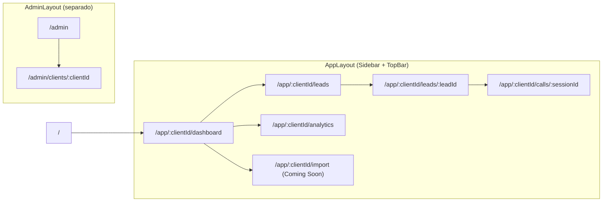
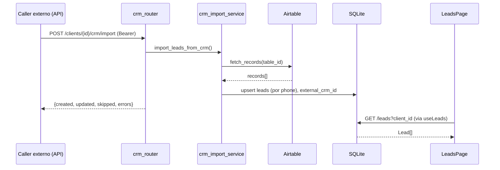
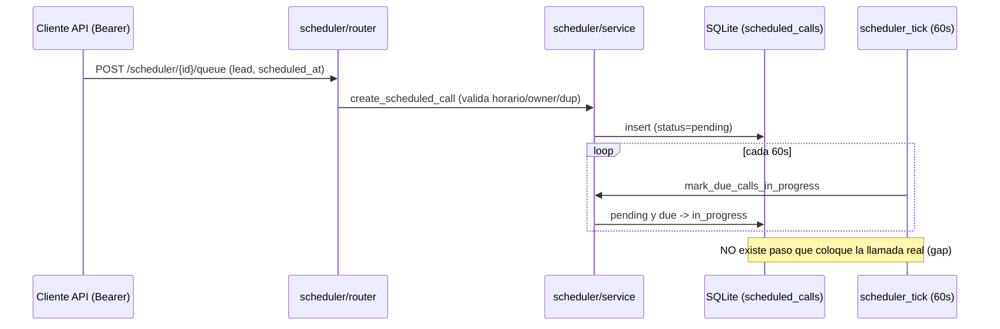
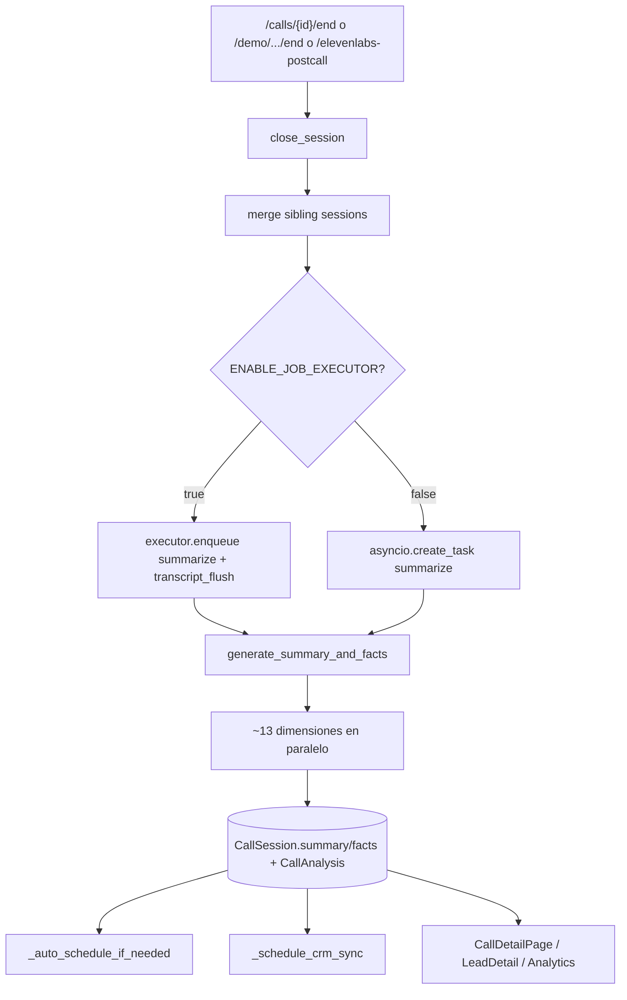
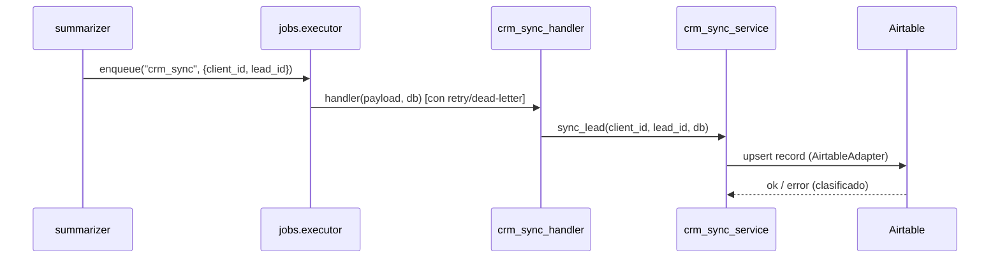
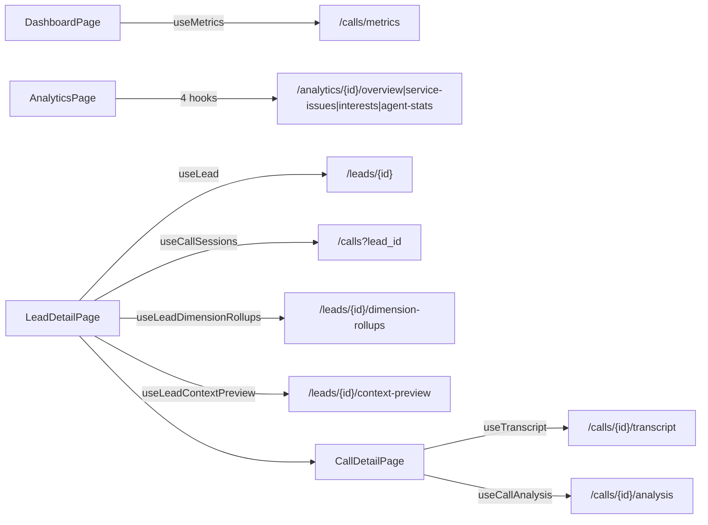
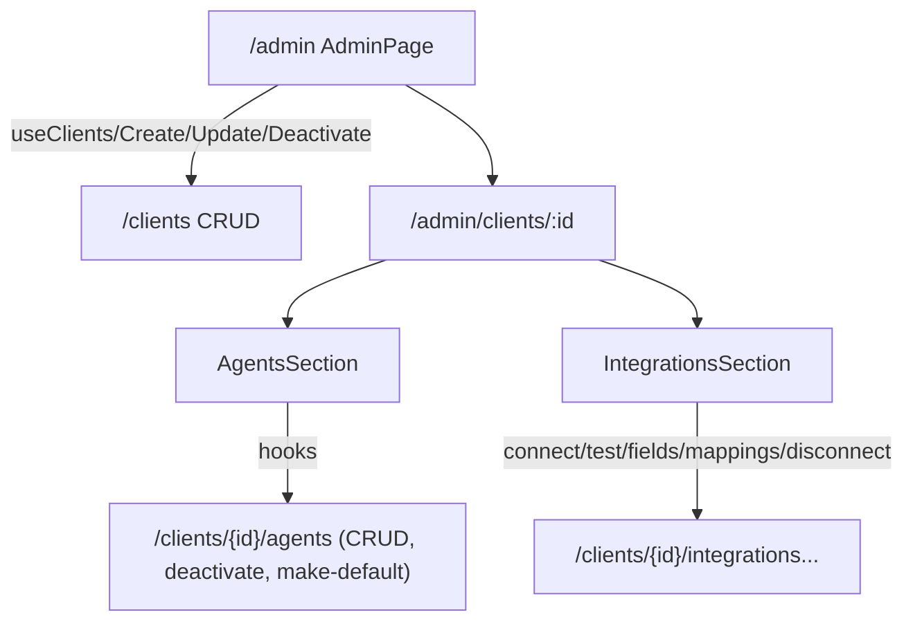
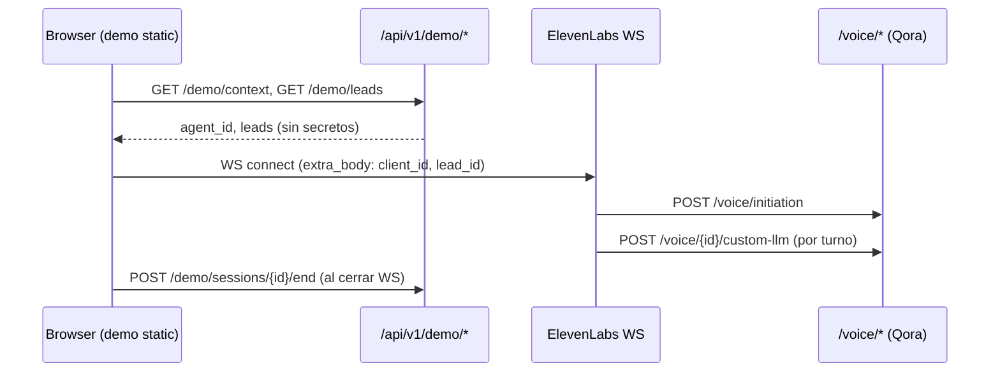

# Area 4 — Flujos de usuario principales

> Proposito: documentar los flujos end-to-end de Qora (usuario operador, sistema y voz en vivo), mapeando cada uno a pantallas de UI, endpoints de backend, datos leidos/escritos e integraciones. Se distingue explicitamente lo implementado de lo parcial/no conectado. Auditoria de solo lectura: cada afirmacion relevante lleva evidencia y etiqueta de clasificacion.

## Indice de flujos

| # | Flujo | Estado global |
|---|-------|---------------|
| 0 | Mapa de navegacion y superficie de rutas | Confirmado |
| 1 | Importar leads (CRM/Airtable y CSV) y revisarlos | Parcial (backend CRM si; CSV y trigger UI no) |
| 2 | Programar llamadas salientes (scheduler) y colocar la llamada | Parcial (cola si; discador saliente ausente) |
| 3 | Sesion de voz en vivo (initiation + custom-LLM + tools) | Confirmado |
| 4 | Fin de llamada -> analisis -> resumen -> analytics | Confirmado |
| 5 | Sincronizacion CRM (lead -> Airtable) via job durable | Confirmado |
| 6 | Operador revisa Dashboard / Analytics / detalle de lead y llamada | Confirmado |
| 7 | Admin gestiona clientes / agentes / integraciones | Confirmado |
| 8 | Simulador demo (pagina estatica) | Confirmado |

---

## Flujo 0 — Mapa de navegacion y superficie de rutas

La SPA usa React Router v7. Las rutas estan definidas en un unico archivo y exportadas para reuso en tests. [Confirmado por codigo: `frontend/src/router.tsx` `routes`]

Rutas de la app de operador (todas bajo `AppLayout` con Sidebar + TopBar): `dashboard`, `leads`, `leads/:leadId`, `import`, `analytics`, `calls/:sessionId`. Rutas de admin (layout aparte `AdminLayout`): `/admin` (lista de clientes) y `/admin/clients/:clientId`. La raiz `/` y el catch-all `*` redirigen a `/app/demo-client/dashboard`. [Confirmado por codigo: `frontend/src/router.tsx` líneas 36-95]

La Sidebar solo expone 4 items de navegacion: Dashboard, Analytics, Leads, Import. No hay enlace a `/admin`, ni a una pantalla de scheduler, ni a detalle de llamada (se llega por navegacion programatica). [Confirmado por codigo: `frontend/src/design/components/sidebar.tsx` `navItems` (Dashboard/Analytics/Leads/Import); `frontend/src/app-layout.tsx`]



Notas transversales sobre la capa API del frontend:
- Toda llamada pasa por `apiFetch`, que adjunta `Authorization: Bearer <VITE_API_KEY>` solo si `VITE_API_KEY` esta seteado en build. Si no esta seteado, no se envia header (modo dev sin auth). [Confirmado por codigo: `frontend/src/api/client.ts` `apiFetch`, `API_KEY`]
- Los endpoints admin de backend usan `Depends(require_api_key)`, que rechaza con 401 si `QORA_API_KEY` no esta configurado o el Bearer no coincide. Hay un bypass de tests (`_TESTING_BYPASS`) inalcanzable en produccion. [Confirmado por codigo: `backend/app/core/auth.py` `require_api_key` líneas 110-123]
- Los webhooks de voz usan `require_webhook_secret`, deshabilitado por defecto (`QORA_WEBHOOK_AUTH_ENABLED=false`). [Confirmado por codigo: `backend/app/core/auth.py` `require_webhook_secret` línea 292]

---

## Flujo 1 — Importar leads (CRM/Airtable y CSV)

### 1a. Import CSV desde UI — NO IMPLEMENTADO

La pantalla `Import` del sidebar es un placeholder estatico: muestra "CSV bulk lead import is coming soon." No hace ninguna llamada API ni hay input de archivo. [Confirmado por codigo: `frontend/src/features/import/page.tsx` `ImportPage`]

### 1b. Import desde CRM externo (Airtable) — backend implementado, sin trigger en UI

Existe un endpoint de import batch que tira (PULL) registros de Airtable hacia la base interna de Qora.

- Endpoint: `POST /api/v1/clients/{client_id}/crm/import`, protegido con `require_api_key`. Responde `ImportResultResponse {created, updated, skipped, errors}`; nunca levanta excepcion ante fallos parciales. [Confirmado por codigo: `backend/app/integrations/crm_router.py` `trigger_crm_import`]
- Servicio: `import_leads_from_crm(client_id, session)` lee `crm.yaml` del cliente, hace `AirtableAdapter.fetch_records(table_id=...)`, mapea cada registro via `mapper.reverse_map(...)`, hace upsert por telefono y persiste `external_crm_id` = id de Airtable. [Confirmado por codigo: `backend/app/integrations/crm_import_service.py` `import_leads_from_crm` líneas 130-342, 462]

No existe ningun consumidor frontend de este endpoint. Una busqueda de `crm/import` / `crm-import` en `frontend/src` no arroja resultados; tampoco hay hook en `frontend/src/api/hooks.ts`. [Confirmado por codigo: ausencia de match en `frontend/src/**`; `frontend/src/api/hooks.ts` no expone import CRM]. Conclusion: el import CRM solo es invocable por API directa / herramienta externa. [Inferido razonablemente]

### 1c. Revision de leads en la UI

Una vez en la DB, los leads se ven en la pantalla Leads:
- `LeadsPage` lee `clientId` de la URL y usa `useLeads(clientId)` -> `GET /api/v1/leads?client_id=...`. Renderiza loading/error/empty/tabla. El empty state dice "Import leads to start calling." [Confirmado por codigo: `frontend/src/features/leads/page.tsx`; `frontend/src/api/leads.ts` `fetchLeads`]
- Tambien es posible crear leads manualmente: `createLead` -> `POST /api/v1/leads?client_id=...`. No se observo un formulario de creacion en la UI de Leads que lo invoque (la funcion existe en la capa API). [Confirmado por codigo: `frontend/src/api/leads.ts` `createLead`] [Necesita validacion humana: si alguna pantalla dispara `createLead`]



---

## Flujo 2 — Programar llamadas salientes (scheduler)

### 2a. CRUD de cola de llamadas — implementado en backend

El router de scheduler expone CRUD sobre `ScheduledCall`, con doble juego de rutas (canonica `/scheduler/{client_id}/queue...` y alias `/clients/{client_id}/scheduled-calls...`), todo bajo `require_api_key`:
- `POST` crear llamada manual (valida cliente, ownership del lead multi-tenant, horario permitido del cliente, y rechaza duplicados activos con 409; resuelve agente por default del cliente). [Confirmado por codigo: `backend/app/scheduler/router.py` `create_manual_scheduled_call` líneas 65-174]
- `GET` listar cola (filtros status/lead/rango fechas), `GET` por id, `POST .../cancel`, `PATCH` reschedule (revalida horario), `PATCH .../complete`. [Confirmado por codigo: `backend/app/scheduler/router.py` líneas 182-384]

### 2b. Tick de fondo — solo promueve estado, NO disca

`scheduler_tick()` corre cada 60s (registrado en lifespan) y llama `mark_due_calls_in_progress`, que toma los `ScheduledCall` con `status=pending` y `scheduled_at<=now` y los marca `in_progress`. No hay ninguna llamada a un discador, a Twilio ni a la API de ElevenLabs para colocar la llamada. [Confirmado por codigo: `backend/app/scheduler/service.py` `mark_due_calls_in_progress` líneas 505-537 y `scheduler_tick` líneas 540-556; `backend/app/main.py` líneas 215-217]

El `ElevenLabsService` solo sincroniza configuracion del agente (soft timeout) via `PATCH /convai/agents/{id}`; no expone ninguna operacion para iniciar una llamada saliente. [Confirmado por codigo: `backend/app/elevenlabs/service.py` `ElevenLabsService.sync_soft_timeout`, `_ELEVENLABS_BASE_URL`]. Una busqueda de terminos de discado (twilio/outbound/batch/initiate call) no arroja un colocador real de llamadas. [Confirmado por codigo: ausencia de discador en `backend/app/**`]

Conclusion: el scheduler es una cola con maquina de estados, pero el paso "ElevenLabs places call" del flujo objetivo NO esta implementado: nada transiciona `in_progress` -> llamada real. [Confirmado por codigo / Inferido razonablemente]. [Necesita validacion humana: si el discado se hace por un proceso externo/manual o por Batch Calling de ElevenLabs fuera de este repo]

### 2c. Auto-programacion post-llamada

`auto_schedule(...)` existe y se invoca tras el analisis (ver Flujo 4): el summarizer llama `_auto_schedule_if_needed` -> `auto_schedule` para crear el proximo `ScheduledCall` segun el outcome. [Confirmado por codigo: `backend/app/summarizer.py` `_auto_schedule_if_needed` líneas 1098-1126 y llamada en línea 475; `backend/app/scheduler/service.py` `auto_schedule` línea 314]

### 2d. Sin UI de scheduler

No hay hook ni componente frontend que consuma el scheduler. Busqueda de `scheduler`/`scheduled-calls` en `frontend/src` sin resultados; `hooks.ts` no expone scheduler. [Confirmado por codigo: ausencia de match en `frontend/src/**`]. La cola solo se gestiona por API directa. [Inferido razonablemente]



---

## Flujo 3 — Sesion de voz en vivo (el core de Qora)

Este es el flujo mejor desarrollado. ElevenLabs Conversational AI actua como ASR/TTS y orquestador de turnos; el backend de Qora actua como Custom LLM (GPT-4o) y como fuente de contexto/herramientas.

### 3.1 Initiation webhook (pre-call)

Antes de que el agente hable, ElevenLabs llama `POST /api/v1/voice/initiation` (acepta client_id/lead_id por query o body). El handler: [Confirmado por codigo: `backend/app/voice/initiation.py` `initiation_webhook` líneas 65-275]
- Carga cliente (404 si no existe) y agente default (Phase 7).
- Si hay lead: lo carga, valida tenant; si `do_not_call` bloquea con 403 antes de cualquier llamada; lee campos de auto/seguro desde `lead_custom_fields`; construye memoria (`build_memory_context`: call_history, confirmed_facts, is_returning_caller, call_number); transiciona el lead a `called` (idempotente).
- Si llega `conversation_id`, pre-construye y cachea el `VoiceSessionContext` (`build_voice_context`) y crea una `AuthorizedSession` en `session_store` (is_demo=False).
- Responde `dynamic_variables` (nombres planos y variantes con guion bajo `_lead_name_`, etc.) que ElevenLabs inyecta en el prompt del agente. [Confirmado por codigo: `InitiationResponse` líneas 238-274]

### 3.2 Custom-LLM webhook (cada turno)

Durante la llamada, por cada turno ElevenLabs envia un request OpenAI-compatible a `POST /api/v1/voice/{client_id}/custom-llm/chat/completions` (hay tambien rutas legacy `/voice/custom-llm[/chat/completions]` y `/voice/chat/completions` que loguean deprecacion). [Confirmado por codigo: `backend/app/voice/webhook.py` líneas 531-672]

El handler `_process_custom_llm_request`: [Confirmado por codigo: `backend/app/voice/webhook.py` líneas 732-1309]
1. Resuelve client_id (path > extra_body > top-level > model_extra; 422 si falta) y lead_id/conversation_id.
2. Resuelve sesion: si hay `conversation_id` lo usa; si no, usa `find_by_client_lead` para reusar sesion del mismo (client, lead) y evitar fragmentacion (VSC-8); si no, genera un id estable `demo-<hash>`.
3. Ensambla el system prompt: fast path desde contexto cacheado (cero queries DB) o per-turn (carga cliente/agente, `build_voice_context` o fallback `PromptLoader.render_for_agent`). Maneja tenant inexistente (404) o inactivo (403).
4. Crea/reusa el `CallSession` en DB (backfill cuando initiation cacheo sin session_id; o creacion directa en flujo browser). Si no hay agente default, devuelve SSE de error en vez de 500.
5. Stream GPT-4o via SSE (`_stream_llm_response`): emite tokens de contenido; ante un tool_call emite filler TTS, espera `FILLER_PAUSE_SECONDS`, ejecuta la tool (`dispatch_tool` con `authorized_session` para guard de scope), persiste turnos `tool_call`/`tool_result`, re-llama a GPT-4o con el resultado y termina con `[DONE]`. Cachea resultados de `load_skill` en `conv_state.loaded_skills`. Timeout de 60s por turno. [Confirmado por codigo: `backend/app/voice/webhook.py` `_stream_llm_response` líneas 257-523]
6. Persiste el turno del usuario fire-and-forget (`schedule_user_turn_persist`) y los turnos del agente (`add_transcript_turn`).

Tools disponibles (function calling): `load_skill`, `capture_data` (schema dinamico por agente/CRM), `end_call`, mas otras definidas en el registry. `register_interest`/`mark_not_interested`/`schedule_followup` fueron removidas (Phase 2; transiciones de estado ahora derivan del analisis). [Confirmado por codigo: `backend/app/tools/registry.py` `TOOL_DEFINITIONS` líneas 58-71]

```mermaid
sequenceDiagram
  participant EL as ElevenLabs (ASR/TTS)
  participant Init as /voice/initiation
  participant Hook as /voice/{id}/custom-llm
  participant GPT as GPT-4o (OpenAI)
  participant Disp as tools.dispatcher
  participant DB as SQLite (call_sessions, transcript_turns)
  EL->>Init: POST initiation (client_id, lead_id, conversation_id)
  Init->>DB: load lead, transicion -> called
  Init-->>EL: dynamic_variables (lead_name, memoria...)
  loop cada turno
    EL->>Hook: POST chat/completions (messages, extra_body)
    Hook->>DB: create/reuse CallSession; persist user turn
    Hook->>GPT: stream (system+messages, tools)
    alt tool_call
      GPT-->>Hook: ToolCallDelta
      Hook->>EL: SSE filler TTS
      Hook->>Disp: dispatch_tool (authorized_session)
      Disp-->>Hook: tool_result
      Hook->>DB: persist tool_call/tool_result
      Hook->>GPT: re-call con tool result
    end
    GPT-->>Hook: ContentDelta
    Hook-->>EL: SSE tokens + [DONE]
    Hook->>DB: persist agent turn
  end
```

---

## Flujo 4 — Fin de llamada -> analisis -> resumen -> analytics

### 4.1 Cierre de la sesion

La sesion se cierra por uno de tres caminos:
- `POST /api/v1/calls/{conversation_id}/end` (admin, `require_api_key`) -> `close_session(...)`. Idempotente; setea status=completed, duration, billable_minutes; incrementa `Lead.call_count`/`last_called_at` solo en el primer cierre. [Confirmado por codigo: `backend/app/calls/router.py` `end_call_session` líneas 228-295]
- `POST /api/v1/demo/sessions/{session_id}/end` (auth-exempt, scoped a demo client) para el simulador. [Confirmado por codigo: `backend/app/demo/router.py` `demo_end_call_session`]
- `POST /api/v1/calls/elevenlabs-postcall` (webhook post-call de ElevenLabs): si la sesion seguia `initiated` la cierra como `network_drop`; si ya estaba `completed` mergea turnos extra de ElevenLabs y re-dispara summarize. [Confirmado por codigo: `backend/app/calls/router.py` `elevenlabs_postcall_webhook` líneas 156-220]

### 4.2 Disparo del analisis (durable o fire-and-forget)

`close_session` (y `end_session`) encolan el trabajo de analisis. Con `ENABLE_JOB_EXECUTOR=true` se encola un job durable `summarize` (y un `transcript_flush` off-call) via `executor.enqueue(...)`, persistido en `background_jobs` antes de retornar (garantia de durabilidad). Si no, fallback `_schedule_summarize` (`asyncio.create_task`). Antes del flush se mergean sibling sessions para que el summarizer vea el transcript completo (Issue #22). [Confirmado por codigo: `backend/app/calls/service.py` `close_session` líneas 604-716, `_schedule_summarize`/`_summarize_in_background` líneas 726-754]

### 4.3 Pipeline de analisis (6 dimensiones core + 5 pipelines)

`generate_summary_and_facts` (y su variante `_durable`) corre el pipeline en dos capas:

- **Fan-out de 6 dimensiones core** (`DIMENSION_MODULES`): una coroutine `analyze` por modulo stateless bajo `app.analysis.universal`, ejecutadas en paralelo. Los 6 modulos son: `summary`, `objections`, `outcome`, `problem`, `service_issues`, `commitments`. Una dimension fallida no mata el analisis (se marca parcial). [Confirmado por codigo: `backend/app/analysis/universal/__init__.py` `DIMENSION_MODULES` líneas 101-108]
- **5 pipelines de analisis separados** (extraidos de `DIMENSION_MODULES` en refactors sucesivos, varios stateful porque requieren snapshot del lead): `run_interest_pipeline` (interest, 2 fases), `run_profile_facts_pipeline` (profile_facts), `run_misc_notes_pipeline` (misc_notes), `run_data_corrections_pipeline` (data_corrections) y `run_next_action_pipeline` (next_action, post-analisis). [Confirmado por codigo: `backend/app/analysis/universal/__init__.py` líneas 7-30 y 61-84; los modulos `next_action`, `misc_notes`, `data_corrections`, `profile_facts` se importan pero ya NO estan en `DIMENSION_MODULES`]

> Nota de auditoria: versiones previas del pipeline tenian hasta 13 modulos en `DIMENSION_MODULES`. La cadena de comentarios `qora-*` en `__init__.py` documenta la reduccion 13 → 11 → 10 → 9 → 8 → 7 → 6 a medida que dimensiones stateful/secuenciales se promovieron a pipelines propios. El conteo "~13 coroutines" ya no refleja la arquitectura actual.

Luego ensambla `PostCallAnalysis` y hace dual-write a `CallSession` (summary/facts) y a `CallAnalysis` en el mismo savepoint. Soporta locale via `analysis_language` del cliente. [Confirmado por codigo: `backend/app/summarizer.py` líneas 186-481, `_upsert_call_analysis` línea 471; el umbral de fallo total usa `len(DIMENSION_MODULES) + 1` (6 dimensiones + interest pipeline) en línea 798]

Tras persistir, dispara `_auto_schedule_if_needed` (Flujo 2c) y `_schedule_crm_sync` (Flujo 5). [Confirmado por codigo: `backend/app/summarizer.py` líneas 475-481]

### 4.4 Consumo en la UI

- Detalle de llamada `CallDetailPage` (`/app/:clientId/calls/:sessionId`): usa `useTranscript` (`GET /calls/{id}/transcript`) y `useCallAnalysis` (`GET /calls/{id}/analysis`, que devuelve null en 404 = "sin analisis aun", pero relanza otros errores). [Confirmado por codigo: `frontend/src/api/hooks.ts` `useTranscript`/`useCallAnalysis` líneas 166-202; `frontend/src/api/calls.ts`]
- Detalle de lead: `useCallSessions(clientId, leadId)` lista llamadas del lead y `useLeadDimensionRollups` agrega contadores por dimension desde `call_analyses`. [Confirmado por codigo: `frontend/src/features/leads/detail-page.tsx` líneas 22, 589, 1024; `backend/app/leads/router.py` `get_dimension_rollups` línea 651]



---

## Flujo 5 — Sincronizacion CRM (lead -> Airtable) via job durable

Tras el analisis, `_schedule_crm_sync` empuja (PUSH) el lead al CRM externo:
- Con `ENABLE_JOB_EXECUTOR=true`: encola un job durable `crm_sync` con payload `{client_id, lead_id}`. Si no, fallback directo a `crm_sync_service.sync_lead(...)`. Maneja config-missing como no-op (FM-4). [Confirmado por codigo: `backend/app/summarizer.py` `_schedule_crm_sync` líneas 1133-1216]
- Handler durable: `crm_sync_handler(payload, db)` valida payload, llama `crm_sync_service.sync_lead(client_id, lead_id, db_session=db)` y clasifica errores (config vs transient vs HTTP) para el retry/dead-letter del executor. Registrado via `register("crm_sync", crm_sync_handler)`. [Confirmado por codigo: `backend/app/jobs/handlers/crm_sync.py` líneas 59-145; `backend/app/jobs/handlers/__init__.py` línea 25]
- `crm_sync_service.sync_lead` hace upsert del lead contra Airtable via `AirtableAdapter` (`make_adapter`), con verificacion de duplicados por cliente. [Confirmado por codigo: `backend/app/integrations/crm_sync_service.py` `sync_lead` línea 35, import de `airtable`]

Direccion de datos: import = PULL Airtable->Qora (Flujo 1b); sync = PUSH Qora->Airtable. Comparten `crm.yaml`. [Confirmado por codigo: docstrings en `crm_import_service.py` línea 1 y `crm_sync_service.py` línea 1]



---

## Flujo 6 — Operador revisa Dashboard / Analytics / detalles

### 6.1 Dashboard

`DashboardPage` usa `useMetrics(clientId, dateRange)` -> `GET /api/v1/calls/metrics?client_id=...&date_from&date_to` y `useAgents` para el filtro. Selector de periodo memoizado para evitar refetch infinito. [Confirmado por codigo: `frontend/src/features/dashboard/page.tsx` líneas 18, 70-71, 226; `frontend/src/api/calls.ts` `fetchMetrics`]

### 6.2 Analytics

`AnalyticsDashboardPage` con selector de periodo y filtro de agente; dispara 4 queries en paralelo: overview, service-issues, interests, agent-stats. Todas contra `GET /api/v1/analytics/{clientId}/{endpoint}?period=...&agent_id=...`. [Confirmado por codigo: `frontend/src/features/analytics/page.tsx` líneas 18-47; `frontend/src/api/analytics.ts`; `backend/app/analytics/router.py` endpoints líneas 87-225]

### 6.3 Detalle de lead y de llamada

`LeadDetailPage` compone: registro del lead (`useLead`, incluye `next_action`/`next_action_at`/quote readiness), historial de llamadas (`useCallSessions`), rollups de dimensiones (`useLeadDimensionRollups`), preview de contexto de proxima llamada (`useLeadContextPreview` -> `GET /leads/{id}/context-preview`, carga lazy) e integraciones (`useIntegrations`). Navega a `calls/:sessionId` para el detalle de llamada. [Confirmado por codigo: `frontend/src/features/leads/detail-page.tsx` líneas 22, 908, 1018-1045]



---

## Flujo 7 — Admin: clientes / agentes / integraciones

Bajo `/admin` (layout separado, sin sidebar de la app):
- `AdminPage` (lista de clientes): `useClients` (`GET /clients`), crear (`useCreateClient` -> `POST /clients`), editar inline (`useUpdateClient` -> `PATCH`), desactivar (`useDeactivateClient` -> `DELETE`, soft delete). Click en fila navega a detalle. [Confirmado por codigo: `frontend/src/features/admin/page.tsx`; `frontend/src/api/clients.ts`]
- `ClientDetailPage`: `useClient` + dos secciones: `AgentsSection` e `IntegrationsSection`. [Confirmado por codigo: `frontend/src/features/admin/client-detail-page.tsx` líneas 16-114]
- Agentes: hooks `useAgents`/`useCreateAgent`/`useUpdateAgent`/`useDeactivateAgent`/`useMakeAgentDefault` contra `/clients/{id}/agents...`. [Confirmado por codigo: `frontend/src/api/agents.ts`; `frontend/src/api/hooks.ts` líneas 223-328]
- Integraciones (gestion de la integracion CRM/Airtable del cliente): `useAvailableIntegrations`, `useConnectIntegration` (crea `crm.yaml`), `useTestIntegration` (`POST .../test`), `useIntegrationFields` (lista campos de Airtable), `useSaveIntegrationMappings` (`PUT .../mappings`), `useDisconnectIntegration`. Por seguridad `api_key_env` es siempre el NOMBRE de la env var, nunca el secreto. [Confirmado por codigo: `frontend/src/features/admin/integrations-section.tsx` líneas 19-25, 83, 205-206; `frontend/src/api/integrations.ts` (nota de seguridad línea 12); `backend/app/integrations/crm_config_router.py`]

Nota: la UI de integraciones permite configurar y probar la conexion y los mappings, pero el DISPARO del import batch (`/crm/import`) no esta cableado en esta seccion ni en ninguna otra del frontend (ver Flujo 1b). [Confirmado por codigo: ausencia de match `crm/import` en `frontend/src/**`]



---

## Flujo 8 — Simulador demo (pagina estatica)

El simulador NO es una feature React: es una pagina estatica HTML servida por el backend en `/demo` (mount de `StaticFiles` sobre `backend/app/static/`). [Confirmado por codigo: `backend/app/main.py` líneas 402-404; `backend/app/static/index.html`]

Flujo del navegador (todo contra endpoints auth-exempt del router demo): [Confirmado por codigo: `backend/app/static/index.html`; `backend/app/demo/router.py`]
1. `GET /api/v1/demo/context` resuelve `elevenlabs_agent_id`, nombres de display y `demo_client_id` desde env (`QORA_DEMO_CLIENT_ID`/`QORA_DEMO_AGENT_ID`). Nunca expone secretos. [Confirmado por codigo: `get_demo_context` líneas 59-134]
2. `GET /api/v1/demo/leads` lista leads del cliente demo (scoped server-side, no por input del usuario). [Confirmado por codigo: `get_demo_leads` líneas 142-195]
3. El usuario inicia conversacion: el navegador abre WebSocket directo a `wss://api.elevenlabs.io/v1/convai/conversation?agent_id=...` (sin SDK/WebRTC/LiveKit), pasando `client_id`/`lead_id` via `elevenlabs_extra_body`. Eso dispara `/voice/initiation` y luego los turnos `/voice/{id}/custom-llm` (Flujo 3). [Confirmado por codigo: `index.html` `openWebSocket` líneas 497-540]
4. Al cerrar el WS, el navegador llama `POST /api/v1/demo/sessions/{id}/end` (auth-exempt, valida que la sesion pertenezca al demo client con 403). [Confirmado por codigo: `index.html` líneas 664-702; `demo_end_call_session`]

Nota: hay tambien un endpoint `GET /api/v1/voice/signed-url` que genera un signed URL de ElevenLabs (fuerza WebSocket); requiere `ELEVENLABS_AGENT_ID`. La pagina demo actual usa WS directo, no este endpoint. [Confirmado por codigo: `backend/app/voice/webhook.py` `get_signed_url` líneas 76-110] [Necesita validacion humana: si algun cliente externo consume `/voice/signed-url`]



---

## Hallazgos transversales relevantes a los flujos

- Gap de discado saliente: el scheduler promueve a `in_progress` pero nada coloca la llamada real (no hay discador ElevenLabs/Twilio en el repo). El flujo "schedule -> ElevenLabs places call" esta incompleto. [Confirmado por codigo: `backend/app/scheduler/service.py` `mark_due_calls_in_progress`]
- Import CSV de leads: solo placeholder "Coming Soon", sin backend ni input. [Confirmado por codigo: `frontend/src/features/import/page.tsx`]
- Endpoint `POST /clients/{id}/crm/import` sin consumidor frontend; solo invocable por API. [Confirmado por codigo: ausencia de match en `frontend/src/**`]
- Scheduler CRUD completo en backend sin UI; gestionable solo por API. [Confirmado por codigo: ausencia de match `scheduler` en `frontend/src/**`]
- Rutas legacy del custom-LLM webhook (`/voice/custom-llm`, `/voice/chat/completions`) siguen activas y solo loguean deprecacion; conviven con la ruta path-based. [Confirmado por codigo: `backend/app/voice/webhook.py` líneas 531-606]
- Doble juego de rutas del scheduler (canonica + alias `/clients/{id}/scheduled-calls`) puede ser superficie redundante. [Confirmado por codigo: `backend/app/scheduler/router.py` decoradores duplicados]
- `createLead` existe en la capa API pero no se observo pantalla que lo dispare. [Necesita validacion humana]

---

## Cobertura y limites

- No se ejecuto la aplicacion ni se observaron flujos en runtime; todo es analisis estatico de codigo. [Necesita validacion humana]
- No se pudo confirmar si el discado saliente real se realiza por un sistema externo (ElevenLabs Batch Calling, Twilio, proceso manual) fuera de este repositorio. [Necesita validacion humana]
- No se verifico si existe alguna UI/cron externo que dispare `POST /clients/{id}/crm/import` o que consuma `/voice/signed-url`. [Necesita validacion humana]
- No se rastrearon exhaustivamente todos los componentes hijos de cada pagina (p.ej. formularios secundarios) que pudieran invocar `createLead` u otras mutaciones; se cubrieron los contenedores y hooks principales. [Necesita validacion humana]
- El comportamiento exacto del executor de jobs durables (reintentos, dead-letter, idempotencia) se documenta a alto nivel; el detalle pertenece al area de jobs/background. [Inferido razonablemente]
- Conteo de "12 vs 13" dimensiones de analisis: el codigo menciona ambos (fan-out de ~13 coroutines; la UI/endpoint habla de "all 12 dimensions"). No se reconcilio el numero exacto. [Necesita validacion humana: `backend/app/summarizer.py` vs `frontend/src/api/calls.ts`]
</content>
</invoke>
