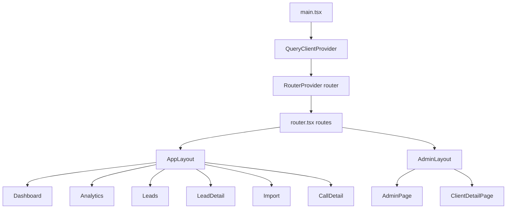

# Área 5 — Frontend / UI / Pantallas / Rutas

> Auditoría de solo lectura del frontend de Qora (`frontend/`). Mapea rutas → pantallas → componentes clave → llamadas a la API, documenta la capa de datos (TanStack Query), el sistema de diseño y la cobertura de tests. Cada afirmación relevante lleva evidencia (archivo + símbolo) y etiqueta de clasificación. El código manda sobre la documentación.

## 1. Stack y arranque

- **Stack declarado** (`frontend/package.json`): React `^19.1.0`, React Router `^7.5.2` (paquete `react-router`), TanStack Query `^5.74.4`, Vite `^6.3.3`, Tailwind `^4.1.4` (vía `@tailwindcss/vite`), Radix UI (`dialog`, `dropdown-menu`, `tabs`, `toggle-group`, `tooltip`), Vitest `^3.1.2` + Testing Library + MSW para tests. [Confirmado por codigo]
- **Punto de entrada** (`frontend/src/main.tsx`): monta `<RouterProvider router={router}>` dentro de un único `QueryClientProvider`. El `QueryClient` define defaults globales: `retry: 1`, `staleTime: 30_000`. No hay `ReactQueryDevtools` ni error boundary global. [Confirmado por codigo]
- **Alias de import**: `@` → `frontend/src` (`frontend/vite.config.ts`, `resolve.alias`). [Confirmado por codigo]
- **Proxy de desarrollo** (`frontend/vite.config.ts`, `server.proxy`): `/api` → `http://127.0.0.1:8000` con `changeOrigin: true`. Por eso `VITE_API_BASE_URL` por defecto es `''` (mismo origen). [Confirmado por codigo]

## 2. Rutas → pantallas (`frontend/src/router.tsx`)

Definidas en `export const routes` y envueltas en `createBrowserRouter`. La constante `routes` se exporta para que los tests usen `createMemoryRouter`. [Confirmado por codigo]

| Ruta | Layout | Pantalla (componente) | Archivo |
|---|---|---|---|
| `/` | — | Redirect → `/app/demo-client/dashboard` | `router.tsx` |
| `/app/:clientId` | `AppLayout` | (Outlet) | `app-layout.tsx` |
| `/app/:clientId` (index) | `AppLayout` | Redirect → `dashboard` | `router.tsx` |
| `/app/:clientId/dashboard` | `AppLayout` | `DashboardPage` | `features/dashboard/page.tsx` |
| `/app/:clientId/leads` | `AppLayout` | `LeadsPage` | `features/leads/page.tsx` |
| `/app/:clientId/leads/:leadId` | `AppLayout` | `LeadDetailPage` | `features/leads/detail-page.tsx` |
| `/app/:clientId/import` | `AppLayout` | `ImportPage` (placeholder) | `features/import/page.tsx` |
| `/app/:clientId/analytics` | `AppLayout` | `AnalyticsDashboardPage` | `features/analytics/page.tsx` |
| `/app/:clientId/calls/:sessionId` | `AppLayout` | `CallDetailPage` | `features/calls/call-detail-page.tsx` |
| `/admin` (index) | `AdminLayout` | `AdminPage` (lista de clientes) | `features/admin/page.tsx` |
| `/admin/clients/:clientId` | `AdminLayout` | `ClientDetailPage` | `features/admin/client-detail-page.tsx` |
| `*` | — | Redirect → `/app/demo-client/dashboard` | `router.tsx` |

Observaciones:
- **`demo-client` está hardcodeado** como tenant por defecto en el redirect raíz, en el catch-all `*` y como fallback en `AppLayout` (`const id = (clientId ?? 'demo-client').toLowerCase()`). Cualquier URL desconocida cae en `demo-client`. [Confirmado por codigo] (`router.tsx` L41/L94; `app-layout.tsx` L15)
- **No hay ruta de login/autenticación ni guard de rutas.** No existe `useAuth`, `<ProtectedRoute>` ni redirección a login; la única referencia a auth es un comentario "Phase C: JWT from login flow" en `api/client.ts`. El panel `/admin` es accesible sin gate en el frontend. [Confirmado por codigo]
- **El doc-comment de `router.tsx` (líneas 1-17, bloque "Route structure" L8-L11) está desactualizado** respecto del array `routes` real: (a) etiqueta como "placeholder" pantallas que están **completamente implementadas** (`DashboardPage`, `LeadsPage`, `LeadDetailPage`); (b) **omite tres rutas que sí existen** en el código: `/app/:clientId/analytics` (`AnalyticsDashboardPage`), `/app/:clientId/calls/:sessionId` (`CallDetailPage`) y las rutas admin `/admin` (`AdminPage`) + `/admin/clients/:clientId` (`ClientDetailPage`). El comentario solo lista `dashboard`, `leads`, `leads/:leadId` e `import`. Discrepancia doc vs código; el código manda (ver imports `AnalyticsDashboardPage`, `CallDetailPage`, `AdminPage`, `ClientDetailPage` en `router.tsx` L26-L30). [Confirmado por codigo]

## 3. Layouts y navegación

### 3.1 `AppLayout` (`frontend/src/app-layout.tsx`)
- Estructura: `TopBar` (sticky) + `Sidebar` (fija izquierda, colapsable) + `PageContainer` con `<Outlet/>`. Gestiona `sidebarCollapsed` en estado local para sincronizar el margen del contenido. [Confirmado por codigo]
- `clientId` se lee de `useParams` y se **lowercasea solo para TopBar/Sidebar** (display); las pantallas hijas leen el `clientId` crudo de `useParams` para las queries. Posible inconsistencia de casing entre lo mostrado y la clave de query si la URL trae mayúsculas. [Inferido razonablemente]

### 3.2 `Sidebar` (`frontend/src/design/components/sidebar.tsx`)
- 4 ítems de navegación: **Dashboard, Analytics, Leads, Import** (`navItems`), cada uno con icono SVG inline. Colapsable (64px ↔ 224px). [Confirmado por codigo]
- **No hay enlace a `/admin` ni a la vista de llamadas** (`calls/:sessionId`). A `/admin` se llega solo escribiendo la URL; a una llamada se llega desde el detalle de lead (`CallHistoryList` → "View detail"). [Confirmado por codigo]
- **El item "Import" navega a una pantalla placeholder** (ver 4.4): la navegación promete una función no implementada. [Confirmado por codigo]

### 3.3 `TopBar` (`frontend/src/design/components/top-bar.tsx`)
- Minimalista: solo muestra el `clientId` actual en mono-uppercase. Sin acciones, sin selector de tenant, sin menú de usuario. [Confirmado por codigo]

### 3.4 `AdminLayout` (`frontend/src/features/admin/admin-layout.tsx`)
- Header compacto "Qora / Admin", contenido a ancho completo con padding. Sin Sidebar ni TopBar. [Confirmado por codigo]

## 4. Pantallas (features)

### 4.1 Dashboard (`features/dashboard/page.tsx`)
- Container-presentational. Lee `clientId` de params, gestiona `period` (`'today' | '7d' | '30d' | 'all'`, default `'all'`) y deriva rango UTC con `periodToDateRange` (memoizado para no romper el queryKey). Llama `useMetrics(clientId, dateRange)`. [Confirmado por codigo]
- Ramas UI: loading (skeleton grid), error (mensaje + botón Retry), empty (`total_calls === 0`), data (`MetricsGrid`). [Confirmado por codigo]
- Columna derecha:
  - **`ActiveIntegrationsCard`**: **HARDCODEADA** — renderiza siempre "Airtable · Connected" sin llamar a ninguna API. No refleja el estado real de integraciones del cliente. UI engañosa. [Confirmado por codigo] (`page.tsx` L192-219)
  - **`AgentStatusCard`**: sí llama `useAgents(clientId)` y muestra estado Live/Setup/Inactive según `is_active` + `is_conversation_ready`. [Confirmado por codigo]
- Componentes auxiliares: `metrics-grid.tsx`, `stat-card.tsx`, `status-breakdown.tsx`, `period-selector.tsx`. [Confirmado por codigo]

### 4.2 Leads — lista (`features/leads/page.tsx` + `lead-table.tsx`)
- `LeadsPage` lee `clientId`, llama `useLeads(clientId)`, rutea loading/error/empty/data y delega en `LeadTable`. Click de fila → `navigate(/app/:clientId/leads/:leadId)`. [Confirmado por codigo]
- `LeadTable` (presentacional): columnas Name, Phone, Status (Badge), Calls, Last Called, **Fields** (resumen de `custom_fields`), **Next Action** (derivado por `deriveNextAction`, `next-action.ts`). [Confirmado por codigo]
- **No hay UI de creación de lead.** No existe botón "New Lead" ni formulario; `createLead` en `api/leads.ts` no tiene hook ni consumidor (ver 6). Los leads solo entran por sync de CRM/backend. [Confirmado por codigo]

### 4.3 Lead detail (`features/leads/detail-page.tsx`)
- Pantalla más densa del producto: vista de inspección "qué guarda Qora y qué recibirá el agente". Layout dos columnas (xl). Hooks: `useLead`, `useCallSessions`, `useLeadContextPreview`, `useIntegrations`, `useLeadDimensionRollups`. [Confirmado por codigo]
- Secciones:
  - **A — Lead Record**: campos base (id, name, phone, email, status, call_count, do_not_call, notes, interest_level, fechas).
  - **B — Quote Readiness Fields**: separa `quote_fields` por `in_quote_ready_fields` (objetivos del agente) vs CRM-provided (contexto). Badge `filled/total required`.
  - **C — Accumulated Facts (`MemorySection`)**: parsea `profile_facts` (JSON estructurado con fallback a raw), rankings de intereses/issues vía `useLeadDimensionRollups`, rollups de objeciones/pain points, historial de interés, resumen de última llamada. Incluye `ZonaMismatchWarning` (heurística de ubicación AR vs campo `zona`). [Confirmado por codigo]
  - **D — Call History** (`CallHistoryList`): sesiones con transcript inline expandible + enlace al detalle de llamada.
  - **E — CRM / Airtable** (`CRMSection`): IDs externos + field mappings del primer integration. Copy honesto "No last-sync timestamp stored". Sin botón de sync falso.
  - **F — Next-Call Context Preview**: carga diferida (botón "Load context preview") → `useLeadContextPreview`; muestra bloques literales (lead_profile, call_history, misc_notes, skills_index, tools) y metadata (call_number, returning caller). [Confirmado por codigo]
- `DetectedInterestsRanking` y `ServiceIssuesRanking` se **exportan** desde este archivo y son lo que prueba `features/leads/dimension-rollups.test.tsx` (no existe un archivo fuente `dimension-rollups.tsx`). [Confirmado por codigo]
- Etiquetas de dimensiones traducidas con `resolveLabel(code, 'es')` (`config/dimension-labels.ts`). [Confirmado por codigo]

### 4.4 Import (`features/import/page.tsx`)
- **Placeholder "Coming Soon"**: solo renderiza un encabezado y el texto "CSV bulk lead import is coming soon." No llama a ninguna API. Sin embargo es un item de navegación de primer nivel en el Sidebar. Funcionalidad anunciada sin backend. [Confirmado por codigo]

### 4.5 Analytics (`features/analytics/page.tsx`)
- Container con `period` (default `'month'`) y `agentId` (default `'all'` → `undefined`). Llama 4 hooks: `useAnalyticsOverview`, `useAnalyticsServiceIssues`, `useAnalyticsInterests`, `useAnalyticsAgentStats`. `isLoading` se toma solo de `overview`; `isError` agrega las 4. [Confirmado por codigo]
- Secciones presentacionales: `OverviewSection`, `ServiceIssuesSection`, `InterestsSection`, `AgentStatsSection`. Filtros: `AgentFilter` (`<select>` poblado con `useAgents`) y `PeriodSelector`. [Confirmado por codigo]
- **`PeriodSelector` ofrece la opción `'custom'` pero no hay selectores de fecha** en ninguna parte de Analytics: elegir "Custom" envía `period=custom` sin `start_date`/`end_date`. Función incompleta o potencial bug funcional según cómo el backend maneje `custom` sin fechas. [Confirmado por codigo] (`features/analytics/period-selector.tsx`)

### 4.6 Call detail (`features/calls/call-detail-page.tsx` + `call-analysis-panel.tsx`)
- Lee `sessionId` de params, llama `useCallAnalysis(sessionId)` y compone, en un único flujo masonry CSS-columns, la `Transcript` (`TranscriptViewer`) + todas las tarjetas de análisis (`AnalysisSectionCards`). [Confirmado por codigo]
- `call-analysis-panel.tsx` renderiza las ~12 dimensiones (pain points, summary, interest bar, classification, urgency, objections, service issues, detected interests, commitment signals, profile facts, misc notes, data corrections con badges de paridad Qora/CRM, audit section). Los campos JSON llegan como `Record<string, unknown>[]` y se acceden con índices string → **tipado débil** en las dimensiones. [Confirmado por codigo]
- `useCallAnalysis` trata 404 como `null` (sin análisis) y re-lanza cualquier otro error para no enmascarar fallos del servidor. [Confirmado por codigo] (`api/hooks.ts` L182-202)
- `CallAnalysisPanel` (wrapper con su propio contenedor de columnas) **no es usado por `CallDetailPage`** (que usa `AnalysisSectionCards` directamente); se exporta como API retrocompatible que ningún consumidor de producción importa. El único `import { CallAnalysisPanel }` del repo está en su propio test (`features/calls/call-analysis-panel.test.tsx` L31); `call-detail-page.test.tsx` solo lo nombra en un comentario, no lo importa. Dead code confirmado. [Confirmado por codigo]

### 4.7 Admin — lista de clientes (`features/admin/page.tsx`)
- `AdminPage` (export nombrado): lista de clientes con `useClients`, formularios inline de crear/editar (`useCreateClient`, `useUpdateClient`) y desactivar (`useDeactivateClient`), Toast de feedback, navegación de fila a `/admin/clients/:clientId`. [Confirmado por codigo]
- Default de `agent_name` hardcodeado a `'Jaumpablo'` en el formulario de creación. [Confirmado por codigo]

### 4.8 Admin — detalle de cliente (`features/admin/client-detail-page.tsx`)
- Lee `clientId`, `useClient`. Header + dos `Disclosure` colapsables: **Agents** (`AgentsSection`) e **Integrations** (`IntegrationsSection`). [Confirmado por codigo]
- **`AgentsSection`** (`features/admin/agents-section.tsx`): tabla de agentes + crear/editar con checklist de readiness (`computeReadinessChecklist` importado de `agents-panel.tsx`), URL de Custom LLM con copy-to-clipboard, voice tuning (speed/stability/similarity), tools enabled (`get_lead_details`, `register_interest`, `mark_not_interested`, `schedule_followup`), temperature/max_tokens, ElevenLabs Agent ID, knowledge base. Hooks: `useAgents`, `useCreateAgent`, `useUpdateAgent`, `useDeactivateAgent`, `useMakeAgentDefault`. [Confirmado por codigo]
  - El voice_id se edita en el form pero el copy aclara que la voz "se configura en el dashboard de ElevenLabs, no acá". [Confirmado por codigo]
  - **No hay botón para disparar el sync a ElevenLabs**; el endpoint backend `POST /agents/{agent_id}/sync-elevenlabs` no se consume desde el frontend (solo se edita `elevenlabs_agent_id` a mano). [Confirmado por codigo]
- **`IntegrationsSection`** (`features/admin/integrations-section.tsx`): lista providers con `useAvailableIntegrations` + `useIntegrations`. Tarjeta conectada con detalles (base_id, table_id, api_key_env, match_field), `MappingEditor` (core mappings + custom fields + quote-ready), test connection, disconnect; tarjeta no-conectada con `ConnectForm`. Hooks: `useAvailableIntegrations`, `useIntegrations`, `useTestIntegration`, `useConnectIntegration`, `useDisconnectIntegration`, `useIntegrationFields`, `useSaveIntegrationMappings`. [Confirmado por codigo]
  - `MappingEditor` valida claves de custom fields contra `SNAKE_CASE_KEY_PATTERN` antes de guardar y exige los core fields requeridos (`external_lead_id`, `name`, `phone`, `email`). [Confirmado por codigo]
  - El input de API key es `type="password"`; el copy aclara que se acepta PAT o nombre de env var y que Qora nunca vuelve a mostrar el valor crudo. Manejo correcto de secretos en UI. [Confirmado por codigo]

## 5. Capa de datos (`frontend/src/api/*`)

### 5.1 Cliente base (`api/client.ts`)
- `apiFetch<T>(path, init)`: arma `Authorization: Bearer ${API_KEY}` cuando `VITE_API_KEY` está seteado, fuerza `Content-Type: application/json` (incluso en GET sin body), parsea errores con `errorMessageFromBody` y lanza `ApiError(status, body)`. [Confirmado por codigo]
- `BASE = VITE_API_BASE_URL ?? ''`, `API_KEY = VITE_API_KEY ?? ''`. [Confirmado por codigo]
- **El bearer es un token estático embebido en build (`VITE_API_KEY`)**: queda dentro del bundle JS servido al navegador → cualquiera con acceso al frontend puede leerlo. Adecuado solo para entorno interno/demo; no es auth real. [Confirmado por codigo / Necesita validacion humana sobre el modelo de despliegue]

### 5.2 Funciones de endpoint y verificación contra backend
Cruce de `api/*.ts` con los routers FastAPI (`backend/app/.../router.py`, prefijo `/api/v1`). Todos los endpoints invocados por el frontend **existen** en el backend: [Confirmado por codigo]

| Función frontend | Método + path | Router backend |
|---|---|---|
| `fetchLeads` / `fetchLead` / `createLead` | `GET/POST /api/v1/leads` (+ `/{id}`) | `leads/router.py` |
| `fetchLeadContextPreview` | `GET /api/v1/leads/{id}/context-preview` | `leads/router.py:730` |
| `fetchLeadDimensionRollups` | `GET /api/v1/leads/{id}/dimension-rollups` | `leads/router.py:650` |
| `fetchMetrics` | `GET /api/v1/calls/metrics` | `calls/router.py:57` |
| `fetchCallSessions` | `GET /api/v1/calls?client_id&lead_id` | `calls/router.py:121` |
| `fetchTranscript` | `GET /api/v1/calls/{id}/transcript` | `calls/router.py:316` |
| `fetchCallAnalysis` | `GET /api/v1/calls/{id}/analysis` | `calls/router.py:360` |
| `fetchClients`/`fetchClient`/`createClient`/`updateClient`/`deactivateClient` | `GET/POST/PATCH/DELETE /api/v1/clients` | `clients/router.py` |
| `fetchAgents`/`createAgent`/`updateAgent`/`deactivateAgent`/`makeAgentDefault` | `/api/v1/clients/{id}/agents/...` | `agents/router.py` |
| `fetchAnalytics*` (overview/service-issues/interests/agent-stats) | `GET /api/v1/analytics/{id}/...` | `analytics/router.py` |
| Integrations (`fetch`/`available`/`update`/`connect`/`test`/`disconnect`/`fields`/`mappings`) | `/api/v1/clients/{id}/integrations/...` | `integrations/crm_config_router.py:352-636` |

- **No se detectaron llamadas a endpoints inexistentes.** El contrato API↔backend está alineado. [Confirmado por codigo]
- El comentario de `api/types.ts` advierte que los tipos espejan los Pydantic del backend manualmente ("Keep in sync... If API grows past 30 endpoints, switch to codegen") → riesgo de drift de tipos. [Confirmado por codigo]

### 5.3 Hooks TanStack Query (`api/hooks.ts`)
- Queries con `queryKey` estable incluyendo `clientId`/params y `enabled: Boolean(clientId)`. `staleTime` por hook (30s–60s). Mutaciones invalidan las queries relevantes (`['clients']`, `['agents', clientId]`, `['integrations', clientId]`, etc.). [Confirmado por codigo]
- Inventario de hooks: `useMetrics`, `useLeads`, `useLead`, `useLeadContextPreview`, `useLeadDimensionRollups`, `useCallSessions`, `useClient`, `useTranscript`, `useCallAnalysis`, `useClients`, `useAgents`, `useCreateClient`, `useUpdateClient`, `useDeactivateClient`, `useCreateAgent`, `useUpdateAgent`, `useDeactivateAgent`, `useMakeAgentDefault`, `useAnalytics{Overview,ServiceIssues,Interests,AgentStats}`, `useIntegrations`, `useUpdateIntegration`, `useTestIntegration`, `useAvailableIntegrations`, `useConnectIntegration`, `useDisconnectIntegration`, `useIntegrationFields`, `useSaveIntegrationMappings`. [Confirmado por codigo]
- **`useUpdateIntegration` no tiene consumidor en UI** (la edición de mappings usa `useSaveIntegrationMappings` vía `/mappings`; la sección de integraciones nunca llama al `PUT /{provider}` directo). [Inferido razonablemente]

### 5.4 Endpoints backend NO consumidos por el frontend
- `POST /api/v1/agents/{id}/sync-elevenlabs` (sin botón en UI). [Confirmado por codigo]
- `PATCH /api/v1/leads/{id}/status` y `GET /api/v1/leads/{id}/history` (no hay función en `api/leads.ts`). [Confirmado por codigo]
- Todo el router `/api/v1/demo/*` (`demo/router.py`) — esta SPA usa la superficie autenticada con `demo-client` como tenant; no consume los endpoints públicos de demo. [Confirmado por codigo]

## 6. Código muerto / legacy

- **`features/admin/clients-panel.tsx` (`ClientsPanel`)**: no se renderiza en ninguna ruta ni pantalla; solo lo referencia su propio test. Reemplazado por `AdminPage` (`features/admin/page.tsx`). Dead code. [Confirmado por codigo]
- **`features/admin/agents-panel.tsx` → componente `AgentsPanel`**: muerto (el comentario de `agents-section.tsx` dice "Replaces the old AgentsPanel"). El **helper `computeReadinessChecklist` del mismo archivo SÍ se usa** en `AgentsSection`, así que el archivo no puede borrarse sin extraer ese helper. [Confirmado por codigo]
- **`features/leads/analysis-panel.tsx` (`AnalysisPanel`)**: exportado pero sin import en ningún componente (solo aparece su propia definición). Superseded por `features/calls/call-analysis-panel.tsx`. Dead code. [Confirmado por codigo]
- **`createLead` (`api/leads.ts`)**: sin hook (`useCreateLead`) ni consumidor de UI; solo lo referencian tests. Dead a nivel de producto (no hay forma de crear leads desde la interfaz). [Confirmado por codigo]
- **`CallAnalysisPanel` wrapper (`call-analysis-panel.tsx` L942-L950)**: no usado por la página real (`CallDetailPage` consume `AnalysisSectionCards` directamente); su único import en todo el repo es su propio test (`call-analysis-panel.test.tsx` L31). El wrapper existe solo como API retrocompatible sin consumidor de producción. Dead code confirmado. [Confirmado por codigo]

## 7. Sistema de diseño (`frontend/src/design/`)

- **Doc canónico**: `qora-design-system.md` (v2026.05, es-AR, voseo) — manual de marca extenso: paleta (teal signature `#1A8B7A`, coral cuentagotas, pearl/paper/ink), tipografía Fredoka, principios "calma sobre estridencia", anti-patrones (p.ej. left-stripe prohibido, citado en `sidebar.tsx`). Es documentación de marca, no necesariamente 1:1 con todos los componentes. [Confirmado por codigo]
- **Tokens**: `tokens.css` (`@theme` Tailwind 4 con variables `--color-*`), `globals.css`. Test `tokens.test.ts` valida tokens. [Confirmado por codigo]
- **Componentes** (`design/components/`, barrel en `index.ts`): `Button`, `Card`, `Input`, `Badge`, `Sidebar`, `TopBar`, `PageContainer`, `Table` (+sub), `Tabs`, `Select`, `Textarea`, `Checkbox`, `Toast`, `LiveIndicator`. Mayoría con test propio. [Confirmado por codigo]
- `Tabs` y `Select` están exportados; conviene verificar consumidores reales (Radix está en deps pero el uso directo en pantallas es limitado; los selects de analytics/integrations usan `<select>` nativo). [Necesita validacion humana]

## 8. Config / hooks / lib

- `config/dimension-labels.ts`: registro `code → {es,en}` para traducir dimensiones de análisis; `resolveLabel(code, locale)`. Frontend-only, tree-shakeable. [Confirmado por codigo]
- `hooks/use-client-id.ts`: `useClientId()` que lanza si no hay `:clientId`. **Define un patrón más seguro que el usado en las pantallas**, que en cambio hacen `clientId ?? ''`. Adopción inconsistente del hook. [Confirmado por codigo]
- `lib/format-duration.ts`: formateo mm:ss usado en historial de llamadas. [Confirmado por codigo]

## 9. Cobertura de tests (alto nivel)

- **47 archivos de test** (`*.test.ts(x)`), runner Vitest + Testing Library + MSW. Cobertura amplia: toda la capa `api/*` (incl. hooks), todos los componentes de diseño, y la mayoría de pantallas (dashboard, leads, analytics, calls, admin, router). [Confirmado por codigo]
- **Huecos de test**: `features/import/page.tsx` (placeholder, sin test); subcomponentes de analytics `overview-section`, `service-issues-section`, `interests-section`, `agent-stats-section`, `period-selector` (analytics) y `agent-filter` (sin test dedicado; cubiertos indirectamente por `analytics/page.test.tsx`); `live-indicator`, `top-bar`, `page-container` (sin test individual; `top-bar`/layout parcialmente vía `layout.test.tsx`). [Confirmado por codigo]
- Tests para `clients-panel`/`agents-panel` existen aunque los componentes estén muertos → mantienen vivo código no usado. [Confirmado por codigo]

## 10. Riesgos y hallazgos transversales (resumen)

- **Sin autenticación real en el frontend**: bearer estático en bundle, `/admin` sin guard, sin login. [Confirmado por codigo / Necesita validacion humana sobre despliegue]
- **`ActiveIntegrationsCard` del dashboard hardcodea "Airtable Connected"** sin consultar la API → puede mentir sobre el estado real. [Confirmado por codigo]
- **Analytics "Custom" sin date pickers** → opción de UI sin función. [Confirmado por codigo]
- **Import es placeholder** anunciado en la navegación. [Confirmado por codigo]
- **Sin UI de creación de leads** pese a existir `createLead`. [Confirmado por codigo]
- **Tipos API mantenidos a mano** (riesgo de drift) y dimensiones de análisis con tipado débil (`Record<string,unknown>`). [Confirmado por codigo]
- **Código muerto** (ClientsPanel, AnalysisPanel, AgentsPanel) inflando bundle y tests. [Confirmado por codigo]

## 11. Cobertura y límites

- **No ejecuté** build, dev server, tests ni navegación real (auditoría de solo lectura): el comportamiento runtime real (p.ej. cómo responde el backend a `period=custom` sin fechas, o si `demo-client` existe siempre) **no fue validado dinámicamente**. [Necesita validacion humana]
- **Variables de entorno** (`VITE_API_BASE_URL`, `VITE_API_KEY`): documenté nombres y propósito inferido; no inspeccioné valores ni archivos `.env`. El modelo de seguridad real del bearer depende del despliegue. [Necesita validacion humana]
- **Consumo real de `Tabs`/`Select`/`useUpdateIntegration`**: marqué dead/parcial por análisis estático de imports; conviene confirmar con un check de cobertura/tree-shaking. (`CallAnalysisPanel` quedó confirmado como dead code por inspección de imports — ver 4.6 y 6, no requiere validación adicional.) [Necesita validacion humana]
- **Paridad doc de marca vs implementación**: `qora-design-system.md` es extenso; no audité cada token/regla contra cada componente, solo el alineamiento general. [Necesita validacion humana]
- El cruce API↔backend se hizo por rutas/prefijos; **no validé esquemas de request/response campo por campo** entre Pydantic y los `interface` de `types.ts`. [Necesita validacion humana]
