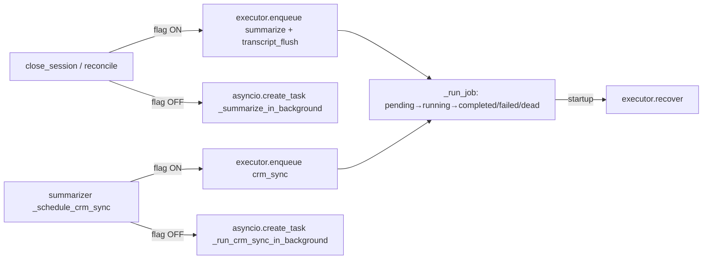

# Área 6 — Backend / API / Servicios

> Auditoría de solo lectura de la superficie HTTP (FastAPI) y la capa de servicios de Qora.
> Documenta cada router de dominio, su autenticación, el contrato de request/response y el servicio
> al que delega, más la lógica de cada servicio (calls, leads, scheduler, analytics, tenants,
> integrations, elevenlabs, summarizer, sweeper, memory, jobs). Las afirmaciones llevan evidencia
> (`archivo:símbolo`) y una etiqueta de clasificación. El código manda sobre la documentación previa.

---

## 1. Arquitectura de routing

- La aplicación se crea en `create_app()` y se expone como singleton `app` a nivel de módulo. **[Confirmado por codigo]** `backend/app/main.py:325` (`create_app`), `:396` (`app = create_app()`).
- TODOS los routers de dominio se montan bajo un `APIRouter(prefix="/api/v1")` (`api_v1_router`) que luego se incluye en la app. **[Confirmado por codigo]** `backend/app/main.py:253`, `:389`.
- `backend/app/api/routes/` está esencialmente vacío (solo `__init__.py` de 26 bytes); los routers viven por módulo de dominio. **[Confirmado por codigo]** `backend/app/api/routes/__init__.py`.
- Orden de inclusión de routers en `api_v1_router`: clients, agents, tenants, leads, calls, voice(initiation), voice(webhook), scheduler, analytics, crm, crm_config, demo. **[Confirmado por codigo]** `backend/app/main.py:284-297`.
- El orden importa: en `calls/router.py` las rutas `metrics`, `""` (list) y `elevenlabs-postcall` se registran ANTES de `/{session_id}` para evitar que FastAPI capture esas palabras como UUID de sesión. **[Confirmado por codigo]** `backend/app/calls/router.py:51-57`, `:117-121`, `:151-156`.

### 1.1 Middleware y CORS

- `RequestLoggingMiddleware` (structlog) registra método, path, status y latencia por request. **[Confirmado por codigo]** `backend/app/main.py:69-106`.
- CORS: `allow_origins` se parsea de `QORA_ALLOWED_ORIGINS`; **por defecto `"*"`** con `allow_methods=["*"]` y `allow_headers=["*"]`. **[Confirmado por codigo]** `backend/app/main.py:379-387`, `_parse_allowed_origins:305`.
- `/docs` y `/redoc` se controlan con `QORA_DOCS_ENABLED` (default `True`). **[Confirmado por codigo]** `backend/app/main.py:359-373`, `backend/app/core/config.py:121`.

### 1.2 Lifespan (startup/shutdown)

`backend/app/main.py:134-246` (`lifespan`). En el arranque, en orden: **[Confirmado por codigo]**
1. Carga `Settings()` y configura logging.
2. `validate_all_integration_credentials()` — valida credenciales por cliente en `clients/*/crm.yaml`; hard-fail si falta una env var referenciada (`:170`).
3. `init_db()` (solo engine + WAL; el esquema lo garantiza la migración Alembic pre-arranque, NO `create_all`). `:179`.
4. Seed: `seed_quintana`, `seed_qora_demo`, `seed_leads`. `:184-190`.
5. Si `enable_job_executor`: `executor.recover()` reencola jobs pendientes/corriendo. `:198-202`.
6. Lanza tareas de fondo: `_session_store_cleanup_task` (TTL 5 min, cada 60s), `stale_session_sweeper` (sweeper), `scheduler_tick` (Phase 6). `:207-217`.
- Shutdown: cancela las tareas, hace `executor.shutdown()` si está habilitado y `close_db()`. `:222-246`.

### 1.3 Rutas no-API (estáticas / SPA / redirect)

- `GET /admin` y `GET /admin/` → `RedirectResponse` 307 a `{frontend_url}/admin`. **[Confirmado por codigo]** `backend/app/main.py:414-424`.
- Mount `/demo` → `StaticFiles(directory=app/static, html=True)` (la página simuladora de llamada). **[Confirmado por codigo]** `backend/app/main.py:402-404`.
- Mounts `/assets`, `/fonts`, `/images` y catch-all `GET /{full_path:path}` que sirve `index.html` del build React — **solo existen dentro de la imagen Docker** (`static-frontend/`); fuera de Docker se omiten. **[Confirmado por codigo]** `backend/app/main.py:442-459`.
- El antiguo mount `/admin` estático fue removido a propósito (comentario explícito). **[Confirmado por codigo]** `backend/app/main.py:26-28`.

---

## 2. Autenticación y seguridad transversal

Definidas en `backend/app/core/auth.py`. Tres mecanismos:

| Dependencia | Qué valida | Default | Usada por |
|---|---|---|---|
| `require_api_key` | `Authorization: Bearer <QORA_API_KEY>` con `secrets.compare_digest` (constant-time). Devuelve `CallerIdentity` con hash de auditoría. | Si `QORA_API_KEY` no está configurada → **deniega todo (401)** | Routers admin (clients, agents, leads, calls*, scheduler, analytics, crm, crm_config) |
| `require_webhook_secret` | Header `X-Webhook-Secret` vs `QORA_WEBHOOK_SECRET`. | **`QORA_WEBHOOK_AUTH_ENABLED=false` por defecto → no-op (sin auth)** | `/voice/initiation`, `/voice/custom-llm*`, `/voice/{client_id}/custom-llm/...` |
| `get_authorized_session` | Lee `AuthorizedSession` del `session_store` (cero DB). | — | **Ninguno (no se usa como Depends)** — ver §8 |

**[Confirmado por codigo]** `require_api_key:90-157`, `require_webhook_secret:260-331`, `get_authorized_session:334-369`, `CallerIdentity:58-68`.

- `AuthorizedSession` (scopes `pipeline:write/read`; demo nunca recibe `admin:*`) se crea en `create_authorized_session()` y se cachea en `session_store` por `(client_id, conversation_id)`; se consulta en cada turno del custom-LLM leyendo `conv_state.auth` directamente. **[Confirmado por codigo]** `auth.py:212-247`, `voice/webhook.py:1277`.
- `_TESTING_BYPASS` (módulo) permite saltear `require_api_key` bajo pytest. **[Confirmado por codigo]** `auth.py:50`, `:113-115`. Riesgo controlado por el entorno (solo se activa cuando `conftest.py` lo setea).
- Variables de entorno de secretos (solo NOMBRES, sin valores): `OPENAI_API_KEY`, `ELEVENLABS_API_KEY`, `QORA_API_KEY`, `QORA_WEBHOOK_SECRET`, `QORA_ALLOWED_ORIGINS`, `QORA_WEBHOOK_AUTH_ENABLED`, `QORA_DOCS_ENABLED`, `QORA_DEMO_CLIENT_ID`, `QORA_DEMO_AGENT_ID`, `QORA_SESSION_TTL_SECONDS`, `ENABLE_JOB_EXECUTOR`, `DATABASE_URL`, `FRONTEND_URL`, más `QUINTANA_AIRTABLE_API_KEY` / `<CLIENT>_AIRTABLE_API_KEY` referenciadas en `crm.yaml`. **[Confirmado por codigo]** `backend/app/core/config.py:73-152`, `backend/app/main.py:42-48`. `Settings` hace hard-fail si faltan `OPENAI_API_KEY`/`ELEVENLABS_API_KEY`/`QORA_API_KEY` o si tienen placeholders débiles. **[Confirmado por codigo]** `config.py:169-201`.

> Diagrama del flujo de auth por superficie:

```mermaid
flowchart TD
    A[Cliente HTTP] -->|Bearer QORA_API_KEY| B[Routers admin]
    A -->|X-Webhook-Secret opcional| C[/voice/*]
    A -->|sin auth por diseño| D[/api/v1/demo/*]
    A -->|sin auth| E[/api/v1/tenants/{id}]
    A -->|sin auth| F[/voice/signed-url]
    B -->|require_api_key| G[CallerIdentity]
    C -->|require_webhook_secret\nNO-OP por defecto| H[SSE GPT-4o / dynamic vars]
```

---

## 3. Tabla exhaustiva de endpoints

Todas las rutas llevan el prefijo `/api/v1`. Auth: `KEY` = `require_api_key`; `WH` = `require_webhook_secret` (off por defecto); `—` = sin auth.

| Método | Path (con prefijo) | Auth | Propósito | Servicio / lógica |
|---|---|---|---|---|
| GET | `/api/v1/health` | — | Estado, uptime, versión | inline `main.py:259` |
| POST | `/api/v1/clients` | KEY | Crear cliente (201/409) | `tenant_service.create_client` (+ bootstrap agente default) |
| GET | `/api/v1/clients` | KEY | Listar clientes activos (con agent_count batch) | inline `select(Client)` |
| GET | `/api/v1/clients/{client_id}` | KEY | Obtener cliente | inline `session.get(Client)` |
| PATCH | `/api/v1/clients/{client_id}` | KEY | Update parcial (valida ventana horaria) | inline `setattr` |
| DELETE | `/api/v1/clients/{client_id}` | KEY | Soft-delete (`is_active=False`) | inline |
| GET | `/api/v1/clients/{client_id}/agents` | KEY | Listar agentes activos | `tenant_service.list_agents_for_client` |
| POST | `/api/v1/clients/{client_id}/agents` | KEY | Crear agente (201/409) + sync EL fire-and-forget | `tenant_service.create_agent` + `sync_to_elevenlabs` |
| GET | `/api/v1/clients/{client_id}/agents/{agent_id}` | KEY | Obtener agente | `tenant_service.get_agent` |
| PATCH | `/api/v1/clients/{client_id}/agents/{agent_id}` | KEY | Update parcial + sync EL si cambia soft-timeout | `tenant_service.update_agent` |
| POST | `/api/v1/clients/{client_id}/agents/{agent_id}/deactivate` | KEY | Soft-delete agente (guard sole-default) | `tenant_service.deactivate_agent` |
| POST | `/api/v1/clients/{client_id}/agents/{agent_id}/make-default` | KEY | Swap default atómico | `tenant_service.set_default_agent` |
| POST | `/api/v1/clients/{client_id}/agents/{agent_id}/sync-elevenlabs` | KEY | Re-sync síncrono a EL | `ElevenLabsService.sync_soft_timeout` |
| GET | `/api/v1/tenants/{client_id}` | **—** | Config de tenant (alias compat read-only) | `tenant_service.get_client` |
| GET | `/api/v1/leads?client_id=` | KEY | Listar leads + `next_scheduled_call_at` (batch) | `list_leads_for_client` + `cf_service.batch_get` |
| GET | `/api/v1/leads/{lead_id}` | KEY | Detalle lead (profile facts, interest, quote_fields) | `get_lead` + `cf_service` + `CRMConfigLoader` |
| POST | `/api/v1/leads?client_id=` | KEY | Crear lead (201) + custom_fields | `create_lead` + `cf_service.upsert_many` |
| PATCH | `/api/v1/leads/{lead_id}/status` | KEY | Transición de estado (state machine) | `transition_lead_status` |
| GET | `/api/v1/leads/{lead_id}/history` | KEY | Sesiones de llamada del lead | inline `select(CallSession)` |
| GET | `/api/v1/leads/{lead_id}/dimension-rollups?client_id=` | KEY | Rollups (intereses, objeciones, pain, issues) | inline agregación `CallAnalysis` |
| GET | `/api/v1/leads/{lead_id}/context-preview` | KEY | Preview del contexto de la próxima llamada | `build_voice_context` + `build_memory_context` |
| GET | `/api/v1/calls/metrics?client_id=` | KEY | Métricas agregadas | `get_call_metrics` |
| GET | `/api/v1/calls?client_id=` | KEY | Listar sesiones (filtra ghost) | `list_sessions_for_client` |
| POST | `/api/v1/calls/elevenlabs-postcall` | **—** | Webhook post-call de ElevenLabs (CAP-2b) | `close_session` / merge transcript |
| POST | `/api/v1/calls/{conversation_id}/end` | KEY | Cerrar sesión (idempotente, reconciliación) | `close_session` |
| GET | `/api/v1/calls/{session_id}` | KEY | Inspeccionar sesión | `get_session` |
| GET | `/api/v1/calls/{session_id}/transcript` | KEY | Turnos de transcript | `get_transcript` |
| GET | `/api/v1/calls/{session_id}/analysis` | KEY | Análisis 12 dimensiones | `get_call_analysis` |
| POST | `/api/v1/voice/initiation` | WH | Inyección pre-call de lead (dynamic_variables) | `get_client`/`get_lead`/`build_memory_context`/`build_voice_context` |
| GET | `/api/v1/voice/signed-url` | **—** | Signed URL WS de ElevenLabs (demo) | httpx a EL |
| POST | `/api/v1/voice/custom-llm` | WH | Custom-LLM webhook (legacy, deprecado) | `_process_custom_llm_request` (SSE) |
| POST | `/api/v1/voice/custom-llm/chat/completions` | WH | Custom-LLM (legacy) | idem |
| POST | `/api/v1/voice/chat/completions` | WH | Custom-LLM (legacy) | idem |
| POST | `/api/v1/voice/{client_id}/custom-llm/chat/completions` | WH | Custom-LLM path-based (CAP-1, ruta primaria) | idem |
| POST | `/api/v1/scheduler/{client_id}/queue` | KEY | Crear ScheduledCall manual (201) | `create_scheduled_call` |
| POST | `/api/v1/clients/{client_id}/scheduled-calls` | KEY | Alias del anterior | idem |
| GET | `/api/v1/scheduler/{client_id}/queue` | KEY | Listar cola (filtros) | `list_queue` |
| GET | `/api/v1/clients/{client_id}/scheduled-calls` | KEY | Alias | idem |
| GET | `/api/v1/scheduler/{client_id}/queue/{id}` | KEY | Obtener uno | `get_scheduled_call` |
| GET | `/api/v1/clients/{client_id}/scheduled-calls/{id}` | KEY | Alias | idem |
| POST | `/api/v1/scheduler/{client_id}/queue/{id}/cancel` | KEY | Cancelar | `cancel_scheduled_call` |
| PATCH | `/api/v1/clients/{client_id}/scheduled-calls/{id}/cancel` | KEY | Alias (PATCH) | idem |
| PATCH | `/api/v1/scheduler/{client_id}/queue/{id}` | KEY | Reprogramar | `reschedule_call` |
| PATCH | `/api/v1/clients/{client_id}/scheduled-calls/{id}/reschedule` | KEY | Alias | idem |
| PATCH | `/api/v1/clients/{client_id}/scheduled-calls/{id}/complete` | KEY | Completar manual | `complete_scheduled_call` |
| GET | `/api/v1/analytics/{client_id}/overview` | KEY | Métricas agregadas (period) | `get_overview` |
| GET | `/api/v1/analytics/{client_id}/service-issues` | KEY | Issues rankeados | `get_service_issues` |
| GET | `/api/v1/analytics/{client_id}/interests` | KEY | Top intereses + trend | `get_interests` |
| GET | `/api/v1/analytics/{client_id}/agent-stats` | KEY | Stats por agente | `get_agent_stats` |
| POST | `/api/v1/clients/{client_id}/crm/import` | KEY | Import batch Airtable→Qora | `import_leads_from_crm` |
| GET | `/api/v1/clients/{client_id}/integrations` | KEY | Config integraciones (nombre de env var, no secreto) | `CRMConfigLoader.load` |
| GET | `/api/v1/clients/{client_id}/integrations/available` | KEY | Providers soportados + estado | lee `crm.yaml` |
| PUT | `/api/v1/clients/{client_id}/integrations/{provider}` | KEY | **Escribe `crm.yaml`** (update parcial) | `crm.yaml` write |
| POST | `/api/v1/clients/{client_id}/integrations/{provider}/test` | KEY | Test conexión Airtable (1 record) | `_test_airtable_connection` |
| GET | `/api/v1/clients/{client_id}/integrations/{provider}/fields` | KEY | Listar campos Airtable | `_list_airtable_fields` |
| PUT | `/api/v1/clients/{client_id}/integrations/{provider}/mappings` | KEY | **Escribe `crm.yaml`** (mappings/defs) | `crm.yaml` write |
| POST | `/api/v1/clients/{client_id}/integrations/{provider}/connect` | KEY | **Crea `crm.yaml`** (201/409) | `crm.yaml` write |
| DELETE | `/api/v1/clients/{client_id}/integrations/{provider}/disconnect` | KEY | **Borra `crm.yaml`** (`unlink`) | `crm.yaml` delete |
| GET | `/api/v1/demo/context` | **—** | Metadata demo (sin secretos) | `get_client`/`get_agent` |
| GET | `/api/v1/demo/leads` | **—** | Leads del cliente demo | `list_leads_for_client` |
| POST | `/api/v1/demo/sessions/{session_id}/end` | **—** | Cerrar sesión demo (scope-guard) | `close_session` |

Total: **61 endpoints HTTP de API** enumerados arriba (60 rutas de routers de dominio + `GET /api/v1/health`), **contando cada alias del scheduler como una ruta HTTP distinta** (p. ej. `/scheduler/{client_id}/queue` y `/clients/{client_id}/scheduled-calls` apuntan al mismo handler pero son dos registros de ruta separados). El código registra **64 decoradores de ruta en total**: estos 60 de routers de dominio (4 analytics + 7 agents + 11 scheduler + 5 voice/webhook + 1 voice/initiation + 7 leads + 1 crm + 1 tenants + 5 clients + 3 demo + 8 crm_config + 7 calls) más 4 decoradores en `main.py` (`@api_v1_router.get("/health")` ya incluido en la tabla, y los 3 no-API `GET /admin`, `GET /admin/` y el catch-all SPA `GET /{full_path:path}`), aparte de los mounts estáticos `/demo`, `/assets`, `/fonts`, `/images` (que no son decoradores). **[Confirmado por codigo]** conteo de decoradores `@router.*`/`@api_v1_router.*`/`@app.*` en `backend/app/**/router.py`, `voice/webhook.py`, `voice/initiation.py` y `main.py:259,414-415,456`; cada fila de la tabla tiene su archivo en §4.

---

## 4. Detalle por router de dominio

### 4.1 `clients/router.py` — CRUD de clientes
- Prefijo `/clients`, todas con `require_api_key`. **[Confirmado por codigo]** `:27-31`.
- `create_client`: resuelve `client_id` explícito o autogenera slug con dedup `-2/-3...`; delega a `tenant_service.create_client` (NO construye `Client()` directo — bootstrapea agente default). Maneja 409 por id o por nombre (IntegrityError). **[Confirmado por codigo]** `:94-166`.
- `update_client`: valida ventana horaria combinando valores PATCH + DB; aplica `setattr` solo sobre campos del schema `ClientUpdate`. `client_id` no es actualizable. **[Confirmado por codigo]** `:238-301`.
- `delete_client`: soft-delete; **no cascada a agentes ni leads** (quedan activos). **[Inferido razonablemente]** `:309-338` (no toca `Agent`/`Lead`).

### 4.2 `agents/router.py` — CRUD de agentes (anidado)
- Prefijo `/clients/{client_id}/agents`, `redirect_slashes=False`, `require_api_key`. **[Confirmado por codigo]** `:28-33`.
- `_agent_to_response` deriva `custom_llm_url`, flags `is_conversation_ready` y deserializa `tools_enabled`/`tool_config` desde JSON-string de DB. Usa `_tts_field` con check `None` explícito (evita el bug de `value or default` con `0.0`). **[Confirmado por codigo]** `:95-143`.
- `create_agent`/`update_agent`: tras commit, disparan `asyncio.create_task(sync_to_elevenlabs(...))` (fire-and-forget) cuando `_should_trigger_sync` (agente con `elevenlabs_agent_id` + campo soft-timeout). **[Confirmado por codigo]** `:270-275`, `:405-408`, `_should_trigger_sync:153-173`.
- `sync_agent_to_elevenlabs`: variante SÍNCRONA (await) que persiste `elevenlabs_sync_status`/`elevenlabs_last_synced_at`. **[Confirmado por codigo]** `:283-329`.
- `deactivate_agent`/`make_default_agent`: traducen `ValueError` del servicio a 409 (sole-default / inactive) o 500. **[Confirmado por codigo]** `:441-454`, `:489-502`.

### 4.3 `tenants/router.py` — alias compat read-only
- Prefijo `/tenants`, **sin `require_api_key`**. Único endpoint `GET /{client_id}` devuelve config de cliente. **[Confirmado por codigo]** `:10`, `:24-52`.
- **Sin consumidor conocido**: no aparece referenciado en `frontend/` ni en la página demo (solo en docs/tests). **[Confirmado por codigo]** búsqueda repo-wide: solo `main.py`, `tests/integration/test_app_wiring.py`, `docs/api-reference.md`.

### 4.4 `leads/router.py` — admin/debug de leads
- Prefijo `/leads`, `require_api_key`. **[Confirmado por codigo]** `:45-49`.
- `list_leads`: usa `_batch_next_scheduled_call_at` (un `MIN()` GROUP BY, sin N+1) + `cf_service.batch_get`. **[Confirmado por codigo]** `:99-125`, `:272-303`.
- `create_new_lead`: `client_id` por query o body; 422 si falta. **[Confirmado por codigo]** `:352-388`.
- `get_dimension_rollups`: **guard de tenant (IDOR)** — exige `client_id` y devuelve 404 oracle-safe si el lead pertenece a otro tenant; todas las queries filtran por `lead_id` AND `client_id`. **[Confirmado por codigo]** `:650-697`, `_build_dimension_rollups:488-647`.
- `get_lead_context_preview`: reconstruye el contexto exacto del runtime con `build_voice_context` + `build_memory_context`; redacta el system prompt (solo presencia). **[Confirmado por codigo]** `:730-846`.

### 4.5 `calls/router.py` — ciclo de vida de la llamada
- Prefijo `/calls`. Auth **por-ruta** (`dependencies=[Depends(require_api_key)]` en cada decorador) EXCEPTO `elevenlabs-postcall`. **[Confirmado por codigo]** `:57`, `:121`, `:156` (sin auth), `:228`, `:303`, `:316`, `:360`.
- `elevenlabs_postcall_webhook`: idempotente por estado; cierra sesiones `initiated` huérfanas (`network_drop`) o mergea turnos extra si EL trae más, y re-dispara summarize. 404 si no hay sesión para ese `conversation_id`. **[Confirmado por codigo]** `:156-220`.
- `end_call_session`: resuelve por `elevenlabs_conversation_id` y cae a UUID interno; idempotente; loggea mismatch path/body. **[Confirmado por codigo]** `:228-295`.
- `get_call_analysis_endpoint`: parsea columnas JSON-TEXT a listas/dicts vía `_parse_json_col`. **[Confirmado por codigo]** `:346-407`.

### 4.6 `voice/initiation.py` — webhook de iniciación
- Prefijo `/voice`, `require_webhook_secret`. Acepta `client_id`/`lead_id` por query o body; 422 si falta `client_id`, 404 si el cliente no existe, **403 si `lead.do_not_call`**. **[Confirmado por codigo]** `:65-150`.
- Construye `dynamic_variables` con datos de lead leídos de `lead_custom_fields` (WU-7, no columnas legacy) + variables de memoria (CAP-6); incluye variantes `_var_` para el template de ElevenLabs y duplicados deprecados (`broker_name`). **[Confirmado por codigo]** `:152-273`.
- Si llega `conversation_id`, pre-construye y cachea el `VoiceSessionContext` y crea `AuthorizedSession` (is_demo=False) en `session_store`. **[Confirmado por codigo]** `:190-236`.

### 4.7 `voice/webhook.py` — custom-LLM (núcleo)
- Cuatro rutas POST apuntan al mismo `_process_custom_llm_request`: tres legacy (`/custom-llm`, `/custom-llm/chat/completions`, `/chat/completions`) que emiten `custom_llm_legacy_route_used` (warning de deprecación), y la primaria path-based `/{client_id}/custom-llm/chat/completions`. **[Confirmado por codigo]** `:531-672`.
- `CustomLLMRequest` usa `model_config = {"extra": "allow"}` → acepta cualquier campo extra de ElevenLabs. `client_id` se resuelve de `elevenlabs_extra_body` → top-level → `model_extra`. **[Confirmado por codigo]** `:132-151`, `:568-586`.
- Streaming SSE de GPT-4o con manejo de tool-calls mid-stream: emite filler, ejecuta tool vía `dispatch_tool`, recall a GPT-4o, persiste turnos. Cache de `load_skill` en `conv_state.loaded_skills`. Timeout 60s por turno. **[Confirmado por codigo]** `_stream_llm_response:257-523`.
- Tres caminos de contexto: FAST (context cacheado, cero DB), LAZY/NEW SESSION (build dentro de la sesión DB), y fallback PER-TURN (`render_for_agent`). Backfill de `CallSession` y `AuthorizedSession` para flujos sin iniciación. **[Confirmado por codigo]** `:833-1264`.
- `get_signed_url`: endpoint GET **sin auth** que llama a la API de ElevenLabs con la `xi-api-key`. **Sin consumidor** en frontend ni en la demo estática. **[Confirmado por codigo]** `:76-110`; búsqueda: 0 referencias en `frontend/`/`static/`.

### 4.8 `scheduler/router.py` — CRUD de ScheduledCall (Phase 6)
- Router SIN `prefix` (paths absolutos), `require_api_key`. Cada operación expone **doble ruta**: la canónica `/scheduler/{client_id}/queue...` y un alias `/clients/{client_id}/scheduled-calls...`. **[Confirmado por codigo]** `:37-40`, `:65-74`, `:182-189`, `:260-267`, `:302-309`, `:359-362`.
- `create_manual_scheduled_call`: valida cliente (404), propiedad del lead (403), ventana horaria (422) y duplicados pendientes (409). Resuelve agente default. **[Confirmado por codigo]** `:75-174`.
- **Sin consumidor de UI**: ni `/scheduler/` ni `scheduled-calls` aparecen en `frontend/src`; solo en docs/openspec/tests. El uso real de `ScheduledCall` proviene del `scheduler_tick` (background) y de `auto_schedule` (llamado por el summarizer), no de estos endpoints REST. **[Confirmado por codigo]** búsqueda repo-wide; `auto_schedule` no es invocado por el router.

### 4.9 `analytics/router.py`
- Prefijo `/analytics`, `require_api_key`. Cuatro GET (`overview`, `service-issues`, `interests`, `agent-stats`) que validan `period` (day/week/month/custom, 400 si inválido o faltan fechas custom) y existencia del cliente (404). **[Confirmado por codigo]** `:41-45`, `_validate_period:53-68`, `:87-264`. Consumidos por el frontend. **[Confirmado por codigo]** búsqueda: 5 endpoints referenciados en `frontend/`.

### 4.10 `integrations/crm_router.py` y `crm_config_router.py`
- `crm_router`: único POST `/{client_id}/crm/import` con `require_api_key` (el docstring dice "No auth required for now" pero **el código SÍ exige `require_api_key`** — discrepancia doc/código). **[Confirmado por codigo]** `crm_router.py:12` (comentario) vs `:29-33` (dependencia real).
- `crm_config_router`: 8 endpoints. Varios **mutan el filesystem del servidor**: `connect`/`update`/`mappings` escriben `CLIENTS_ROOT/{client_id}/crm.yaml`, `disconnect` hace `crm_path.unlink()`. **[Confirmado por codigo]** `crm_config_router.py:438`, `:541`, `:622`, `:656`.
- Higiene de secretos: `api_key_env` se devuelve como NOMBRE de env var; `_safe_credential_label` enmascara literales; `_sanitize_secret_text` redacta tokens Airtable en mensajes de error. **[Confirmado por codigo]** `:169-187`, `:215-243`.
- El path-param `{client_id}` se concatena directo a `CLIENTS_ROOT / client_id / "crm.yaml"` sin sanitización explícita — ver §9 (riesgo de traversal). **[Confirmado por codigo]** `:52`, `:383`, `:419`, `:570`, `:648`.

### 4.11 `demo/router.py` — endpoints públicos del demo
- Prefijo `/demo`, **auth-exempt por diseño** (comentario explícito "NEVER add require_api_key"). **[Confirmado por codigo]** `:18-19`, `:28`.
- `get_demo_context`/`get_demo_leads`: resuelven `QORA_DEMO_CLIENT_ID`/`QORA_DEMO_AGENT_ID` del servidor (nunca del usuario), 503 si no configurado. Solo devuelven datos no sensibles. **[Confirmado por codigo]** `:59-195`.
- `demo_end_call_session`: scope-guard que rechaza con 403 sesiones que no pertenecen al cliente demo (evita abuso del endpoint sin auth). **[Confirmado por codigo]** `:212-315`. Consumidos por `backend/app/static/index.html`. **[Confirmado por codigo]** búsqueda en `static/index.html`.

---

## 5. Capa de servicios por módulo

### 5.1 `calls/service.py`
- Lifecycle: `create_session` (status `initiated`; resuelve agente default o `ValueError`; avanza lead `new→called` idempotente), `close_session` (idempotente, billable = `ceil(s/60)`, incrementa contadores del lead solo en primer cierre, mergea sesiones hermanas), `end_session`. **[Confirmado por codigo]** `:46-105`, `:604-718`, `:148-180`.
- **Reconciliación de huérfanas** `_reconcile_session`: si no se encuentra sesión por id, busca la sesión `initiated` más "activa" para `(client_id, lead_id)` dentro de `RECONCILIATION_WINDOW_SECONDS=600`. **[Confirmado por codigo]** `:480-601`, `:38`.
- `_merge_sibling_sessions`: reasigna turnos de hermanas (`initiated`/`abandoned`, sin `el_conversation_id`, ±600s) y las marca `merged_into_session_id` (Issue #22). **[Confirmado por codigo]** `:415-477`.
- Despacho de trabajo post-call: si `enable_job_executor` → `executor.enqueue("summarize")` + `executor.enqueue("transcript_flush", max_attempts=2)` (durables); si no → `_schedule_summarize` (fire-and-forget). **[Confirmado por codigo]** `:590-599`, `:707-716`.
- `get_call_metrics`: una sola query con `case()`; excluye `merged_into_session_id`. **[Confirmado por codigo]** `:258-345`.
- `schedule_user_turn_persist`/`_persist_user_turn`: persistencia fire-and-forget del último turno de usuario con 1 retry (backoff 0.5s). **[Confirmado por codigo]** `:768-851`.
- Detalle: `settings = _Settings()` se instancia a nivel de módulo (import time) y gobierna `enable_job_executor` en `close_session`. **[Confirmado por codigo]** `:24-32`.

### 5.2 `tenants/service.py`
- `create_client`: persiste `Client` y **auto-crea agente default** (sanitiza slug). **[Confirmado por codigo]** `:15-106`.
- CRUD de agentes con invariantes: `create_agent` valida unicidad de slug por cliente y único `is_default`; `set_default_agent` hace swap atómico (UPDATE masivo + flag); `deactivate_agent` con guard sole-default; `get_default_agent` excluye inactivos. **[Confirmado por codigo]** `:500-795`.
- Seeds embebidos: `seed_quintana` (prompt + KB como constantes legacy/fallback; el filesystem `clients/quintana-seguros/agents/jaumpablo/system-prompt.md` es la fuente canónica), `seed_qora_demo` (agente `qora-explainer`, `elevenlabs_agent_id` hardcodeado `agent_8201kra4wjhve0srcwgbtwfetr5n`, TTS deterministas). **[Confirmado por codigo]** `:316-492`. El prompt completo de Quintana vive embebido en el servicio (`_QUINTANA_SYSTEM_PROMPT`, ~110 líneas). **[Confirmado por codigo]** `:165-273`.
- **Seed defaults inconsistentes con Phase 2 (`schedule_followup`):** el default de `tools_enabled` en la firma de `create_client`/`create_agent` (`tenants/service.py:27`) y los `default` de columna en `tenants/models.py:59` (Client) y `:140` (Agent) son `'["get_lead_details","mark_not_interested","schedule_followup"]'`. La tool `schedule_followup` fue **removida en Phase 2** (`tools/registry._REMOVED_TOOLS`, `tools/registry.py:70-71`) y su `tools/schedule_followup.py` queda como código sin uso (no se importa en `TOOL_DEFINITIONS`, aunque conserva `TOOL_DEFINITION`). En runtime el dispatcher rechaza toda tool-call a `schedule_followup` con error estructurado `tool_removed` (`tools/dispatcher.py:170-178`). **Consecuencia:** todo agente nuevo creado con los defaults queda con una tool en su configuración persistida que el dispatcher rechaza; se filtra del schema OpenAI vía `strip_deprecated_tools`, pero la config seed queda inconsistente. **[Confirmado por codigo]** (El rango `models.py:151-152` citado en revisión es incorrecto: las líneas reales son `:59` y `:140`.)
- **Recomendación (a validar):** quitar `schedule_followup` de los defaults de seed y/o agregar una migración que lo remueva de `tools_enabled` en agentes existentes — ya existe el patrón en `tenants/service.py:351-361`, que remueve idempotentemente `register_interest` de `tools_enabled`. **[Inferido razonablemente]**

### 5.3 `leads/service.py`
- CRUD + state machine (`transition_lead_status` valida con `is_valid_transition`; `InvalidTransitionError`). **[Confirmado por codigo]** `:91-120`.
- Queries de perfil (Issue #36): `get_active_profile_facts`, `get_interest_history`, `get_facts_by_namespace`. **[Confirmado por codigo]** `:128-235`.
- `create_lead` aún acepta y escribe columnas legacy de auto (`car_make`, etc.); `seed_leads` escribe esos datos vía `lead_custom_fields_service.upsert` (transición WU-7). **[Confirmado por codigo]** `:59-88`, `:319-355`.

### 5.4 `scheduler/service.py`
- `calculate_scheduled_at`: función pura que clampea a la ventana horaria en TZ del cliente. **[Confirmado por codigo]** `:39-83`.
- `auto_schedule`: motor de reglas post-call (scheduler_enabled, outcome en `scheduler_retry_on_outcomes`, `do_not_call`, guard duplicados, max_attempts); resuelve agente (explícito > sesión > default). **Llamado por el summarizer, no por el router.** **[Confirmado por codigo]** `:314-497`; invocación en `summarizer.py` (ver §6).
- `scheduler_tick`: loop de 60s que promueve `pending→in_progress` cuando `scheduled_at <= now`. **[Confirmado por codigo]** `:505-556`.

### 5.5 `analytics/service.py`
- `resolve_window`/`prior_window`/`_compute_trend` (umbral ±10%). **[Confirmado por codigo]** `:33-81`.
- `get_overview`, `get_service_issues` (usa `text()` con `json_each()` de SQLite + combina `LeadProfileFact` namespace `service_issue:`), `get_interests` (namespace `signal:` con trend vs ventana previa), `get_agent_stats` (NULL agent → `unassigned`). **[Confirmado por codigo]** `:89-420`.
- `get_primary_objection_breakdown`, `get_primary_pain_breakdown`, `get_service_issues_count_total`: usan columnas BI denormalizadas/indexadas — **definidas pero NO expuestas por el router de analytics** (posible feature parcial). **[Confirmado por codigo]** `:429-602`; el router solo llama a `get_overview/service_issues/interests/agent_stats`.

### 5.6 `tenants` vs `integrations` — CRM
- `crm_sync_service.sync_lead`: push fire-and-forget post-call (CS-5: traga toda excepción). Lee lead de SQLite (autoritativo), resuelve credencial en runtime, mapea con `FieldMapper`, fallback de `match_field` (external_crm_id→email), detecta duplicados de `external_lead_id`, upsert vía adapter Airtable. Guard de tenant. **[Confirmado por codigo]** `crm_sync_service.py:35-243`.
- `crm_import_service.import_leads_from_crm`: pull batch Airtable→Qora; dedup por (client_id, phone); status forward-only (`_apply_status_if_ahead`); dual-write a `lead_custom_fields` + columnas legacy; cada record en savepoint anidado; **la transacción la commitea el caller (`crm_router`)**. **[Confirmado por codigo]** `crm_import_service.py:130-355`.

### 5.7 `leads/lead_custom_fields_service.py`
- CRUD de campos dinámicos con coerción type-safe en write (`coerce_value`, tipos: string/integer/boolean/date/phone). Lecturas siempre scopeadas por `client_id` (CF-9). `batch_get` (un IN-clause, CF-8). `upsert`/`upsert_many`/`delete`. **[Confirmado por codigo]** `:54-310`. Nota: `delete` NO scopea por `client_id`. **[Confirmado por codigo]** `:292-310`.

### 5.8 `elevenlabs/service.py`
- `ElevenLabsService.sync_soft_timeout`: PATCH parcial (solo `soft_timeout_config`) a `api.elevenlabs.io/v1/convai/agents/{id}`; skip si no hay `elevenlabs_agent_id` o todos los campos None; 1 retry en 5xx, sin retry en 4xx/timeout; nunca lanza (devuelve `SyncResult`). **[Confirmado por codigo]** `:41-160`.
- `sync_to_elevenlabs`: helper background (sesión DB propia) que persiste `elevenlabs_sync_status`. **[Confirmado por codigo]** `:168-202`.
- `get_elevenlabs_service` (FastAPI dependency): **declarada pero no usada** — el router instancia `ElevenLabsService(settings=...)` directo. **[Confirmado por codigo]** `:210-212` vs `agents/router.py:311`.

### 5.9 `summarizer.py`
- Pipeline post-call (~2046 líneas). Entradas públicas: `generate_summary_and_facts` (legacy, traga excepciones) y `generate_summary_and_facts_durable` (re-lanza para el executor). Ambas delegan a `_run_summarizer(durable=)`. **[Confirmado por codigo]** `:186-235`.
- `_run_summarizer`: carga turnos (skip si 0), corre dimensiones en paralelo, persiste con savepoint atómico (CallSession + CallAnalysis + LeadProfileFact + LeadInterestHistory), aplica correcciones de datos, dispara `_auto_schedule_if_needed` y `_schedule_crm_sync`. **[Confirmado por codigo]** `:237-...`, `:1098`, `:1133`.
- `_schedule_crm_sync`: si `enable_job_executor` → `executor.enqueue("crm_sync", {client_id, lead_id})`; si no → `_run_crm_sync_in_background` (fire-and-forget). **[Confirmado por codigo]** `:1180-1196`.

### 5.10 `sweeper.py`
- `sweep_stale_sessions`: marca `initiated` con `started_at` > 10 min como `abandoned` (closed_reason `timeout`), **sin** incrementar `call_count`, y dispara summarize. `stale_session_sweeper`: loop 60s. **[Confirmado por codigo]** `:26-105`.

### 5.11 `memory.py`
- `build_memory_context`: 2 queries (¿existe sesión completed? + últimas 3 con summary); devuelve `MemoryContext` TypedDict (`call_history`, `confirmed_facts=""` intencional, `is_returning_caller`, `call_number`). **[Confirmado por codigo]** `:93-168`.
- Formateadores: `_format_call_history` (TZ Buenos Aires), `_format_misc_notes`, `_format_accumulated_profile` (LeadProfileFact por namespace, tope 10/namespace + evolución de interés). Funciones `_format_confirmed_facts`/`_render_fact_value`/`_format_axis` quedan pero `confirmed_facts` ya no se rellena en runtime (hygiene). **[Confirmado por codigo]** `:144-147`, `:211-642`.

### 5.12 Jobs (`jobs/`)
- `JobExecutor` (DB-backed, in-process): `enqueue` inserta fila `pending` y dispara coroutine tras commit (vía listener `after_commit` cuando se pasa `db`); `_run_job` (pending→running→completed/failed/dead con backoff exponencial+jitter); `recover` (reencola pending/running al arranque); `shutdown`. **[Confirmado por codigo]** `executor.py:99-455`.
- Registry: `register`/`get_handler` con `ConfigurationError`. Handlers registrados al import: `summarize`, `crm_sync`, `transcript_flush`. **[Confirmado por codigo]** `registry.py:60-101`, `handlers/__init__.py:24-26`.
- Política de errores: `ConfigurationError` → dead tras 1 retry con `operator_review=True`; transitorios → retry hasta `max_attempts`. `crm_sync_handler` reclasifica por nombre de excepción o HTTP 400/401/403/404/422. **[Confirmado por codigo]** `executor.py:282-357`, `handlers/crm_sync.py:36-144`.
- Todo el subsistema durable está **gated por `ENABLE_JOB_EXECUTOR` (default `false`)**: en producción por defecto se usa el camino legacy fire-and-forget. **[Confirmado por codigo]** `config.py:152`.



---

## 6. Endpoints / código sin consumidor claro

- `GET /api/v1/tenants/{client_id}` — alias compat read-only, **sin consumidor** en frontend ni demo. **[Confirmado por codigo]** `tenants/router.py`; búsqueda repo-wide.
- **Toda la API REST del scheduler** (`/scheduler/{client_id}/queue*` y aliases `/clients/{client_id}/scheduled-calls*`, incluido `.../complete`) — **sin consumidor en `frontend/src` ni demo**; el uso de `ScheduledCall` ocurre por `scheduler_tick` + `auto_schedule` (summarizer). **[Confirmado por codigo]** `scheduler/router.py`; búsqueda repo-wide.
- `GET /api/v1/voice/signed-url` — **sin consumidor** en frontend/demo. **[Confirmado por codigo]** `voice/webhook.py:76`.
- Rutas legacy `/voice/custom-llm`, `/voice/custom-llm/chat/completions`, `/voice/chat/completions` — activas pero deprecadas (emiten warning); la ruta path-based es la primaria. **[Confirmado por codigo]** `voice/webhook.py:531-606`.
- Aliases duplicados del scheduler — duplican la superficie sin consumidor distinto. **[Confirmado por codigo]** `scheduler/router.py:65-362`.
- `get_authorized_session` (auth) y `get_elevenlabs_service` (elevenlabs) — dependencias FastAPI **declaradas pero nunca usadas**. **[Confirmado por codigo]** búsqueda: 0 usos como `Depends(...)`.
- Funciones de analytics BI (`get_primary_objection_breakdown`, `get_primary_pain_breakdown`, `get_service_issues_count_total`) — **sin endpoint que las exponga**. **[Confirmado por codigo]** `analytics/service.py:429-602` vs `analytics/router.py`.

---

## 7. Discrepancias documentación vs código

- `crm_router.py:12` dice "No auth required for now (dev/demo environment)" pero el router exige `require_api_key`. **El código manda: SÍ requiere auth.** **[Confirmado por codigo]** `crm_router.py:12` vs `:29-33`.
- `elevenlabs/service.py:34-35` dice que `get_elevenlabs_service` se inyecta vía `Depends()` en el router de agentes; el router NO lo hace (instancia directa). **[Confirmado por codigo]** `agents/router.py:308-311`.
- `auth.py:11`/`:251` documentan `get_authorized_session` como dep del hot path del custom-LLM, pero el webhook lee `conv_state.auth` directo del store. **[Confirmado por codigo]** `voice/webhook.py:1277`.

---

## 8. Cobertura y límites (Necesita validacion humana)

- **No se ejecutó nada** (auditoría read-only): no se corrieron tests, ni el servidor, ni migraciones. El comportamiento runtime de SSE, tool-calls y reconciliación se infirió del código. **[Necesita validacion humana]**
- **Path traversal en crm_config_router**: `client_id` se concatena a `CLIENTS_ROOT/{client_id}/crm.yaml` sin sanitización visible; FastAPI no matchea `/` en path params por defecto, pero un `client_id` URL-encoded (`%2F`, `..`) debería validarse contra escritura/borrado fuera de `clients/`. Requiere verificación manual. **[Necesita validacion humana]** `crm_config_router.py:52,383,419,648`.
- **Webhook auth off por defecto**: confirmar si en el deploy productivo `QORA_WEBHOOK_AUTH_ENABLED=true` y `QORA_ALLOWED_ORIGINS` está restringido; con los defaults, `/voice/*` (custom-LLM = costo GPT-4o; initiation = PII de lead) quedan abiertos a quien conozca un `client_id`. **[Necesita validacion humana]** `config.py:135,141`.
- **Consumidores reales**: el cruce de endpoints contra `frontend/` se hizo por grep de literales de path; clientes que construyan URLs dinámicamente podrían no aparecer. Confirmar manualmente si el scheduler REST / tenants alias / signed-url tienen consumidores externos (n8n, Postman, integraciones). **[Necesita validacion humana]**
- **Multiplicidad de Settings()**: `Settings()` se instancia en varios sitios (lifespan, `create_app`, `calls/service` a import-time, fallbacks en routers). No se validó que todas lean el mismo `.env`/entorno en runtime. **[Necesita validacion humana]**
- No se auditaron en profundidad `tools/` (dispatcher, registry), `prompts/loader.py`, `voice/context.py`, `voice/session.py`, `analysis/universal/*` ni los adapters de Airtable — quedan fuera del scope de esta área (Backend/API/servicios core) y pertenecen a las áreas de voz/IA e integraciones. **[Necesita validacion humana]**
