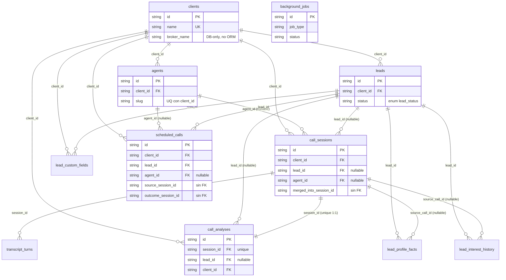
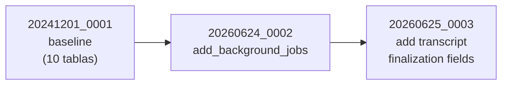

# Área 7 — Modelo de datos, schemas y migraciones

**Propósito.** Documentar de forma exhaustiva el modelo de datos de Qora: tablas SQLAlchemy (columnas, tipos, nulabilidad, FKs, índices), la configuración del motor SQLite/WAL, el esquema de análisis post-llamada y el estado de las migraciones (Alembic + scripts ad-hoc). Se prioriza el código sobre la documentación existente y se marcan los riesgos de *schema-drift* detectados.

Convención de etiquetas: `[Confirmado por codigo]` = verificado leyendo el archivo; `[Inferido razonablemente]` = deducción a partir de evidencia indirecta; `[Necesita validacion humana]` = no verificable solo desde el repo (depende del estado real de la base de datos en producción).

---

## 1. Inventario de tablas

Hay **11 tablas** ORM, todas derivadas de una única `Base` declarativa (`app/core/database.py:26`). `[Confirmado por codigo]` (vía `rg "__tablename__"`).

| Tabla | Modelo | Archivo | Dominio |
|---|---|---|---|
| `clients` | `Client` | `app/tenants/models.py:112` | Tenant / broker |
| `agents` | `Agent` | `app/tenants/models.py:34` | Configuración de agente IA |
| `leads` | `Lead` | `app/leads/models.py:77` | CRM (contacto) |
| `lead_profile_facts` | `LeadProfileFact` | `app/leads/models.py:137` | Hechos de lead (append-supersede) |
| `lead_custom_fields` | `LeadCustomField` | `app/leads/models.py:181` | Campos dinámicos tipados |
| `lead_interest_history` | `LeadInterestHistory` | `app/leads/models.py:229` | Serie temporal de interés |
| `call_sessions` | `CallSession` | `app/calls/models.py:30` | Llamada ElevenLabs |
| `transcript_turns` | `TranscriptTurn` | `app/calls/models.py:91` | Turnos de transcripción |
| `call_analyses` | `CallAnalysis` | `app/calls/models.py:111` | Análisis post-llamada (1:1) |
| `scheduled_calls` | `ScheduledCall` | `app/scheduler/models.py:40` | Cola de llamadas programadas |
| `background_jobs` | `BackgroundJob` | `app/jobs/models.py:24` | Ejecutor durable de jobs |

`app/elevenlabs/models.py` **NO define tablas**: contiene solo Pydantic (`SoftTimeoutConfig`, `SyncResult`) para contratos de la API de ElevenLabs. `[Confirmado por codigo]` (`app/elevenlabs/models.py:14,47`).

### Observaciones estructurales transversales

- **No hay relaciones ORM (`relationship()`)**: todos los modelos usan únicamente `mapped_column`; las FKs son a nivel de columna y la navegación entre entidades se hace con `select()` explícitos. `[Confirmado por codigo]` (`rg 'relationship\(' backend/app/**/models.py` → 0 resultados; imports solo `Mapped, mapped_column`).
- **Claves primarias `String`**: todas las PK son `String` (UUID4 a nivel de app o slug legible). Solo `Agent.id` y `Client`/`Lead` generan UUID/slug; varios modelos esperan que el `id` lo provea el llamador (`mapped_column(String, primary_key=True)` sin `default`). `Agent.id` usa `default=_uuid4` (`app/tenants/models.py:42`). `[Confirmado por codigo]`
- **No hay `ON DELETE`/`CASCADE`** declarado en ninguna FK. `[Confirmado por codigo]`
- **Timestamps**: patrón uniforme `_utcnow()` (`datetime.now(timezone.utc)`) como `default`, y `onupdate=_utcnow` donde aplica (`leads`, `lead_custom_fields`, `scheduled_calls`). `[Confirmado por codigo]`

---

## 2. Motor, sesión y SQLite/WAL (`app/core/database.py`)

- **Driver async**: `create_async_engine` con `aiosqlite`. URL por defecto: `sqlite+aiosqlite:///%(here)s/qora.db` (`backend/alembic.ini:14`). `[Confirmado por codigo]`
- **Engine**: `echo=False`, `pool_pre_ping=True` (`database.py:46-50`). `[Confirmado por codigo]`
- **Session factory**: `async_sessionmaker(..., expire_on_commit=False)` (`database.py:52-56`). `[Confirmado por codigo]`
- **`get_session()`** (`database.py:100-118`): context manager async con commit/rollback automático. `[Confirmado por codigo]`
- **`init_db()` NO crea esquema**: ya **no llama** `Base.metadata.create_all`. El esquema lo garantiza la migración pre-arranque (`python scripts/migrate.py`). Test que lo blinda: `tests/unit/test_database_no_create_all.py:22`. `[Confirmado por codigo]`
- **PRAGMAs aplicados al arrancar** (`database.py:84-87`): solo `journal_mode=WAL` y `busy_timeout=5000`. `[Confirmado por codigo]`

> ⚠️ **Hallazgo (FKs no aplicadas en runtime).** **NO** se ejecuta `PRAGMA foreign_keys=ON` en ningún punto (`rg 'foreign_keys' backend/app` → 0). En SQLite las restricciones FK están **desactivadas por defecto** salvo que se active ese PRAGMA por conexión. Por tanto, todas las `ForeignKey(...)` de los modelos son **declarativas pero NO se hacen cumplir en la base de datos** en tiempo de ejecución: es posible insertar `call_sessions.lead_id` apuntando a un lead inexistente, o borrar un `client` con leads dependientes, sin error. `[Confirmado por codigo]` (`database.py:84-87`, ausencia del PRAGMA). Impacto: integridad referencial delegada implícitamente a la capa de aplicación.

> Nota: importación de modelos para registro en `Base.metadata`. `init_db()` importa `tenants`, `leads`, `calls`, `scheduler` **y** `jobs` (`database.py:76-80`). Esto es relevante para el contraste con `alembic/env.py` (sección 7.5).

---

## 3. Detalle por tabla

### 3.1 `clients` (tenant/broker)

PK `id` String (slug legible, p.ej. `quintana-seguros`). Columnas notables (`app/tenants/models.py:112-204`):

- Identidad/estado: `name` (NOT NULL, `unique`), `is_active` (Bool, default `True`), `created_at`.
- **Config de agente heredada (DEPRECATED Phase 7)**: `agent_name` (default `"Jaumpablo"`), `voice_id` (NOT NULL), `system_prompt_override`, `knowledge_base`, `model` (default `gpt-4o`), `temperature` (0.7), `max_tokens` (300), `tools_enabled` (TEXT con JSON por defecto). El propio modelo las marca como deprecadas y movidas a `Agent`, conservadas "por compatibilidad / rollback" (`app/tenants/models.py:209-215`). `[Confirmado por codigo]` → **duplicación de configuración** Client vs Agent.
- Scheduler (7 columnas): `scheduler_enabled` (default `False`), `scheduler_max_attempts` (3), `scheduler_cooldown_minutes` (60), `scheduler_allowed_hours_start` (9), `scheduler_allowed_hours_end` (20), `scheduler_retry_on_outcomes` (TEXT JSON), `scheduler_timezone` (`America/Argentina/Buenos_Aires`).
- Next Action Engine: `next_action_max_attempts` (5), `next_action_min_interest_for_followup` (40), `next_action_close_on_hard_rejection` (Bool `True`).
- Análisis: `analysis_language` (default `"Spanish"`), `extraction_config` (TEXT JSON nullable).

Índices: ninguno explícito más allá de PK y unique en `name`. `[Confirmado por codigo]`

> ⚠️ **`broker_name`**: la columna existe en la migración baseline (`NOT NULL`, `server_default=""`) y en la `qora.db` de producción, pero **NO está en el modelo ORM `Client`** (`rg 'broker_name' backend/app/**/models.py` → 0). El baseline la clasifica como "compatibility" (`alembic/versions/20241201_0001_baseline.py:49-52`). Es *schema-drift* permanente (ver sección 8). `[Confirmado por codigo]`

### 3.2 `agents` (configuración de agente IA)

PK `id` String UUID4 (`default=_uuid4`). `app/tenants/models.py:34-106`. Una entidad de primera clase: un `Client` puede tener N `Agent`; "exactamente uno con `is_default=True` por cliente, **forzado a nivel de aplicación**" (no hay constraint DB que lo garantice). `[Confirmado por codigo]`

Columnas: `client_id` (FK→`clients.id`, NOT NULL, `index=True`), `slug` (NOT NULL), `name`, `voice_id` (NOT NULL), `system_prompt`, `knowledge_base`, `model` (`gpt-4o`), `temperature` (0.7), `max_tokens` (300), `tools_enabled` (TEXT JSON), `elevenlabs_agent_id`, `tool_config` (TEXT JSON nullable), TTS (`tts_speed` 0.95, `tts_stability` 0.4, `tts_similarity_boost` 0.75, `tts_model` `eleven_flash_v2_5`), soft-timeout (`soft_timeout_seconds`, `soft_timeout_message`, `soft_timeout_use_llm` Bool nullable), sync ElevenLabs (`elevenlabs_sync_status`, `elevenlabs_last_synced_at`), `is_active` (True), `is_default` (False), `created_at`.

Restricciones/índices: `UniqueConstraint("client_id","slug", name="uq_agents_client_slug")` (`app/tenants/models.py:103-106`); índice `ix_agents_client_id` (vía `index=True` + creado explícito en baseline). `[Confirmado por codigo]`

### 3.3 `leads` (CRM)

PK `id` String. `app/leads/models.py:77-134`. Columnas: `client_id` (FK→`clients.id`, NOT NULL, `index=True`), `name` (NOT NULL), `phone` (NOT NULL), `car_make`/`car_model`/`car_year`/`current_insurance` (nullable, legacy), `status` (Enum, default `new`), `notes`, `call_count` (default 0), `last_called_at`, `created_at`, `updated_at` (`onupdate`), `email`, `age`, `zona`, `summary_last_call`, `objections_heard` (JSON), `interest_level`, `extracted_facts` (JSON), `do_not_call` (Bool False), `next_action`, `next_action_at`, `external_crm_id` (String, p.ej. Airtable `recXXX`), `external_lead_id` (Integer, ID numérico upstream).

- **Máquina de estados `LeadStatus`** (`app/leads/models.py:31-74`): valores `new, called, quoted, interested, not_interested, follow_up`. Transiciones válidas en `VALID_TRANSITIONS` + helper `is_valid_transition()`. La columna usa `Enum(*[s.value ...], name="lead_status")`. `[Confirmado por codigo]`
- **Columnas legacy en transición a `lead_custom_fields`**: el docstring de `LeadCustomField` indica que `car_make, car_model, car_year, current_insurance, age, zona` están destinadas a ser reemplazadas por el modelo dinámico (`app/leads/models.py:181-192`). Coexisten ambas representaciones. `[Confirmado por codigo]` → *drift* conceptual (datos potencialmente en dos lugares).

Índices: `ix_leads_client_id`. `[Confirmado por codigo]`

### 3.4 `lead_profile_facts` (append-and-supersede)

PK `id`. `app/leads/models.py:137-178`. Patrón append-supersede: al cambiar un `fact_key` se setea `superseded_at` en la fila vigente y se inserta una nueva; `superseded_at IS NULL` = valor activo. Columnas: `lead_id` (FK→`leads.id`, NOT NULL), `fact_key`, `fact_value` (Text), `source_call_id` (FK→`call_sessions.id` **en el modelo**, nullable), `recorded_at`, `superseded_at` (nullable).

Índices: `ix_lead_profile_facts_lead_key_active (lead_id, fact_key, superseded_at)`, `ix_lead_profile_facts_lead_id`, `ix_lead_profile_facts_source_call_id`. `[Confirmado por codigo]`

> Nota *drift*: el modelo declara `source_call_id` como `ForeignKey("call_sessions.id")` pero el baseline lo crea como `sa.Column(String, nullable=True)` **sin FK** (`baseline.py:318`). Igual situación en `lead_interest_history.source_call_id` (`baseline.py:370`). `[Confirmado por codigo]`

### 3.5 `lead_custom_fields` (campos dinámicos tipados)

PK `id`. `app/leads/models.py:181-226`. Diseño "dynamic-lead-fields": reemplaza las 6 columnas hardcodeadas. Columnas: `lead_id` (FK→`leads.id`), `client_id` (FK→`clients.id`), `field_key`, `field_value` (Text nullable), `field_type` (default `"string"`; valores esperados: `string, integer, boolean, date, phone`, coerción en escritura), `created_at`, `updated_at` (`onupdate`).

Índices: `ix_lcf_lead_client (lead_id, client_id)`; `ix_lcf_lead_client_key (lead_id, client_id, field_key) UNIQUE`. `[Confirmado por codigo]`

### 3.6 `lead_interest_history` (serie temporal append-only)

PK `id`. `app/leads/models.py:229-258`. Append-only (nunca update/delete). Columnas: `lead_id` (FK→`leads.id`, `index=True`), `interest_level` (Int NOT NULL), `source_call_id` (FK→`call_sessions.id` en modelo, nullable), `recorded_at`. Índices: `ix_lead_interest_history_lead_recorded_at (lead_id, recorded_at)` + `ix_lead_interest_history_lead_id`. `[Confirmado por codigo]`

### 3.7 `call_sessions` (llamada ElevenLabs)

PK `id` String. `app/calls/models.py:30-88`. Columnas: `client_id` (FK→`clients.id`, NOT NULL, `index`), `lead_id` (FK→`leads.id`, **nullable**, `index`), `elevenlabs_conversation_id`, `status` (default `"initiated"`), `started_at`, `ended_at`, `duration_seconds` (Float), `billable_minutes` (Int), `outcome`, `created_at`, `summary` (Text), `closed_reason`, `total_user_turns` (0), `total_agent_turns` (0), `extracted_facts` (JSON, **DEPRECATED** — reemplazado por `call_analyses`), `merged_into_session_id` (String, **sin FK** por "limitación SQLite", reconciliación Issue #22), `agent_id` (FK→`agents.id`, nullable), `transcript_finalized_at` (nullable, PR3), `transcript_turn_count` (nullable, PR3).

- `lead_id` nullable es resultado de un fix de *drift* histórico (modelo declaraba nullable pero la tabla tenía `NOT NULL`; ver `migrate_lead_id_nullable.py`). `[Confirmado por codigo]`
- Índices: `ix_call_sessions_client_id`, `ix_call_sessions_lead_id`. `[Confirmado por codigo]`

### 3.8 `transcript_turns`

PK `id`. `app/calls/models.py:91-108`. Columnas: `session_id` (FK→`call_sessions.id`, NOT NULL, `index`), `role`, `content` (Text NOT NULL), `timestamp`, `filler_detected` (Int default 0). Índice: `ix_transcript_turns_session_id`. `[Confirmado por codigo]`

### 3.9 `call_analyses` (análisis post-llamada, 1:1 con `call_sessions`)

PK `id`. `app/calls/models.py:111-183`. **Tabla aplanada** que reemplaza el blob JSON `CallSession.extracted_facts`. Arrays JSON guardados como **TEXT** (`json.dumps/loads` a nivel app — decisión AD1).

Columnas clave:
- FKs/identidad: `session_id` (FK→`call_sessions.id`, **`unique`** → 1:1), `lead_id` (FK→`leads.id`, nullable, `index`), `client_id` (FK→`clients.id`, NOT NULL, `index`).
- Escalares: `summary`, `interest_level`, `classification`, `outcome_reason`, `urgency`, `primary_need`, `next_action_suggested`, `current_insurance`, `data_corrections` (TEXT NOT NULL default `""`), `misc_notes` (TEXT NOT NULL default `""`).
- Arrays JSON-en-TEXT (default `"[]"`): `objections`, `products`, `specific_needs`, `buying_signals`, `pain_points`, `service_issues`, `profile_facts`, `commitment_signals`.
- BI denormalizado (post-call-analysis-bi-friendly PR2): `primary_objection_category`, `primary_pain_category`, `objections_count`, `pain_points_count`, `service_issues_count`.
- Abandonment: `abandonment_reason` (**DEPRECATED** AD-4, recibe NULL), `was_abrupt` (Bool nullable), `abandonment_trigger`, `extra_axes_data` (TEXT JSON nullable).
- Auditoría: `analyzed_at`, `analysis_status` (default `"ok"`), `analysis_error`.

Índices (modelo `__table_args__`, `app/calls/models.py:175-180`): `ix_call_analyses_classification`, `ix_ca_primary_objection_category`, `ix_ca_primary_pain_category`. El baseline añade además `ix_call_analyses_client_id`, `ix_call_analyses_lead_id` (vía `index=True`) y `ix_call_analyses_session_id` (creado explícito — ver drift §8). `[Confirmado por codigo]`

La escritura/upsert de esta tabla ocurre en `app/summarizer.py:_upsert_call_analysis` (`:1433`) y el marcador de fallo en `_upsert_call_analysis_failed` (`:1565`), en el mismo savepoint que las escrituras a `call_sessions`. `[Confirmado por codigo]`

### 3.10 `scheduled_calls` (cola de llamadas — Phase 6)

PK `id` (uuid4). `app/scheduler/models.py:40-89`. Estados (`VALID_TRANSITIONS`, `:30-37`): `pending → in_progress|cancelled|expired`; `in_progress → completed|failed|cancelled`; terminales: `completed, failed, cancelled, expired`. Columnas: `client_id` (FK→`clients.id`, `index`), `lead_id` (FK→`leads.id`, **NOT NULL**, `index`), `source_session_id` (String **sin FK**), `status` (default `pending`), `scheduled_at` (NOT NULL), `attempt_number` (1), `max_attempts` (3), `trigger_reason` (NOT NULL), `outcome_session_id` (String **sin FK**), `notes`, `agent_id` (FK→`agents.id`, nullable), `created_at`, `updated_at` (`onupdate`).

Índices (modelo): `ix_scheduled_calls_lead_status (lead_id, status)`. El baseline añade además `ix_scheduled_calls_client_id`, `ix_scheduled_calls_lead_id` y **`ix_scheduled_calls_status_scheduled_at (status, scheduled_at)`** — este último **no está en `__table_args__` del modelo** (drift, §8). `[Confirmado por codigo]`

> Nota de scope vs implementación: el docstring dice "Phase 6: Queue-only. Actual Twilio dialing is Phase 8" (`app/scheduler/models.py:43`). Tabla = cola; el discado real depende de fases posteriores (validar contra el área de scheduler/voz). `[Inferido razonablemente]`

### 3.11 `background_jobs` (ejecutor durable — Phase B)

PK `id` (UUID4). `app/jobs/models.py:24-70`. Sin FK a otras tablas (add/drop limpio). Estados: `pending → running → completed|failed|dead`. Columnas: `job_type` (`index`), `payload` (TEXT JSON NOT NULL), `status` (default `pending`, `index`), `attempts` (0), `max_attempts` (3), `created_at`, `started_at`, `completed_at`, `error` (TEXT JSON: `{message, type, operator_review}`, no se limpia en retry). Índices: `ix_background_jobs_status`, `ix_background_jobs_type_status (job_type, status)`. `[Confirmado por codigo]`

---

## 4. Diagrama ER

> Las relaciones del diagrama son **declarativas (FK en columnas)**; no existen `relationship()` ORM ni enforcement runtime (PRAGMA foreign_keys desactivado, §2). `background_jobs` queda aislada (sin FK). Las referencias `merged_into_session_id`, `source_session_id`, `outcome_session_id` son strings libres sin FK. `[Confirmado por codigo]`

---

## 5. Esquema de análisis post-llamada

El "esquema de análisis" es la representación **Pydantic** (no una tabla) que produce el pipeline y luego se aplana hacia `call_analyses`.

- **`app/analysis_schema.py`**: shim de retrocompatibilidad (`from app.analysis import *`). El docstring advierte que se eliminaron `ANALYSIS_SYSTEM_PROMPT`, `build_system_prompt`, `ExtractionConfig`, `AxisFieldDef`, `build_analysis_model` al migrar a módulos por dimensión. `[Confirmado por codigo]` (`app/analysis_schema.py:1-12`) → archivo casi vacío, posible candidato a limpieza si no quedan importadores legacy.
- **`app/analysis/schema.py`**: modelo raíz `PostCallAnalysis` (`:43`). Campos con `default`/`default_factory` para tolerar fallos por dimensión (orquestación con `asyncio.gather(return_exceptions=True)`): `summary`, `objections` (`ObjectionsAxis`), `interest_level` (int, default 0), `next_action_suggested` (str), `misc_notes` (`MiscNotesAxis`), `data_corrections` (str), `call_outcome` (`CallOutcome`), `detected_interests` (`InterestsAxis`), `identified_problem` (`ProblemAxis`), `service_issues`, `profile_facts`, `commitments`, `next_action_result` (dict nullable). `[Confirmado por codigo]`
- **`app/analysis/enums.py`**: solo `Urgency(str, Enum)` con `high|medium|low` (`:8`). El resto de clasificaciones (p.ej. `classification`, `abandonment_trigger`) viven como `str` en columnas, validadas por catálogos/axes del paquete `universal/`. `[Confirmado por codigo]`
- **`app/analysis/universal/`**: 10 dimensiones modulares. `DIMENSION_MODULES` quedó reducido a **6** entradas activas (`summary, objections, outcome, problem, service_issues, commitments`); `interest`, `interest_level`, `profile_facts`, `misc_notes`, `data_corrections`, `next_action` se promovieron a *pipelines* dedicados fuera de la lista (`app/analysis/universal/__init__.py:101-108` y comentarios históricos `:13-29`). `[Confirmado por codigo]`

**Mapeo schema → columnas** (`app/summarizer.py:_upsert_call_analysis`, `:1468-1562`): `interest_level`→`interest_level`; `call_outcome.classification`→`classification`; `call_outcome.reason`→`outcome_reason`; `identified_problem` (pain primario) → `urgency` + `primary_need`; arrays serializados con `_to_json_list` a TEXT; `detected_interests.items[].product`→`products`, `.needs`→`specific_needs`; `buying_signals` se fija a `[]` (ya no proviene de `InterestsAxis`); BI columns derivadas en la misma transacción; `abandonment_reason=None` (deprecada), `was_abrupt`/`abandonment_trigger` desde `call_outcome`; `extra_axes_data`→JSON. `[Confirmado por codigo]`

> Observación: `call_analyses.buying_signals` siempre se escribe `"[]"` para registros nuevos (`summarizer.py:1507`). Columna efectivamente **inerte** en escritura (posible dead-write / candidato a deprecación). `[Confirmado por codigo]`

---

## 6. Migraciones — Alembic (fuente de verdad actual)

Tres revisiones encadenadas (`backend/alembic/versions/`):

1. **`20241201_0001_baseline.py`** — crea las **10** tablas base (todas menos `background_jobs`). Hand-authored desde `PRAGMA table_info` de la `qora.db` de producción "Phase B foundation"; incluye explícitamente columnas/índices de compatibilidad (`broker_name`, `ix_call_analyses_session_id`). `down_revision = None`. `[Confirmado por codigo]`
2. **`20260624_0002_add_background_jobs.py`** — crea `background_jobs` + 2 índices. Sin FKs (rollback limpio). `[Confirmado por codigo]`
3. **`20260625_0003_add_transcript_finalization_fields.py`** — añade `transcript_finalized_at` + `transcript_turn_count` a `call_sessions` vía `batch_alter_table` (modo batch SQLite). `[Confirmado por codigo]`

**`alembic/env.py`**: async + `render_as_batch=True` (necesario para ALTER en SQLite); `target_metadata = Base.metadata`; respeta override `DATABASE_URL`. `[Confirmado por codigo]`

### 6.1 Runner pre-arranque `scripts/migrate.py`

Ejecuta `alembic upgrade head` **antes** de uvicorn; exit ≠ 0 bloquea el arranque (`scripts/migrate.py:449-455`). Árbol de decisión (`run_migrations`, `:361-446`):

| Estado DB | Acción |
|---|---|
| Sin archivo / sin tablas de usuario | `upgrade head` (fresh) |
| Sellada (`alembic_version` válido) | `upgrade head` (idempotente / aplica pendientes) |
| Sin sellar + esquema Qora-compatible | `stamp head` (sin DDL) |
| Sin sellar + esquema incompatible/parcial | `RuntimeError` (fail-safe) |

Compatibilidad Qora (`_is_qora_compatible`, `:166-247`): exige las **10** tablas baseline + columnas mínimas por tabla (`_BASELINE_SCHEMA_CONTRACT`) + `clients.broker_name` `NOT NULL` + índice `ix_call_analyses_session_id`. Además, gate de backup (`_require_backup`, `:330-358`): exige backup del día salvo `QORA_SKIP_BACKUP_CHECK`. Honra `DATABASE_URL` antes de los chequeos. `[Confirmado por codigo]`

> ⚠️ **Riesgo (stamp a HEAD en DB legacy baseline).** En la rama "sin sellar + compatible", el script ejecuta `command.stamp(alembic_cfg, "head")` (`:426`), donde *head* = `0003`. Pero `_is_qora_compatible` solo valida la presencia del **baseline (0001)**: **no** verifica `background_jobs` (0002) ni `transcript_finalized_at`/`transcript_turn_count` (0003). Una `qora.db` legacy que solo tenga el esquema baseline sería sellada como "head" → Alembic la marcaría como si 0002/0003 ya estuvieran aplicadas, **sin** crear `background_jobs` ni las columnas de finalización. `[Confirmado por codigo]` el stamp a "head"; `[Inferido razonablemente]` el salto de DDL 0002/0003; `[Necesita validacion humana]` si alguna DB real está en ese estado.
>
> **Alcance del riesgo (acotación).** La lógica de migración **no tiene mecanismo** que impida que una DB quede en este estado, pero el riesgo es **estructural/teórico**: solo se materializa en bases **legacy** que tengan el esquema baseline (0001) y carezcan de 0002/0003. Una DB *fresh* (sin tablas) toma la rama `upgrade head` y aplica las tres revisiones; una DB ya sellada (`alembic_version` válido) también aplica pendientes vía `upgrade head` idempotente. El gap afecta exclusivamente al camino "sin sellar + compatible", que sella sin DDL. **Mitigación sugerida** (no implementar — solo documentación de auditoría): para despliegues productivos, verificar el estado real con `alembic current`/`alembic history` antes de confiar en el sello; o endurecer `_is_qora_compatible` / `migrate.py` para validar también la presencia de `background_jobs` (0002) y de `transcript_finalized_at`/`transcript_turn_count` (0003) antes de ejecutar `stamp head`, de modo que una DB baseline-only caiga en la rama `RuntimeError` (fail-safe) o en `upgrade head` en lugar de sellarse a ciegas.

### 6.2 Scripts ad-hoc `migrate_*.py` — deuda de migración

**14 scripts** `migrate_*.py` (además del runner `migrate.py`). Todos llevan cabecera **`# DEPRECATED — superseded by Alembic migrations`** y la instrucción "Do NOT run against production". Son el enfoque previo: scripts idempotentes con `ALTER TABLE` + `PRAGMA table_info`. `[Confirmado por codigo]`

> **Nota de revisión temporal (2026-06-26):** la deprecación de estos 14 scripts no es deuda olvidada ni una limpieza pendiente sin dueño, sino una **decisión deliberada y fechada**. La cabecera `# DEPRECATED — superseded by Alembic migrations` se añadió el **2026-06-19** en el commit `177819b` ("docs(db): deprecate legacy scripts, add migration guide and smoke tests"), parte de **PR #103 (B4 — fundación de migraciones Alembic)**, el mismo cambio que reemplazó el DDL de arranque por `backend/scripts/migrate.py` + Alembic (ver `docs/Auditoria/20-historia-y-evolucion.md`, fila 2026-06-19, y §5/§7.5 de ese documento). Desde esa fecha el camino de migración vigente es Alembic; estos scripts se **conservan por historial** (y como cobertura de tests legacy), superados por el baseline `20241201_0001`. El hallazgo de code-state se mantiene verbatim: los archivos existen, no están cableados al arranque/Docker/CI, y la única referencia viva son tests + `docs/MIGRATIONS.md`. Solo se actualiza el *framing*: su estado "deprecado/superado" es **intención registrada con fecha y fuente** (#103, `177819b`, 2026-06-19), no un descubrimiento de algo abandonado por descuido. Fuentes: `git show 177819b`; `docs/ROADMAP.md` (B4 `[x]`).

| Script | Cambio histórico | Estado |
|---|---|---|
| `migrate_phase2.py` | Columnas Phase 2 a `call_sessions`/`leads` | Superado por baseline |
| `migrate_lead_id_nullable.py` | `call_sessions.lead_id` → nullable (rebuild tabla) | Superado por baseline |
| `migrate_session_reconciliation.py` | `merged_into_session_id` a `call_sessions` | Superado por baseline |
| `migrate_call_scheduler.py` | Tabla `scheduled_calls` + 7 cols scheduler en `clients` | Superado por baseline |
| `migrate_analysis_v2.py` | Tablas `call_analyses`, `lead_profile_facts`, `lead_interest_history` + backfill desde JSON | Superado por baseline |
| `migrate_extraction_v2.py` | Axes (`service_issues`, `profile_facts`, `commitment_signals`, `extra_axes_data`) en `call_analyses`/`clients` | Superado por baseline |
| `migrate_add_agents.py` | Tabla `agents` + seed default | Superado por baseline |
| `migrate_add_agent_id_fks.py` | `agent_id` en `call_sessions`/`scheduled_calls` + backfill | Superado por baseline |
| `migrate_data_corrections.py` | `email`, `age` en `leads` | Superado por baseline |
| `migrate_drop_engagement_quality.py` | DROP `engagement_quality` de `call_analyses` | Superado por baseline |
| `migrate_abandonment_to_outcome.py` | `was_abrupt`, `abandonment_trigger` en `call_analyses` | Superado por baseline |
| `migrate_next_action_engine.py` | Columnas next-action en `clients` | Superado por baseline |
| `migrate_analysis_language.py` | `analysis_language` en `clients` | Superado por baseline |
| `migrate_bi_columns.py` | 5 columnas BI + 2 índices en `call_analyses` | Superado por baseline |

**Coexistencia / deuda**: ninguno de estos scripts está cableado al arranque ni a Docker/CI; las referencias vivas a ellos son **únicamente tests** (`tests/integration/test_bi_columns_migration.py`, `tests/integration/test_analysis_v2_migration.py`, `tests/integration/scheduler/test_migration.py`, `tests/integration/scheduler/test_agent_migration.py`, etc.) y la propia `docs/MIGRATIONS.md` (`rg 'migrate_'`). `[Confirmado por codigo]` Conclusión: son **dead code de producción** conservados como historial + cobertura de tests legacy → candidatos a archivado/eliminación una vez confirmada la migración a Alembic. `[Inferido razonablemente]`

> Invocación del runner activo (`scripts/migrate.py`): `Qora` launcher (`:280`), `docker/entrypoint.sh:15`, documentado en `README.md`, `docs/running-locally.md`, `docs/MIGRATIONS.md`. `[Confirmado por codigo]`

---

## 7. `docs/MIGRATIONS.md` vs código

Contraste de la documentación (`docs/MIGRATIONS.md`, 208 líneas) contra el código:

| Afirmación del doc | Código | Veredicto |
|---|---|---|
| Alembic es la fuente de verdad; runner pre-arranque | `scripts/migrate.py` + `env.py` | ✅ Coincide `[Confirmado por codigo]` |
| Tabla de 4 estados de DB del runner | `run_migrations` (`:372-446`) | ✅ Coincide |
| "14 scripts deprecados" + tabla de 14 filas | 14 archivos `migrate_*.py` | ✅ Coincide exactamente |
| `render_as_batch=True` para ALTER en SQLite | `env.py:89,113` | ✅ Coincide |
| Backup obligatorio antes de migrar | `_require_backup` (`:330`) | ✅ Coincide (con escape `QORA_SKIP_BACKUP_CHECK`) |
| "Todos superados por el baseline (10 tablas)" | baseline crea 10 tablas | ✅ Coincide; **pero** el doc no menciona el riesgo de stamp-head saltando 0002/0003 (§6.1) ⚠️ |
| Flujo `alembic revision --autogenerate` recomendado | `target_metadata=Base.metadata` en `env.py` | ⚠️ **Engañoso**: autogenerate produciría *drift* falso (ver §8) porque `env.py` no importa `jobs.models` y hay desalineaciones modelo↔baseline |

El doc está **alineado en lo esencial** pero **omite** dos puntos: (a) el gap de stamp-head, y (b) que `alembic revision --autogenerate` no es seguro tal cual hoy por el *drift* de la sección 8. `[Confirmado por codigo]` / `[Inferido razonablemente]`

---

## 8. Riesgos de *schema-drift* (flag)

> **Nota previa (qué NO causa el drift).** `alembic/env.py` configura correctamente `render_as_batch=True` (`env.py:89,113`), que es **necesario y correcto** para que SQLite soporte operaciones `ALTER`/`batch_alter_table` (SQLite no permite `ALTER` arbitrario; el modo batch reconstruye la tabla). Este pragma **está bien implementado y NO es la causa** de ninguno de los riesgos D1–D6. Los drifts de abajo provienen de **desalineaciones modelo↔baseline** (tablas/columnas/índices/FKs/tipos divergentes y un módulo no importado en `env.py`), no del modo batch de SQLite. La distinción importa: corregir D1–D6 pasa por alinear modelos y baseline, no por tocar la configuración de batch. `[Confirmado por codigo]`

> ⚠️ **D1 — `jobs.models` no se importa en `alembic/env.py`.** `env.py` (`:35-38`) importa `tenants, leads, calls, scheduler` pero **NO** `app.jobs.models`. Por tanto `target_metadata` (`Base.metadata`) **no incluye `background_jobs`** durante autogenerate. Un `alembic revision --autogenerate` generaría un **`DROP TABLE background_jobs`** espurio. (En runtime sí se importa, vía `database.py:80`, por lo que las queries ORM funcionan; el problema es solo en autogenerate/diff.) **Severidad alta.** `[Confirmado por codigo]`

> ⚠️ **D2 — `clients.broker_name` existe en DB/baseline pero no en el modelo.** Autogenerate intentaría **dropear** `broker_name`. Documentado como "compatibility" en el baseline pero sin columna ORM equivalente. `[Confirmado por codigo]`

> ⚠️ **D3 — Índices presentes en baseline ausentes del modelo.** `ix_scheduled_calls_status_scheduled_at` (`baseline.py:410-414`) e `ix_call_analyses_session_id` (`baseline.py:298`) se crean en el baseline pero **no** figuran en `__table_args__` de los modelos. `ix_call_analyses_session_id` además es **requerido** por el gate de compatibilidad de `migrate.py`. Autogenerate intentaría dropear estos índices. `[Confirmado por codigo]`

> ⚠️ **D4 — FK declaradas en el modelo, ausentes en el baseline.** `lead_profile_facts.source_call_id` y `lead_interest_history.source_call_id` tienen `ForeignKey("call_sessions.id")` en el modelo pero el baseline las crea **sin FK** (`baseline.py:318,370`). `[Confirmado por codigo]`

> ⚠️ **D5 — Desalineaciones de tipo modelo↔baseline (afinidad TEXT/VARCHAR, BOOLEAN/INTEGER).** Ej.: `leads.zona` (modelo `String` / baseline `Text`), `leads.external_crm_id` (`String`/`Text`), `agents.tts_model` (`String`/`Text`), `agents.elevenlabs_sync_status` (`String`/`Text`), `agents.soft_timeout_use_llm` (`Boolean`/`Integer`). En SQLite son equivalentes en afinidad, pero generan ruido en autogenerate. `[Confirmado por codigo]`

> ⚠️ **D6 — `leads.status`: Enum (modelo) vs `String(length=14)` (baseline).** El modelo usa `Enum(..., name="lead_status")`; el baseline usa `sa.String(length=14)` sin CHECK constraint. Posible diferencia en CHECK/longitud generada por autogenerate. `[Confirmado por codigo]`

> ⚠️ **D7 — FKs no aplicadas en runtime** (ver §2): integridad referencial no garantizada por la DB. **Severidad media-alta** para consistencia de datos. `[Confirmado por codigo]`

> ⚠️ **D8 — Stamp-head salta DDL 0002/0003 en DB legacy baseline** (ver §6.1). **Severidad alta** si existe alguna DB en ese estado. `[Confirmado por codigo]` (stamp a head) / `[Necesita validacion humana]` (existencia real). 

Consecuencia agregada: la combinación D1–D6 implica que **`alembic revision --autogenerate` NO es seguro hoy** sin revisión manual; produciría migraciones destructivas (drops de `background_jobs`, `broker_name` e índices) y ruido de tipos. La gestión actual depende de migraciones **escritas a mano**. `[Inferido razonablemente]`

---

## 9. Duplicaciones / posible código muerto (data layer)

- **Config de agente duplicada Client↔Agent**: `agent_name, voice_id, system_prompt_override, knowledge_base, model, temperature, max_tokens, tools_enabled` siguen en `clients` marcadas DEPRECATED (`app/tenants/models.py:209-215`). Doble fuente de verdad. `[Confirmado por codigo]`
- **Columnas legacy de `leads`** (`car_make, car_model, car_year, current_insurance, age, zona`) coexisten con `lead_custom_fields` (`app/leads/models.py:181-192`). `[Confirmado por codigo]`
- **`call_sessions.extracted_facts` (JSON)** y **`call_analyses.abandonment_reason`** marcadas DEPRECATED en el propio modelo (`app/calls/models.py:67,161-163`). `[Confirmado por codigo]`
- **`call_analyses.buying_signals`**: siempre escrita `"[]"` (`summarizer.py:1507`) → columna inerte. `[Confirmado por codigo]`
- **14 scripts `migrate_*.py`** sin invocación productiva (§6.2). `[Confirmado por codigo]`
- **`app/analysis_schema.py`**: shim casi vacío; revisar si quedan importadores antes de eliminar. `[Confirmado por codigo]`

---

## 10. Cobertura y límites

- **Estado real de la `qora.db` de producción** (existencia de `broker_name`, qué revisión está sellada, si alguna DB quedó en el estado de riesgo D8): no verificable desde el repo. `[Necesita validacion humana]`
- **Confirmación empírica del autogenerate-drift (D1–D6)**: deducido por lectura cruzada modelo↔baseline; no se ejecutó `alembic revision --autogenerate` (auditoría read-only, sin ejecutar Alembic). `[Necesita validacion humana]`
- **Impacto real de FKs no aplicadas**: depende de si la capa de aplicación valida integridad en todos los caminos de escritura (fuera del scope de esta área; revisar áreas de repos/servicios). `[Necesita validacion humana]`
- **Uso vivo de los scripts `migrate_*.py`**: confirmado que solo los referencian tests y docs; no se descarta uso manual operacional no versionado. `[Inferido razonablemente]`
- **Mapeo completo schema↔columnas**: se verificó `_upsert_call_analysis`; no se auditaron exhaustivamente todos los pipelines `universal/` (pertenecen al área de análisis). `[Inferido razonablemente]`
- No se inspeccionó el contenido de `clients/*` (configuración por tenant en archivos) como modelo de datos relacional, por estar fuera del alcance de tablas SQLAlchemy. `[Inferido razonablemente]`
