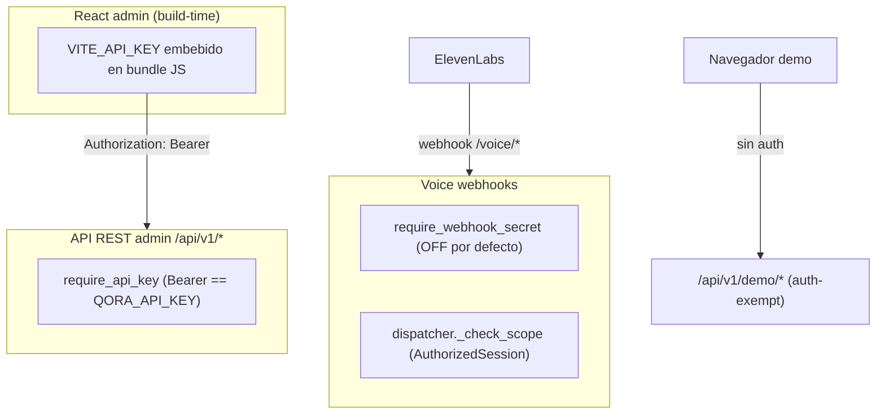

# Área 8 — Auth / usuarios / roles / permisos

Este documento audita, de forma estrictamente read-only, el mecanismo de
autenticación y autorización REALMENTE aplicado en Qora: qué rutas exigen
credenciales, cómo se autentica el webhook de ElevenLabs, si existe concepto de
usuario/cuenta o solo scoping por tenant, y dónde la documentación/intención
diverge del código efectivamente desplegado.

> Convención de tags: `[Confirmado por codigo]` (evidencia directa en archivo),
> `[Inferido razonablemente]` (deducción a partir del código), `[Necesita validacion humana]`.

---

## 1. Resumen ejecutivo del modelo de auth

Qora implementa **un único esquema de autenticación efectivo**: un **API key
estático compartido** (`QORA_API_KEY`) transportado como `Authorization: Bearer
<key>` y validado por la dependency `require_api_key`. No hay usuarios, cuentas,
login, JWT, sesiones de usuario ni roles/permisos a nivel de plataforma.
La separación entre tenants (`client_id`) es un mecanismo de **ruteo/scoping de
datos**, NO una frontera de autorización para las rutas admin: cualquier portador
del único API key puede operar sobre cualquier `client_id`.
[Confirmado por codigo] `backend/app/core/auth.py:90` (`require_api_key`),
`backend/app/core/config.py:118` (`qora_api_key: SecretStr | None`).

Existe un segundo subsistema de autorización — `AuthorizedSession` con "scopes"
(`pipeline:read/write`, `admin:read/write`) — pero solo se aplica en el **hot path
de voz** (tool dispatcher), no en la API REST admin, y nunca llega a otorgar los
scopes `admin:*` (son strings declarados pero jamás asignados).
[Confirmado por codigo] `backend/app/core/auth.py:171` (`_PIPELINE_SCOPES`),
`backend/app/tools/dispatcher.py:62` (`_check_scope`).

---

## 2. ¿API key, bearer, o nada? — mecanismo realmente aplicado

### 2.1 `require_api_key` — la única auth admin

`require_api_key` es una FastAPI dependency que:
- Lee `Authorization: Bearer <key>` del header.
- Si `settings.qora_api_key is None` → **deniega todo** con 401 (fail-closed).
- Compara con `secrets.compare_digest` (tiempo constante, sin side-channel de timing).
- Devuelve `CallerIdentity(api_key_hash=...)` (solo guarda los primeros 16 hex del
  SHA-256 de la key, nunca la key cruda).
[Confirmado por codigo] `backend/app/core/auth.py:90-157`.

El valor esperado proviene de `Settings.qora_api_key` (env `QORA_API_KEY`), tipado
`SecretStr | None`. Además, `validate_required_secrets` (model_validator) **aborta
el arranque** si `QORA_API_KEY` está ausente/vacío/placeholder débil — es decir, en
producción la clave es obligatoria.
[Confirmado por codigo] `backend/app/core/config.py:204-210`,
`openspec/.../api-key-auth/spec.md` ("Platform API Key Required").

### 2.2 Bypass de tests

`_TESTING_BYPASS` (módulo `auth.py`) hace que `require_api_key` devuelva
`CallerIdentity("test-bypass")` sin validar. Lo activa `conftest.py` mediante un
fixture autouse y solo es alcanzable bajo pytest. No es un bypass de producción,
pero es un flag de módulo mutable global.
[Confirmado por codigo] `backend/app/core/auth.py:50,110-115`;
`backend/tests/conftest.py:99-125`.

### 2.3 El API key admin es ÚNICO y COMPARTIDO, embebido en el bundle del frontend

El frontend inyecta `VITE_API_KEY` en **build time** y lo envía como
`Authorization: Bearer <key>` en cada `apiFetch`. Esto significa que el API key
admin queda **embebido en el bundle JavaScript servido al navegador**: cualquiera
que cargue el panel admin puede extraerlo de los assets estáticos.
[Confirmado por codigo] `frontend/src/api/client.ts:17,52`.

Implicación: el "secreto" admin es de facto público para cualquier usuario del
panel; no hay rotación por usuario ni revocación granular. Es un único secreto
compartido para toda la superficie admin.
[Inferido razonablemente] derivado de la inyección build-time + ausencia de
cualquier flujo de login.

---

## 3. ¿Usuarios / cuentas / roles / permisos?

**No existe ningún concepto de usuario final ni de cuenta.** No hay tabla de
usuarios, modelo `User`, login, password, registro, ni sesión de usuario.
[Confirmado por codigo] búsqueda `login|password|token|user` en `frontend/src`
solo arroja referencias al Bearer token estático y a `max_tokens` (LLM); no hay
flujo de autenticación de usuario.

**No existen roles ni permisos a nivel plataforma.** Lo más parecido a "permisos"
es el set de *scopes* de `AuthorizedSession`, pero:
- Todos los sessions (demo y producción) reciben exactamente `_PIPELINE_SCOPES =
  {"pipeline:write", "pipeline:read"}`. [Confirmado por codigo] `auth.py:171,245`.
- Los scopes `admin:write` / `admin:read` están **documentados pero nunca se
  asignan** a ningún session (`create_authorized_session` siempre usa
  `_PIPELINE_SCOPES`). Son strings muertos en docstrings/comentarios.
  [Confirmado por codigo] `auth.py:188-191,239-247`.
- El flag `is_demo` se propaga pero, dado que ambos casos reciben los mismos
  scopes, no produce diferencia de scope real; solo distingue el origen del flujo.
  [Confirmado por codigo] `auth.py:235-246`.

Conclusión: **roles/permisos NO existen como sistema funcional.** Hay andamiaje
(scopes, `is_demo`) preparado para una futura "Phase C" (JWT + user model) que aún
no está implementada. La documentación interna lo dice explícitamente: "Phase C
extension: add user_id, allowed_client_ids from JWT payload".
[Confirmado por codigo] `auth.py:65,106-108`; `frontend/src/api/client.ts:7,16`.

---

## 4. Frontera multi-tenant (`client_id`) como modelo de autorización de facto

El aislamiento entre clientes se hace por `client_id`, que viaja en el **path** o
en el **body** de cada request. El patrón típico:
- Rutas admin con prefijo `/{client_id}/...` (analytics, agents, crm, integraciones)
  validan que el cliente exista, pero NO que el portador del key tenga derecho sobre
  ese `client_id`. [Confirmado por codigo] `backend/app/analytics/router.py:71-78`
  (`_validate_client_exists` solo comprueba existencia).

**Hallazgo clave:** como el API key admin es único y global, el `client_id` NO es
una frontera de autorización en la API REST. Quien tenga el key puede leer/escribir
datos de **cualquier** tenant simplemente cambiando el `client_id` del path/body.
La multi-tenancy aquí es *scoping de datos*, no *control de acceso*.
[Inferido razonablemente] a partir de `require_api_key` (sin `allowed_client_ids`) +
ruteo por `client_id` libre.

La **única** comprobación real de frontera tenant está en el hot path de voz:
`dispatcher._check_scope` rechaza (`scope_denied`) si
`authorized_session.client_id != client_id` de la llamada — impide que un session
demo de cliente-A dispare tools de cliente-B. Pero si `authorized_session is None`
(camino legacy) el guard se **omite por completo**.
[Confirmado por codigo] `backend/app/tools/dispatcher.py:80-93`.

---

## 5. Endpoints SIN autenticación (inventario y juicio)

Routers/rutas que NO llevan `require_api_key`:

| Endpoint | Auth | ¿Intencional? | Evidencia |
|---|---|---|---|
| `GET /api/v1/health` | Ninguna | Sí (health checks) | `main.py:259` |
| `GET /docs`, `/redoc` | Ninguna (toggle `QORA_DOCS_ENABLED`) | Sí en dev | `main.py:371-372` |
| `/demo` (estáticos) y `/api/v1/demo/*` | Ninguna (auth-exempt by design) | Sí | `demo/router.py:1-19` |
| `GET /api/v1/voice/signed-url` | **Ninguna** | **Dudoso** | `voice/webhook.py:76` |
| `POST /api/v1/voice/initiation` | `require_webhook_secret` (OFF por defecto → de facto ninguna) | Parcial | `voice/initiation.py:71` |
| `POST /api/v1/voice/custom-llm[...]` | `require_webhook_secret` (OFF por defecto) | Parcial | `voice/webhook.py:539,619` |
| `GET /api/v1/tenants/{client_id}` | **Ninguna** | **No intencional (probable bug)** | `tenants/router.py:24` |

### 5.1 `GET /api/v1/tenants/{client_id}` — endpoint admin sin proteger

El router de tenants se incluye en `main.py:288` SIN `dependencies=[Depends(
require_api_key)]` y su única ruta tampoco la lleva. Devuelve configuración del
tenant (nombre, voice_id, model, temperature, tools_enabled, is_active, etc.) para
cualquier `client_id`, sin autenticación.
[Confirmado por codigo] `backend/app/tenants/router.py:24-52`, `main.py:288`.

El spec de auth (`api-key-auth/spec.md`, "Explicit Auth Exclusions") solo exime
`/health`, `/docs|/redoc` y `/demo`. **`/tenants` NO figura en la lista de
exclusiones**, por lo que su falta de auth contradice el spec y parece un descuido,
no una decisión.
[Inferido razonablemente] cruce código vs. spec.

### 5.2 `GET /api/v1/voice/signed-url` — fuga de cuota ElevenLabs

Esta ruta NO tiene `require_api_key` ni `require_webhook_secret`. Usa el
`ELEVENLABS_API_KEY` **global** del servidor para pedir un signed URL a ElevenLabs
y lo devuelve al caller. Cualquiera que alcance el backend puede generar signed URLs
y consumir cuota/minutos de ElevenLabs sin autenticarse.
[Confirmado por codigo] `backend/app/voice/webhook.py:76-110`.

### 5.3 Webhooks de voz: auth opcional, **apagada por defecto**

`require_webhook_secret` valida el header `X-Webhook-Secret` con
`secrets.compare_digest`, pero **solo si `QORA_WEBHOOK_AUTH_ENABLED=true`**. El
default es `false`, por lo que en la configuración por defecto los endpoints
`/voice/initiation`, `/voice/custom-llm`, `/voice/custom-llm/chat/completions`,
`/voice/chat/completions` y `/voice/{client_id}/custom-llm/chat/completions` están
**abiertos** (cualquiera con el `client_id` puede invocar el custom-LLM, generando
llamadas facturables a GPT-4o).
[Confirmado por codigo] `backend/app/core/auth.py:292-294`,
`backend/app/core/config.py:135`, `voice/webhook.py:531-535,614`.

Cuando se habilita, hay fail-closed correcto: enabled + secret ausente → 401, y el
arranque aborta si `QORA_WEBHOOK_AUTH_ENABLED=true` sin secret configurado.
[Confirmado por codigo] `auth.py:296-307`, `config.py:220-245`.

---

## 6. Autenticación del webhook de ElevenLabs (detalle)

- **Mecanismo:** header compartido `X-Webhook-Secret` comparado en tiempo constante
  contra `QORA_WEBHOOK_SECRET`. No es firma HMAC del payload; es un secreto estático
  por header. [Confirmado por codigo] `auth.py:309-329`.
- **Estado por defecto:** DESACTIVADO (`qora_webhook_auth_enabled=False`). El docstring
  lo justifica como compatibilidad: "Existing ElevenLabs agents continue to work
  without reconfiguration". [Confirmado por codigo] `auth.py:264-294`.
- **Rollout documentado:** setear `QORA_WEBHOOK_SECRET`, pegar el mismo valor en el
  campo "Webhook secret" del agente ElevenLabs, y poner `QORA_WEBHOOK_AUTH_ENABLED=
  true`. [Confirmado por codigo] `auth.py:279-285`.
- **Identificación de tenant en el webhook:** `client_id` se resuelve de
  `elevenlabs_extra_body` → campo top-level → `model_extra`; si falta → 422. No hay
  validación criptográfica de que ElevenLabs sea el emisor más allá del header opcional.
  [Confirmado por codigo] `voice/webhook.py:568-586`.

`[Necesita validacion humana]`: si en el deployment real `QORA_WEBHOOK_AUTH_ENABLED`
está en `true` y el secret está configurado en el dashboard de ElevenLabs. El código
por sí solo no lo determina.

---

## 7. CORS y exposición

`CORSMiddleware` usa `QORA_ALLOWED_ORIGINS` (default `"*"` = abierto). En la
configuración por defecto el backend acepta cualquier origen. Para producción debe
fijarse una lista explícita.
[Confirmado por codigo] `backend/app/main.py:379-387`, `config.py:141`,
`_parse_allowed_origins` `main.py:305-322`.

`/admin` redirige (307) al frontend canónico; no expone API key en el esquema.
[Confirmado por codigo] `main.py:414-424`.

---

## 8. Código muerto / parcial relacionado a auth

- `get_authorized_session` (FastAPI dep para el hot path custom-LLM) está **definida
  pero nunca usada** en ningún router. La auth de sesión se compone vía
  `ConversationState.auth` + `_check_scope`, no vía esta dependency.
  [Confirmado por codigo] `auth.py:334-369`; `rg get_authorized_session` solo arroja
  la definición y docstrings.
- Scopes `admin:write` / `admin:read`: declarados en docstrings y comentarios pero
  nunca asignados a ningún `AuthorizedSession`. Posible dead code semántico.
  [Confirmado por codigo] `auth.py:188-191`.
- `_TESTING_BYPASS`: flag global mutable de módulo (solo test), aceptable pero
  conviene auditar que no se exporte/active fuera de pytest. [Confirmado por codigo]
  `auth.py:50`.

---

## 9. Discrepancias documentación vs. código

| Afirmación en docs/spec | Realidad en código | Evidencia |
|---|---|---|
| "All admin API routes MUST require Bearer" | `/api/v1/tenants/{client_id}` NO la exige | spec `api-key-auth`; `tenants/router.py:24` |
| Exclusiones de auth = health, docs, demo | `/voice/signed-url` también abierto y no listado | spec; `webhook.py:76` |
| Scopes incluyen `admin:read/write` | Nunca se asignan (solo pipeline) | `auth.py:188-191,245` |
| "Phase C: JWT / login flow" | No implementado; sigue siendo API key estático | `client.ts:7`; `auth.py:106-108` |
| Webhook auth disponible | Sí, pero OFF por defecto (de facto abierto) | `config.py:135` |

---

## 10. Cobertura y límites

- **No se ejecutó** la aplicación; todas las conclusiones surgen de lectura estática.
- `[Necesita validacion humana]` Valor real de `QORA_WEBHOOK_AUTH_ENABLED`,
  `QORA_ALLOWED_ORIGINS`, `QORA_API_KEY` y `VITE_API_KEY` en el/los entorno(s)
  desplegado(s): el repo no contiene el `.env` con valores (correcto), por lo que no
  puede confirmarse si webhook auth está activo ni si CORS está restringido en prod.
- `[Necesita validacion humana]` Si el frontend admin se sirve solo internamente o
  expuesto públicamente — esto determina la gravedad real de embeber `VITE_API_KEY`
  en el bundle.
- `[Necesita validacion humana]` Si existe una capa externa (reverse proxy / WAF /
  red privada) que proteja `/api/v1/voice/signed-url` y `/api/v1/tenants/*`; a nivel
  aplicación están abiertos.
- No se auditó exhaustivamente cada handler de cada router admin para confirmar que
  ninguno re-deriva `client_id` desde el `CallerIdentity` (no puede, porque
  `CallerIdentity` solo lleva un hash de auditoría) — se asume scoping por path/body.
