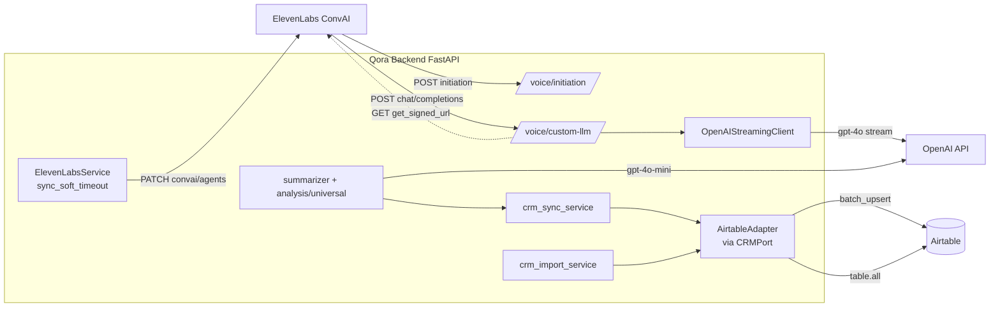

# Área 9 — Integraciones externas

Auditoría de solo lectura de las integraciones externas de Qora: ElevenLabs Conversational AI (voz), OpenAI GPT-4o / GPT-4o-mini (LLM en vivo y análisis post-llamada) y Airtable como CRM mediante un patrón puerto/adaptador. Para cada integración se documenta cómo se configura (solo NOMBRES de variables de entorno), dónde se usa, qué datos fluyen en cada dirección y si está totalmente cableada, parcial, solo-config o sin uso. Las afirmaciones llevan evidencia (ruta + símbolo) y una etiqueta de clasificación.

---

## 1. Mapa general de integraciones

Las tres integraciones están implementadas en código real, no solo declaradas. El detalle de cobertura y los matices (placeholders, flags no aplicados) se documentan por sección. [Confirmado por codigo]

---

## 2. ElevenLabs Conversational AI

ElevenLabs es la plataforma de voz. La relación es bidireccional: ElevenLabs llama a Qora (Qora actúa como Custom LLM del agente) y Qora llama a la API de ElevenLabs para configurar el agente.

### 2.1 Configuración (variables de entorno — solo NOMBRES)

Definidas en `backend/app/core/config.py` (clase `Settings`):

| Variable / atributo | Tipo / default | Propósito inferido |
|---|---|---|
| `ELEVENLABS_API_KEY` (`elevenlabs_api_key`) | `SecretStr`, requerida | Clave API para llamar a la API ConvAI (header `xi-api-key`). |
| `elevenlabs_agent_id` | `str`, default `"agent_8201kra4wjhve0srcwgbtwfetr5n"` | Agente por defecto (demo). |
| `elevenlabs_voice_id` | `str`, default `"4wDRKlxcHNOFO5kBvE81"` | Voz TTS por defecto. |
| `elevenlabs_model` | `str`, default `"eleven_flash_v2_5"` | Modelo TTS. |
| `elevenlabs_stability` / `elevenlabs_speed` / `elevenlabs_similarity_boost` | floats | Parámetros de voz. |

`ELEVENLABS_API_KEY` es validada como obligatoria al arrancar (`config.py`, validación con `field_name="ELEVENLABS_API_KEY"`, junto a `OPENAI_API_KEY`). [Confirmado por codigo] Los defaults `elevenlabs_agent_id`/`elevenlabs_voice_id` están hardcodeados en el código (no solo en `.env`); el `agent_id` por defecto apunta al agente demo de Qora. [Confirmado por codigo] [Necesita validacion humana] sobre si esos defaults son adecuados en producción.

### 2.2 Punto de entrada A — Webhook de initiation (ElevenLabs → Qora)

`backend/app/voice/initiation.py` → `POST /api/v1/voice/initiation` (`initiation_webhook`). ElevenLabs lo invoca ANTES de que el agente hable para obtener contexto del lead. [Confirmado por codigo]

- **Entrada**: `InitiationRequest` (`client_id`, `lead_id`, `agent_id`, `called_number`, `conversation_id`), todos opcionales; `client_id`/`lead_id` también aceptados por query param. Sin `client_id` → 422. [Confirmado por codigo]
- **Salida**: `InitiationResponse` con `type="conversation_initiation_client_data"` y `dynamic_variables` (nombre del lead, datos del auto/seguro, `company_name`, `agent_name`, e historia/memoria de llamadas). Las variables se entregan en dos formas: nombre plano y envuelto en guiones bajos (`_lead_name_`) que exige la plantilla del agente. [Confirmado por codigo]
- **Autenticación**: `Depends(require_webhook_secret)`. [Confirmado por codigo]
- **Reglas de negocio relevantes**: bloquea iniciación si `lead.do_not_call` (403); valida pertenencia del lead al `client_id`; cachea `VoiceSessionContext` y una `AuthorizedSession` en `session_store` cuando hay `conversation_id`. [Confirmado por codigo]

### 2.3 Punto de entrada B — Webhook Custom LLM (ElevenLabs → Qora, núcleo del producto)

`backend/app/voice/webhook.py`. ElevenLabs envía un request OpenAI-compatible de chat completions y Qora responde con un stream SSE. Rutas registradas (`custom_llm_webhook`, `custom_llm_path_route`):

- `POST /api/v1/voice/custom-llm` (legacy; emite warning `custom_llm_legacy_route_used`).
- `POST /api/v1/voice/custom-llm/chat/completions` y `POST /api/v1/voice/chat/completions` (legacy).
- `POST /api/v1/voice/{client_id}/custom-llm/chat/completions` (ruta path-based, recomendada — CAP-1). [Confirmado por codigo]

Contrato (`CustomLLMRequest`): `model` (default `"gpt-4o"`), `messages`, `stream`, `temperature` (0.7), `max_tokens` (300), `tools`, y `elevenlabs_extra_body` (que transporta `client_id`/`lead_id`/`conversation_id`). `model_config = {"extra": "allow"}` para tolerar campos extra. [Confirmado por codigo] El `client_id` se resuelve por orden: `elevenlabs_extra_body` → campo top-level → `model_extra` → 422. [Confirmado por codigo]

Flujo: resuelve tenant/agente, ensambla el system prompt (vía `VoiceSessionContext` cacheado o fallback per-turn `PromptLoader`), llama a GPT-4o vía SSE, intercepta tool-calls a mitad de stream (emite "filler" de voz, ejecuta la tool, re-llama a GPT-4o), persiste turnos de transcript y termina con `data: [DONE]`. [Confirmado por codigo]

### 2.4 Punto de entrada C — Signed URL (Qora → ElevenLabs)

`backend/app/voice/webhook.py` → `GET /api/v1/voice/signed-url` (`get_signed_url`). Llama a
`GET https://api.elevenlabs.io/v1/convai/conversation/get_signed_url?agent_id=...` con header `xi-api-key`, timeout 10s, y devuelve `signed_url`. Usa `settings.elevenlabs_agent_id` (el global, NO el del agente por tenant); 400 si no está configurado. [Confirmado por codigo] El comentario indica que forzar signed URL obliga WebSocket (no WebRTC). [Confirmado por codigo]

### 2.5 Configuración programática del agente (Qora → ElevenLabs)

`backend/app/elevenlabs/service.py` (`ElevenLabsService`) + `models.py`. Único caso donde Qora MODIFICA configuración del agente en ElevenLabs.

- **API llamada**: `PATCH https://api.elevenlabs.io/v1/convai/agents/{agent_id}` (`_ELEVENLABS_BASE_URL` + `sync_soft_timeout`). [Confirmado por codigo]
- **Payload**: SOLO el bloque parcial `conversation_config.turn.soft_timeout_config` (`SoftTimeoutConfig.to_patch_payload`), con `timeout_seconds` / `message` / `use_llm_generated_message`. Nunca envía el cuerpo completo del agente. [Confirmado por codigo]
- **Alcance real**: la única faceta del agente que Qora sincroniza programáticamente es el **soft timeout**. Voz, prompt, tools, knowledge base, background music, etc., NO se gestionan por código (se configuran en el dashboard de ElevenLabs). [Confirmado por codigo]
- **Robustez**: cliente `httpx` por llamada, 1 reintento solo en 5xx, sin reintento en 4xx ni timeout, timeout 10s, logging estructurado, nunca lanza al caller (devuelve `SyncResult` con `synced`/`skipped`/`error`). Skip si `elevenlabs_agent_id is None` o todos los campos de soft timeout son `None`. [Confirmado por codigo]
- **Disparo**: `sync_to_elevenlabs()` se invoca fire-and-forget vía `asyncio.create_task` en `backend/app/agents/router.py` (al crear/actualizar agente, línea ~273) y de forma síncrona desde `POST /api/v1/clients/{client_id}/agents/{agent_id}/sync-elevenlabs` (re-sync manual). Persiste `elevenlabs_sync_status` y `elevenlabs_last_synced_at` en el agente. [Confirmado por codigo]
- **Inyección FastAPI**: `get_elevenlabs_service` (`Depends`). [Confirmado por codigo]

Comentarios del código afirman que los nombres de campo fueron "verified against real ElevenLabs API (2026-05-24)": `timeout_seconds` (no `timeout_secs`), `use_llm_generated_message` (no `use_llm`). [Inferido razonablemente] que es correcto; [Necesita validacion humana] contra la API real actual.

### 2.6 Documentación vs. código

- `docs/elevenlabs-reference.md` y `docs/elevenlabs-setup.md` describen muchas más capacidades de la API ConvAI (WebSocket nativo, workflows, knowledge base, guardrails, experiments, MCP, phone/Twilio, background music). **El código solo implementa**: webhook Custom LLM, webhook initiation, signed-url y PATCH de soft timeout. Las demás funciones documentadas son referencia de plataforma, NO funcionalidad implementada en Qora. [Confirmado por codigo] — distinguir intención/referencia de producto enviado.
- `elevenlabs-reference.md` (línea ~191) ya admite que "solo" el sync parcial de `soft_timeout_config` está implementado: coincide con el código. [Confirmado por codigo]
- `elevenlabs-setup.md` documenta el endpoint base `/api/v1/voice/<tenant>/custom-llm` y que el modelo se setea como `gpt-4o` en el dashboard: coincide con las rutas reales. [Confirmado por codigo]
- El doc menciona `background_music` con `volume: 0.15` "en producción"; no hay código que setee background music. Es configuración de dashboard, no de Qora. [Confirmado por codigo] [Necesita validacion humana]

---

## 3. OpenAI (GPT-4o en vivo / GPT-4o-mini en análisis)

### 3.1 Configuración (variables de entorno — solo NOMBRES)

`backend/app/core/config.py`:

| Variable / atributo | Default | Propósito |
|---|---|---|
| `OPENAI_API_KEY` (`openai_api_key`) | `SecretStr`, requerida | Clave API OpenAI. Validada como obligatoria al arranque. |
| `openai_model` | `"gpt-4o"` | Modelo del LLM en vivo (webhook de voz). |
| `openai_model_fast` | `"gpt-4o-mini"` | Modelo del análisis post-llamada. |

[Confirmado por codigo]

### 3.2 LLM en vivo — streaming durante la llamada

`backend/app/ai/llm_streaming.py` (`OpenAIStreamingClient`). Cliente async stateless sobre `AsyncOpenAI` que produce eventos tipados (`ContentDelta`, `ToolCallDelta`, `StreamDone`) desde `chat.completions.create(stream=True)`. Acumula deltas de tool_calls y los emite al cerrar el stream con `finish_reason == "tool_calls"`. Maneja `APIConnectionError` / `APITimeoutError` / `RateLimitError` envolviéndolos en `StreamingError`. [Confirmado por codigo]

- **Modelo usado**: el del request de ElevenLabs / config del agente (default `gpt-4o`); `webhook.py` construye `OpenAIStreamingClient(api_key=..., model=_model)` con `_model` resuelto de contexto/agente. [Confirmado por codigo]
- **Datos que fluyen**: hacia OpenAI van system prompt ensamblado + historial de mensajes + definiciones de tools; desde OpenAI vuelven tokens de contenido y tool-calls. [Confirmado por codigo]
- `stream_completion()` es un wrapper de compatibilidad marcado deprecado en su docstring; sólo emite texto. [Confirmado por codigo] — posible candidato a limpieza si no tiene consumidores.

### 3.3 Análisis post-llamada — `summarizer.py` + `analysis/universal/*`

`backend/app/summarizer.py` orquesta el análisis. Punto importante de discrepancia con el enunciado del área:

- El análisis post-llamada usa **`gpt-4o-mini`** (`openai_model_fast`), NO `gpt-4o`. `_get_openai_client()` retorna `settings.openai_model_fast  # gpt-4o-mini`. Además cada dimensión hardcodea `"model": "gpt-4o-mini"` (p. ej. `analysis/universal/outcome.py` `DIMENSION["model"]`, `summary.py`, `interest/interest_level.py`, `next_action.py`). [Confirmado por codigo]
- Técnica de llamada: la mayoría de dimensiones usan **structured outputs** vía `client.beta.chat.completions.parse(..., response_format=DIMENSION["schema"])` con un esquema Pydantic (p. ej. `CallOutcome`). `next_action.py` usa `chat.completions.create(..., response_format={"type": "json_object"})`. [Confirmado por codigo]
- Orquestación: `_call_gpt_summarize()` corre las ~6 dimensiones independientes (`DIMENSION_MODULES`) en paralelo vía `asyncio.gather(return_exceptions=True)` más pipelines secuenciales (interest, profile_facts, misc_notes, data_corrections, next_action). Una dimensión que falla no mata el análisis: se loguea y se usa el default del esquema. Solo si fallan TODAS lanza `RuntimeError`. [Confirmado por codigo]
- El número de `DIMENSION_MODULES` ha cambiado por sucesivas extracciones (de 13 a 6 según comentarios de `analysis/universal/__init__.py`); los módulos extraídos (`profile_facts`, `misc_notes`, `data_corrections`, `next_action`) se conservan importados "para acceso directo/tests" pero ya no están en `DIMENSION_MODULES`. [Confirmado por codigo]
- Persistencia/efectos: el summarizer escribe `CallSession`, `CallAnalysis`, `LeadProfileFact`, `LeadInterestHistory`, mergea facts al `Lead` y dispara el hook de CRM sync (ver §4). Todo bajo savepoint para atomicidad; nunca debe afectar el cierre de la llamada. [Confirmado por codigo]
- `analysis_language` (default `"Spanish"`) controla el idioma de los campos textuales del análisis; enums/códigos quedan en inglés. [Confirmado por codigo]

> Discrepancia documentada: el enunciado del área asume "GPT-4o" para los prompts de análisis; el código usa **gpt-4o-mini**. El código manda. [Confirmado por codigo]

---

## 4. Airtable CRM (patrón puerto/adaptador)

### 4.1 Patrón puerto/adaptador y número de adaptadores

- **Puerto**: `backend/app/integrations/crm_port.py` → `CRMPort(ABC)` con `upsert_record(table_id, payload, match_field)` (abstracto) y `health_check()` (default `True`). Interfaz de SOLO escritura para el camino de llamada (CS-7). [Confirmado por codigo]
- **Adaptador**: existe **un único** adaptador concreto, `AirtableAdapter`, en `backend/app/integrations/adapters/airtable/adapter.py`. La factory `make_adapter(provider, ...)` sólo reconoce `"airtable"` y lanza `ValueError` para cualquier otro provider. `CRMConfig.provider` es `Literal["airtable"]`. **No hay segundo adaptador** (HubSpot/Salesforce se mencionan solo en docstrings como ejemplo futuro). [Confirmado por codigo]
- `health_check()` está definido en el puerto pero **no se invoca en ningún lado** del backend. [Confirmado por codigo] — código muerto menor / extensión futura.

### 4.2 Configuración por cliente (`crm.yaml`)

`backend/app/integrations/crm_config.py` (`CRMConfig`, `CRMConfigLoader`). La config vive en `backend/clients/{client_id}/crm.yaml` (filesystem, sin DB). [Confirmado por codigo]

- **Resolución de credenciales**: `resolve_api_key()` aplica una heurística: si `api_key` matchea `^[A-Z][A-Z0-9_]+$` se trata como NOMBRE de variable de entorno (`os.environ.get`); en caso contrario se usa como literal (patrón dev/test). Rechaza placeholders débiles vía `is_weak_placeholder` (B8). El secreto nunca se incluye en mensajes de error. [Confirmado por codigo]
- **Variable de entorno real en uso**: `backend/clients/quintana-seguros/crm.yaml` referencia `QUINTANA_AIRTABLE_API_KEY` (campo `api_key_env`). Es el único NOMBRE de credencial CRM presente en repo. [Confirmado por codigo]
- **Compatibilidad de alias**: acepta `adapter→provider`, `api_key_env`/`credentials_key→api_key`, `field_map`/`field_mapping→field_mappings`, `field_definitions→custom_fields`. [Confirmado por codigo]
- **Archivo faltante** → `load()` devuelve `None` (skip silencioso). **Archivo inválido** → `ConfigValidationError`. [Confirmado por codigo]
- **Cobertura de clientes**: solo `quintana-seguros` tiene `crm.yaml`. `qora-demo` y `_template` NO. Por tanto la integración CRM está activa para un único tenant. [Confirmado por codigo]

`crm.yaml` de quintana-seguros mapea: `external_lead_id→lead_id`, `name→Nombre Completo`, `phone→Teléfono`, `email→Correo electrónico`, `status→Status`, y custom fields de auto/seguro (`Marca_Auto`, `Modelo_Auto`, `Año_Auto`, `Poliza_Actual`, `Edad`, `Zona`). Incluye `status_mapping` e `import_status_mapping` bidireccional (ES ↔ estados internos) y `quote_ready_fields` (`car_make`, `car_model`, `car_year`, `age`, `zona`). `match_field: lead_id`. [Confirmado por codigo]

### 4.3 Push (Qora → Airtable) — `crm_sync_service.py`

`sync_lead(client_id, lead_id, db_session)` empuja el lead tras la llamada. Lee el lead de SQLite (fuente autoritativa, sin lecturas a Airtable en el camino de llamada — CS-7), resuelve credenciales, mapea con `FieldMapper`, y delega el upsert al adaptador. [Confirmado por codigo]

- **Idempotencia / dedup**: `AirtableAdapter.upsert_record` usa `Table.batch_upsert(records, key_fields=[match_field])` — un único request de escritura con `performUpsert` server-side, sin list/find/get. Reintentos: 3 intentos con backoff exponencial + jitter en 429/5xx; 4xx no-retryable falla de inmediato; tras agotar lanza `AirtableUpsertError`. Las llamadas bloqueantes de `pyairtable` van por `asyncio.to_thread`. [Confirmado por codigo]
- **Tolerancia a fallos**: TODAS las excepciones se loguean y se tragan; el CRM es un espejo downstream y nunca debe afectar el análisis (CS-5). Guard de tenant: rechaza sincronizar un lead de otro `client_id`. [Confirmado por codigo]
- **Fallback de match_field**: si el `match_field` configurado falta en el payload (lead sin `external_lead_id`), intenta fallback a `external_crm_id` y luego `email`; si ninguno resuelve, skip con warning (evita duplicados). [Confirmado por codigo]
- **Disparo y durabilidad** (`summarizer.py` → `_schedule_crm_sync`):
  - Con `ENABLE_JOB_EXECUTOR=true` (`settings.enable_job_executor`): encola un job durable `"crm_sync"` vía `executor.enqueue(...)` en la misma transacción del savepoint del summarizer; reintentos/dead-letter gestionados por el executor. Las fallas de `enqueue` NO se tragan (visibilidad para operadores). [Confirmado por codigo]
  - Con flag off (default): `asyncio.create_task(_run_crm_sync_in_background(...))`, fire-and-forget en su propia sesión DB. [Confirmado por codigo]
  - El handler durable `backend/app/jobs/handlers/crm_sync.py` (`crm_sync_handler`) clasifica errores: transitorios (timeout/red/5xx) → reintento con backoff; config/auth/mapping y HTTP 400/401/403/404/422 → `ConfigurationError` → dead-letter con `operator_review`. Registrado en `jobs/handlers/__init__.py` como `"crm_sync"`. [Confirmado por codigo]

### 4.4 Pull (Airtable → Qora) — `crm_import_service.py`

`import_leads_from_crm(client_id, db_session)` importa leads en batch (operación manual, NO durante llamadas). [Confirmado por codigo]

- Usa `AirtableAdapter.fetch_records()` (`table.all()` vía `asyncio.to_thread`) — operación de LECTURA, fuera del camino de llamada. [Confirmado por codigo]
- Reverse-mapea con `FieldMapper.reverse_map`, deduplica por `(client_id, phone)` (registros sin teléfono se saltan), guarda el record ID de Airtable como `external_crm_id`. Avance de estado solo "hacia adelante" (`_apply_status_if_ahead` con `_STATUS_ORDER`), nunca regresa un lead. [Confirmado por codigo]
- Dual-write transicional: campos custom se escriben a `lead_custom_fields` Y a columnas legacy del Lead (se removerá en WU-7). [Confirmado por codigo]
- Atomicidad: cada registro en un savepoint (`begin_nested`); el caller (`crm_router`) posee el commit único. Errores por registro se acumulan en `ImportResult.errors` sin abortar el batch. [Confirmado por codigo]

### 4.5 Mapeo de campos — `field_mapping.py`

`FieldMapper` puro (sin IO). `map()` (Qora→CRM) coacciona tipos (`string`/`integer`/`boolean`/`date`/`phone`), normaliza teléfonos a E.164 (rechaza locales/nacionales con `MappingError`), aplica `status_mapping`, omite opcionales ausentes y lanza `MappingError` si falta un requerido. `reverse_map()` (CRM→Qora) aplica `import_status_mapping`. [Confirmado por codigo]

### 4.6 Routers HTTP

- `crm_router.py` → `POST /api/v1/clients/{client_id}/crm/import` (dispara import). Protegido por `Depends(require_api_key)` a nivel de router. [Confirmado por codigo] **Discrepancia doc/código**: el docstring dice "No auth required for now (dev/demo environment)" pero el router SÍ exige `require_api_key`. El código manda. [Confirmado por codigo]
- `crm_config_router.py` → CRUD sobre `crm.yaml`: `GET /integrations`, `GET /integrations/available`, `PUT /integrations/{provider}`, `GET /integrations/{provider}/fields`, `PUT /integrations/{provider}/mappings`, `POST /integrations/{provider}/test`, `POST /integrations/{provider}/connect`, `DELETE /integrations/{provider}/disconnect`. Protegido por `require_api_key`. [Confirmado por codigo]
  - **Seguridad de secretos**: `api_key_env` en las respuestas SIEMPRE es el NOMBRE de la env var o una etiqueta enmascarada (`_safe_credential_label`); `resolve_api_key()` no se llama para responder. `_sanitize_secret_text` redacta tokens tipo Airtable (`pat…`/`key…`) de los mensajes de error. [Confirmado por codigo]
  - `test`, `fields` y `connect` tocan Airtable en vivo vía `pyairtable` (lazy import) — solo en endpoints de admin, no en el camino de llamada. [Confirmado por codigo]
- Ambos routers se registran en `backend/app/main.py` (`include_router(crm_router)`, `include_router(crm_config_router)`). [Confirmado por codigo]
- Consumidores frontend confirmados: `frontend/src/api/integrations.ts`, `frontend/src/features/admin/integrations-section.tsx`, `client-detail-page.tsx` (con tests). La integración tiene UI de admin real. [Confirmado por codigo]

### 4.7 CRM Parity — placeholder sin consumidores

`backend/app/analytics/crm_parity.py` (`SyncState`, `resolve_sync_state`, `resolve_latest_correction`). Su propio docstring lo declara: "returns SyncState.UNKNOWN for all fields until a real CRM sync engine is implemented". `resolve_sync_state` devuelve `UNKNOWN` siempre que `crm_value is None` (que es el default — no hay motor que provea el valor del CRM). [Confirmado por codigo]

Búsqueda de consumidores en `backend/app`: `resolve_sync_state` / `resolve_latest_correction` / `SyncState` **no se importan ni usan en ningún otro módulo** del backend. Es código efectivamente muerto / placeholder honesto a la espera de un motor de paridad real. [Confirmado por codigo]

---

## 5. Hallazgos transversales (resumen)

- **Flag `enabled` de CRM no aplicado**: `CRMConfig.enabled` (B8) está definido con default `True` y documentado como interruptor on/off, pero NO se consulta en `crm_sync_service.sync_lead`, ni en `crm_import_service`, ni en los routers. Poner `enabled: false` en `crm.yaml` NO desactiva la integración. Además `IntegrationConfigResponse` ni siquiera expone `enabled`. [Confirmado por codigo] — bug funcional / config muerta.
- **`crm_parity.py` sin consumidores** (§4.7). [Confirmado por codigo]
- **`CRMPort.health_check` sin uso** (§4.1). [Confirmado por codigo]
- **`OpenAIStreamingClient.stream_completion` deprecado** (§3.2): verificar si tiene consumidores antes de remover. [Inferido razonablemente]
- **Modelo de análisis = gpt-4o-mini**, no gpt-4o (§3.3). [Confirmado por codigo]
- **Sync programático de ElevenLabs limitado a soft_timeout** (§2.5); el resto de la config del agente es manual en dashboard. [Confirmado por codigo]
- **Cobertura CRM = 1 tenant** (`quintana-seguros`) (§4.2). [Confirmado por codigo]
- **Discrepancia doc vs código en `crm_router`** (auth) (§4.6). [Confirmado por codigo]

---

## 6. Cobertura y límites

Lo que NO pudo validarse solo desde el repositorio (marcar **Necesita validacion humana**):

- Que los nombres de campo del payload PATCH de ElevenLabs (`timeout_seconds`, `use_llm_generated_message`, ruta `convai/agents/{id}`) sigan vigentes en la API real actual de ElevenLabs. El código afirma verificación al 2026-05-24. [Necesita validacion humana]
- Comportamiento real de `batch_upsert` de `pyairtable` (forma exacta de `UpsertResultDict`, semántica server-side de `performUpsert`) con la cuenta/base reales. No hay ejecución de red en esta auditoría. [Necesita validacion humana]
- Si `ENABLE_JOB_EXECUTOR` está activo en el entorno de producción (determina camino durable vs fire-and-forget para el CRM sync). [Necesita validacion humana]
- Si el `base_id`/`table_id` de `quintana-seguros` y la env var `QUINTANA_AIRTABLE_API_KEY` están efectivamente provisionados en el entorno de despliegue (no se inspeccionan valores de `.env`). [Necesita validacion humana]
- Si los defaults hardcodeados de `elevenlabs_agent_id`/`elevenlabs_voice_id` se sobreescriben por env en producción o se usan tal cual. [Necesita validacion humana]
- Background music y demás capacidades ConvAI documentadas: configuradas en el dashboard de ElevenLabs, fuera del alcance del código. [Necesita validacion humana]
- Confirmar que `stream_completion` y `CRMPort.health_check` no tienen consumidores fuera de `backend/app` (p. ej. scripts, notebooks). La búsqueda cubrió `backend/app`. [Necesita validacion humana]
