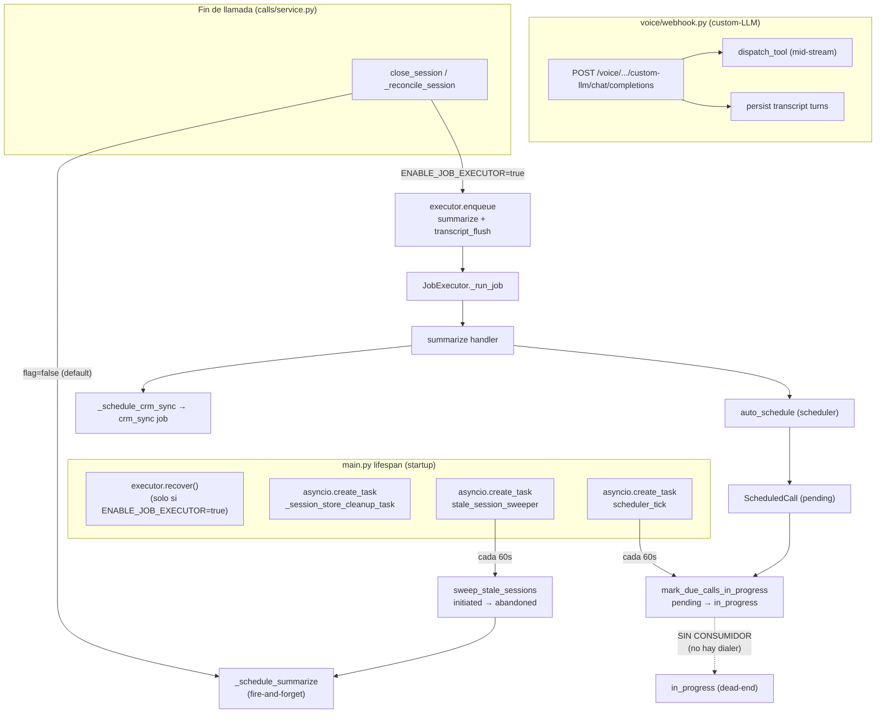
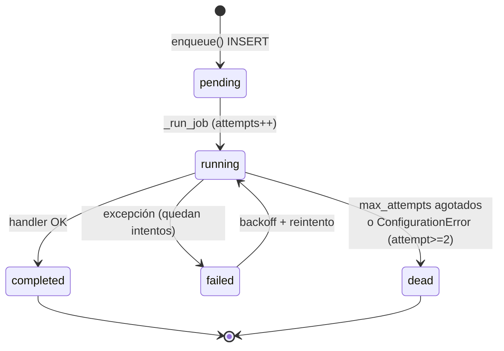

# Área 10 — Webhooks / Jobs / Automatizaciones / Cron

> **Propósito.** Auditoría de solo lectura de toda la maquinaria asíncrona de Qora: el webhook custom-LLM de ElevenLabs, el ejecutor durable de jobs (B10), el scheduler de llamadas, los sweepers/TTL y las tareas de fondo arrancadas en el `lifespan`. Se documenta el ciclo de vida real implementado, se contrasta contra `docs/ops/background-jobs.md` y se marcan las automatizaciones incompletas, deshabilitadas o sin consumidor.

---

## 1. Mapa general

Hallazgo transversal: existen **dos rutas asíncronas paralelas** según el flag `ENABLE_JOB_EXECUTOR`: la durable (B10, tabla `background_jobs`) y la legacy fire-and-forget (`asyncio.create_task`). El flag está **deshabilitado por defecto** (`enable_job_executor: bool = False`, `backend/app/core/config.py:152`), por lo que en una instalación estándar la pila durable NO está activa. [Confirmado por codigo]

---

## 2. Webhook custom-LLM de ElevenLabs (`backend/app/voice/webhook.py`)

Es el núcleo de Qora: ElevenLabs envía un request OpenAI-compatible y Qora responde con SSE, interceptando tool-calls a mitad de stream.

### 2.1 Endpoints expuestos

| Método/Ruta | Símbolo | Auth | Notas |
|---|---|---|---|
| `GET /voice/signed-url` | `get_signed_url` (`webhook.py:76`) | **Ninguna** | Genera un signed URL WebSocket del agente global de ElevenLabs. Sin `require_webhook_secret` ni `require_api_key`. [Confirmado por codigo] |
| `POST /voice/custom-llm` | `custom_llm_webhook` (`webhook.py:531`) | `require_webhook_secret` (opcional) | Ruta **legacy**; emite log `custom_llm_legacy_route_used` con `migration_hint`. [Confirmado por codigo] |
| `POST /voice/custom-llm/chat/completions` | mismo handler | idem | Alias de la legacy. |
| `POST /voice/chat/completions` | mismo handler | idem | Alias de la legacy. |
| `POST /voice/{client_id}/custom-llm/chat/completions` | `custom_llm_path_route` (`webhook.py:614`) | `require_webhook_secret` (opcional) | Ruta **path-based** preferida (CAP-1); `client_id` en la URL tiene precedencia sobre el body. [Confirmado por codigo] |

Ambas familias delegan en `_process_custom_llm_request` (`webhook.py:732`), que resuelve tenant, prompt, sesión y devuelve `StreamingResponse` SSE. [Confirmado por codigo]

### 2.2 Autenticación del webhook

`require_webhook_secret` (`backend/app/core/auth.py:260`) es una dependencia **opcional y fail-closed cuando se activa**:

- Si `QORA_WEBHOOK_AUTH_ENABLED=false` (default, `config.py:135`) → no-op, cualquier request pasa. [Confirmado por codigo]
- Si está activa pero `QORA_WEBHOOK_SECRET` no está seteado → 401 a todo (fail-closed). [Confirmado por codigo]
- Si está activa: compara el header `X-Webhook-Secret` con `secrets.compare_digest` (constant-time). [Confirmado por codigo]
- Hay validación a nivel `Settings` que aborta el arranque si `QORA_WEBHOOK_AUTH_ENABLED=true` sin secret (`config.py:221` `validate_webhook_secret_when_enabled`). [Confirmado por codigo]

**Riesgo:** en configuración por defecto el webhook custom-LLM y `/voice/signed-url` quedan **sin autenticación**, expuestos públicamente. No hay verificación de firma HMAC del payload de ElevenLabs (solo un header de secreto compartido opcional). [Confirmado por codigo / Necesita validacion humana sobre el despliegue real]

### 2.3 Payload y resolución de `client_id`

Schema `CustomLLMRequest` (`webhook.py:132`) con `model_config = {"extra": "allow"}`. El `client_id` se resuelve en orden: `elevenlabs_extra_body.client_id` → top-level `body.client_id` → `model_extra` → si falta, **HTTP 422** (`webhook.py:582`). En la ruta path-based el `client_id` viene de la URL y se loguea `client_id_mismatch` si difiere del body (no bloquea). [Confirmado por codigo]

### 2.4 Dispatch de tools a mitad de stream

En `_stream_llm_response` (`webhook.py:257`), al detectar un `ToolCallDelta`:

1. **Short-circuit de caché** para `load_skill`: si el skill ya está en `conv_state.loaded_skills`, se omite filler, sleep y ejecución (`webhook.py:330`). [Confirmado por codigo]
2. Emite **filler speech** + `asyncio.sleep(FILLER_PAUSE_SECONDS=0.7)` antes de ejecutar el tool (`webhook.py:361-365`). [Confirmado por codigo]
3. Ejecuta vía `_execute_tool` → `app.tools.dispatcher.dispatch_tool`, pasando `authorized_session` para el guard de scope/tenant (Phase B5). Errores se devuelven como `{"error": ...}` y no rompen el stream (`webhook.py:230-249`). [Confirmado por codigo]
4. Persiste turnos `tool_call` y `tool_result` (para `load_skill` solo un marcador "Skill X cargada", `webhook.py:417-445`). [Confirmado por codigo]
5. Segunda llamada a GPT-4o con el resultado del tool y stream final (`webhook.py:470`). [Confirmado por codigo]

Toda la pasada está protegida por `asyncio.timeout(60.0)` por turno; en timeout persiste lo parcial y cierra con `[DONE]` (`webhook.py:298`, `:484`). [Confirmado por codigo]

### 2.5 Persistencia de turnos (automatización fire-and-forget)

`generate()` llama `schedule_user_turn_persist(session_id, body.messages)` (fire-and-forget vía `asyncio.create_task`, `webhook.py:1267-1271` y `calls/service.py:851`) para no bloquear el SSE. Esto es persistencia intra-llamada y, por diseño, NO usa el ejecutor durable (regla explícita en `docs/ops/background-jobs.md`: nunca encolar jobs dentro de handlers de turno en vivo). [Confirmado por codigo]

> Nota: no existe un webhook separado de "post-call" de ElevenLabs (tipo transcript/analytics webhook). Todo el cierre de llamada se origina en el endpoint `/end` de calls/demo, no en un callback de ElevenLabs. [Inferido razonablemente]

---

## 3. Jobs durables — B10 (`backend/app/jobs/`)

### 3.1 Componentes

| Archivo | Rol |
|---|---|
| `jobs/models.py` | Modelo `BackgroundJob` (tabla `background_jobs`). |
| `jobs/registry.py` | Mapa `job_type → handler`; `register()` / `get_handler()`; `ConfigurationError`. |
| `jobs/executor.py` | `JobExecutor` (singleton `executor`) con `enqueue` / `_run_job` / `recover` / `shutdown` + `calculate_backoff`. |
| `jobs/queries.py` | Helpers read-only `get_failed_jobs` / `get_pending_jobs`. |
| `jobs/handlers/__init__.py` | Registra los 3 handlers al importarse. |
| `jobs/handlers/{summarize,crm_sync,transcript_flush}.py` | Handlers concretos. |

`import app.jobs.handlers` se ejecuta en `main.py:56` (side-effect: registra los handlers). [Confirmado por codigo]

### 3.2 Modelo y ciclo de vida

`BackgroundJob` (`models.py:24`): `id` (UUID4 str), `job_type`, `payload` (JSON text), `status`, `attempts`, `max_attempts` (default 3), timestamps, `error` (JSON `{message,type,operator_review}`). Índices `ix_background_jobs_status` y `ix_background_jobs_type_status`. [Confirmado por codigo]

### 3.3 Enqueue y atomicidad

`JobExecutor.enqueue` (`executor.py:99`):

- Valida el `job_type` con `get_handler()` **antes** de insertar (si no está registrado, `ConfigurationError` y no inserta fila). [Confirmado por codigo]
- Con `db` provisto: hace `db.flush()` y registra listeners SQLAlchemy `after_commit`/`after_rollback` sobre `db.sync_session`. El task `_run_job` se dispara **solo tras el commit** del caller; en rollback se limpia `_active_job_ids` y se quita el listener fantasma. Esto evita el bug "job stuck pending" por insertar antes de que la fila sea visible (`executor.py:141-207`). Diseño cuidado. [Confirmado por codigo]
- Sin `db`: abre `get_session()` propia, commitea y dispara el task (`executor.py:209-218`). [Confirmado por codigo]

### 3.4 Ejecución, reintentos y backoff

`_run_job` (`executor.py:223`) usa **una sesión fresca por intento**:

- `ConfigurationError`: `operator_review=True`; dead-letter en attempt ≥ 2 (1 reintento). [Confirmado por codigo]
- Otras excepciones: transitorias; reintenta hasta `max_attempts` con `calculate_backoff(attempt, base=1, max=60, jitter=1)` = `min(2^attempt + jitter, 60)` (`executor.py:42`, `:370`). [Confirmado por codigo]
- El `error` se persiste siempre (audit trail), incluso en filas que luego reintentan. [Confirmado por codigo]
- `get_handler()` está dentro del try, de modo que un handler removido tras encolar se trata como `ConfigurationError` capturado, no como excepción no manejada. [Confirmado por codigo]

> **El backoff vive dentro del task en memoria** (`await asyncio.sleep(delay)` dentro del while). El reintento NO está persistido como "schedule"; depende de que el proceso siga vivo. Ver riesgo 4.x sobre recuperación de filas `failed`.

### 3.5 Recuperación en arranque

`recover()` (`executor.py:386`) se invoca en `lifespan` **solo si `enable_job_executor`** (`main.py:198-202`):

- `SELECT ... WHERE status IN ('pending','running')`. [Confirmado por codigo]
- Resetea `running → pending` (evita doble disparo por crash a mitad de ejecución). [Confirmado por codigo]
- Crea un task `_run_job` por cada job, salvo los ya presentes en `_active_job_ids` (idempotencia). Devuelve el conteo. [Confirmado por codigo]

> **Gap de durabilidad:** `recover()` NO selecciona `status='failed'`. Un job que quedó en `failed` esperando su backoff y cuyo task murió por crash (entre reintentos) **no es recuperado** — queda permanentemente en `failed` sin volver a ejecutarse. La doc afirma "resume any incomplete work" pero solo cubre pending/running. [Confirmado por codigo — `executor.py:405` vs `docs/ops/background-jobs.md:87`]

### 3.6 Shutdown

`shutdown()` (`executor.py:441`) cancela todos los tasks sin drain (cancelación inmediata, decisión MVP). Se llama en `lifespan` shutdown solo si el flag está activo (`main.py:226-228`). [Confirmado por codigo]

### 3.7 Handlers y sus encoladores

| job_type | Handler | Encolado en | max_attempts |
|---|---|---|---|
| `summarize` | `summarize_handler` (`handlers/summarize.py:31`) | `calls/service.py:591` (reconcile) y `:708` (close_session) | 3 (default) |
| `crm_sync` | `crm_sync_handler` (`handlers/crm_sync.py:59`) | `summarizer.py:1180` (`_schedule_crm_sync`) | 3 (default) |
| `transcript_flush` | `transcript_flush_handler` (`handlers/transcript_flush.py:44`) | `calls/service.py:592` y `:709` | **2** (explícito) |

- `summarize_handler`: usa `generate_summary_and_facts_durable()` (variante que propaga excepciones), nunca la fire-and-forget. [Confirmado por codigo]
- `crm_sync_handler`: reclasifica errores a `ConfigurationError` por nombre de tipo (`_CONFIG_ERROR_TYPE_NAMES`) o por HTTP 400/401/403/404/422 (`_CONFIG_ERROR_HTTP_STATUSES`); el resto se propaga como transitorio. [Confirmado por codigo]
- `transcript_flush_handler`: cuenta `TranscriptTurn` y estampa `transcript_finalized_at` + `transcript_turn_count` en `CallSession` (`db.flush()`); idempotente; dead = pérdida acotada aceptada (no operator_review). [Confirmado por codigo]

Los 3 handlers tienen encolador real. **No hay handler huérfano.** [Confirmado por codigo]

### 3.8 Helpers de consulta sin consumidor de producción

`get_failed_jobs` / `get_pending_jobs` (`queries.py`) están documentados como "internal only / no HTTP". El único consumidor en el repo es la suite de tests (`backend/tests/jobs/test_crm_sync_pipeline.py`). **No hay ninguna ruta, script de operador, health-check ni tarea que los invoque en producción.** Posible código preparado para B9 aún no cableado. [Confirmado por codigo]

---

## 4. Scheduler de llamadas (`backend/app/scheduler/`)

### 4.1 Modelo y transiciones

`ScheduledCall` (`models.py:40`) — el docstring lo dice explícitamente: **"Phase 6: Queue-only. Actual Twilio dialing is Phase 8."** `VALID_TRANSITIONS` (`models.py:30`) define `pending → in_progress | cancelled | expired` e `in_progress → completed | failed | cancelled`. [Confirmado por codigo]

### 4.2 Tick de fondo

`scheduler_tick` (`service.py:540`) — loop cada 60s arrancado en `lifespan` (`main.py:217`):

- Llama `mark_due_calls_in_progress` → promueve `pending` con `scheduled_at <= now` a `in_progress` (`service.py:505-537`). [Confirmado por codigo]
- Robusto: captura excepciones sin matar el loop. [Confirmado por codigo]

> **Automatización incompleta / dead-end:** `scheduler_tick` solo cambia `pending → in_progress`. **Ningún código consume las filas `in_progress` para realmente discar** (no hay dialer/Twilio; búsqueda de `in_progress` solo aparece en duplicate-guards, cancel, list y enrichment de leads). Las filas quedan en `in_progress` indefinidamente salvo que un operador llame a la API `complete`/`cancel`. El scheduler está, en la práctica, **a medio camino**: agenda y vence, pero nunca ejecuta la llamada. [Confirmado por codigo — `models.py:43`, ausencia de consumidor de `in_progress`]

> **Posible dead code:** el estado `expired` está en `VALID_TRANSITIONS` (`models.py:31`) pero **ningún código asigna `status='expired'`**. La transición existe sin implementación. [Confirmado por codigo]

### 4.3 Motor de reglas `auto_schedule`

`auto_schedule` (`service.py:314`) — invocado desde el summarizer (`summarizer.py:1116`, dentro del post-call). Reglas en orden: `scheduler_enabled` → outcome en `scheduler_retry_on_outcomes` → `lead.do_not_call=False` → sin duplicado pending/in_progress → `attempt_count < max_attempts`. Si pasa, crea `ScheduledCall(trigger_reason='auto_retry')`, usando `next_action_result.next_action_at` o `calculate_scheduled_at()` (clamp a horario permitido con TZ del cliente). [Confirmado por codigo]

### 4.4 Router REST (`scheduler/router.py`)

Todo el router exige `require_api_key` (`router.py:39`). CRUD de `ScheduledCall`: crear manual, listar queue, get, cancel, reschedule, complete. Cada endpoint tiene rutas duplicadas (`/scheduler/{client_id}/queue...` y `/clients/{client_id}/scheduled-calls...`) por compatibilidad. Validan ownership de lead y horario permitido. [Confirmado por codigo]

> Observación: `complete_scheduled_call` (`service.py:286`) permite completar manualmente `pending`/`in_progress` — es el único camino real para sacar filas de `in_progress`, dado que no hay dialer. [Confirmado por codigo]

Otro encolador del scheduler: la tool `schedule_followup` (`tools/schedule_followup.py:249`) crea `ScheduledCall` con su propio duplicate-guard. [Confirmado por codigo]

---

## 5. Sweepers / TTL

### 5.1 Sweeper de sesiones stale (`backend/app/sweeper.py`)

`stale_session_sweeper` (`sweeper.py:88`) — loop cada 60s arrancado en `lifespan` (`main.py:212`):

- `sweep_stale_sessions`: marca `CallSession` con `status='initiated'` y `started_at` > 10 min como `abandoned` (`closed_reason='timeout'`), **sin** tocar `Lead.call_count`. [Confirmado por codigo]
- Para cada sesión abandonada dispara `_schedule_summarize(session_id)` (`sweeper.py:80-83`). [Confirmado por codigo]

> **Inconsistencia con B10:** el sweeper usa **siempre** la vía legacy fire-and-forget `_schedule_summarize`, incluso con `ENABLE_JOB_EXECUTOR=true`. No consulta el flag ni usa `executor.enqueue`. Las summarizaciones de sesiones abandonadas **nunca son durables** y no aparecen en `background_jobs`. [Confirmado por codigo — `sweeper.py:80,83`]
>
> **Asimetría de durabilidad (importante).** El comportamiento en runtime de una misma operación (`summarize`) depende de QUIÉN la dispara, no solo del flag:
>
> | Origen de la summarización | Branchea sobre `enable_job_executor` | Con flag `true` |
> |---|---|---|
> | `close_session` / `_reconcile_session` (cierre normal) | Sí (`calls/service.py:590`, `:707`) | Durable (`executor.enqueue`) |
> | `stale_session_sweeper` (sesión abandonada) | **No** (`sweeper.py:83`) | Legacy fire-and-forget |
>
> Es decir: con `ENABLE_JOB_EXECUTOR=true`, las sesiones cerradas normalmente **ganan** garantías de durabilidad (sobreviven a reinicios, reintentos, audit trail en `background_jobs`), pero las sesiones **abandonadas** —que pasan por el sweeper— **pierden** esas mismas garantías y siguen en la vía no durable. Justo las sesiones más frágiles (las que ya fallaron en cerrarse y fueron barridas por timeout) son las que NO obtienen durabilidad. Esta asimetría no es un claim falso de la doc anterior, sino un comportamiento de runtime que conviene resaltar explícitamente. [Confirmado por codigo — `calls/service.py:590,707` vs `sweeper.py:83`]

### 5.2 TTL del session-store en memoria (`main.py`)

`_session_store_cleanup_task` (`main.py:114`) — loop cada 60s arrancado en `lifespan` (`main.py:207`): elimina sesiones de conversación en memoria con TTL de 300s (`session_store.cleanup_expired(ttl_seconds=300)`). Previene memory leaks de conversaciones abandonadas. [Confirmado por codigo]

---

## 6. Inventario de TODAS las tareas de fondo del `lifespan`

| # | Qué arranca | Condición | Periodicidad | Cancelación en shutdown |
|---|---|---|---|---|
| 1 | `executor.recover()` (B10) | solo si `enable_job_executor` (`main.py:198`) | one-shot al arranque | — (no es task; los tasks de jobs los cancela `executor.shutdown()`) |
| 2 | `_session_store_cleanup_task` (`main.py:207`) | siempre | 60s | `cleanup_task.cancel()` (`main.py:230`) |
| 3 | `stale_session_sweeper` (`main.py:212`) | siempre | 60s | `sweeper_task.cancel()` (`main.py:231`) |
| 4 | `scheduler_tick` (`main.py:217`) | siempre | 60s | `scheduler_task.cancel()` (`main.py:232`) |
| 5 | `executor.shutdown()` | solo si `enable_job_executor` (`main.py:226`) | shutdown | cancela tasks de jobs en vuelo |

Además, fuera del `lifespan` (tasks fire-and-forget creados en caliente): persistencia de turnos (`schedule_user_turn_persist`, `_persist_user_turn`), summarize/CRM legacy, y **sync de agentes a ElevenLabs** (`agents/router.py:273`, `:408` → `sync_to_elevenlabs`). Esta última es otra automatización fire-and-forget sin durabilidad ni retry. [Confirmado por codigo]

---

## 7. Contraste contra `docs/ops/background-jobs.md`

| Afirmación de la doc | Verificación contra código | Veredicto |
|---|---|---|
| Flag `ENABLE_JOB_EXECUTOR` default `false`, legacy si off | `config.py:152` `= False` | OK [Confirmado] |
| 3 job types con triggers y max_attempts (3/3/2) | Coincide con encoladores reales | OK [Confirmado] |
| Lifecycle pending→running→completed/failed/dead | Coincide con `_run_job` | OK [Confirmado] |
| Backoff `min(2^attempt + jitter, 60)` | `calculate_backoff` idéntico | OK [Confirmado] |
| ConfigError → 1 retry → dead, operator_review=true | Coincide (`attempt>=2`) | OK [Confirmado] |
| "Startup recovery resume any incomplete work" | `recover()` cubre pending/running pero **NO `failed`** | **Discrepancia** — filas `failed` huérfanas no se recuperan [Confirmado] |
| "queries.py helpers internal, no HTTP" | Correcto, además **sin consumidor de producción alguno** | OK + matiz [Confirmado] |
| transcript_flush off-call only | Encolado solo en close/reconcile | OK [Confirmado] |

La doc **no menciona** que el sweeper de sesiones abandonadas usa la vía legacy incluso con el flag activo (sus summarizaciones no son durables). [Confirmado por codigo]

---

## 8. Hallazgos priorizados

### Riesgos
1. **Webhook custom-LLM sin auth por defecto** — `QORA_WEBHOOK_AUTH_ENABLED=false` y `/voice/signed-url` sin ninguna dependencia de auth; sin verificación de firma HMAC del payload. (`auth.py:292`, `webhook.py:76`)
2. **Jobs `failed` huérfanos tras crash** — `recover()` ignora `status='failed'`; un reintento en backoff que muere por crash queda atascado. (`executor.py:405`)
3. **Scheduler sin dialer (automatización incompleta)** — `in_progress` nunca se consume; las llamadas agendadas no se ejecutan jamás de forma automática. (`scheduler/models.py:43`, `service.py:505`)
4. **Sweeper no usa la pila durable (asimetría de durabilidad)** — summarizaciones de sesiones abandonadas siempre fire-and-forget, invisibles en `background_jobs`. Con `ENABLE_JOB_EXECUTOR=true`, las sesiones cerradas normalmente son durables pero las abandonadas (vía sweeper) no, justo las más frágiles. (`sweeper.py:83` vs `calls/service.py:590,707`)

### Posible dead code / sin uso
- Estado `expired` de `ScheduledCall` definido pero nunca asignado. (`scheduler/models.py:31`)
- `queries.py` (`get_failed_jobs`/`get_pending_jobs`) sin consumidor de producción (solo tests). (`jobs/queries.py`)
- Ruta legacy `/voice/custom-llm[...]` marcada como deprecada pero aún activa. (`webhook.py:531`)

### Optimizaciones / deuda
- No hay reaper periódico para jobs `running`/`failed` atascados (la única limpieza es al arranque). (`executor.py:386`)
- `shutdown()` cancela jobs sin drain → trabajo en vuelo se pierde en deploys. (`executor.py:441`)
- Tres tareas de fondo con loops `while True` + `sleep(60)` independientes; podrían unificarse, pero el aislamiento de fallos actual es deliberado.

---

## 9. Cobertura y límites

- **Despliegue real de flags** (`ENABLE_JOB_EXECUTOR`, `QORA_WEBHOOK_AUTH_ENABLED`): no se pudo verificar el valor efectivo en producción; se reportan solo los defaults del código. [Necesita validacion humana]
- **Comportamiento de ElevenLabs**: si ElevenLabs envía o no firma/secret en producción y si existe un post-call webhook configurado en su dashboard no es observable desde el repo. [Necesita validacion humana]
- **Existencia de la tabla `background_jobs`** en la DB activa (la doc exige migración Alembic previa al flag) no se validó contra una DB real. [Necesita validacion humana]
- **Twilio/Phase 8**: confirmado que el discado outbound no está implementado en el código; si existe un componente externo no versionado, no es visible. [Necesita validacion humana]
- No se ejecutó ningún proceso ni test (auditoría estrictamente de solo lectura).
