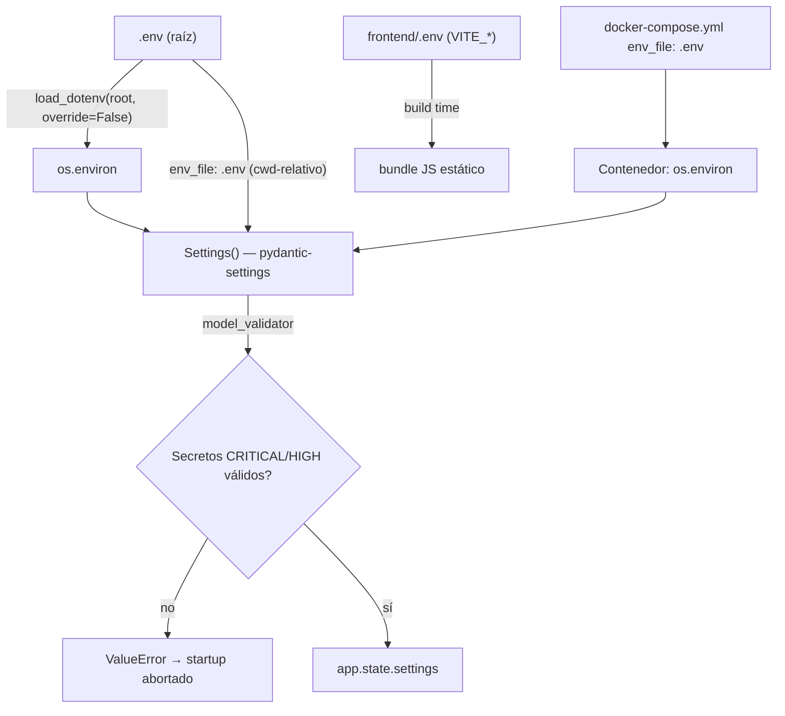
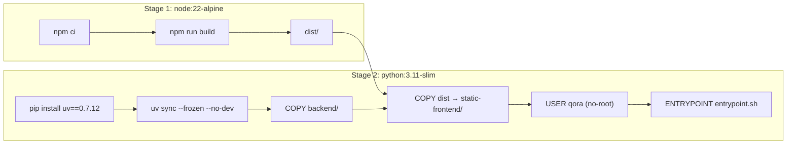

# Área 11 — Configuración / Env / Deployment

> **Propósito.** Auditoría de solo lectura de la configuración, variables de entorno y despliegue de Qora: inventario completo de variables (sin valores), análisis de `core/config.py` (pydantic-settings), del flujo Docker / launcher local / Alembic, y de la gestión de secretos. Se contrasta cada afirmación con el código y se marcan las divergencias entre documentación y producto real.

Convención de etiquetas: **[Confirmado por codigo]** / **[Inferido razonablemente]** / **[Necesita validacion humana]**.

---

## 1. Modelo de configuración — visión general

Qora carga su configuración desde un único archivo `.env` en la **raíz del repositorio**, leído explícitamente por `backend/app/main.py` y luego materializado en la clase `Settings` (pydantic-settings). El frontend tiene su propio `frontend/.env` con variables `VITE_*` que Vite hornea en el bundle en tiempo de build.

**Mecanismo de carga real** [Confirmado por codigo]:
- `backend/app/main.py:48` — `load_dotenv(Path(__file__).resolve().parent.parent.parent / ".env", override=False)`. Resuelve tres niveles `.parent` hasta la raíz del repo y carga TODAS las variables (incluidas las per-client como `QUINTANA_AIRTABLE_API_KEY`) a `os.environ` antes de instanciar `Settings`.
- `backend/app/core/config.py:155` — `model_config = {"env_file": ".env", "env_file_encoding": "utf-8", "extra": "ignore"}`. Este `env_file` es **relativo al cwd del proceso**, no a la raíz: si uvicorn se ejecuta desde `backend/`, pydantic intentaría leer `backend/.env`. En la práctica el `load_dotenv` de `main.py` ya inyectó todo a `os.environ`, así que los valores se resuelven igual; el `env_file` relativo es **redundante** con `load_dotenv` y sería la única vía que reintroduciría un `backend/.env` legacy. [Inferido razonablemente]
- `extra: "ignore"` → variables no declaradas en `Settings` se ignoran silenciosamente (no fallan el arranque).

La decisión "raíz como única fuente de verdad" está formalizada como cambio **B8** en `openspec/changes/phase-b-secrets-management/specs/env-file-conventions/spec.md` (nota de implementación: se rechazó el symlink `backend/.env -> ../.env` en favor de resolver `.parent` en `main.py`; `backend/.env` no se crea ni se lee). [Confirmado por codigo]

---

## 2. Inventario de variables de entorno — Backend

Fuente: `.env.example` (raíz) y campos de `backend/app/core/config.py`. **No se reproduce ningún valor secreto.**

### 2.1 REQUERIDAS — arranque falla si faltan o son placeholder débil

| Variable | Campo `Settings` | Tier | Propósito | Evidencia |
|----------|------------------|------|-----------|-----------|
| `OPENAI_API_KEY` | `openai_api_key: SecretStr` | CRITICAL | Clave OpenAI (GPT-4o, cerebro conversacional). Facturable | `config.py:73`, validado en `validate_required_secrets` |
| `ELEVENLABS_API_KEY` | `elevenlabs_api_key: SecretStr` | CRITICAL | Clave ElevenLabs (TTS+STT). Facturable | `config.py:80` |
| `QORA_API_KEY` | `qora_api_key: SecretStr \| None` | HIGH | Token Bearer admin que protege rutas admin. Requerido en TODOS los entornos (incluido dev) | `config.py:118`, validado obligatorio en `config.py:204-210` |

Validación: `model_validator(mode="after") validate_required_secrets` (`config.py:169`) aborta el arranque con `ValueError` si alguna está ausente, vacía o coincide (case-insensitive) con un placeholder débil de `_WEAK_PLACEHOLDERS` (`change-me-before-production`, `your-key-here`, `todo`, `replace_me`, `xxx`, `test`, `changeme`). Los valores NUNCA se incluyen en el mensaje de error. [Confirmado por codigo]

> Nota: el `.env.example` trae `QORA_API_KEY=change-me-before-production` (`.env.example:47`), que es exactamente un placeholder de la lista negra → copiar el ejemplo sin editar provoca fallo de arranque deliberado. [Confirmado por codigo]

### 2.2 CONDICIONALES

| Variable | Campo | Propósito | Evidencia |
|----------|-------|-----------|-----------|
| `QORA_WEBHOOK_AUTH_ENABLED` | `qora_webhook_auth_enabled: bool = False` | Activa autenticación del webhook de ElevenLabs | `config.py:135` |
| `QORA_WEBHOOK_SECRET` | `qora_webhook_secret: SecretStr \| None` | Secreto compartido `X-Webhook-Secret`. Obligatorio si el flag anterior es `true` | `config.py:134`; validado en `validate_webhook_secret_when_enabled` (`config.py:220-245`) — arranque falla si flag on y secreto vacío/ausente |

### 2.3 PER-CLIENT (CRM)

| Variable | Propósito | Evidencia |
|----------|-----------|-----------|
| `QUINTANA_AIRTABLE_API_KEY` | API key Airtable para el cliente Quintana Seguros. Referenciada por `backend/clients/*/crm.yaml` vía patrón `^[A-Z][A-Z0-9_]+$` → lookup en `os.environ` | `.env.example:66`; resolución en `crm_config.py:170`, `credentials.py:154`; escaneo en `check-secrets.py:_scan_crm_yaml` |

No declarada en `Settings`; se resuelve dinámicamente desde `os.environ` por el subsistema CRM y se valida en el "CRM credential scan" del lifespan (hard-fail con `SystemExit` si el `crm.yaml` está `enabled` pero la var falta). [Confirmado por codigo — `docs/ops/secrets-management.md:34`]

### 2.4 OPCIONALES (con default funcional)

| Variable | Campo / default | Propósito |
|----------|-----------------|-----------|
| `OPENAI_MODEL` | `openai_model = "gpt-4o"` | Modelo principal |
| `OPENAI_MODEL_FAST` | `openai_model_fast = "gpt-4o-mini"` | Modelo rápido/barato |
| `ELEVENLABS_VOICE_ID` | `= "4wDRKlxcHNOFO5kBvE81"` | Voz (Melisa/Sofia demo) |
| `ELEVENLABS_AGENT_ID` | `= "agent_8201kra4wjhve0srcwgbtwfetr5n"` | Agente demo |
| `ELEVENLABS_MODEL` | `= "eleven_flash_v2_5"` | Modelo de voz |
| `ELEVENLABS_STABILITY` | `= 0.4` (float) | Tuning de voz |
| `ELEVENLABS_SPEED` | `= 0.95` (float) | Velocidad |
| `ELEVENLABS_SIMILARITY_BOOST` | `= 0.75` (float) | Similaridad |
| `DATABASE_URL` | `= "sqlite+aiosqlite:///./qora.db"` | URL DB async. Docker la sobrescribe |
| `HOST` | `= "0.0.0.0"` | Bind host |
| `PORT` | `= 8000` (int) | Puerto |
| `LOG_LEVEL` | `= "INFO"` | Nivel de log; validado contra `{DEBUG,INFO,WARNING,ERROR,CRITICAL}` (`config.py:160`) |
| `DEBUG` | `= False` (bool) | Modo debug |
| `FILLER_TIMEOUT_MS` | `= 500` (int) | Timeout de filler de respaldo |
| `QORA_DOCS_ENABLED` | `= True` (bool) | Habilita `/docs` y `/redoc`. **Default abierto** |
| `QORA_ALLOWED_ORIGINS` | `= "*"` | CORS allow-list (coma-separado). **Default abierto** |
| `QORA_DEMO_CLIENT_ID` | `None` | `client_id` del tenant demo |
| `QORA_DEMO_AGENT_ID` | `None` | UUID del agente demo |
| `QORA_SESSION_TTL_SECONDS` | `= 14400` (int) | TTL de sesión en memoria (4 h) |

Evidencia: `config.py:74-141`. [Confirmado por codigo]

### 2.5 Variables declaradas en `Settings` pero AUSENTES de `.env.example` (drift de documentación)

| Variable / campo | Estado | Impacto | Evidencia |
|------------------|--------|---------|-----------|
| `ENABLE_JOB_EXECUTOR` (`enable_job_executor: bool = False`) | **No documentada** en `.env.example`, `docs/running-locally.md` ni `secrets-management.md` (aunque **SÍ** en `docs/ops/background-jobs.md`) | **Funcional real**: feature flag que conmuta entre ejecutor durable de jobs post-call (con reintentos DB-backed) y el path legacy fire-and-forget. Un operador no puede descubrir cómo activar la durabilidad desde el `.env.example` | Campo: `config.py:152`; usado en `main.py:198,226` y `summarizer.py:1174`; ausente de `.env.example` (verificado por búsqueda) |
| `FRONTEND_URL` (`frontend_url = "http://localhost:5173"`) | No documentada en `.env.example` | Usada para construir el redirect a `/admin` (`main.py:423`). Default local hardcodeado; en producción el redirect apuntaría a localhost si no se setea | `config.py:100`, `main.py:423` |
| `DEFAULT_COMPANY_NAME` (`= "Quintana Seguros"`) | No documentada en `.env.example` | Default de tenant; solo definición, sin uso fuera de `config.py` en el grep realizado (posible default residual) | `config.py:110` |
| `DEFAULT_AGENT_NAME` (`= "Jaumpablo"`) | No documentada en `.env.example` | Ídem anterior | `config.py:111` |

[Confirmado por codigo] para la ausencia en `.env.example`; el impacto de `ENABLE_JOB_EXECUTOR` es la divergencia más relevante de esta área.

### 2.6 FUTURE / LEGACY — declaradas en `.env.example` pero NO cableadas en código

`.env.example:130-149` lista, comentadas, variables reservadas que el propio código marca como muertas en `check-secrets.py:DEAD_VARS` (`check-secrets.py:73-83`):

- `N8N_ENABLED`, `N8N_WEBHOOK_URL`, `N8N_WEBHOOK_SECRET`, `N8N_INTERNAL_API_KEY`, `N8N_TIMEOUT_SECONDS` — automatización n8n post-call (no activa).
- `TWILIO_ACCOUNT_SID`, `TWILIO_AUTH_TOKEN`, `TWILIO_PHONE_NUMBER` — llamadas salientes (Phase C, no activa).
- `BROKER_NAME` — legacy, reemplazado por config per-client en `crm.yaml`.

`check-secrets.py` emite un warning `[DEPRECATED]` si alguna de estas aparece seteada en el entorno. [Confirmado por codigo]

### 2.7 Inyectadas en runtime Docker (no setear manualmente)

| Variable | Propósito | Evidencia |
|----------|-----------|-----------|
| `DATABASE_URL` (override) | `sqlite+aiosqlite:////app/data/qora.db` — SQLite en volumen nombrado | `docker-compose.yml:31` (sobrescribe cualquier valor de `.env`) |
| `QORA_SKIP_BACKUP_CHECK` | `"1"` — omite el gate de backup-antes-de-migrar en restart de contenedor | `docker-compose.yml:35`; consumida en `migrate.py:343` |
| `QORA_ENV_FILE` | Override de la ruta `.env` (solo para tests) | `check-secrets.py:45` |
| `QORA_CLIENTS_ROOT` | Override del directorio de clientes (solo para tests) | `check-secrets.py:336` |

---

## 3. Inventario de variables — Frontend

Fuente: `frontend/.env.example` y `frontend/src/api/client.ts`. Vite solo expone variables con prefijo `VITE_` al bundle.

| Variable | Propósito | Evidencia |
|----------|-----------|-----------|
| `VITE_API_BASE_URL` | URL base del backend. Vacío = same-origin (proxy de Vite dev / Docker single-port). Default `''` | `frontend/.env.example:11`; `client.ts:12` (`import.meta.env.VITE_API_BASE_URL ?? ''`) |
| `VITE_API_KEY` | Token Bearer admin, debe igualar `QORA_API_KEY`. **Horneado en el bundle JS** → visible en DevTools. Aceptable solo en Phase B (dashboard interno mono-operador); plan Phase C = login JWT | `frontend/.env.example:13-26`; `client.ts:17` (`import.meta.env.VITE_API_KEY ?? ''`) |

**Riesgo de seguridad documentado y confirmado** [Confirmado por codigo]: `VITE_API_KEY` es un secreto que viaja al cliente. Si el bundle frontend es accesible por usuarios externos, la clave admin queda expuesta. El propio `.env.example` y `docs/ops/secrets-management.md:137` lo advierten explícitamente; la mitigación (JWT) está marcada como FUTURO, no implementada.

---

## 4. `core/config.py` — análisis de pydantic-settings

[Confirmado por codigo]

- **Clase**: `Settings(BaseSettings)` — `config.py:67`.
- **Secretos como `SecretStr`**: `openai_api_key`, `elevenlabs_api_key`, `qora_api_key`, `qora_webhook_secret` → evita logueo accidental de valores.
- **Validadores**:
  - `validate_log_level` (field_validator) — normaliza a mayúsculas y valida el conjunto permitido (`config.py:160`).
  - `validate_required_secrets` (model_validator after) — fail-fast de CRITICAL/HIGH + rechazo de placeholders (`config.py:169`).
  - `validate_webhook_secret_when_enabled` (model_validator after) — coherencia flag/secreto webhook (`config.py:220`).
- **Defaults vs requeridos**: solo `openai_api_key` y `elevenlabs_api_key` son obligatorios a nivel de tipo (sin default); `qora_api_key` es `None` a nivel de tipo pero forzado a obligatorio por el model_validator. El resto tiene default funcional.
- **Comentarios de fase**: muchos campos llevan notas "Phase B5 PR #2/#3", "Phase B10", "Phase C". Varios se declaran "para que Settings sea la única fuente de verdad" aunque su cableado viva en otro PR (p. ej. CORS y webhook auth declarados antes de ser enforced) — coherente con un desarrollo por fases. [Inferido razonablemente]

---

## 5. Despliegue — Docker

### 5.1 `Dockerfile` (multi-stage)

[Confirmado por codigo]

- **Stage 1** (`Dockerfile:18-32`): compila el frontend con `node:22-alpine`, `npm ci` + `npm run build` → `dist/`.
- **Stage 2** (`Dockerfile:38-84`): `python:3.11-slim`; instala `curl` (healthcheck), `uv==0.7.12` pinneado; `uv sync --frozen --no-dev` (deps de producción exactas desde `uv.lock`); copia backend y el bundle a `/app/static-frontend/` (servido condicionalmente por `main.py`).
- **Seguridad**: usuario no-root `qora`, dueño de `/app/data` para escritura de SQLite (`Dockerfile:67-77`).
- **Entrypoint** (`docker/entrypoint.sh`): `set -e` → corre `python scripts/migrate.py` y si falla aborta el contenedor (no arranca uvicorn contra esquema desajustado); luego `exec uvicorn` como PID 1 para reenvío correcto de SIGTERM. [Confirmado por codigo]
- **Puerto único**: API (`/api/v1/*`) + SPA React (`/`) en `:8000`. `EXPOSE 8000`, `VOLUME ["/app/data"]`.

### 5.2 `docker-compose.yml`

[Confirmado por codigo]

- Servicio único `qora`, build local, `image: qora:latest`, puerto `8000:8000`.
- `env_file: .env` (raíz) + override de `DATABASE_URL` y `QORA_SKIP_BACKUP_CHECK` vía `environment:`.
- Volumen nombrado `qora-data` montado en `/app/data` (persiste tras `docker compose down`; se borra con `down -v`).
- Healthcheck: `curl -f http://localhost:8000/api/v1/health` (interval 30s, timeout 10s, retries 3, start_period 15s).
- `restart: unless-stopped`.

### 5.3 `.dockerignore`

[Confirmado por codigo] Excluye correctamente del contexto de build: `.env` / `*.env` / `backend/.env`, todas las variantes de SQLite (`*.db`, `*.db-shm`, `*.db-wal`, `*.db.bak-*`, `*.sqlite*`), venvs, `node_modules`, `frontend/dist`, `.git`, caches de test/ruff/pytest, `backend/tests/`, y directorios de tooling (`Plugin/`, `.atl/`, `.engram/`, `openspec/`, `docs/`). Buen higiene: los secretos y la DB nunca entran a las capas de imagen.

---

## 6. Launcher local `Qora` (script raíz)

[Confirmado por codigo] `bash` con `set -euo pipefail`. Orquesta backend + ngrok + frontend en un terminal.

- Resuelve symlinks para funcionar tanto como `./Qora` como vía PATH (`Qora:11-19`).
- Pre-checks: existencia de `backend/`, `frontend/`, `python3` (prefiere `backend/.venv/bin/python`), `npm`, `ngrok` (`Qora:245-256`).
- Libera puertos 8000/5173/4040 si están ocupados por procesos Qora previos (`stop_port_if_busy`, identificación por patrón de comando — `Qora:108-125`).
- Corre `python scripts/migrate.py` (Alembic) antes de uvicorn (`Qora:270-281`).
- Levanta uvicorn `--reload`, `ngrok http 8000`, y `npm run dev -- --host 0.0.0.0 --strictPort`.
- Espera readiness HTTP del backend/frontend y la URL pública HTTPS de ngrok; imprime un resumen con la URL para ElevenLabs (`$ngrok_url/api/v1/voice`).
- Trap de `cleanup`/`shutdown` que mata el árbol de procesos (TERM→KILL) en Ctrl+C/exit.

**Divergencias del launcher** (ver §9):
- `Qora:258-259` advierte si falta `backend/.env` y sugiere crearlo desde `backend/.env.example` — **contradice la convención B8** (root-only; `backend/.env` no se lee). Es una verificación legacy con mensaje engañoso. [Confirmado por codigo]

---

## 7. Migraciones — `alembic.ini` y `migrate.py`

[Confirmado por codigo]

- `backend/alembic.ini`: `script_location = alembic`; `sqlalchemy.url = sqlite+aiosqlite:///%(here)s/qora.db` (path determinístico vía `%(here)s` = `backend/`). Comenta que el CLI usa driver sync pero el runner async se invoca programáticamente por `migrate.py`.
- `migrate.py` (`run_migrations`, `migrate.py:361`): resuelve `alembic.ini` y `script_location` de forma absoluta desde `__file__` (cwd-independiente); aplica `DATABASE_URL` override antes de los chequeos de seguridad; árbol de decisión idempotente (DB nueva → upgrade; stamped → upgrade; unstamped compatible → stamp; incompatible → `RuntimeError` fail-safe).
- **Gate de backup** (`_require_backup`, `migrate.py:330`): bloquea migración sobre DB existente no vacía si no hay backup del día, salvo `QORA_SKIP_BACKUP_CHECK` seteado. **En Docker el gate está deshabilitado** por `QORA_SKIP_BACKUP_CHECK=1` (`docker-compose.yml:35`) → en contenedor no hay verificación de backup pre-migración (la durabilidad recae solo en el volumen nombrado). [Confirmado por codigo] — ver Riesgos.

---

## 8. Tooling de build y dependencias

[Confirmado por codigo]

- **Backend** `backend/pyproject.toml`: build `hatchling`; `requires-python >=3.11`; deps de runtime (fastapi, uvicorn[standard], pydantic 2, pydantic-settings, openai, sqlalchemy[asyncio], aiosqlite, structlog, click, pyyaml, pyairtable, alembic); extra `dev` (pytest, pytest-asyncio, pytest-mock, httpx, respx). `[tool.pytest.ini_options]` con `asyncio_mode = "auto"`. **No hay `[tool.ruff]`** pese a que `.dockerignore` excluye `.ruff_cache` → posible deriva de tooling (lint configurado fuera del repo o no usado). [Inferido razonablemente]
- **Frontend** `frontend/package.json`: React 19, react-router 7, @tanstack/react-query, Radix UI, Tailwind 4 (vía `@tailwindcss/vite`); scripts `dev`/`build` (`tsc -b && vite build`)/`preview`/`test` (vitest)/`lint` (eslint). Gestor: **npm** (hay `package-lock.json`, usado por Dockerfile y launcher).
- **`vite.config.ts`**: alias `@ → ./src`; dev server `:5173` con proxy `/api → http://127.0.0.1:8000` (same-origin en dev). Plugins react + tailwind.
- **`tsconfig*`**: project references (`tsconfig.json` → `app` + `node`); `app` con `strict`, `noUnusedLocals/Parameters`, `moduleResolution: bundler`, alias `@/*`, tipos `vite/client` + testing-library + vitest. `node` para archivos de config. Strict mode activo en ambos.

---

## 9. Divergencias documentación vs código (el código manda)

| # | Divergencia | Evidencia | Severidad |
|---|-------------|-----------|-----------|
| 1 | `ENABLE_JOB_EXECUTOR` usada en código y ausente de `.env.example` (confirmado), **pero SÍ documentada** en `docs/ops/background-jobs.md` (ver nota de corrección al pie) | `config.py:152`; ausente de `.env.example`; presente en `docs/ops/background-jobs.md:15,20,150` | Baja/Media — no está en `.env.example`, pero el operador puede descubrir la activación en la guía de ops |
| 2 | `docker-compose.yml:14` instruye "Copy `backend/.env.example` to .env", pero `backend/.env.example` **no existe** (solo `.env.example` raíz y `frontend/.env.example`) | `docker-compose.yml:14`; `fd` no halla `backend/.env.example` | Baja — comentario obsoleto, contradice B8 |
| 3 | Launcher `Qora` verifica/sugiere `backend/.env` y `backend/.env.example`, contradiciendo la convención root-only B8 | `Qora:258-259` | Baja — warning engañoso (no rompe, backend lee root `.env`) |
| 4 | `docs/ops/secrets-management.md` usa `pnpm dev`/`pnpm build`; el proyecto usa **npm** (lockfile, Dockerfile, launcher) | `secrets-management.md:56,132` vs `package.json`+`Dockerfile:23-26`+`Qora:297` | Baja — comando incorrecto para el desarrollador |
| 5 | `docs/running-locally.md` instala con `pip install -e "backend/.[dev]"` mientras Dockerfile usa `uv sync --frozen` (`uv.lock`). Dos flujos de dependencias coexistiendo (pip+venv local vs uv en imagen) | `running-locally.md:27` vs `Dockerfile:45-58` | Baja/Media — riesgo de versiones distintas dev vs prod (pip resuelve libre, uv usa lock) |
| 6 | `README.md` referencia `docker-compose.n8n-local.yml` y `docs/n8n-workflows/`; el compose **no existe** (solo `docker-compose.yml`) | `README.md:203` vs `fd docker-compose` | Baja — referencia colgante (README la marca como "referencia estática, no runtime") |
| 7 | `secrets-management.md:189` (rollback) referencia "restore `backend/.env.example` from git history", archivo ya inexistente | `secrets-management.md:189` | Informativa — instrucción de rollback histórica |
| 8 | `config.py` `env_file: ".env"` es cwd-relativo y redundante con `load_dotenv(root)` de `main.py`; es la única vía que reintroduciría un `backend/.env` legacy si el proceso corre desde `backend/` | `config.py:155` vs `main.py:48` | Baja — doble mecanismo de carga; sin impacto observado pero frágil |

> **Nota de corrección (revisión 2026-06-27).** La fila #1 de esta tabla se corrigió: la afirmación original *"ausente de `.env.example` **y de toda la doc de setup**"* / *"invisible para el operador"* era **parcialmente incorrecta**. Verificado por inspección read-only del repo: `ENABLE_JOB_EXECUTOR` **sí está documentado** en `docs/ops/background-jobs.md` (tabla de configuración con el comportamiento `true`/`false`, ejemplo `ENABLE_JOB_EXECUTOR=true`, y procedimiento de rollback — líneas 15, 20, 150). Lo que **sí es correcto** y se mantiene: el flag **no figura en `.env.example`** (ni en `running-locally.md` / `secrets-management.md`). Hecho de code-state preservado; solo se corrige el alcance "toda la doc de setup". Registrado en `21-revision-temporal-y-ajustes.md` §5 (punto 6).

---

## 10. Postura de seguridad de la configuración (resumen)

[Confirmado por codigo]

- **Defaults abiertos en dev**: `QORA_ALLOWED_ORIGINS="*"` (CORS abierto) y `QORA_DOCS_ENABLED=True` (`/docs` y `/redoc` expuestos). Ambos defaults deben endurecerse en producción; el `.env.example` lo comenta pero el código no fuerza el cierre.
- **`VITE_API_KEY`** horneado en el bundle (secreto browser-visible) — mitigación JWT pendiente (Phase C).
- **Secretos como `SecretStr`** y validación que nunca emite valores en errores/logs — buena práctica aplicada consistentemente (`config.py`, `check-secrets.py`).
- **`check-secrets.py`** ofrece gate pre-deploy (exit 0/1) con salida humana y `--json` para CI; escanea CRM `crm.yaml` y detecta vars muertas. No está cableado a ningún CI activo en el repo (la sección CI/CD del runbook es "future"). [Confirmado por codigo — `secrets-management.md:164`]
- **Backup pre-migración deshabilitado en contenedor** (`QORA_SKIP_BACKUP_CHECK=1`) → la protección de datos en Docker depende solo del volumen nombrado, sin snapshot previo a migrar.

---

## 11. Cobertura y límites

- **[Necesita validacion humana]** No se ejecutó ningún comando de build/run/migración (auditoría read-only): no se verificó empíricamente que `docker compose up --build`, `./Qora` ni `check-secrets.py` corran sin error en esta máquina. Las conclusiones derivan de lectura de código.
- **[Necesita validacion humana]** No se confirmó si existe un `.env` o `frontend/.env` real en el entorno del operador (están en `.gitignore`; no se inspeccionaron valores por política de secretos).
- **[Necesita validacion humana]** No hay pipeline CI/CD en el repo que invoque `check-secrets.py`; el runbook lo describe como futuro. Validar si existe CI externo.
- **[Necesita validacion humana]** El uso real de `DEFAULT_COMPANY_NAME` / `DEFAULT_AGENT_NAME` fuera de `config.py` no se halló en el grep dirigido; podría haber consumo dinámico no capturado. Confirmar si son defaults muertos.
- **[Necesita validacion humana]** No se auditó la configuración de despliegue en la nube (orquestador, TLS, reverse proxy, gestión de secretos del proveedor); el repo solo describe single-container + ngrok local.
- **[Inferido razonablemente]** La redundancia `env_file` relativo + `load_dotenv(root)` se infiere benigna; convendría validar el comportamiento si alguien corre uvicorn directamente desde `backend/` con un `backend/.env` residual presente.
