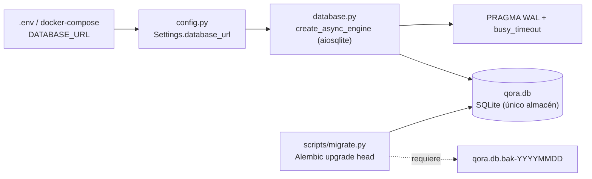
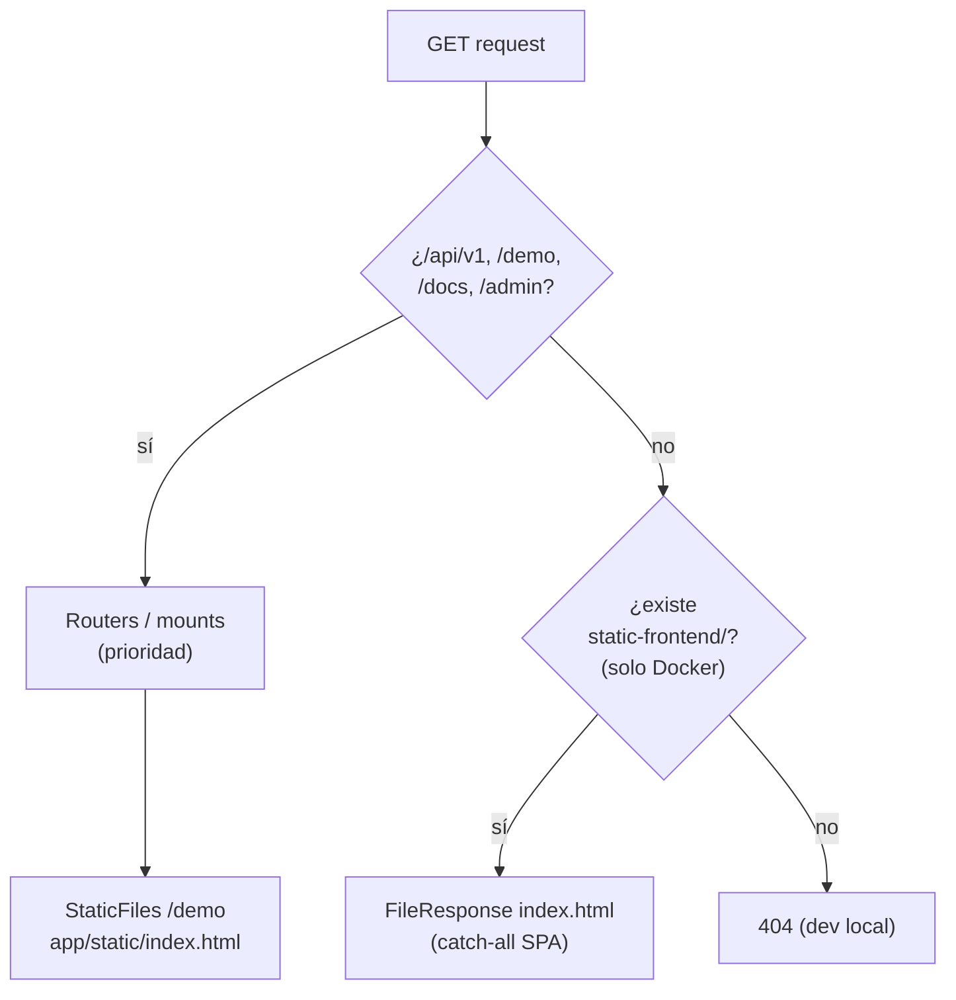

# Área 12 — Storage / archivos / uploads

> **Propósito.** Auditoría de solo lectura del almacenamiento de datos, el manejo de archivos y las cargas (uploads) en Qora. Se documenta qué se persiste, dónde y cómo; se distingue lo implementado de lo planificado; y se señalan artefactos binarios/db comprometidos al repositorio. No se modifica ningún archivo del producto.

---

## 1. Resumen ejecutivo

Qora **no tiene almacenamiento de objetos/archivos de propósito general**. Toda la persistencia productiva ocurre en **una única base SQLite** vía SQLAlchemy async (`aiosqlite`). No existe almacenamiento de blobs, S3, GCS, disco para adjuntos, ni grabaciones de audio persistidas localmente. El único "manejo de archivos" del sistema es:

1. La **base SQLite** (archivo `qora.db`) — el único almacén de datos.
2. **Archivos estáticos** servidos por FastAPI: la página `/demo` (simulador de llamada, `index.html`) y, solo dentro de la imagen Docker, el build del SPA React.
3. **Configuración por cliente** en `clients/*` (YAML), leída en disco (fuera del alcance estricto de esta área, pero relevante al import de CRM).

El **import de CRM es PULL desde la API de Airtable**, NO una carga de archivos CSV. La página de import del frontend está marcada explícitamente como "Coming Soon" (no implementada). No hay ningún endpoint de upload (`UploadFile`/`multipart`) en el backend. [Confirmado por codigo]

No hay archivos `.db`, `.sqlite`, ni binarios comprometidos al repositorio, ni en el árbol actual ni en el historial git. [Confirmado por codigo]

---

## 2. Almacén primario — SQLite

### 2.1 Motor y sesión

`backend/app/core/database.py` define el motor async y la session factory como singletons de módulo:

- `create_engine_and_session(database_url)` → `create_async_engine(database_url, echo=False, pool_pre_ping=True)` y `async_sessionmaker(..., expire_on_commit=False)`. [Confirmado por codigo — `database.py:38-58`]
- `Base(DeclarativeBase)` es la base declarativa compartida por todos los modelos. [Confirmado por codigo — `database.py:26-27`]
- `get_session()` es un context manager async con commit/rollback automático: hace `yield`, luego `commit()`, y `rollback()` ante excepción. [Confirmado por codigo — `database.py:100-118`]

### 2.2 URL y ubicación del archivo

La URL de base se define en `backend/app/core/config.py`:

- `database_url: str = "sqlite+aiosqlite:///./qora.db"` (default; ruta relativa al CWD del proceso). [Confirmado por codigo — `config.py:91`]
- En CLI (`backend/qora_cli.py`) se fija por defecto `DATABASE_URL = sqlite+aiosqlite:///{_BACKEND_DIR}/qora.db` (ruta absoluta dentro de `backend/`). [Confirmado por codigo — `qora_cli.py:137,190`]
- En Docker, `docker-compose.yml` **sobreescribe** la URL a `sqlite+aiosqlite:////app/data/qora.db`, ubicando el `.db` en el volumen nombrado `qora-data` montado en `/app/data`. El `Dockerfile` declara `VOLUME ["/app/data"]`. [Confirmado por codigo — `docker-compose.yml:31`, `Dockerfile:80`]

> **Observación.** La ubicación del `.db` depende del entorno: dev local (CWD/`backend/`) vs. contenedor (`/app/data` en volumen). Esto está documentado en los archivos pero conviene validarlo en el despliegue real. [Inferido razonablemente]

### 2.3 WAL y pragmas

`init_db(settings)` crea el motor, importa los módulos de modelos para registrarlos en `Base.metadata`, y aplica pragmas SQLite tras conectar:

- `PRAGMA journal_mode=WAL` — modo Write-Ahead Logging para lecturas/escrituras concurrentes.
- `PRAGMA busy_timeout=5000` — 5 s de espera ante locks.

[Confirmado por codigo — `database.py:61-87`]

> **Nota.** WAL genera archivos auxiliares en runtime (`qora.db-wal`, `qora.db-shm`) junto al `.db`. No están presentes ni comprometidos (ver §6). [Inferido razonablemente]

La creación del esquema **no** la hace `init_db` (no llama `create_all`); el esquema lo garantiza la migración de pre-arranque (`scripts/migrate.py` → Alembic `upgrade head`). [Confirmado por codigo — `database.py:67-70`]

### 2.4 Modelos que registran metadata

`init_db` importa explícitamente: `app.tenants.models`, `app.leads.models`, `app.calls.models`, `app.scheduler.models`, `app.jobs.models`. [Confirmado por codigo — `database.py:76-80`]

### 2.5 Backups gestionados por la migración

`backend/scripts/migrate.py` implementa un guard de backup obligatorio antes de migrar una DB existente:

- Patrón de backup esperado: `{db_dir}/{db_stem}.db.bak-{YYYYMMDD}` (p. ej. `qora.db.bak-20241201`). [Confirmado por codigo — `migrate.py:294-330`]
- `_require_backup()` aborta (`SystemExit(1)`) si no existe un backup legible del día, salvo que se setee `QORA_SKIP_BACKUP_CHECK` (DB efímera). [Confirmado por codigo — `migrate.py:330-413`]

> **Observación.** El backup es un `cp` manual sugerido en el mensaje de error; el repo no automatiza la creación del backup, solo verifica su existencia antes de migrar. [Confirmado por codigo — `migrate.py:350-355`]



---

## 3. Cargas de archivos (uploads)

### 3.1 No hay endpoints de upload

No existe ningún endpoint que reciba archivos: no se encontró uso de `UploadFile`, `File(...)`, ni `multipart` en `backend/app`. [Confirmado por codigo — búsqueda `rg 'UploadFile|multipart|File\('` sin coincidencias funcionales]

### 3.2 Import de CRM = PULL desde Airtable API (no CSV)

`backend/app/integrations/crm_import_service.py` orquesta el import **Airtable → Qora en dirección PULL**:

- Punto de entrada único `import_leads_from_crm(client_id, db_session, ...)`. [Confirmado por codigo — `crm_import_service.py:130`]
- Lee `crm.yaml` del cliente (`CRMConfigLoader.load`), resuelve la API key desde variable de entorno, y obtiene **todos** los registros vía `AirtableAdapter.fetch_records(table_id=...)` (batch, no live). [Confirmado por codigo — `crm_import_service.py:170-207`]
- Mapeo inverso de campos Airtable → Qora con `FieldMapper.reverse_map()`; deduplicación por `(client_id, phone)`: actualiza si existe, crea si no. Guarda el record ID de Airtable como `external_crm_id`. [Confirmado por codigo — `crm_import_service.py:224-355`]
- Es una operación batch, **no** se llama durante llamadas en vivo, y **no** modifica el path de push sync (`crm_sync_service.py`). [Confirmado por codigo — docstring `crm_import_service.py:10-13`]
- Atomicidad: cada registro se aísla en un `begin_nested()` (savepoint); el caller (`crm_router`) es dueño de la transacción única. [Confirmado por codigo — `crm_import_service.py:260-343`]

> **Conclusión.** El import **no acepta carga de archivos**: lee de la API REST de Airtable. La fuente de datos externa es Airtable, no un CSV subido por el usuario. [Confirmado por codigo]

### 3.3 Import CSV en frontend — NO implementado

`frontend/src/features/import/page.tsx` es un placeholder "Coming Soon":

```tsx
/**
 * ImportPage — Coming Soon
 * CSV bulk lead import — not yet implemented.
 */
```

Renderiza únicamente el texto "CSV bulk lead import is coming soon." [Confirmado por codigo — `import/page.tsx:1-26`]

> **Discrepancia UI vs. backend.** La UI promete "CSV bulk lead import" que **no existe** en backend (no hay upload ni parser CSV). La funcionalidad real de carga de leads es el PULL de Airtable, expuesto por otra ruta (CRM), no por esta página. [Confirmado por codigo]

---

## 4. Archivos estáticos

`backend/app/main.py` configura dos bloques de estáticos:

### 4.1 `/demo` — simulador de llamada de voz

- `_STATIC_DIR = .../app/static`. Si el directorio existe, se monta `app.mount("/demo", StaticFiles(directory=_STATIC_DIR, html=True), name="demo")`. [Confirmado por codigo — `main.py:402-404`]
- El contenido es `backend/app/static/index.html` (~38 KB), una página HTML/CSS/JS inline titulada "QORA — Demo" (simulador de llamada). Es el **único archivo trackeado** bajo `static/`. [Confirmado por codigo — `git ls-files backend/app/static` → 1 archivo; `index.html`]
- Existe un subdirectorio vacío `backend/app/static/admin/` (sin archivos trackeados ni presentes). [Confirmado por codigo]

> **Posible dead code / artefacto legacy.** El directorio `backend/app/static/admin/` está vacío. Un comentario en `main.py:27` indica que "the previous /admin static mount has been [removed]" y que la SPA admin ahora vive en el frontend React/Vite. El directorio vacío parece residuo del mount eliminado. [Inferido razonablemente — `main.py:25-27`, dir vacío]

### 4.2 `/admin` — redirect (no estático)

`/admin` y `/admin/` redirigen (307) a `frontend_url + /admin` (la SPA React canónica). Ya no se sirve estático de admin desde el backend. [Confirmado por codigo — `main.py:409-426`]

### 4.3 SPA React — solo dentro de Docker

- `_FRONTEND_DIR = .../app/../static-frontend`. Solo existe **dentro de la imagen Docker** (`/app/static-frontend/`). Fuera de Docker el path no existe y todos los mounts/rutas se saltan. [Confirmado por codigo — `main.py:437-442`]
- Monta `/assets`, `/fonts`, `/images` vía `StaticFiles`, y una ruta catch-all `GET /{full_path:path}` que sirve `index.html` para soportar deep-links de React Router (SPA routing). [Confirmado por codigo — `main.py:444-459`]



---

## 5. Persistencia de memoria y transcripciones

### 5.1 Memoria (`app/memory.py`)

`app/memory.py` **no es un almacén**: es un *builder* que computa el contexto de memoria del lead **leyendo de la DB** (no guarda nada nuevo). [Confirmado por codigo — `memory.py:1-22`]

- `build_memory_context(db, lead)` consulta `CallSession` (sesiones completadas con summary, top 3 por `ended_at`) y arma `call_history`, `is_returning_caller`, `call_number`. [Confirmado por codigo — `memory.py:93-168`]
- `confirmed_facts` se devuelve **intencionalmente vacío** (higiene de contexto); el bloque mixto legacy fue desactivado. [Confirmado por codigo — `memory.py:144-147`]
- `_format_accumulated_profile()` lee `LeadProfileFact` (filas activas, `superseded_at IS NULL`) y `LeadInterestHistory` desde tablas relacionales. [Confirmado por codigo — `memory.py:525-642`]

> **Conclusión.** La "memoria" se almacena en tablas SQLite (`call_sessions`, `lead_profile_facts`, `lead_interest_history`, y `Lead.extracted_facts` como blob JSON), no en archivos ni en un store externo. `memory.py` solo las lee y formatea. [Confirmado por codigo]

### 5.2 Transcripciones — persistencia en DB

Las transcripciones se persisten en la tabla `transcript_turns`, **no en archivos**:

- Modelo `TranscriptTurn` (`call_sessions` 1:N): `id`, `session_id` (FK), `role`, `content` (Text), `timestamp`, `filler_detected`. [Confirmado por codigo — `calls/models.py:91-108`]
- Inserción turno a turno vía `calls/service.py` (`TranscriptTurn(...)` → `session.add(turn)` → `flush`). [Confirmado por codigo — `service.py:207-216`]

**Finalización off-call** (`backend/app/jobs/handlers/transcript_flush.py`):

- `transcript_flush_handler(payload, db)` corre **solo en los límites de la llamada** (fin normal o corte), nunca durante streaming en vivo. [Confirmado por codigo — `transcript_flush.py:16-19`]
- Cuenta los `transcript_turns` y **estampa** en la fila `CallSession`: `transcript_finalized_at` (timestamp UTC) y `transcript_turn_count` (conteo confirmado). Es idempotente (seguro ante reintentos del executor). [Confirmado por codigo — `transcript_flush.py:97-106`]
- Campos en el modelo: `CallSession.transcript_finalized_at` y `transcript_turn_count`, ambos nullable (NULL = no finalizado / pre-PR3). B9/operadores pueden filtrar `WHERE transcript_finalized_at IS NULL` para detectar sesiones sin finalizar. [Confirmado por codigo — `calls/models.py:77-85`]
- Política de reintentos: `max_attempts=2`; tras fallar ambos, el job queda `dead` (pérdida acotada aceptada, no operator-review). [Confirmado por codigo — `transcript_flush.py:21-25`]

> **Observación de durabilidad.** Si la sesión no se encuentra, el handler lanza `RuntimeError` para forzar reintento; con sólo 2 intentos y backoff, una latencia de replicación prolongada podría dejar un `transcript_turn_count` sin estampar (job `dead`). Es un diseño de "pérdida acotada aceptada" explícito. [Confirmado por codigo — `transcript_flush.py:82-88`]

### 5.3 Audio / grabaciones

No hay persistencia de audio: ninguna referencia a `.mp3`/`.wav`/grabaciones almacenadas. La única mención a "audio" es texto de prompt de análisis (`outcome.py:125`, clasificación "technical_issue"). El audio de la llamada lo maneja ElevenLabs (externo); Qora no guarda media. [Confirmado por codigo]

---

## 6. Artefactos binarios / DB comprometidos

- **Árbol actual:** sin archivos `*.db`, `*.sqlite`, `*.sqlite3`, `*.db-wal`, `*.db-shm` trackeados ni presentes. [Confirmado por codigo — `git ls-files`, `fd` sin coincidencias]
- **Historial git:** `git log --all --diff-filter=A -- '*.db' '*.sqlite*'` no devuelve resultados — nunca se commiteó una DB. [Confirmado por codigo]
- **Binarios trackeados:** búsqueda de extensiones `.db/.sqlite/.bak/.mp3/.wav/.mp4/.zip/.tar/.gz/.pdf/.xlsx` en `git ls-files` → sin coincidencias. [Confirmado por codigo]
- **`.gitignore`** ignora correctamente: `.env`, `*.env`, `*.db`, `*.db-shm`, `*.db-wal`, `*.db.bak-*`, `*.sqlite`, `*.sqlite3`, `frontend/.env`. [Confirmado por codigo — `.gitignore:20-29,71`]

> **Conclusión positiva.** No hay fugas de DB ni binarios al repositorio; la higiene de `.gitignore` cubre DB, WAL/SHM, backups y secretos. [Confirmado por codigo]

---

## 7. Secretos relacionados a storage

Variables de entorno relevantes a esta área (solo NOMBRE y propósito; nunca valores):

| Variable | Propósito inferido | Evidencia |
|---|---|---|
| `DATABASE_URL` | URL de la base SQLite (driver `aiosqlite`); sobreescrita en Docker | `config.py:91`, `docker-compose.yml:31` |
| `QORA_SKIP_BACKUP_CHECK` | Saltar el guard de backup en migración (DB efímera) | `migrate.py` (guard `_require_backup`) |
| (API key de Airtable) | Resuelta desde env por `config.resolve_api_key()` para el PULL de CRM | `crm_import_service.py:188` |

Las API keys de OpenAI/ElevenLabs/QORA se validan en `config.py` como `SecretStr` y nunca se loguean (relevante a secretos generales, fuera del foco de storage). [Confirmado por codigo — `config.py:67-218`]

---

## 8. Cobertura y límites

- **Validado desde el repo:** motor SQLite + WAL, ubicación del `.db` por entorno, ausencia de uploads, import CRM por PULL de Airtable (no CSV), import CSV de frontend no implementado, estáticos `/demo` y SPA Docker, persistencia de transcripciones y su finalización off-call, ausencia de DB/binarios en repo e historial.
- **`DATABASE_URL` real en producción** y la ubicación física efectiva del `.db` en el despliegue (volumen `qora-data`) — solo verificable en el entorno desplegado. [Necesita validacion humana]
- **Existencia y cadencia real de backups** (`qora.db.bak-YYYYMMDD`) — el repo solo verifica su presencia antes de migrar; no automatiza su creación. ¿Hay un cron/backup externo? [Necesita validacion humana]
- **Política de retención de transcripciones y tamaño de la DB** en producción (sin TTL/purga observada para `transcript_turns`) — no hay job de archivado/borrado en el alcance leído. [Necesita validacion humana]
- **Comportamiento de WAL bajo concurrencia real** (múltiples workers/procesos sobre el mismo archivo SQLite en el volumen) — riesgo conocido de SQLite con escritura concurrente; requiere validación operativa. [Necesita validacion humana]
- **El subdirectorio `static/admin/` vacío** — confirmar si es residuo eliminable o placeholder intencional. [Necesita validacion humana]
