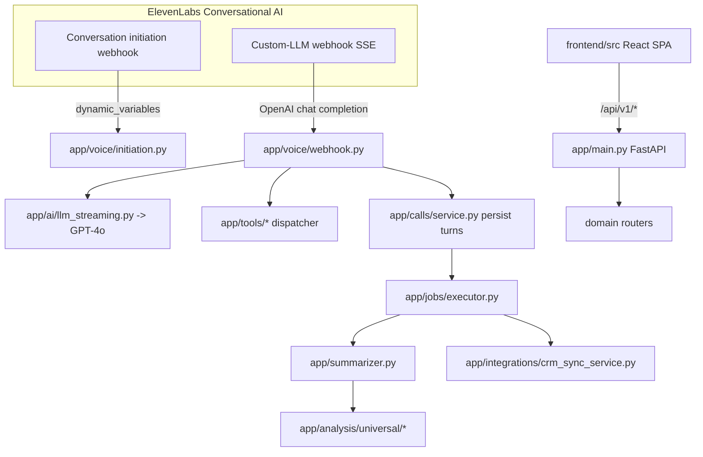

# 14 — Inventario archivo por archivo

> **Naturaleza de este documento.** Este es el *mapa legible por humanos* del repositorio Qora.
> No reemplaza al detalle exhaustivo registro a registro de `file-inventory.csv` (generado aparte);
> lo complementa agrupando por módulo/carpeta, describiendo la responsabilidad de cada grupo y
> destacando individualmente los archivos **críticos** (entry points, ejecutores, routers, modelos,
> `core/*`, webhook de voz, executor de jobs).
>
> **Convenciones de evidencia.** Cada afirmación relevante lleva una etiqueta:
> `[Confirmado por codigo]` / `[Inferido razonablemente]` / `[Necesita validacion humana]`.
> Las rutas, símbolos, endpoints y nombres de variables de entorno se citan textualmente.
> El código manda sobre la documentación previa: las discrepancias detectadas se anotan.
>
> **Referencias cruzadas.** Donde aplica se enlaza el documento de área correspondiente
> (`01`–`13`) que profundiza el tema.

---

## 0. Vista general del repositorio

`git ls-files` reporta **656 archivos versionados**. Distribución por raíz [Confirmado por codigo]:

| Raíz | Archivos | Contenido |
|---|---:|---|
| `backend/` | 331 | FastAPI + SQLAlchemy + pipeline de análisis + jobs + integraciones |
| `frontend/` | 135 | React 19 + Vite + React Router v7 |
| `.sdd/` | 88 | Artefactos del flujo SDD (planificación, no producto) |
| `openspec/` | 58 | Specs/designs de cambios (planificación, no producto) |
| `docs/` | 21 | Documentación de producto/ingeniería (parcialmente desactualizada) |
| `skills/`, `.atl/`, `.engram/`, `sdd/` | ~14 | Tooling de agentes/IA del entorno, no producto |
| raíz | varios | `docker-compose.yml`, `Dockerfile`, `docker/entrypoint.sh`, `README.md`, `AGENTS.md`, `.env.example`, `.gitignore`, `.dockerignore` |

Ver `01-mapa-del-repo.md` y `02-arquitectura-general.md` para la fotografía macro.

---

## 1. Backend — punto de entrada y núcleo

### 1.1 Entry point (CRÍTICO)

- **`backend/app/main.py`** (459 L) — *Application factory* FastAPI. [Confirmado por codigo]
  - `create_app()` construye la instancia; `app = create_app()` es el singleton de producción.
  - `lifespan()` orquesta el arranque: `Settings()` → logging → `validate_all_integration_credentials()` → `init_db()` → seed (`seed_quintana`, `seed_qora_demo`, `seed_leads`) → recuperación de jobs (`executor.recover()` solo si `ENABLE_JOB_EXECUTOR=true`) → tareas de fondo: `_session_store_cleanup_task`, `stale_session_sweeper`, `scheduler_tick`.
  - Registra **12 routers** bajo `api_v1_router` (prefix `/api/v1`): clients, agents, tenants (alias compat), leads, calls, voice (initiation + webhook), scheduler, analytics, crm, crm_config, demo.
  - `GET /api/v1/health` (uptime/version), redirect `/admin → frontend_url/admin`, montaje estático `/demo` y SPA catch-all `GET /{full_path:path}` (solo si existe `static-frontend/`, es decir dentro del contenedor Docker).
  - CORS regido por `QORA_ALLOWED_ORIGINS` (default `*`), middleware `RequestLoggingMiddleware`.
  - **Nota de discrepancia:** los docstrings afirman que la migración de esquema corre *antes* del proceso (`scripts/migrate.py` / Alembic) y que `lifespan` ya no llama `create_all()`. [Confirmado por codigo] El seed sí corre en cada arranque. Ver `11-configuracion-env-deployment.md`.

### 1.2 `backend/app/core/` (CRÍTICO)

Núcleo transversal: configuración, autenticación, credenciales, base de datos y logging. Ver `08-auth-usuarios-roles-permisos.md`, `11-configuracion-env-deployment.md`, `13-seguridad-observabilidad-errores.md`.

| Archivo | L | Rol (una línea) |
|---|---:|---|
| `core/config.py` | 245 | `Settings` (pydantic-settings) — única autoridad de entorno; valida secretos requeridos y rechaza placeholders débiles. [Confirmado por codigo] |
| `core/auth.py` | 369 | Dependencias FastAPI de seguridad: `require_api_key` (Bearer admin), `require_webhook_secret`, `AuthorizedSession`/`create_authorized_session`, scoping de tools. [Confirmado por codigo] |
| `core/credentials.py` | 204 | Validación en arranque de credenciales CRM por cliente (escanea `clients/*/crm.yaml`); hard-fail si falta o es placeholder. [Confirmado por codigo] |
| `core/database.py` | 118 | Engine async SQLAlchemy + `async_session_factory` + `get_session()` + pragmas WAL para SQLite. [Confirmado por codigo] |
| `core/logging.py` | 41 | Setup de logging estructurado JSON con `structlog`. [Confirmado por codigo] |

> **Secretos:** se documentan SOLO nombres de variables (p. ej. `OPENAI_API_KEY`, `ELEVENLABS_API_KEY`, `QORA_WEBHOOK_SECRET`, `QUINTANA_AIRTABLE_API_KEY`). Nunca se transcriben valores. Ver `11`.

---

## 2. Backend — Voz (el corazón del producto)

`backend/app/voice/` implementa la integración con ElevenLabs Conversational AI. Es la ruta caliente del producto. Ver `04-flujos-de-usuario.md` y `09-integraciones-externas.md`.

- **`voice/webhook.py`** (1.313 L — **CRÍTICO, el archivo más central del producto**) — Webhook Custom-LLM. [Confirmado por codigo]
  - Recibe un chat completion OpenAI-compatible de ElevenLabs, extrae `client_id`/`lead_id` de `elevenlabs_extra_body`, carga config de tenant + contexto del lead, **streamea GPT-4o por SSE**, intercepta tool calls a mitad de stream (ejecuta y re-llama al LLM), persiste turnos de transcript y cierra con `data: [DONE]`.
  - Cubre CAP-1 (SSE), CAP-4 (tools), CAP-5 (filler phrases), CAP-6 (ruteo por tenant). Incluye `GET /voice/signed-url` para el simulador demo (fuerza WebSocket).
- **`voice/initiation.py`** (274 L — CRÍTICO) — Webhook de *conversation initiation*: ElevenLabs lo llama antes de hablar; responde `dynamic_variables` con contexto del lead + memoria. Transiciona estado del lead. [Confirmado por codigo]
- **`voice/session.py`** (CRÍTICO) — `ConversationState` (dataclass) + `SessionStore` singleton en memoria (AD-3). Cachea contexto, skills cargadas y `AuthorizedSession` por sesión → **cero queries por turno** en la ruta caliente. [Confirmado por codigo]
- **`voice/context.py`** (424 L) — `build_voice_context`, `parse_agent_tool_config`: arma `VoiceSessionContext` una vez por sesión. [Confirmado por codigo]
- `voice/__init__.py` — package init.

---

## 3. Backend — IA, prompts y tools del agente

### 3.1 `backend/app/ai/`
- **`ai/llm_streaming.py`** (CRÍTICO) — `OpenAIStreamingClient`: streaming GPT-4o con acumulación de `tool_calls` deltas; emite `ContentDelta`/`ToolCallDelta`/`StreamDone`. Consumido por `voice/webhook.py`. [Confirmado por codigo]

### 3.2 `backend/app/tools/` — herramientas que el LLM puede invocar
Responsabilidad: definir, registrar y despachar las *function tools* del agente de voz. Ver `03-inventario-completo-de-features.md`.

- **`tools/registry.py`** (264 L — CRÍTICO) — `TOOL_DEFINITIONS`, `TOOL_FILLER_PHRASES`, `DEFAULT_FILLER`, `build_tool_definitions`. Catálogo central de tools. [Confirmado por codigo]
- **`tools/dispatcher.py`** (310 L — CRÍTICO) — Enruta una tool call a su handler. [Confirmado por codigo]

Handlers de tool individuales (uno por capacidad) [Confirmado por codigo]:

| Archivo | L | Tool |
|---|---:|---|
| `tools/capture_data.py` | 205 | Captura/actualiza datos del lead durante la llamada |
| `tools/get_lead_details.py` | 88 | Lectura de detalles del lead |
| `tools/get_lead_history.py` | 61 | Historial de llamadas del lead |
| `tools/get_lead_pain_points.py` | 71 | Pain points del lead |
| `tools/get_lead_profile.py` | 80 | Perfil del lead |
| `tools/mark_not_interested.py` | 77 | Marca lead como no interesado |
| `tools/schedule_followup.py` | 299 | Agenda follow-up (integra con scheduler) |
| `tools/skill_loader.py` | 142 | Carga dinámica de skills mid-call (`load_skill`) |
| `tools/__init__.py` | 0 | package init vacío |

### 3.3 `backend/app/prompts/`
Carga y composición de system prompts por cliente/agente. Ver `skills-system` en docs.

- **`prompts/loader.py`** (659 L — CRÍTICO) — `PromptLoader`: carga `backend/clients/{client_id}/prompt.md` con fallback. [Confirmado por codigo]
- `prompts/skill_loader.py` — carga de skills desde `clients/*/agents/*/skills/`. [Confirmado por codigo]
- `prompts/insurance_agent.py` (219 L) — prompt base de dominio seguros. [Inferido razonablemente] (posible acoplamiento a vertical seguros; validar si es genérico o específico de Quintana — **[Necesita validacion humana]**).
- `prompts/__init__.py`.

### 3.4 `backend/app/agents/`
- **`agents/router.py`** (506 L — CRÍTICO) — CRUD de agentes bajo `/api/v1/clients/{client_id}/agents` (Phase 7). [Confirmado por codigo]
- `agents/schemas.py` (227 L) — DTOs Pydantic. `agents/__init__.py`.

---

## 4. Backend — Dominios CRUD (leads, calls, tenants, clients)

Cada dominio sigue el patrón `models.py` (ORM) + `schemas.py` (Pydantic) + `service.py` (lógica) + `router.py` (HTTP). Ver `06-backend-api-servicios.md` y `07-modelo-de-datos.md`.

### 4.1 `backend/app/leads/`
- **`leads/models.py`** (258 L — CRÍTICO) — Tablas `leads`, `lead_profile_facts`, `lead_custom_fields`, `lead_interest_history`. [Confirmado por codigo]
- **`leads/router.py`** (846 L — CRÍTICO) — Router admin/debug de leads (`/api/v1/leads`). [Confirmado por codigo]
- `leads/service.py` (354 L) — lógica de negocio + `seed_leads`, `get_lead`, `transition_lead_status` (incluye `InvalidTransitionError`). [Confirmado por codigo]
- `leads/lead_custom_fields_service.py` (310 L) — gestión de campos custom por cliente. [Confirmado por codigo]
- `leads/__init__.py`.

### 4.2 `backend/app/calls/`
- **`calls/models.py`** (CRÍTICO) — Tablas `call_sessions`, `transcript_turns`, `call_analyses`. [Confirmado por codigo]
- **`calls/service.py`** (851 L — CRÍTICO) — `create_session`, `add_transcript_turn`, `schedule_user_turn_persist`; orquesta persistencia de turnos (consumido por webhook). [Confirmado por codigo]
- **`calls/router.py`** (407 L) — Router admin/debug de llamadas (`/api/v1/calls`). [Confirmado por codigo]
- `calls/schemas.py`, `calls/__init__.py`.

### 4.3 `backend/app/tenants/` y `backend/app/clients/` (atención: relación de compatibilidad)
- **`tenants/models.py`** (215 L — CRÍTICO) — Tablas `agents` y `clients` (las entidades multi-tenant viven aquí, **no** en `clients/models.py` que no existe). [Confirmado por codigo]
- `tenants/service.py` (795 L) — `seed_quintana`, `seed_qora_demo`, `get_client`, `get_default_agent`. [Confirmado por codigo]
- **`tenants/router.py`** — Router **read-only** de compatibilidad: un único `GET /{client_id}` bajo `/api/v1/tenants`. Es alias hacia la entidad client. [Confirmado por codigo]
- **`clients/router.py`** (338 L) — CRUD completo de clientes bajo `/api/v1/clients`. [Confirmado por codigo]
- `clients/schemas.py`, `clients/__init__.py`.

> **Observación de organización:** el dominio "cliente/tenant" está partido entre dos paquetes (`tenants/` tiene los modelos y servicios; `clients/` tiene el router CRUD; `tenants/router.py` es un alias compat). No es duplicación de datos pero sí un acoplamiento histórico a tener en cuenta. [Confirmado por codigo]

---

## 5. Backend — Pipeline de análisis post-llamada

Genera el resumen y las *dimensiones* analíticas estructuradas de cada llamada vía GPT. Ver `03` (features) y `analysis-pipeline.md` en docs.

- **`backend/app/summarizer.py`** (2.046 L — **el archivo más largo del repo, CRÍTICO**) — Orquesta el análisis por dimensión: cada módulo de `analysis/universal/` aporta su schema + prompt; el summarizer los corre y compone `PostCallAnalysis`. [Confirmado por codigo]
- `backend/app/memory.py` (642 L — CRÍTICO) — Única fuente de verdad para computar variables de memoria desde el historial de un lead; inyectadas en `initiation.py`. [Confirmado por codigo]
- `backend/app/analysis_schema.py` — **shim de compatibilidad**: reexporta `from app.analysis import *`. Ítems legacy (`ANALYSIS_SYSTEM_PROMPT`, `build_system_prompt`, `ExtractionConfig`, `build_analysis_model`) fueron eliminados. [Confirmado por codigo] (señal de migración: el hogar canónico es `app/analysis`).

### `backend/app/analysis/` — dimensiones universales
Paquete **auto-contenido** (solo depende de pydantic/enum, sin dependencias de `app`) [Confirmado por codigo]. Cada submódulo de `analysis/universal/` posee schema + prompt + lógica de una dimensión:

| Archivo | L | Dimensión |
|---|---:|---|
| `analysis/schema.py` | 114 | Agrega todas las dimensiones en `PostCallAnalysis` |
| `analysis/enums.py` | 13 | Enums compartidos |
| `analysis/universal/next_action.py` | 745 | Motor de próxima acción priorizada (CRÍTICO de negocio) |
| `analysis/universal/data_corrections.py` | 547 | Correcciones de datos estructuradas |
| `analysis/universal/profile_facts.py` | 389 | Facts de perfil add/update/remove estructurado |
| `analysis/universal/interest/interest_level.py` | 274 | Scoring de nivel de interés |
| `analysis/universal/interest/interests.py` | 204 | Detección de productos de interés |
| `analysis/universal/interest/{catalog,pipeline,__init__}.py` | 58/119/56 | Catálogo válido + pipeline + API |
| `analysis/universal/objections.py` | 199 | Objeciones |
| `analysis/universal/misc_notes.py` | 192 | Notas estructuradas |
| `analysis/universal/outcome.py` | 184 | Clasificación de outcome (11 valores, Issue #50) |
| `analysis/universal/problem.py` | 184 | Pain points |
| `analysis/universal/service_issues.py` | 162 | Problemas de servicio |
| `analysis/universal/commitments.py` | 152 | Compromisos |
| `analysis/universal/summary.py` | 69 | Resumen textual |
| `analysis/universal/__init__.py` | 145 | Registro de dimensiones |

---

## 6. Backend — Jobs de fondo (durabilidad)

`backend/app/jobs/` reemplaza los `asyncio.create_task` fire-and-forget por un executor con persistencia DB. Ver `10-webhooks-jobs-automatizaciones.md`.

- **`jobs/executor.py`** (463 L — CRÍTICO) — `JobExecutor`: `enqueue()`/`_run_job()`/`recover()`/`shutdown()` + `calculate_backoff()`. Máquina de estados `pending→running→completed|failed|dead`, retry con backoff exponencial+jitter, recuperación en arranque, idempotencia por `_active_job_ids`. Singleton de módulo `executor`. **Gated por `ENABLE_JOB_EXECUTOR`** (flag-off = no-op). [Confirmado por codigo]
- **`jobs/models.py`** (70 L — CRÍTICO) — Tabla `background_jobs`. [Confirmado por codigo]
- `jobs/registry.py` (101 L) — registro de handlers + `get_handler`/`ConfigurationError`. [Confirmado por codigo]
- `jobs/queries.py` (100 L) — queries sobre la tabla de jobs. [Confirmado por codigo]
- **Handlers** [Confirmado por codigo]:
  - `jobs/handlers/summarize.py` (70 L) — dispara el pipeline de análisis post-llamada.
  - `jobs/handlers/crm_sync.py` (145 L) — sincroniza el lead al CRM externo.
  - `jobs/handlers/transcript_flush.py` (114 L) — finaliza/persiste transcript off-call.
  - `jobs/handlers/__init__.py` (28 L) — **side-effect de registro** (import en `main.py` registra los handlers).

---

## 7. Backend — Scheduler, sweeper y demo

- **`backend/app/scheduler/`** — agenda de llamadas. Ver `10`.
  - `scheduler/models.py` — tabla `scheduled_calls`. [Confirmado por codigo]
  - `scheduler/service.py` (555 L — CRÍTICO) — `scheduler_tick` (loop de fondo lanzado en lifespan) + lógica de agenda. [Confirmado por codigo]
  - `scheduler/router.py` (383 L) — `/api/v1/scheduler`. `scheduler/schemas.py`, `__init__.py`.
- **`backend/app/sweeper.py`** — `stale_session_sweeper`: corre cada 60 s y marca sesiones `initiated` con más de 10 min como vencidas (CAP-2c). [Confirmado por codigo]
- **`backend/app/demo/router.py`** (315 L) — endpoints **AUTH-EXEMPT** del demo público (`/api/v1/demo`). [Confirmado por codigo] — superficie sin auth: revisar en `08`/`13`.

---

## 8. Backend — Integraciones externas (CRM)

`backend/app/integrations/` implementa import/sync con CRMs externos vía patrón puerto/adaptador. Ver `09-integraciones-externas.md`.

| Archivo | L | Rol |
|---|---:|---|
| `integrations/crm_port.py` | 54 | Puerto/interfaz CRM (hexagonal) |
| `integrations/adapters/airtable/adapter.py` | 373 | **Único adaptador real implementado: Airtable** [Confirmado por codigo] |
| `integrations/crm_config.py` | 276 | Config CRM por cliente (lee `clients/*/crm.yaml`) |
| `integrations/crm_config_router.py` | 657 | `/api/v1/clients/{client_id}/integrations` (CRÍTICO por tamaño) |
| `integrations/crm_import_service.py` | 557 | Importación de leads desde CRM |
| `integrations/crm_sync_service.py` | 303 | Sync saliente de leads al CRM |
| `integrations/crm_router.py` | 93 | `/api/v1/clients/{client_id}/crm/import` |
| `integrations/field_mapping.py` | 273 | Mapeo de campos lead↔CRM |
| `integrations/__init__.py`, `adapters/__init__.py`, `adapters/airtable/__init__.py` | — | inits |

> **Observación:** solo existe adaptador **Airtable**. Si la UI/config sugiere otros CRMs, marcar como no implementados. [Confirmado por codigo] — verificar consumidores en `09`.

### `backend/app/elevenlabs/`
- `elevenlabs/service.py` — `ElevenLabsService.sync_soft_timeout()` (PATCH parcial a la API de ElevenLabs). [Confirmado por codigo]
- `elevenlabs/models.py`, `elevenlabs/__init__.py`.

---

## 9. Backend — Analytics

`backend/app/analytics/` provee métricas agregadas (Issue #37). Ver `05` (consumo UI) y `06`.

- **`analytics/service.py`** (601 L — CRÍTICO) — cómputo de agregados/rollups. [Confirmado por codigo]
- `analytics/router.py` (264 L) — `/api/v1/analytics`. [Confirmado por codigo]
- `analytics/crm_parity.py` — paridad de datos con CRM. `analytics/schemas.py`, `__init__.py`.

---

## 10. Backend — Paquete `app/api/` (posible placeholder)

- `backend/app/api/__init__.py` y `backend/app/api/routes/__init__.py` (`"""API routes package."""`) — **paquete vacío, sin consumidores**: `rg "from app.api"` no encuentra ningún import en `backend/`. Probable scaffolding/dead code o reserva para futura reorganización. [Confirmado por codigo]

---

## 11. Backend — Migraciones, scripts y configuración multi-tenant

### 11.1 `backend/alembic/`
Migraciones de esquema. Ver `07` y `MIGRATIONS.md`. [Confirmado por codigo]
- `alembic/env.py`, `alembic/script.py.mako`.
- `versions/20241201_0001_baseline.py` — baseline.
- `versions/20260624_0002_add_background_jobs.py` — tabla `background_jobs`.
- `versions/20260625_0003_add_transcript_finalization_fields.py` — campos de finalización de transcript.

### 11.2 `backend/scripts/` (atención: dos generaciones de migración)
- **`scripts/migrate.py`** — runner Alembic invocado pre-arranque (referenciado por `main.py` y `docker/entrypoint.sh`). [Confirmado por codigo]
- **`scripts/check-secrets.py`** — verificación de secretos. [Confirmado por codigo]
- **15 scripts `migrate_*.py` ad-hoc** (`migrate_phase2.py`, `migrate_extraction_v2.py`, `migrate_next_action_engine.py`, `migrate_call_scheduler.py`, `migrate_data_corrections.py`, `migrate_analysis_v2.py`, `migrate_add_agents.py`, etc.) — migraciones manuales históricas **previas** a la adopción de Alembic. Probable legacy/one-shot ya aplicado; coexisten con `alembic/versions/`. [Inferido razonablemente] — **[Necesita validacion humana]** sobre cuáles siguen vigentes.
- `scripts/seed_analysis_demo_call.py`, `scripts/smoke_test_analysis.py` — seeding/smoke de demo. [Confirmado por codigo]

### 11.3 `backend/clients/` — configuración por tenant
Multi-tenancy basada en archivos: cada cliente tiene prompts, agentes, skills y config CRM. Ver `02` y `09`.
- `clients/_template/prompt.md` — plantilla base. [Confirmado por codigo]
- `clients/qora-demo/` — tenant demo: `README.md`, agente `qora-explainer` (`system-prompt.md` + `skills/` con `registry.yaml` y `Qora-info.agent-skill.md`). [Confirmado por codigo]
- `clients/quintana-seguros/` — tenant real (seguros): `crm.yaml` (config Airtable por env var), dos agentes (`jaumpablo`, `leads-agent`) con `system-prompt.md`, `skills/registry.yaml` y skills de dominio (`auto-insurance-knowledge`, `lead-qualification`). [Confirmado por codigo]

> Los `crm.yaml` referencian secretos **por nombre de env var** (p. ej. `QUINTANA_AIRTABLE_API_KEY`), validados por `core/credentials.py`. No contienen valores. [Confirmado por codigo]

---

## 12. Backend — Tests

`backend/tests/` (~150 archivos) — suite pytest. **No es producto**; se inventaría como cobertura. [Confirmado por codigo]
- `tests/unit/` (117), `tests/integration/` (23), `tests/jobs/` (5), `tests/core/` (4), `tests/scripts/` (3), `tests/integrations/` (2), `tests/helpers/` (2), `tests/fixtures/`.
- Tests sueltos en raíz: `test_webhook_auth_cors.py`, `test_session_auth.py`, `test_scheduler_next_action.py`, `test_next_action_engine.py`, `test_summarizer_corrections.py`, `test_analytics_service.py`, `test_auth.py`, `conftest.py`, etc.
- **Restricción de auditoría:** no se ejecutan tests que escriban estado. Solo se inventaría su existencia.

---

## 13. Frontend — React 19 + Vite + React Router v7

`frontend/src/` (paquete `qora-frontend`, React `^19.1.0`, Vite `^6.3.3`). Ver `05-frontend-ui-rutas-pantallas.md`.

### 13.1 Entry points y routing (CRÍTICO)
- `frontend/src/main.tsx` — bootstrap React. [Confirmado por codigo]
- **`frontend/src/router.tsx`** (CRÍTICO) — `createBrowserRouter`. Dos árboles de rutas: **app por tenant** `/app/:clientId/{dashboard,leads,leads/:leadId,import,analytics,calls/:sessionId}` y **admin** `/admin` + `/admin/clients/:clientId`. Catch-all redirige a `/app/demo-client/dashboard`. [Confirmado por codigo]
  - **Discrepancia con su propio docstring:** el comentario de cabecera describe rutas como "(placeholder)" y omite `analytics` y `calls/:sessionId`, que sí están implementadas en el `routes`. El código manda. [Confirmado por codigo]
- `frontend/src/app-layout.tsx` — layout `Sidebar + TopBar + Outlet`. [Confirmado por codigo]

### 13.2 Capa API (`frontend/src/api/`)
Cliente HTTP + hooks de datos hacia `/api/v1/*`. [Confirmado por codigo]
- `api/client.ts` — fetch wrapper base. `api/hooks.ts` — hooks (TanStack Query, inferido). `api/index.ts` — barrel.
- Por dominio: `api/leads.ts`, `api/calls.ts`, `api/analytics.ts`, `api/clients.ts`, `api/agents.ts`, `api/integrations.ts`. Tipos en `api/types.ts`.

### 13.3 Features (`frontend/src/features/`)
Pantallas por dominio (patrón page + secciones). [Confirmado por codigo]
- **`features/leads/`** (15) — `page.tsx`, `detail-page.tsx`, `lead-table.tsx`, `analysis-panel.tsx`, `call-history-list.tsx`, `transcript-viewer.tsx`, `call-outcome-badge.tsx`, `next-action.ts`.
- **`features/admin/`** (15) — `admin-layout.tsx`, `page.tsx`, `clients-panel.tsx`, `client-detail-page.tsx`, `agents-panel.tsx`, `agents-section.tsx`, `integrations-section.tsx`.
- **`features/dashboard/`** (10) — `page.tsx`, `metrics-grid.tsx`, `stat-card.tsx`, `status-breakdown.tsx`, `period-selector.tsx`.
- **`features/analytics/`** (9) — `page.tsx`, `overview-section.tsx`, `interests-section.tsx`, `service-issues-section.tsx`, `agent-stats-section.tsx`, `agent-filter.tsx`, `period-selector.tsx`.
- **`features/calls/`** (4) — `call-detail-page.tsx`, `call-analysis-panel.tsx`.
- **`features/import/`** (1) — `page.tsx` (import CRM/leads).

### 13.4 Design system y utilidades
- `frontend/src/design/components/` (26) — librería UI: `button`, `card`, `input`, `select`, `table`, `tabs`, `sidebar`, `top-bar`, `toast`, `badge`, `checkbox`, `textarea`, `live-indicator`, `page-container`, etc. + `index.ts` barrel. [Confirmado por codigo]
- `design/tokens.css`, `design/globals.css`, `design/qora-design-system.md` (doc del DS).
- `config/dimension-labels.ts` — etiquetas de dimensiones de análisis. `hooks/use-client-id.ts`, `lib/format-duration.ts`. [Confirmado por codigo]

### 13.5 Config y tests del frontend
- Raíz: `package.json`, `vite.config.ts`, `vitest.config.ts`, `eslint.config.js`, `tsconfig*.json`, `index.html`, `.env.example`. [Confirmado por codigo]
- `public/fonts/` (Inter, Manrope woff2), `public/images/integrations/` (íconos Airtable). [Confirmado por codigo]
- Tests: `tests/integration.test.tsx`, `tests/mocks/{handlers,server}.ts`, `tests/setup.ts`, y `*.test.ts(x)` colocados junto a su módulo (vitest + MSW). [Confirmado por codigo]

---

## 14. Infraestructura, deployment y documentación

### 14.1 Contenedores y arranque
- `Dockerfile` — build multi-stage (Node para SPA + Python para backend; el backend sirve `static-frontend/`). [Inferido razonablemente por `main.py` líneas 442–459] — confirmar en `11`.
- `docker-compose.yml`, `.dockerignore`.
- **`docker/entrypoint.sh`** (CRÍTICO de deploy) — script de arranque del contenedor (migración pre-start + lanzamiento). [Confirmado por codigo de su existencia; revisar contenido en `11`]
- `.env.example` (raíz) y `frontend/.env.example` — plantillas de entorno (solo nombres de variables). Ver `11`.

### 14.2 Documentación (`docs/`) — verificar contra código
21 archivos. **Pueden estar desactualizados** (el código manda). [Confirmado por codigo que existen]
- Producto/arquitectura: `Qora-Producto.md`, `architecture.md`, `DESIGN.md`, `ROADMAP.md`, `analysis-pipeline.md`, `memory-system.md`, `skills-system.md`, `pricing.md`.
- Ops/integración: `ops/background-jobs.md`, `ops/secrets-management.md`, `MIGRATIONS.md`, `elevenlabs-setup.md`, `elevenlabs-reference.md`, `api-reference.md`, `development-workflow.md`, `running-locally.md`.
- `pipeline-configs/` (5) — `README.md` + variantes `elevenlabs-convai.md`, `hybrid-custom.md`, `self-hosted.md`, `vapi-retell.md` (describen arquitecturas alternativas; **verificar cuáles están realmente implementadas** — solo ElevenLabs+custom-LLM está en código). [Confirmado por codigo: no hay adaptadores Vapi/Retell en `backend/app`].
- `docs/Auditoria/` (01–14) — esta auditoría.

### 14.3 Planificación (no producto)
- `openspec/changes/` (58) — 7 cambios: `phase-b-api-authentication`, `phase-b-background-job-durability`, `phase-b-db-migration-foundation`, `phase-b-docker-containerization`, `phase-b-secrets-management`, `post-call-analysis-bi-friendly`, `cubora-accumulated-dimension-rankings`. Son specs/designs, **no código shipped**. [Confirmado por codigo]
- `.sdd/` (88) — artefactos del flujo SDD. `skills/`, `.atl/`, `.engram/`, `sdd/`, `AGENTS.md` — tooling de agentes IA del entorno, no producto. [Inferido razonablemente]

---

## 15. Señales de deuda / hallazgos para seguimiento

Resumen de elementos marcados como dudosos/parciales/legacy (documentados, **no corregidos** — auditoría read-only):

| Hallazgo | Evidencia | Etiqueta |
|---|---|---|
| `app/api/routes/` paquete vacío sin consumidores | `rg "from app.api"` sin resultados | [Confirmado por codigo] posible dead code |
| `analysis_schema.py` es shim de compat; símbolos legacy eliminados | docstring + `import *` | [Confirmado por codigo] migración en curso |
| 15 `scripts/migrate_*.py` ad-hoc coexisten con Alembic | `backend/scripts/` vs `alembic/versions/` | [Necesita validacion humana] vigencia |
| Dominio cliente partido entre `tenants/` (modelos+service) y `clients/` (router); `tenants/router.py` = alias read-only | `main.py` L271–288 | [Confirmado por codigo] acoplamiento histórico |
| Solo adaptador CRM Airtable implementado | `integrations/adapters/` | [Confirmado por codigo] |
| `pipeline-configs/{vapi-retell,self-hosted,hybrid-custom}.md` sin implementación en código | `docs/` vs `backend/app` | [Confirmado por codigo] doc = intención, no shipped |
| Executor de jobs gated por `ENABLE_JOB_EXECUTOR` (puede estar off) | `main.py` L198 | [Confirmado por codigo] verificar flag en prod |
| `demo/router.py` endpoints AUTH-EXEMPT | docstring del módulo | [Confirmado por codigo] revisar superficie sin auth |
| Docstrings de `router.tsx` desactualizados vs rutas reales | `router.tsx` L1–16 vs L36–96 | [Confirmado por codigo] doc desactualizada |
| `prompts/insurance_agent.py` posible acoplamiento a vertical seguros | nombre + 219 L | [Necesita validacion humana] |

---

*Fin del documento 14. El detalle registro-a-registro vive en `file-inventory.csv`.*
