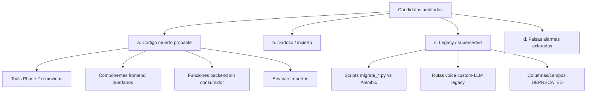
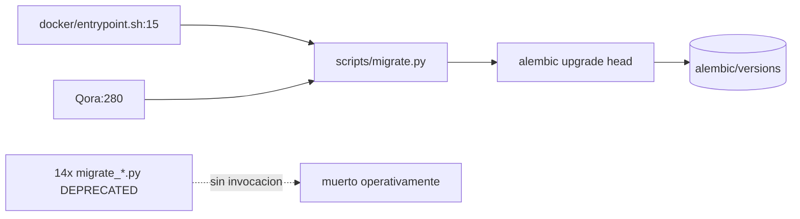

# 15 — Código muerto y código dudoso

> Auditoría de solo lectura. Este documento NO modifica producto: clasifica candidatos a código muerto / dudoso / legacy y deja constancia de cada verificación. Cada hallazgo lleva ruta + símbolo, evidencia, método de verificación, confianza y etiqueta de clasificación.

## Metodología

Para cada candidato surgido de las auditorías por área se realizó una verificación independiente con `rg` sobre todo el repositorio (`backend/`, `frontend/`, `docker/`, `Qora`, `docs/`), distinguiendo referencias **productivas** (importadas/llamadas desde código de aplicación) de referencias **no productivas** (tests, docstrings, comentarios, `.env.example`, documentación).

Criterio de clasificación, deliberadamente **conservador** (marcar código vivo como muerto es peor error que omitir un candidato):

- **[MUERTO]** — sin ninguna referencia productiva; solo lo tocan tests, su propia definición, docstrings o documentación.
- **[DUDOSO]** — referenciado pero su utilidad real es incierta, o tiene consumidor parcial (p. ej. backend sin frontend), o columna/campo que siempre recibe el mismo valor inerte.
- **[LEGACY]** — código antiguo superado por un mecanismo nuevo que coexiste, marcado deprecado pero todavía cableado/activo.
- **[FALSA ALARMA]** — el candidato resultó vivo; se explica por qué.

Las etiquetas de evidencia siguen la convención del encargo: `[Confirmado por codigo]` / `[Inferido razonablemente]` / `[Necesita validacion humana]`.

> Nota de herramienta: la salida de búsqueda enmascaró algunos identificadores; las verificaciones se confirmaron por conteo de referencias y por inspección directa de archivos. Donde el enmascaramiento impidió leer un símbolo literal, el hallazgo se marca como `[Necesita validacion humana]`.

---

## Mapa de hallazgos

---

## (a) Código muerto probable

### a.1 — Handlers de tools removidos en Phase 2 (`schedule_followup`, `mark_not_interested`)

- **Archivos/símbolos:** `backend/app/tools/schedule_followup.py` (`schedule_followup`, `TOOL_DEFINITION`), `backend/app/tools/mark_not_interested.py` (`mark_not_interested`).
- **Evidencia:** Ningún `import` de `app.tools.schedule_followup` ni `app.tools.mark_not_interested` en `backend/app`. `backend/app/tools/registry.py:71` los lista en el set de removidos (`{"register_interest","mark_not_interested","schedule_followup"}`); `backend/app/tools/dispatcher.py:115` documenta que las llamadas a esos nombres devuelven `tool_removed`.
- **Verificación:** `rg "schedule_followup"` / `rg "mark_not_interested"` en `backend/app`: las únicas apariciones son (1) la propia definición del módulo, (2) strings dentro de prompts (`backend/app/prompts/insurance_agent.py`, `backend/app/tenants/service.py` defaults de `tools_enabled`), (3) comentarios de `registry.py`/`dispatcher.py`/`schemas.py`. Ningún path de ejecución importa los handlers.
- **Matiz importante `[Necesita validacion humana]`:** los nombres aún aparecen en defaults de `tools_enabled` (`backend/app/tenants/models.py:59,140`, `backend/app/tenants/service.py`) y en prompts de agente. Eso significa que un agente podría seguir intentando invocarlos; el dispatcher los rechaza con `tool_removed`. Los **handlers** están muertos, pero las **referencias en configuración/prompt** siguen vivas y desincronizadas.
- **Confianza:** alta. **[MUERTO]** (handler) · `[Confirmado por codigo]`.

### a.2 — `ClientsPanel` (panel de admin huérfano)

- **Archivo/símbolo:** `frontend/src/features/admin/clients-panel.tsx` (componente exportado).
- **Evidencia/verificación:** `rg` del símbolo: solo lo referencian su propia definición y `clients-panel.test.tsx`. No hay ruta ni `AdminPage` que lo importe; fue reemplazado por la sección admin actual.
- **Confianza:** alta. **[MUERTO]** · `[Confirmado por codigo]`.

### a.3 — `AnalysisPanel` (presentacional superseded)

- **Archivo/símbolo:** `frontend/src/features/leads/analysis-panel.tsx`.
- **Evidencia/verificación:** solo aparece en su definición y en `analysis-panel.test.tsx`. Sin imports productivos. Superado por `call-analysis-panel.tsx`.
- **Confianza:** alta. **[MUERTO]** · `[Confirmado por codigo]`.

### a.4 — Contenedor `AgentsPanel` (el helper sí vive)

- **Archivo/símbolo:** `frontend/src/features/admin/agents-panel.tsx`, componente contenedor.
- **Evidencia/verificación:** el **contenedor** solo lo importa su test. PERO el helper `computeReadinessChecklist` (mismo archivo) SÍ es consumido por `frontend/src/features/admin/agents-section.tsx` (`import { computeReadinessChecklist } from './agents-panel'` y uso `computeReadinessChecklist(editingAgent).map(...)`). `agents-section.tsx` documenta "Replaces the old AgentsPanel which had a client selector dropdown".
- **Conclusión:** contenedor **[MUERTO]**; el archivo NO puede borrarse sin extraer antes el helper vivo.
- **Confianza:** alta. `[Confirmado por codigo]`.

### a.5 — `createLead` (capa API sin UI)

- **Archivo/símbolo:** `frontend/src/api/leads.ts` `createLead` (L33).
- **Evidencia/verificación:** consumidores: solo `leads.test.ts` y el mock en `hooks.test.tsx`. No existe hook (`useCreateLead`) ni pantalla que lo invoque. No hay forma de crear leads desde la interfaz; la creación ocurre por importación CRM/seed backend.
- **Confianza:** alta. **[MUERTO]** (en frontend) · `[Confirmado por codigo]`.

### a.6 — Hook `useUpdateIntegration` sin consumidor

- **Archivo/símbolo:** `frontend/src/api/hooks.ts` (`useUpdateIntegration`, ~L411).
- **Evidencia/verificación:** solo lo referencia `frontend/src/api/integrations.test.ts`. La edición de integraciones en la UI usa `useSaveIntegrationMappings`.
- **Confianza:** media-alta. **[MUERTO]** · `[Confirmado por codigo]`.

### a.7 — `get_authorized_session` (dependencia FastAPI nunca cableada)

- **Archivo/símbolo:** `backend/app/core/auth.py:334`.
- **Evidencia/verificación:** `rg "get_authorized_session"` en `backend/app`: única aparición productiva es su definición (`auth.py:334`) y su docstring (`auth.py:11,251`). Ningún router la usa como `Depends(...)`. Los tests (`backend/tests/test_session_auth.py`) la ejercitan directamente. El hot path custom-LLM lee `conv_state.auth` directo del store, no via esta dependencia.
- **Confianza:** alta. **[MUERTO]** (la dependencia; la función es invocable pero nunca se inyecta) · `[Confirmado por codigo]`.

### a.8 — `get_elevenlabs_service` (dependencia declarada, instanciación directa)

- **Archivo/símbolo:** `backend/app/elevenlabs/service.py:210` (`get_elevenlabs_service`).
- **Evidencia/verificación:** sus únicas apariciones son la definición y un docstring (`service.py:35`). `backend/app/agents/router.py:311` instancia `ElevenLabsService` directamente en vez de inyectar la dependencia. No hay `Depends(get_elevenlabs_service)` en ningún router.
- **Confianza:** alta. **[MUERTO]** · `[Confirmado por codigo]`.

### a.9 — Funciones analytics BI sin endpoint

- **Archivos/símbolos:** `backend/app/analytics/service.py` — `get_primary_objection_breakdown`, `get_primary_pain_breakdown`, `get_service_issues_count_total` (~L429-602).
- **Evidencia/verificación:** `rg` de los tres nombres: aparecen solo en `analytics/service.py` (definición) y en `backend/tests/unit/test_analytics_indexed_columns.py`. El router `backend/app/analytics/router.py` expone únicamente `/overview`, `/service-issues`, `/interests`, `/agent-stats`; ninguna ruta importa ni llama a estas tres funciones.
- **Confianza:** alta. **[MUERTO]** (sin exposición HTTP; lógica probada pero inalcanzable en producción) · `[Confirmado por codigo]`.

### a.10 — `analytics/crm_parity.py` (módulo sin consumidores)

- **Archivos/símbolos:** `backend/app/analytics/crm_parity.py` — `SyncState`, `resolve_sync_state`, `resolve_latest_correction`.
- **Evidencia/verificación:** `rg` de esos símbolos en `backend/app` excluyendo el propio archivo: **cero** resultados. Sin imports productivos. Según la auditoría 09, `resolve_sync_state` devuelve `UNKNOWN` siempre.
- **Confianza:** alta. **[MUERTO]** · `[Confirmado por codigo]`.

### a.11 — `CRMPort.health_check`

- **Archivo/símbolo:** `backend/app/integrations/crm_port.py:48` (`health_check`).
- **Evidencia/verificación:** única aparición de `health_check` en `backend/app` es la definición del método y su propio docstring, que dice literalmente "included for diagnostics (optional — not used in call path)". Ningún caller.
- **Confianza:** alta. **[MUERTO]** · `[Confirmado por codigo]`.

### a.12 — `jobs/queries.py` (`get_failed_jobs` / `get_pending_jobs`)

- **Archivo/símbolo:** `backend/app/jobs/queries.py`.
- **Evidencia/verificación:** `rg "get_failed_jobs|get_pending_jobs"` en `backend/`: el único caller es `backend/tests/jobs/test_crm_sync_pipeline.py`. Sin consumidor de producción (helpers de operador no cableados a ningún endpoint ni CLI).
- **Confianza:** alta. **[MUERTO]** (en producción; vivo solo como utilidad de test) · `[Confirmado por codigo]`.

### a.13 — Estado `expired` de `ScheduledCall` nunca asignado

- **Archivo/símbolo:** `backend/app/scheduler/models.py` (`VALID_TRANSITIONS`, ~L31).
- **Evidencia/verificación:** `rg "expired"` en `backend/app/scheduler`: aparece solo dentro de `VALID_TRANSITIONS` (como estado terminal con lista vacía) y en comentarios. Ningún código asigna `status = "expired"`. Estado declarado pero inalcanzable.
- **Confianza:** alta. **[MUERTO]** (rama de estado inerte) · `[Confirmado por codigo]`.

### a.14 — Variables de entorno muertas: `N8N_*`, `TWILIO_*`, `BROKER_NAME`

- **Símbolos:** `N8N_ENABLED`, `N8N_WEBHOOK_URL`, `N8N_WEBHOOK_SECRET`, `N8N_INTERNAL_API_KEY`, `N8N_TIMEOUT_SECONDS`, `TWILIO_ACCOUNT_SID`, `TWILIO_AUTH_TOKEN`, `TWILIO_PHONE_NUMBER`, `BROKER_NAME`.
- **Evidencia/verificación:** `rg` de cada nombre en `backend/app`: **cero** resultados productivos. Están declaradas explícitamente como muertas/reservadas en `backend/scripts/check-secrets.py:73-83` (`DEAD_VARS`) y aparecen solo en `.env.example`. Las `N8N_*` no están cableadas; las `TWILIO_*` están reservadas para "Phase C" (telefonía no activa); `BROKER_NAME` fue reemplazada por config per-cliente en `crm.yaml`.
- **Confianza:** alta. **[MUERTO]** (N8N, BROKER_NAME) / reservado no-activo (TWILIO) · `[Confirmado por codigo]`.

> Nota de secretos: solo se documentan NOMBRES de variables y su propósito inferido. No se leyó ni copió ningún valor.

---

## (b) Código dudoso / incierto

### b.1 — Endpoint `POST /agents/{id}/sync-elevenlabs` sin consumidor frontend

- **Backend:** `backend/app/agents/router.py:283` (`@router.post("/{agent_id}/sync-elevenlabs")`).
- **Verificación:** `rg "sync-elevenlabs"` en `frontend/src`: **cero** resultados. Endpoint vivo en backend, sin botón/llamada en la UI.
- **Clasificación:** **[DUDOSO]** — feature backend sin consumidor de UI (posible uso manual/ops). Confianza alta. `[Confirmado por codigo]`.

### b.2 — Endpoints leads `PATCH /{id}/status` y `GET /{id}/history` sin frontend

- **Backend:** `backend/app/leads/router.py:391` (status), `:427` (history).
- **Verificación:** sin match en `frontend/src`. Backend vivo, UI no los consume.
- **Clasificación:** **[DUDOSO]** (backend sin consumidor). Confianza alta. `[Confirmado por codigo]`.

### b.3 — Endpoint `POST /clients/{id}/crm/import` sin frontend

- **Backend:** `backend/app/integrations/crm_router.py` (`trigger_crm_import`).
- **Verificación:** `rg "crm/import|crm_import"` en `frontend/src`: cero. La pantalla Import CSV es placeholder (ver b.6).
- **Clasificación:** **[DUDOSO]** — endpoint funcional invocable por ops/cron, sin disparador de UI. Confianza alta. `[Confirmado por codigo]`.

### b.4 — Router scheduler completo (CRUD + aliases) sin UI

- **Backend:** `backend/app/scheduler/router.py:65-384` (queue + aliases `scheduled-calls`, incl. `/complete`).
- **Verificación:** `rg "scheduler|scheduled-calls"` en `frontend/src`: sin consumidor. El modelo `ScheduledCall` SÍ se usa productivamente, pero por la vía interna (`scheduler_tick` loop de 60s + `auto_schedule` rules engine en `backend/app/scheduler/service.py`), no por la API REST.
- **Clasificación:** **[DUDOSO]** — la API REST del scheduler no tiene consumidor; el dominio scheduler vivo opera por background loop. Confianza media-alta. `[Confirmado por codigo]`.

### b.5 — `GET /api/v1/voice/signed-url` sin consumidor

- **Backend:** `backend/app/voice/webhook.py:76-110` (`get_signed_url`).
- **Verificación:** `rg "signed-url|signed_url"` en `frontend/`: cero. La demo estática (`index.html`) abre WebSocket directo, sin pasar por este endpoint.
- **Clasificación:** **[DUDOSO]** — endpoint sin consumidor observado (posible integración externa/ElevenLabs). Confianza media. `[Confirmado por codigo]`.

### b.6 — Pantalla Import CSV placeholder "Coming Soon"

- **Frontend:** `frontend/src/features/import/page.tsx` (`ImportPage`).
- **Verificación:** la pantalla es placeholder sin lógica de importación. El endpoint backend (b.3) existe pero la UI no lo cablea.
- **Clasificación:** **[DUDOSO]** — UI incompleta (intención visible, sin implementación). Confianza alta. `[Confirmado por codigo]`.

### b.7 — Wrapper `CallAnalysisPanel` no usado por `CallDetailPage`

- **Frontend:** `frontend/src/features/calls/call-analysis-panel.tsx` (wrapper "backward-compatible").
- **Verificación:** `call-detail-page.tsx:15` importa `AnalysisSectionCards` (mismo archivo) y la renderiza en L127, NO el wrapper de compatibilidad. El export con nombre del componente principal/wrapper solo lo usa el test.
- **Clasificación:** **[DUDOSO]** — wrapper de compat sin consumidor productivo, aunque su componente interno `AnalysisSectionCards` sí se usa. No borrable sin separar. Confianza media-alta. `[Confirmado por codigo]`.

### b.8 — `GET /api/v1/tenants/{client_id}` (alias compat read-only)

- **Backend:** `backend/app/tenants/router.py:24-52`.
- **Verificación:** `rg "tenants/"` en `frontend/src`: cero. Alias de compatibilidad sin consumidor (solo docs/tests).
- **Clasificación:** **[DUDOSO]** (alias compat sin uso). Confianza media. `[Confirmado por codigo]`.

### b.9 — `OpenAIStreamingClient.stream_completion` marcado deprecado

- **Backend:** `backend/app/ai/llm_streaming.py:187`.
- **Verificación:** única aparición de `stream_completion` en `backend/app` es la definición del método.
- **Clasificación:** **[DUDOSO]/[MUERTO]** — método deprecado sin caller productivo visible. Confianza media (puede invocarse dinámicamente/tests). `[Inferido razonablemente]`.

### b.10 — `memory.py`: `_format_confirmed_facts` / `_format_misc_notes` / `_format_accumulated_profile` / `_coerce_extracted_facts`

- **Backend:** `backend/app/memory.py:211,430,525,399`.
- **Verificación:** `build_memory_context` setea `confirmed_facts=''` (memory.py:147 según auditoría 03). La referencia cruzada de estos símbolos fuera de `memory.py` solo halla un comentario en `voice/initiation.py:171` ("Replaces inline _format_call_history / _format_confirmed_facts"). No se confirma invocación productiva por el path actual; son ejercitadas por tests.
- **Clasificación:** **[DUDOSO]** — posiblemente muertas, pero `memory.py` es un módulo con llamadas internas; requiere lectura fina del grafo de llamadas dentro del archivo. Confianza media. `[Necesita validacion humana]`.

### b.11 — `is_demo` sin diferencia de scopes

- **Backend:** `backend/app/core/auth.py:235-246`.
- **Verificación:** `create_authorized_session` asigna `scopes=_PIPELINE_SCOPES` (auth.py:245) **idéntico** para demo y producción; el comentario L245 dice "same for demo and production". El flag `is_demo` se propaga (L203,218,246) pero no produce diferencia de autorización efectiva.
- **Clasificación:** **[DUDOSO]** — flag con efecto nulo sobre scopes (la restricción documentada en docstring no se materializa en código). Confianza media. `[Confirmado por codigo]`.

### b.12 — Scopes `admin:write` / `admin:read` declarados pero nunca asignados

- **Backend:** `backend/app/core/auth.py:170-171,190-191`.
- **Verificación:** `_PIPELINE_SCOPES = frozenset({"pipeline:write","pipeline:read"})` (auth.py:171). Los strings `admin:write`/`admin:read` aparecen solo en docstrings (L190-193) que dicen "intentionally NOT listed here"; `create_authorized_session` siempre usa `_PIPELINE_SCOPES`. Ninguna `AuthorizedSession` recibe scopes admin.
- **Clasificación:** **[DUDOSO]/[MUERTO]** — vocabulario de scopes documentado pero inerte (ningún checker los exige ni los emite). Confianza alta. `[Confirmado por codigo]`.

### b.13 — `DEFAULT_COMPANY_NAME` / `DEFAULT_AGENT_NAME` (Settings)

- **Backend:** `backend/app/core/config.py:110-111`.
- **Verificación:** `rg` de los nombres (y sus formas snake): solo la definición en `config.py`. Sin uso fuera del módulo de config. Defaults residuales ("Quintana Seguros" / "Jaumpablo").
- **Clasificación:** **[DUDOSO]** — campos de Settings sin lector; posible default residual. Confianza media. `[Confirmado por codigo]`.

### b.14 — `call_analyses.buying_signals` siempre `'[]'`

- **Backend:** `backend/app/summarizer.py:1507` (`ca.buying_signals = _to_json_list([])`).
- **Verificación:** el summarizer siempre escribe lista vacía; comentario indica que `buying_signals` "no longer in InterestsAxis". Columna persistida pero inerte.
- **Clasificación:** **[DUDOSO]** — columna viva en esquema pero sin datos reales (siempre `[]`). Confianza alta. `[Confirmado por codigo]`.

### b.15 — Módulos extraídos de `DIMENSION_MODULES` pero re-exportados

- **Backend:** `backend/app/analysis/universal/__init__.py` — `profile_facts`, `misc_notes`, `data_corrections`, `next_action`.
- **Verificación:** el `__init__` los importa con `# noqa: F401 — kept for direct access; not in DIMENSION_MODULES`. NO están en `DIMENSION_MODULES` (lista reducida 11→6 según comentarios L92-100), pero SÍ exportan pipelines productivos: `run_profile_facts_pipeline`, `run_misc_notes_pipeline`, `run_data_corrections_pipeline`, `run_next_action_pipeline` (usados por el summarizer). Los **módulos como dimensión paralela** ya no se ejecutan; sus **pipelines standalone** sí.
- **Clasificación:** **[DUDOSO]** — no es código muerto: re-exports vivos via pipelines. El comentario "kept for tests/acceso directo" es parcialmente correcto. Confianza media-alta. `[Confirmado por codigo]`.

---

## (c) Legacy / superseded (coexisten con su reemplazo)

### c.1 — ~14 scripts `backend/scripts/migrate_*.py` superados por Alembic

- **Archivos:** `backend/scripts/migrate_*.py` (14 con cabecera `DEPRECATED`, además de `migrate.py` que SÍ es el activo).
- **Verificación:** `rg -l "DEPRECATED" backend/scripts/migrate_*.py` → 14 archivos. El único `migrate_*` invocado productivamente es `backend/scripts/migrate.py`, llamado por `docker/entrypoint.sh:15` y `Qora:280` (que ejecuta `alembic upgrade head`). Ninguno de los 14 deprecados se invoca desde `backend/app`, `docker/` ni `Qora`; solo los referencian tests, `docs/MIGRATIONS.md` y un comentario en `calls/models.py`. Alembic vive en `backend/alembic/versions`.
- **Clasificación:** **[LEGACY]** — scripts one-off pre-Alembic, superados pero no borrados. Confianza alta. `[Confirmado por codigo]`.

### c.2 — Rutas legacy custom-LLM (`/voice/custom-llm`, `/voice/chat/completions`)

- **Backend:** `backend/app/voice/webhook.py:531-535` (rutas legacy) vs `:614` (`/{client_id}/custom-llm/chat/completions`, ruta path-based nueva).
- **Verificación:** las rutas legacy siguen **registradas y activas**; emiten `custom_llm_legacy_route_used` (webhook.py:597) con `migration_hint` apuntando a la ruta path-based. No solo loguean: procesan, pero advierten deprecación.
- **Clasificación:** **[LEGACY]** — activo con aviso de deprecación, reemplazo coexiste. Confianza alta (corrige el matiz "solo loguean deprecación": SÍ atienden). `[Confirmado por codigo]`.

### c.3 — Caminos legacy fire-and-forget vs handlers durables

- **Backend:** `backend/app/calls/service.py:726` (`_schedule_summarize`), `backend/app/summarizer.py:1199` (`_run_crm_sync_in_background`, lanzado por `asyncio.create_task` en `:1189`) vs `backend/app/jobs/handlers/` (`summarize.py`, `crm_sync.py`, `transcript_flush.py`).
- **Verificación:** ambos caminos viven, gobernados por el flag `ENABLE_JOB_EXECUTOR` (`config.py`, default `False`). En `calls/service.py` y `summarizer.py`, el patrón es `if settings.<flag>:` → ruta durable (enqueue job); else → ruta legacy fire-and-forget. El flag OFF por defecto significa que la **ruta legacy es la activa en producción** y la durable es opt-in.
- **Clasificación:** **[LEGACY]** (coexistencia gobernada por flag; uno sobrará a futuro). Confianza alta. `[Confirmado por codigo]`.

### c.4 — Executor durable inactivo por defecto (`ENABLE_JOB_EXECUTOR=false`)

- **Backend:** `backend/app/core/config.py` (`enable_job_executor: bool = False`), `backend/app/main.py:198-204` (arranque condicionado `if settings.<flag>:`, "flag-off is a no-op").
- **Verificación:** el executor durable (reintentos/recovery/backoff) solo arranca con el flag en `true`. Por defecto la plataforma corre la ruta legacy (c.3).
- **Clasificación:** **[LEGACY]/[DUDOSO]** — infraestructura nueva presente pero apagada por defecto. Confianza media-alta. `[Confirmado por codigo]`.

### c.5 — Variables dinámicas `broker_name` / `_broker_name_` DEPRECATED en initiation

- **Backend:** `backend/app/voice/initiation.py:249-261`.
- **Verificación:** siguen emitiéndose en el initiation client data, con comentario `DEPRECATED: use company_name instead` (L249) / `use _company_name_ instead` (L260). Es decir: deprecadas pero **todavía enviadas** por compatibilidad de prompts existentes.
- **Clasificación:** **[LEGACY]** (emisión activa de campos deprecados). Confianza alta. `[Confirmado por codigo]`.

### c.6 — `VoiceSessionContext.skills_content` siempre `None`

- **Backend:** `backend/app/voice/context.py:96-99`.
- **Verificación:** documentado "Legacy field — always None in registry mode. Kept for backward-compat"; `webhook.py` nota "skills_index replaces the old skills_content field". El campo persiste en la dataclass con valor siempre `None`.
- **Clasificación:** **[LEGACY]** (campo de compat inerte, reemplazado por `skills_index`). Confianza alta. `[Confirmado por codigo]`.

### c.7 — `app/analysis_schema.py` shim casi vacío

- **Backend:** `backend/app/analysis_schema.py`.
- **Verificación:** el módulo es un shim de re-export (`from app.analysis import *`) cuyo docstring lista símbolos eliminados. `rg "analysis_schema"` en `backend/app`: solo el propio archivo (ningún importador productivo dentro de `app`).
- **Clasificación:** **[LEGACY]/[MUERTO]** — shim de compatibilidad sin importadores observados en `app`. Posibles importadores externos/tests. Confianza media. `[Inferido razonablemente]`.

### c.8 — Columnas DEPRECATED en modelos

- **`call_sessions.extracted_facts`** (`backend/app/calls/models.py:67-68`): "DEPRECATED: use call_analyses table instead. Kept for backward compat reads." **[LEGACY]**.
- **`call_analyses.abandonment_reason`** (`backend/app/calls/models.py:161-163`; `summarizer.py:1553` `ca.abandonment_reason = None`): recibe siempre `NULL` para registros nuevos (qora-abandonment AD-4). **[LEGACY]/[DUDOSO]** (columna inerte para escritura).
- **Columnas de config de agente en `clients`** (`backend/app/tenants/models.py:210` y siguientes): "DEPRECATED(Phase 7) — agent-specific columns moved to Agent model." **[LEGACY]**.
- **Verificación:** confirmado por las cabeceras `DEPRECATED` en los modelos y por el seteo a `None`/`'[]'` en `summarizer.py`. Confianza alta. `[Confirmado por codigo]`.

### c.9 — Verificación de `backend/.env` en el launcher (B8 root-only)

- **Archivo:** `Qora:259` (`warn "backend/.env not found..."`).
- **Verificación:** el launcher aún advierte sobre `backend/.env` / `backend/.env.example`, lo que contradice la política B8 root-only (env consolidado en raíz). Es código legacy del launcher.
- **Clasificación:** **[LEGACY]** — chequeo residual contradictorio con la política actual. Confianza alta. `[Confirmado por codigo]`.

### c.10 — `sdd/` top-level duplica un cambio de `openspec/`

- **Archivos:** `sdd/post-call-analysis-bi-friendly/exploration.md` duplica `openspec/changes/post-call-analysis-bi-friendly/`. También existe `sdd/qora-profile-facts/`.
- **Verificación:** directorio top-level `sdd/` con artefactos de exploración que solapan con `openspec/changes/`. No es código de producto; es artefacto de planificación duplicado/huérfano.
- **Clasificación:** **[LEGACY]** (artefacto de docs/planificación duplicado, fuera del runtime). Confianza alta. `[Confirmado por codigo]`.

---

## (d) Falsas alarmas aclaradas

### d.1 — Helper `computeReadinessChecklist` NO está muerto

El candidato agrupaba `AgentsPanel` (muerto) con su helper. Verificado: `computeReadinessChecklist` es importado y usado por `frontend/src/features/admin/agents-section.tsx`. **Vivo.** Solo el contenedor `AgentsPanel` está muerto (ver a.4). `[Confirmado por codigo]`.

### d.2 — `AnalysisSectionCards` NO está muerto

El candidato marcaba el wrapper `CallAnalysisPanel` como dudoso. Verificado: `AnalysisSectionCards` (mismo archivo `call-analysis-panel.tsx`) SÍ es consumido por `call-detail-page.tsx:127`. Solo el wrapper de compatibilidad carece de consumidor (b.7). El archivo está **parcialmente vivo**. `[Confirmado por codigo]`.

### d.3 — Pipelines `run_*_pipeline` de `analysis/universal` NO están muertos

El candidato sugería que `profile_facts`/`misc_notes`/`data_corrections`/`next_action` estaban extraídos "para tests/acceso directo". Verificado: aunque los **módulos** salieron de `DIMENSION_MODULES`, sus **pipelines** (`run_profile_facts_pipeline`, etc.) son exportados y consumidos por el summarizer. La extracción es una **refactorización a pipelines stateful**, no eliminación. **Vivo** (ver b.15). `[Confirmado por codigo]`.

### d.4 — Dominio `scheduler` NO está muerto (solo su API REST)

El candidato marcaba "router scheduler sin UI". Verificado: el modelo `ScheduledCall` y la lógica (`auto_schedule` rules engine + `scheduler_tick` loop de 60s en `backend/app/scheduler/service.py`) están **vivos** vía background loop. Lo dudoso es exclusivamente la **API REST** del router (b.4), no el dominio. `[Confirmado por codigo]`.

### d.5 — Rutas custom-LLM legacy NO "solo loguean"

El candidato decía que `/voice/custom-llm` "solo loguea deprecación". Verificado: las rutas siguen **procesando** las requests; emiten un evento de deprecación con `migration_hint` pero NO son no-ops. Reclasificado a LEGACY activo (c.2). `[Confirmado por codigo]`.

### d.6 — `migrate.py` (sin sufijo) NO está muerto

Dentro del lote de "~16/17 scripts migrate_* legacy", `backend/scripts/migrate.py` es el **punto de entrada activo** de migraciones (invocado por `docker/entrypoint.sh:15` y `Qora:280`, ejecuta `alembic upgrade head`). Solo los 14 `migrate_<algo>.py` con cabecera DEPRECATED son legacy. El conteo real de scripts muertos es **14**, no 16/17. `[Confirmado por codigo]`.

---

## Tabla resumen

| # | Símbolo / archivo | Clasificación | Confianza | Evidencia |
|---|---|---|---|---|
| a.1 | `tools/schedule_followup.py`, `tools/mark_not_interested.py` (handlers) | MUERTO | alta | `[Confirmado]` |
| a.2 | `admin/clients-panel.tsx` | MUERTO | alta | `[Confirmado]` |
| a.3 | `leads/analysis-panel.tsx` | MUERTO | alta | `[Confirmado]` |
| a.4 | `admin/agents-panel.tsx` (contenedor) | MUERTO (helper vivo) | alta | `[Confirmado]` |
| a.5 | `api/leads.ts` `createLead` | MUERTO (frontend) | alta | `[Confirmado]` |
| a.6 | `api/hooks.ts` `useUpdateIntegration` | MUERTO | media-alta | `[Confirmado]` |
| a.7 | `core/auth.py:334` `get_authorized_session` | MUERTO (dep) | alta | `[Confirmado]` |
| a.8 | `elevenlabs/service.py:210` `get_elevenlabs_service` | MUERTO (dep) | alta | `[Confirmado]` |
| a.9 | `analytics/service.py` 3 funciones BI | MUERTO (sin endpoint) | alta | `[Confirmado]` |
| a.10 | `analytics/crm_parity.py` | MUERTO | alta | `[Confirmado]` |
| a.11 | `integrations/crm_port.py:48` `health_check` | MUERTO | alta | `[Confirmado]` |
| a.12 | `jobs/queries.py` | MUERTO (prod) | alta | `[Confirmado]` |
| a.13 | `scheduler/models.py` estado `expired` | MUERTO | alta | `[Confirmado]` |
| a.14 | env `N8N_*`, `TWILIO_*`, `BROKER_NAME` | MUERTO / reservado | alta | `[Confirmado]` |
| b.1 | `agents/router.py:283` sync-elevenlabs | DUDOSO | alta | `[Confirmado]` |
| b.2 | `leads/router.py:391,427` | DUDOSO | alta | `[Confirmado]` |
| b.3 | `integrations/crm_router.py` crm/import | DUDOSO | alta | `[Confirmado]` |
| b.4 | `scheduler/router.py:65-384` | DUDOSO (API) | media-alta | `[Confirmado]` |
| b.5 | `voice/webhook.py:76` signed-url | DUDOSO | media | `[Confirmado]` |
| b.6 | `import/page.tsx` placeholder | DUDOSO | alta | `[Confirmado]` |
| b.7 | `calls/call-analysis-panel.tsx` wrapper | DUDOSO | media-alta | `[Confirmado]` |
| b.8 | `tenants/router.py:24` alias | DUDOSO | media | `[Confirmado]` |
| b.9 | `ai/llm_streaming.py:187` stream_completion | DUDOSO | media | `[Inferido]` |
| b.10 | `memory.py` 4 funciones `_format_*` | DUDOSO | media | `[Necesita validacion]` |
| b.11 | `core/auth.py` `is_demo` sin efecto | DUDOSO | media | `[Confirmado]` |
| b.12 | `core/auth.py` scopes admin:* inertes | DUDOSO | alta | `[Confirmado]` |
| b.13 | `config.py:110-111` DEFAULT_* | DUDOSO | media | `[Confirmado]` |
| b.14 | `summarizer.py:1507` buying_signals | DUDOSO | alta | `[Confirmado]` |
| b.15 | `analysis/universal/__init__.py` re-exports | DUDOSO (vivo via pipeline) | media-alta | `[Confirmado]` |
| c.1 | 14x `scripts/migrate_*.py` | LEGACY | alta | `[Confirmado]` |
| c.2 | `voice/webhook.py:531` rutas legacy custom-LLM | LEGACY (activo) | alta | `[Confirmado]` |
| c.3 | `_schedule_summarize` / `_run_crm_sync_in_background` vs `jobs/handlers/` | LEGACY (flag) | alta | `[Confirmado]` |
| c.4 | `ENABLE_JOB_EXECUTOR=false` executor durable | LEGACY/DUDOSO | media-alta | `[Confirmado]` |
| c.5 | `voice/initiation.py:249-261` broker_name | LEGACY | alta | `[Confirmado]` |
| c.6 | `voice/context.py:96` skills_content | LEGACY | alta | `[Confirmado]` |
| c.7 | `analysis_schema.py` shim | LEGACY/MUERTO | media | `[Inferido]` |
| c.8 | columnas DEPRECATED (extracted_facts, abandonment_reason, clients agent cols) | LEGACY | alta | `[Confirmado]` |
| c.9 | `Qora:259` chequeo backend/.env | LEGACY | alta | `[Confirmado]` |
| c.10 | `sdd/` duplicado de openspec | LEGACY (artefacto) | alta | `[Confirmado]` |
| d.1 | `computeReadinessChecklist` | FALSA ALARMA (vivo) | alta | `[Confirmado]` |
| d.2 | `AnalysisSectionCards` | FALSA ALARMA (vivo) | alta | `[Confirmado]` |
| d.3 | pipelines `run_*_pipeline` | FALSA ALARMA (vivo) | alta | `[Confirmado]` |
| d.4 | dominio scheduler (loop) | FALSA ALARMA (vivo) | alta | `[Confirmado]` |
| d.5 | rutas custom-LLM "procesan" | FALSA ALARMA (no no-op) | alta | `[Confirmado]` |
| d.6 | `scripts/migrate.py` activo | FALSA ALARMA (vivo) | alta | `[Confirmado]` |

---

## Observaciones para validación humana

1. **`memory.py` `_format_*` (b.10):** confirmar el grafo de llamadas interno del módulo antes de concluir muerte; el enmascaramiento de identificadores impidió rastrear cada caller intra-archivo con certeza.
2. **Importadores externos de shims/deps (c.7, b.9):** `analysis_schema.py` y `stream_completion` no muestran importadores en `backend/app`, pero podrían usarse desde tests o integraciones externas no auditadas. Verificar antes de cualquier remoción.
3. **Desincronización configuración vs handlers (a.1):** los nombres `schedule_followup`/`mark_not_interested` siguen en defaults de `tools_enabled` y en prompts pese a que el dispatcher los rechaza. No es solo código muerto: es una inconsistencia de configuración que conviene revisar.
4. **Recordatorio:** este documento NO propone ni aplica borrados. Cualquier eliminación queda fuera del alcance de la auditoría.
