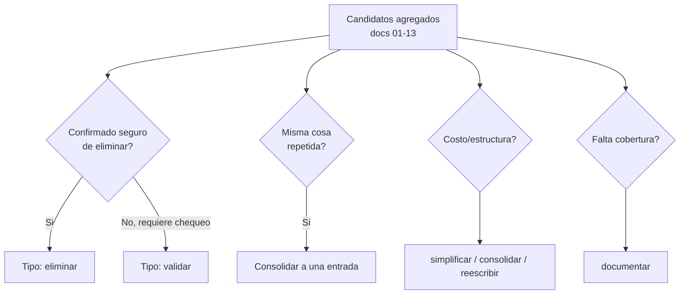

# 16 — Cosas a sacar / optimizar / reescribir

> **Naturaleza del documento.** Esto es un entregable de **auditoría de solo lectura**. Cada entrada es una **recomendación**, no un cambio aplicado. Nada aquí fue modificado en el producto. El criterio rector es conservador: todo lo que no se pudo confirmar como seguro de eliminar queda como **`validar`** con su paso de validación explícito, en lugar de recomendarse para borrado directo.
>
> **Fuentes.** Consolidación y de-duplicación de los candidatos reportados por los documentos 01–13 de esta auditoría. Las afirmaciones de mayor prioridad se re-verificaron contra el código actual (ver tags de evidencia).
>
> **Tags de evidencia:** `[Confirmado por codigo]` / `[Inferido razonablemente]` / `[Necesita validacion humana]`.

---

## Resumen ejecutivo

| Prioridad | Cantidad | Foco principal |
|-----------|----------|----------------|
| **Alta** | 3 | Integridad de datos (FKs SQLite), drift de metadata Alembic, superficie de costo abusable (webhook sin auth) |
| **Media** | 16 | Costo/latencia de LLM, código muerto frontend/backend, observabilidad, deuda de configuración y docs |
| **Baja** | 12 | Limpieza, consolidación de superficie duplicada, simplificación estructural, docs desactualizados |

**Lectura rápida de los 3 ítems de prioridad Alta:**

1. **`foreign_keys=ON` no está activado** en SQLite → las FKs declaradas en el ORM no se aplican a nivel de motor. Riesgo de integridad referencial silenciosa.
2. **`alembic/env.py` no importa `app.jobs.models`** → la tabla `background_jobs` queda fuera de `target_metadata`; cualquier `--autogenerate` produciría un diff erróneo (querría dropear la tabla).
3. **El webhook custom-LLM no exige auth por defecto** (`qora_webhook_auth_enabled=False`) → endpoint que dispara GPT-4o expuesto sin barrera, vector de abuso de costo.



---

## Prioridad ALTA

### A1 — Activar `PRAGMA foreign_keys=ON` por conexión SQLite

- **Tipo:** validar (cambio de comportamiento del motor; debe verificarse que los datos actuales no violen FKs antes de activarlo).
- **Evidencia:** `backend/app/core/database.py:84-87` — en `init_db()` se ejecutan `PRAGMA journal_mode=WAL` y `PRAGMA busy_timeout=5000`, pero **no** `PRAGMA foreign_keys=ON`. SQLite no aplica FKs salvo que se active explícitamente **por cada conexión**. `[Confirmado por codigo]`
- **Impacto esperado:** integridad referencial real (borrados/updates huérfanos bloqueados a nivel motor en lugar de depender del código de aplicación).
- **Riesgo de tocarlo:** **medio-alto.** Si la base actual ya contiene filas que violan alguna FK, activar el pragma puede hacer fallar operaciones que hoy pasan. Además, en SQLite el pragma debe setearse por conexión (event listener `connect`), no una sola vez al arranque.
- **Recomendacion concreta:** auditar primero la DB por violaciones existentes (`PRAGMA foreign_key_check`), corregir datos huérfanos si los hay, y luego activar el pragma vía listener de conexión del engine. No activarlo a ciegas.
- **Validacion necesaria antes de actuar:** correr `PRAGMA foreign_key_check` sobre una copia de la DB de producción; confirmar 0 violaciones; correr el suite de tests con el pragma activo.

### A2 — Importar `app.jobs.models` en `alembic/env.py`

- **Tipo:** documentar/validar (alinear `target_metadata`; bajo riesgo pero requiere confirmar que no se genere un diff destructivo).
- **Evidencia:** `backend/alembic/env.py:35-38` importa `app.tenants.models`, `app.leads.models`, `app.calls.models` y `app.scheduler.models`, pero **no** `app.jobs.models`. En contraste, `backend/app/core/database.py:80` sí importa `app.jobs.models` en runtime (`init_db`) para registrar `BackgroundJob` en `Base.metadata`. `[Confirmado por codigo]`
- **Impacto esperado:** que `target_metadata` de Alembic refleje el esquema real en runtime; habilita `--autogenerate` seguro y evita que una autogeneración quiera dropear `background_jobs`.
- **Riesgo de tocarlo:** **bajo.** Es agregar una línea de import. El riesgo es nulo si solo se importa; el riesgo real está en cualquier autogenerate posterior.
- **Recomendacion concreta:** agregar `import app.jobs.models` al bloque de imports de `env.py`, igual que los otros modelos, con su comentario `# noqa`.
- **Validacion necesaria antes de actuar:** tras el import, correr `alembic check`/`--autogenerate --sql` en seco y confirmar que el diff esperado es vacío (la tabla ya existe vía migración baseline) y no propone drops.

### A3 — Exigir autenticación en el webhook custom-LLM (anti-abuso de costo GPT-4o)

- **Tipo:** validar (decisión de seguridad con impacto operativo; requiere coordinar el secret con la config del agente ElevenLabs antes de activarlo).
- **Evidencia:** `backend/app/core/config.py:134-135` — `qora_webhook_auth_enabled: bool = False` por defecto, "no webhook auth yet". El endpoint custom-LLM dispara GPT-4o por turno. Refuerzo cruzado: `backend/app/core/auth.py:309-329` (el secret previsto es un header estático compartido, no una firma HMAC del payload). `[Confirmado por codigo]`
- **Impacto esperado:** cerrar un endpoint que invoca GPT-4o sin barrera, eliminando un vector directo de abuso de costo y de inyección de tráfico.
- **Riesgo de tocarlo:** **medio.** Activar auth sin coordinar el secret en la configuración del agente ElevenLabs rompe las llamadas en vivo. Es un cambio que debe sincronizarse con el proveedor.
- **Recomendacion concreta:** (1) corto plazo: activar `qora_webhook_auth_enabled=True` con `qora_webhook_secret` configurado en ambos lados; (2) mediano plazo: migrar de header estático a verificación de **firma HMAC del body** (esquema nativo ElevenLabs) — ver M14.
- **Validacion necesaria antes de actuar:** confirmar dónde se configura el header/secret en el agente ElevenLabs; probar en staging que una llamada real con secret pasa y una sin secret es rechazada (401), antes de tocar producción.

> **Nota de revisión temporal (2026-06-26):** El hecho de código se mantiene tal cual: el default es `qora_webhook_auth_enabled=False`. Lo que se ajusta es el *framing* con contexto temporal. La **capacidad de cierre ya existe y fue construida deliberadamente**: PR #107/#109/#111 (2026-06-22/23) entregaron auth de API admin (B5), secret opt-in del webhook (B6) y `QORA_ALLOWED_ORIGINS` configurable (B7) — ver doc 20 §1 y §6. El valor abierto es un **default de desarrollo**, y el producto **aún no está desplegado** (B2 "deploy a VPS/cloud" es deliberadamente lo último, "after security hardening", `[ ]` en `docs/ROADMAP.md`). El hallazgo se conserva; el riesgo correcto es **postura pre-deploy con un flip obligatorio antes de B2** (activar `qora_webhook_auth_enabled=True`), no un endpoint productivo desprotegido hoy.

---

## Prioridad MEDIA

### M1 — Reducir/batchear el fan-out de análisis post-llamada (costo + latencia)

- **Tipo:** simplificar.
- **Evidencia:** `backend/app/summarizer.py:587-647` — `asyncio.gather` de ~6 dimensiones + 4 pipelines + `next_action`, es decir **≈10+ llamadas a gpt-4o-mini por llamada** procesada. `[Confirmado por codigo]` (vía docs 03 y 09)
- **Impacto esperado:** menor costo por llamada y menor latencia de cierre del análisis; menos superficie de fallo parcial.
- **Riesgo de tocarlo:** **medio.** Consolidar prompts puede degradar la calidad/granularidad del análisis por dimensión; cada dimensión hoy tiene su prompt afinado.
- **Recomendacion concreta:** evaluar consolidar dimensiones afines en un solo prompt multi-output, o batchear; medir costo/calidad antes y después. No es un borrado, es una optimización medible.
- **Validacion necesaria antes de actuar:** benchmark de costo (tokens) y comparación de calidad de salida dimensión-por-dimensión sobre un set fijo de transcripts.

### M2 — Doble llamada a GPT-4o por cada tool-call en el webhook (latencia por turno)

- **Tipo:** simplificar.
- **Evidencia:** `backend/app/voice/webhook.py` — `_stream_llm_response` hace filler + re-llamada (`follow_up`) por cada tool-call, duplicando la invocación a GPT-4o en el turno. `[Inferido razonablemente]` (reportado por doc 09; patrón filler+re-call)
- **Impacto esperado:** menor latencia perceptible por turno y menor costo en turnos con herramientas.
- **Riesgo de tocarlo:** **medio.** El filler existe para cubrir la latencia de la tool; quitarlo sin alternativa degrada UX de voz.
- **Recomendacion concreta:** evaluar streaming de la respuesta de la tool sin segunda llamada completa, o filler local sin invocar el modelo. Medir.
- **Validacion necesaria antes de actuar:** confirmar el flujo exacto en `_stream_llm_response` y medir latencia turn-to-turn con/sin el patrón actual.

### M3 — Cachear `CRMConfigLoader.load(client_id)` (lee `crm.yaml` del FS por turno)

- **Tipo:** simplificar.
- **Evidencia:** `backend/app/voice/webhook.py:850-855` y `:1039-1042` — `CRMConfigLoader.load(client_id)` lee `crm.yaml` del filesystem en el fast path **y** en el per-turn path del custom-LLM, es decir en cada turno. `[Confirmado por codigo]` (vía doc 06)
- **Impacto esperado:** elimina I/O de disco repetido en el hot path de voz; menor latencia por turno.
- **Riesgo de tocarlo:** **bajo-medio.** Un caché requiere estrategia de invalidación si `crm.yaml` cambia en caliente (poco frecuente, pero existe).
- **Recomendacion concreta:** cachear por `client_id` en memoria con invalidación por mtime del archivo o TTL corto.
- **Validacion necesaria antes de actuar:** confirmar con qué frecuencia cambia `crm.yaml` en operación; decidir TTL vs. mtime.

### M4 — Refactor de `_process_custom_llm_request` (función monolítica ~530 líneas)

- **Tipo:** reescribir.
- **Evidencia:** `backend/app/voice/webhook.py:732-1264` — función monolítica con 3 caminos de contexto entrelazados (fast path / per-turn lazy / new-session/render fallback). El per-turn fallback (`:861-1062`) duplica `build_voice_context`. `[Confirmado por codigo]` (consolida docs 02, 03, 06)
- **Impacto esperado:** mantenibilidad; reducir la probabilidad de bugs por los caminos entrelazados; potencial reducción de queries redundantes en el fallback.
- **Riesgo de tocarlo:** **alto.** Es el hot path de voz en producción. Un refactor mal hecho rompe llamadas en vivo.
- **Recomendacion concreta:** extraer los 3 caminos a funciones nombradas con contrato claro, sin cambiar comportamiento (refactor puro), respaldado por tests de caracterización. NO mezclar con optimización en el mismo cambio.
- **Validacion necesaria antes de actuar:** suite de tests de caracterización que fije el comportamiento actual de los 3 caminos antes de tocar nada.

### M5 — Eliminar código muerto del frontend (ClientsPanel, AnalysisPanel, componente AgentsPanel)

- **Tipo:** eliminar.
- **Evidencia:**
  - `frontend/src/features/admin/clients-panel.tsx` (+ `clients-panel.test.tsx`) — no renderizado en el router; reemplazado por `features/admin/page.tsx`. Solo lo referencia su propio test. `[Confirmado por codigo]`
  - `frontend/src/features/leads/analysis-panel.tsx` (+ test) — `AnalysisPanel` exportado sin ningún import; superseded por `features/calls/call-analysis-panel.tsx`. `[Confirmado por codigo]`
  - Componente `AgentsPanel` en `features/admin/agents-panel.tsx:90` — muerto; **pero** el helper `computeReadinessChecklist` (`:60`) SÍ se usa desde `agents-section.tsx`. `[Confirmado por codigo]`
- **Impacto esperado:** menor bundle, menos superficie de mantenimiento y de confusión.
- **Riesgo de tocarlo:** **bajo**, con una salvedad: al borrar `agents-panel.tsx` hay que **preservar `computeReadinessChecklist`** (moverlo, no borrarlo).
- **Recomendacion concreta:** eliminar `ClientsPanel`, `AnalysisPanel` y sus tests; extraer `computeReadinessChecklist` a un módulo propio y eliminar el componente `AgentsPanel`.
- **Validacion necesaria antes de actuar:** `rg` final de cada símbolo en `frontend/src` (excluyendo su propio archivo/test) para confirmar 0 consumidores; correr el build del frontend.

### M6 — Eliminar handlers de tools legacy del backend (`schedule_followup`, `mark_not_interested`)

- **Tipo:** eliminar.
- **Evidencia:** `backend/app/tools/schedule_followup.py` y `backend/app/tools/mark_not_interested.py` — sin imports en `backend/app/` (Phase 2 los removió); `registry.py:70-72` los lista en `_REMOVED_TOOLS` y `dispatcher.py:171-179` devuelve `tool_removed`. Solo los referencian tests. Alinear con `AVAILABLE_TOOLS` del admin (`agents-section.tsx:45-50`). `[Confirmado por codigo]`
- **Impacto esperado:** limpieza de código muerto; coherencia entre el registry real y la lista expuesta en admin.
- **Riesgo de tocarlo:** **bajo.** Ya están desconectados del runtime.
- **Recomendacion concreta:** eliminar ambos archivos y sus tests; revisar que `AVAILABLE_TOOLS` en el admin no los liste.
- **Validacion necesaria antes de actuar:** `rg 'schedule_followup|mark_not_interested' backend/app` debe seguir vacío; confirmar que ningún cliente activo los tenga configurados.

### M7 — Endpoint de import CRM/Airtable sin consumidor + página `/import` placeholder

- **Tipo:** validar (decidir entre cablear la UI o eliminar; no borrar a ciegas un endpoint operacional).
- **Evidencia:** `backend/app/integrations/crm_router.py:64-93` (`trigger_crm_import`, `POST /clients/{id}/crm/import`) sin consumidor en `frontend/src`; `frontend/src/features/import/page.tsx:1-26` es un placeholder "Coming Soon". `[Confirmado por codigo]`
- **Impacto esperado:** cerrar una brecha feature (gap UI↔backend): o se expone el trigger, o se elimina superficie sin uso.
- **Riesgo de tocarlo:** **medio.** El endpoint puede ser de uso operacional/manual (curl/cron) aunque no tenga UI.
- **Recomendacion concreta:** decidir producto: (a) cablear `/import` al endpoint, o (b) eliminar la página placeholder y documentar el endpoint como operacional. No eliminar el endpoint sin confirmar que no se invoca fuera de la UI.
- **Validacion necesaria antes de actuar:** confirmar con el equipo si el import se dispara manualmente; revisar logs/uso del endpoint.

### M8 — Generar tipos del frontend por codegen desde el OpenAPI del backend

- **Tipo:** reescribir.
- **Evidencia:** `frontend/src/api/types.ts:5-6` — comentario que ya anticipa migrar a codegen; hoy los tipos se mantienen a mano. `[Confirmado por codigo]`
- **Impacto esperado:** robustez; elimina deriva manual entre contrato backend y tipos frontend.
- **Riesgo de tocarlo:** **bajo-medio.** Introduce un paso de build/codegen y puede requerir ajustar imports.
- **Recomendacion concreta:** introducir generación de tipos desde el OpenAPI del backend; reemplazar gradualmente los tipos manuales.
- **Validacion necesaria antes de actuar:** confirmar que el backend expone OpenAPI estable; elegir herramienta de codegen compatible con el stack.

> **Nota de revisión temporal (2026-06-26):** Esta deriva de tipos manuales ya está **registrada como known-issue P4** en `docs/ROADMAP.md` ("generated API types instead of manual TS sync"). No es un hallazgo novedoso de la auditoría: es deuda **ya rastreada y priorizada** por el equipo (ver doc 20, sección de known-issues).

### M9 — Falta reaper periódico para jobs `running`/`failed` atascados

- **Tipo:** validar (gap de resiliencia; diseñar el reaper antes de implementarlo).
- **Evidencia:** `backend/app/jobs/executor.py:386` — la única limpieza de jobs ocurre al arranque vía `recover()`; no hay barrido periódico de jobs colgados en `running`/`failed`. `[Confirmado por codigo]` (vía doc 10)
- **Impacto esperado:** evitar jobs atascados indefinidamente si el proceso vive mucho sin reiniciar.
- **Riesgo de tocarlo:** **medio.** Un reaper mal calibrado podría re-disparar jobs en curso legítimos.
- **Recomendacion concreta:** diseñar un barrido periódico con umbral de antigüedad (`updated_at`) que reencole o marque jobs colgados, idempotente.
- **Validacion necesaria antes de actuar:** definir el criterio de "atascado" (timeout por tipo de job); confirmar idempotencia de los handlers.

> **Nota de revisión temporal (2026-06-26):** Contexto temporal para M9 y M10: son **refinamientos sobre el ejecutor durable ya construido** en B10 (PR #119–#122, 2026-06-25), no la ausencia de durabilidad. El audit ya los clasifica correctamente como `validar` (rediseño, no borrado). Además, el ejecutor corre **apagado por flag** (`ENABLE_JOB_EXECUTOR=false`) hasta el deploy (B2); la urgencia operativa de M9/M10 es por tanto **post-activación**: conviene resolverlos antes de poner el ejecutor en `true`, no mientras está inactivo. Fuente: Engram #2139/#2142 (2026-06-25), doc 20 §1 y §6.

### M10 — Backoff de reintentos solo en memoria (no persistido como schedule)

- **Tipo:** validar (gap de durabilidad; rediseño del retry, no borrado).
- **Evidencia:** `backend/app/jobs/executor.py:370` — el backoff vive en un `asyncio.sleep` dentro del task; si el proceso muere durante el sleep, el reintento se pierde. `[Confirmado por codigo]` (vía doc 10)
- **Impacto esperado:** reintentos durables que sobreviven a reinicios del proceso.
- **Riesgo de tocarlo:** **medio.** Requiere persistir `next_attempt_at` y que el sweeper lo respete; cambia el modelo de durabilidad.
- **Recomendacion concreta:** persistir el schedule del próximo intento en la fila del job y que el sweeper lo recoja, en vez de dormir en memoria.
- **Validacion necesaria antes de actuar:** revisar el modelo `BackgroundJob` por un campo de "próximo intento"; coordinar con M9 (reaper).

### M11 — Agregar `request_id`/`correlation_id` vía middleware para trazabilidad end-to-end

- **Tipo:** documentar (instrumentación de observabilidad; agrega, no quita).
- **Evidencia:** `backend/app/core/logging.py:23`; `backend/app/main.py:69-106` — no hay middleware que inyecte un id de request correlacionado en los logs. `[Confirmado por codigo]` (vía doc 13)
- **Impacto esperado:** trazabilidad end-to-end de una llamada a través de logs (voz → análisis → jobs).
- **Riesgo de tocarlo:** **bajo.** Es aditivo (middleware + `bind_contextvars`).
- **Recomendacion concreta:** middleware que genere/propague `request_id` y lo bindee al logger contextual.
- **Validacion necesaria antes de actuar:** confirmar que el stack de logging (structlog) soporta `bind_contextvars` en el flujo async.

> **Nota de revisión temporal (2026-06-26):** La ausencia de `correlation_id`/middleware (M11) y de exception handler global (M12) no es un descuido: mapea a la fase de roadmap **B9 "Structured logging + error monitoring"**, marcada `[ ]` y registrada como la **PRÓXIMA** fase tras B10 (`docs/ROADMAP.md`; Engram #2142, 2026-06-25). El groundwork `backend/app/jobs/queries.py` (PR #121, 2026-06-25) ya se sentó con esa fase en mente (ver doc 20 §1). Es trabajo planificado y secuenciado, no observabilidad olvidada.

### M12 — Registrar exception handler global con forma de error canónica

- **Tipo:** documentar (aditivo; estandariza respuestas de error).
- **Evidencia:** `rg exception_handler` vacío en el backend → no hay `add_exception_handler` global. `[Confirmado por codigo]` (vía doc 13)
- **Impacto esperado:** respuestas de error consistentes y un único punto de logging de excepciones no manejadas.
- **Riesgo de tocarlo:** **bajo.** Aditivo, pero cambia la forma del payload de error para errores no controlados.
- **Recomendacion concreta:** registrar un handler global con un schema de error unificado.
- **Validacion necesaria antes de actuar:** confirmar que los consumidores (frontend) toleran la forma de error canónica.

### M13 — Migrar verificación del webhook a firma HMAC del body

- **Tipo:** reescribir (refuerza A3; esquema nativo ElevenLabs).
- **Evidencia:** `backend/app/core/auth.py:309-329` — el secret es un header estático compartido, no una firma HMAC del payload, más débil que la verificación de firma documentada por ElevenLabs. `[Confirmado por codigo]`
- **Impacto esperado:** seguridad: protege contra replay y manipulación del body, no solo posesión del secret.
- **Riesgo de tocarlo:** **medio.** Debe coordinarse con la configuración de firma del agente ElevenLabs.
- **Recomendacion concreta:** implementar verificación HMAC del body con el esquema nativo del proveedor; ejecutarlo junto con A3.
- **Validacion necesaria antes de actuar:** confirmar el algoritmo/headers de firma que envía ElevenLabs; probar en staging.

### M14 — Documentar `ENABLE_JOB_EXECUTOR` y limpiar referencias colgantes de deployment

- **Tipo:** documentar.
- **Evidencia:**
  - `backend/app/core/config.py:152` (`enable_job_executor: bool = False`) ausente de `.env.example`. `[Confirmado por codigo]`
  - `docker-compose.yml:14` instruye copiar `backend/.env.example` (archivo inexistente). `[Confirmado por codigo]`
  - `README.md:203` referencia `docker-compose.n8n-local.yml` (inexistente). `[Confirmado por codigo]`
  - `docs/ops/secrets-management.md:189` paso de rollback que pide restaurar `backend/.env.example` (inexistente). `[Confirmado por codigo]`
  - Launcher `Qora:258-259` verifica `backend/.env`/`backend/.env.example`, contradiciendo el esquema root-only (B8). `[Confirmado por codigo]`
- **Impacto esperado:** documentación de deployment coherente; menos confusión y warnings engañosos.
- **Riesgo de tocarlo:** **bajo** (cambios de docs/scripts dentro del producto — aquí solo se recomienda; el launcher `Qora` es código, requiere cuidado).
- **Recomendacion concreta:** documentar `ENABLE_JOB_EXECUTOR` en `.env.example` (sección feature flags) y en `running-locally.md`; corregir/eliminar las referencias colgantes a archivos inexistentes.
- **Validacion necesaria antes de actuar:** confirmar el esquema canónico de env (root-only) y que ningún flujo dependa de `backend/.env.example`.

> **Nota de revisión temporal (2026-06-26):** Dos precisiones de datación. (1) **`enable_job_executor=False` es un rollout gateado por diseño, no un defecto ni durabilidad ausente.** Los jobs durables se construyeron e integraron el **2026-06-25** (B10, PR #119–#122) y la activación está **planificada para después del deploy** ("set `ENABLE_JOB_EXECUTOR=true` in `.env` after merge and deploy", Engram #2139/#2142; ver doc 20 §1 y §6). La durabilidad está **implementada, pendiente de activación**; el riesgo real es recordar hacer el flip al/antes del deploy, no que esté "roto". Documentarla en `.env.example` sigue siendo correcto. (2) Sobre las referencias a `README.md`/roadmap colgantes: hay **capas temporales** — la prosa "Current State"/"No authentication" del roadmap es **stale** (escrita 2026-06-10, pre-B5; auth completada 2026-06-22/23), mientras la **tabla de fases es la fuente vigente**. Es layering de fechas, severidad menor que una contradicción (ver doc 20, Apéndice).

### M15 — Eliminar variables de entorno muertas y reservadas (N8N_*, TWILIO_*, BROKER_NAME)

- **Tipo:** validar (algunas son "reservadas a futuro", no estrictamente muertas).
- **Evidencia:** `backend/scripts/check-secrets.py:73-83` define `DEAD_VARS`: `N8N_*` (no cableadas), `TWILIO_*` (reservadas Phase C), `BROKER_NAME` (legacy, reemplazado por `crm.yaml` per-client). Comentadas en `.env.example:136-149`. `[Confirmado por codigo]`
- **Impacto esperado:** menos ruido en `.env.example`; menor confusión sobre qué está activo.
- **Riesgo de tocarlo:** **bajo**, salvo que TWILIO_* esté reservado deliberadamente para una fase planificada.
- **Recomendacion concreta:** mover las variables FUTURE/LEGACY a una sección/doc separada de "reservadas/no activas" en vez de mezclarlas con las activas. No eliminar TWILIO_* si hay roadmap confirmado.
- **Validacion necesaria antes de actuar:** confirmar con el equipo el estado de Phase C (Twilio) y de cualquier integración N8N.

> **Nota de revisión temporal (2026-06-26):** Las variables `TWILIO_*` están **reservadas deliberadamente para la Phase C del roadmap (Real Outbound Calls), todo `[ ]` no iniciado**, secuenciada "after B deployed" (`docs/ROADMAP.md`; ver doc 20 §6). El comentario de código "Twilio dialing is Phase 8" (origen #26, 2026-04-23) mapea a esa Phase C: es un gap **conocido y secuenciado por diseño**, no deuda olvidada. La recomendación de la entrada ya es la correcta (no eliminar `TWILIO_*` con roadmap confirmado); esta nota solo **confirma que el roadmap está confirmado** y data el estado. Las `N8N_*` sí son residuo del experimento n8n cerrado (descomisionado 2026-04-29, artefactos borrados #89; doc 20 §7.3).

### M16 — Reconciliar modelos ORM con el baseline de Alembic

- **Tipo:** validar (prerequisito para `--autogenerate` seguro; toca esquema).
- **Evidencia:** doc 07 sección 8 (D2-D6): `broker_name`, índices faltantes, tipos y FKs divergentes entre los modelos ORM y la migración baseline (`20241201_0001_baseline.py`). `[Necesita validacion humana]`
- **Impacto esperado:** habilitar autogenerate confiable; eliminar drift schema↔ORM.
- **Riesgo de tocarlo:** **alto.** Tocar el esquema/migraciones en una DB con datos es delicado.
- **Recomendacion concreta:** reconciliar metódicamente cada divergencia listada en doc 07 §8; tratar como tarea de migración planificada, no ad-hoc.
- **Validacion necesaria antes de actuar:** diff completo ORM vs. baseline; plan de migración revisado; backup de DB.

---

## Prioridad BAJA

### B1 — Eliminar la dependencia FastAPI muerta `get_authorized_session`

- **Tipo:** eliminar.
- **Evidencia:** `backend/app/core/auth.py:334-369` — definida como dependencia para el hot path custom-LLM, pero **nunca** cableada como `Depends`; las únicas referencias son su propia definición y docstrings (`:11`, `:251`). El webhook lee `conv_state.auth` directo del store. `[Confirmado por codigo]`
- **Impacto esperado:** limpieza de código muerto; menos confusión sobre el modelo de auth real.
- **Riesgo de tocarlo:** **bajo.** Sin consumidores.
- **Recomendacion concreta:** eliminar la función y sus referencias en docstrings.
- **Validacion necesaria antes de actuar:** `rg get_authorized_session` debe mostrar solo su definición; confirmar 0 `Depends`.

### B2 — Archivar/eliminar los 14 scripts `backend/scripts/migrate_*.py` legacy

- **Tipo:** validar (confirmar cobertura completa por Alembic antes de borrar histórico de migración).
- **Evidencia:** `backend/scripts/migrate_*.py` (14 archivos confirmados por `fd`) con cabecera `# DEPRECATED — superseded by Alembic migrations` y "Do NOT run against production"; superados por `20241201_0001_baseline.py`. `docker/entrypoint.sh:15` y `Qora:280` solo invocan `scripts/migrate.py` (no los `migrate_*`). `docs/MIGRATIONS.md:166-195`. `[Confirmado por codigo]`
- **Impacto esperado:** limpieza de ~14 scripts one-off sin uso productivo.
- **Riesgo de tocarlo:** **bajo-medio.** Pueden tener valor histórico/forense para entender la evolución del esquema.
- **Recomendacion concreta:** archivar (mover a un `legacy/` o documentar) en vez de borrar de raíz, tras confirmar que el baseline de Alembic cubre todo lo que aplicaban.
- **Validacion necesaria antes de actuar:** confirmar que toda producción ya está en el baseline de Alembic; revisar que ningún runbook los referencie.

> **Nota de revisión temporal (2026-06-26):** Los 14 scripts `migrate_*.py` **no son deuda de origen desconocido**: fueron **deprecados explícitamente el 2026-06-19** junto con la fundación Alembic (PR #103, commit `177819b` "docs(db): deprecate legacy scripts"; ver doc 20 §5). El baseline `20241201_0001_baseline.py` los supersede; se conservan solo por valor histórico/forense. Por lo tanto la recomendación no es "investigar deuda desconocida" sino: **confirmar la cobertura del baseline de Alembic y luego eliminar (o archivar) scripts ya deprecados**. El paso de validación de abajo sigue siendo el correcto; lo que cambia es el *framing*: superseción **ya decidida y fechada**, no una incógnita. El hecho de código del audit (cabecera `DEPRECATED`, 14 archivos) se conserva verbatim.

### B3 — Consolidar los almacenes de planning (`.sdd/`, `sdd/`, `openspec/`)

- **Tipo:** consolidar.
- **Evidencia:** `git ls-files`: `.sdd` 88, `openspec` 58, `sdd` 1. El `sdd/` top-level tiene un solo archivo residual (`sdd/post-call-analysis-bi-friendly/exploration.md`) que duplica un cambio de `openspec/`. `[Confirmado por codigo]`
- **Impacto esperado:** un único almacén de planning; menos confusión.
- **Riesgo de tocarlo:** **bajo.** Es metadata de planning, no producto.
- **Recomendacion concreta:** eliminar el `sdd/` residual (duplicado) y decidir un único backend de artefactos.
- **Validacion necesaria antes de actuar:** confirmar que el archivo de `sdd/` está efectivamente duplicado en `openspec/`.

### B4 — Eliminar rutas legacy del webhook custom-LLM

- **Tipo:** validar (deprecadas pero aún activas; confirmar que el agente ya migró a path-based).
- **Evidencia:** `backend/app/voice/webhook.py:531-606` — rutas `/voice/custom-llm`, `/voice/custom-llm/chat/completions`, `/voice/chat/completions` emiten warning `custom_llm_legacy_route_used`; reemplazadas por la path-based. `[Confirmado por codigo]`
- **Impacto esperado:** reducir superficie del endpoint más crítico.
- **Riesgo de tocarlo:** **medio.** Si algún agente en producción aún apunta a la ruta legacy, eliminarla rompe llamadas.
- **Recomendacion concreta:** monitorear el warning `custom_llm_legacy_route_used`; una vez con 0 hits durante un período, eliminar las rutas legacy.
- **Validacion necesaria antes de actuar:** confirmar en logs que ningún tráfico usa las rutas legacy; verificar la config de URL en todos los agentes ElevenLabs activos.

### B5 — Consolidar la superficie duplicada del scheduler

- **Tipo:** consolidar.
- **Evidencia:** `backend/app/scheduler/router.py:65-384` — aliases duplicados (`/scheduler/queue` vs `/clients/scheduled-calls`, incl. `/complete`) sin consumidor distinto. Además, toda la API REST del scheduler no tiene consumidor en `frontend/src` (`ScheduledCall` se usa vía `scheduler_tick` + `auto_schedule`). `[Confirmado por codigo]` (consolida docs 04, 06)
- **Impacto esperado:** una sola ruta canónica; menos superficie.
- **Riesgo de tocarlo:** **medio.** La ausencia de consumidor frontend no descarta uso operacional/externo.
- **Recomendacion concreta:** elegir un set canónico de rutas y deprecar los aliases; confirmar si la API REST se consume fuera del frontend antes de recortarla.
- **Validacion necesaria antes de actuar:** revisar logs de uso de cada alias; confirmar consumidores externos.

### B6 — Eliminar dependencia muerta `get_elevenlabs_service`

- **Tipo:** eliminar.
- **Evidencia:** `backend/app/elevenlabs/service.py:210-212` — dependencia declarada pero los routers instancian `ElevenLabsService` directo (p. ej. `agents/router.py:311`). `[Confirmado por codigo]`
- **Impacto esperado:** limpieza de código muerto.
- **Riesgo de tocarlo:** **bajo.** Sin `Depends` que la use.
- **Recomendacion concreta:** eliminar la función.
- **Validacion necesaria antes de actuar:** `rg get_elevenlabs_service` sin usos como `Depends`.

### B7 — Eliminar columnas y campos marcados DEPRECATED (siempre vacíos)

- **Tipo:** validar (columnas inertes; borrar columnas en SQLite requiere migración cuidadosa).
- **Evidencia:**
  - `call_analyses.buying_signals` siempre `'[]'` — `backend/app/summarizer.py:1507` (`ca.buying_signals = _to_json_list([])`). `[Confirmado por codigo]`
  - `call_sessions.extracted_facts` DEPRECATED, reemplazada por `call_analyses` — `backend/app/calls/models.py:67`. `[Confirmado por codigo]`
  - `call_analyses.abandonment_reason` DEPRECATED, siempre NULL — `calls/models.py:161-163` y `summarizer.py:1553`. `[Confirmado por codigo]`
  - Columnas de config de agente en `clients` (movidas a `Agent`) — `tenants/models.py:209-215`. `[Confirmado por codigo]`
- **Impacto esperado:** limpieza de esquema; menos columnas inertes.
- **Riesgo de tocarlo:** **medio.** Drop de columnas requiere migración Alembic y datos históricos pueden tener valores en `extracted_facts`/`abandonment_reason` que se quieran conservar para BI.
- **Recomendacion concreta:** primero dejar de escribir/leer; luego planificar drop por migración. No borrar columnas con datos históricos sin política de retención.
- **Validacion necesaria antes de actuar:** confirmar que ninguna consulta BI/analytics lee estas columnas; decidir retención de datos históricos.

### B8 — Eliminar funciones analytics BI sin endpoint y `crm_parity.py`

- **Tipo:** validar (parece código preparado para features no cableadas; confirmar que no son base de algo inminente).
- **Evidencia:**
  - `backend/app/analytics/service.py:429-602` — `get_primary_objection_breakdown`, `get_primary_pain_breakdown`, `get_service_issues_count_total` sin endpoint que las exponga. `[Confirmado por codigo]`
  - `backend/app/analytics/crm_parity.py` — `SyncState`, `resolve_sync_state`, `resolve_latest_correction` sin consumidores; devuelve `UNKNOWN` siempre. `[Confirmado por codigo]`
  - `backend/app/integrations/crm_port.py:48` — `CRMPort.health_check` definido pero nunca invocado. `[Confirmado por codigo]`
- **Impacto esperado:** limpieza de código preparatorio sin uso.
- **Riesgo de tocarlo:** **medio.** Puede ser andamiaje para features planificadas (paridad CRM, BI).
- **Recomendacion concreta:** confirmar con el equipo si hay roadmap para paridad CRM/BI; si no, eliminar; si sí, documentar como "preparado, no cableado".
- **Validacion necesaria antes de actuar:** decisión de producto sobre paridad CRM y dashboards BI.

### B9 — Limpiar helpers huérfanos y shims

- **Tipo:** validar (algunos solo los usan tests; confirmar que no son API pública interna).
- **Evidencia:**
  - `backend/app/memory.py` — `_format_confirmed_facts`, `_format_misc_notes`, `_format_accumulated_profile`, `_coerce_extracted_facts` no invocados por `build_memory_context` ni paths productivos; solo tests. `[Inferido razonablemente]`
  - `backend/app/analysis_schema.py:1-12` — shim casi vacío (solo `from app.analysis import *`), docstring lista símbolos ya eliminados. `[Confirmado por codigo]`
  - `backend/app/jobs/queries.py` (`get_failed_jobs`/`get_pending_jobs`) — único caller es `backend/tests/jobs/test_crm_sync_pipeline.py` (preparado para B9 no cableado). `[Confirmado por codigo]`
  - `backend/app/ai/llm_streaming.py:187` — `OpenAIStreamingClient.stream_completion` marcado deprecado. `[Confirmado por codigo]`
- **Impacto esperado:** limpieza de helpers/shims sin uso productivo.
- **Riesgo de tocarlo:** **bajo-medio.** Los helpers de `memory.py` y `queries.py` pueden estar previstos para cableado futuro.
- **Recomendacion concreta:** eliminar el shim `analysis_schema.py` si no quedan importadores legacy; para los helpers de `memory.py`/`queries.py`, decidir si son andamiaje a cablear o muertos.
- **Validacion necesaria antes de actuar:** `rg` de cada símbolo en `backend/app` (excluyendo tests); confirmar si `queries.py` se cableará (B9 roadmap).

### B10 — Eliminar artefactos de working tree (`qora.db.bak-*`, `test_outputs/`)

- **Tipo:** eliminar.
- **Evidencia:** `backend/qora.db.bak-20260619` (backup de DB, ~758KB, gitignored); `backend/test_outputs/smoke_test_*` (artefactos con timestamp, sin uso en runtime — confirmados por `fd`). `[Confirmado por codigo]`
- **Impacto esperado:** menos ruido en el working tree; ningún riesgo de runtime.
- **Riesgo de tocarlo:** **bajo.** Son artefactos locales, no producto.
- **Recomendacion concreta:** eliminar los archivos de respaldo y salidas de smoke tests del working tree local (gitignored, no afecta repo).
- **Validacion necesaria antes de actuar:** confirmar que nadie necesita el `.bak` como respaldo activo.

### B11 — Documentar/simplificar superficie sin consumidor frontend (informativo)

- **Tipo:** validar.
- **Evidencia:** endpoints definidos sin consumidor en `frontend/src`: `POST /agents/{id}/sync-elevenlabs` (`agents/router.py:283`), `PATCH /leads/{id}/status` y `GET /leads/{id}/history` (`leads/router.py:391,427`), `GET /voice/signed-url` (`webhook.py:76-110`), `GET /tenants/{client_id}` alias compat (`tenants/router.py:24-52`), `createLead` (`frontend/src/api/leads.ts:33`), hook `useUpdateIntegration` (`frontend/src/api/hooks.ts:411`), wrapper `CallAnalysisPanel` (`call-analysis-panel.tsx:950`). `[Confirmado por codigo]` para la ausencia de consumidor; el uso operacional `[Necesita validacion humana]`.
- **Impacto esperado:** inventario claro de superficie sin UI para decidir consolidar/eliminar/documentar caso por caso.
- **Riesgo de tocarlo:** **medio.** Ausencia de consumidor frontend NO implica que sea muerto (puede ser operacional/externo).
- **Recomendacion concreta:** tratar cada uno individualmente; documentar como "operacional" o eliminar tras confirmar 0 uso. No borrar en bloque.
- **Validacion necesaria antes de actuar:** revisar logs de uso de cada endpoint; confirmar consumidores externos (curl, integraciones, demo estática).

### B12 — Actualizar docstrings y simplificaciones estructurales menores

- **Tipo:** documentar.
- **Evidencia:**
  - Docstrings que dicen "12/13 dimensiones" vs. arquitectura real (6 dimensiones + pipelines) — `calls/router.py:362`, `summarizer.py:3`, `analysis/universal/__init__.py:101-108`. `[Confirmado por codigo]`
  - Tres loops `while True + sleep(60)` independientes (TTL cleanup, sweeper, scheduler_tick) — `backend/app/main.py:207-217`; aislamiento deliberado pero unificable en un tick coordinado. `[Confirmado por codigo]`
  - `auto_schedule` materializa toda la lista de intentos solo para `len()`; usar `COUNT` — `backend/app/scheduler/service.py:409-415`. `[Confirmado por codigo]`
  - Prompt y KB de Quintana (~150 líneas) embebidos como constantes en `tenants/service.py:165-313` además del filesystem canónico (fuente duplicada). `[Confirmado por codigo]`
  - Variables DEPRECATED `broker_name`/`_broker_name_` aún emitidas — `voice/initiation.py:250-261`; `VoiceSessionContext.skills_content` siempre `None` — `voice/context.py:96-99`. `[Confirmado por codigo]`
  - `'expired'` en `ScheduledCall.VALID_TRANSITIONS` definido pero nunca asignado — `scheduler/models.py:31`. `[Confirmado por codigo]`
  - `settings=_Settings()` a import-time en `calls/service.py:24-32` y reconstrucción de `Settings()` en fallbacks de routers — centralizar. `[Confirmado por codigo]`
  - Adoptar `use-client-id.ts` consistentemente en vez de `clientId ?? ""` repetido — `frontend/src/hooks/use-client-id.ts`. `[Confirmado por codigo]`
  - Health endpoint sin readiness check (DB/dependencias) — `backend/app/main.py:259-267`. `[Confirmado por codigo]`
  - Faltan `ReactQueryDevtools`/error boundary global en `frontend/src/main.tsx`. `[Confirmado por codigo]`
  - `[tool.ruff]` ausente en `backend/pyproject.toml` mientras `.dockerignore:65` excluye `.ruff_cache` (lint no configurado). `[Confirmado por codigo]`
- **Impacto esperado:** docs alineadas con el código; pequeñas mejoras de mantenibilidad/DX/rendimiento sin riesgo de producto.
- **Riesgo de tocarlo:** **bajo** en docstrings; **bajo-medio** en cambios de código (loops, `COUNT`, centralización de settings).
- **Recomendacion concreta:** corregir los docstrings desactualizados; tratar cada simplificación estructural como mejora independiente y medible.
- **Validacion necesaria antes de actuar:** para los cambios de código (no docs), confirmar comportamiento con tests; para `broker_name`/`skills_content`/`expired`, confirmar que ningún consumidor externo depende de ellos antes de removerlos.

---

## Notas de método

- **De-duplicación aplicada.** Ítems que aparecían en múltiples docs se fusionaron en una sola entrada con todas sus fuentes: los scripts `migrate_*.py` (docs 01, 02, 07) → **B2**; `get_authorized_session` (docs 02, 06, 08) → **B1**; rutas legacy custom-LLM (docs 04, 06, 09, 10) → **B4**; fan-out post-call (docs 03, 09) → **M1**; página `/import` + endpoint CRM import (docs 03, 04) → **M7**; dead code frontend (doc 05) → **M5**; columnas DEPRECATED (doc 07) → **B7**; loops de 60s (docs 02, 10) → **B12**.
- **Sesgo conservador.** Todo lo que no se confirmó como seguro de eliminar (uso operacional posible, andamiaje de features futuras, drop de columnas con datos) quedó como **`validar`** con su paso de validación, no como **`eliminar`**.
- **Lo único realmente "eliminar" directo:** código sin ningún consumidor confirmado y sin valor histórico/operacional — B1, B6, B10, M5 (con la salvedad de preservar `computeReadinessChecklist`), M6.
- **Re-verificado contra código en esta pasada:** A1 (`database.py:84-87` sin `foreign_keys`), A2 (`env.py:35-38` sin import de jobs, `database.py:80` sí lo importa), A3 (`config.py:134-135` auth off), B1 (`auth.py` solo definición), B7 (`summarizer.py:1507` buying_signals vacío), B2 (14 scripts), B10 (artefactos presentes).
```
