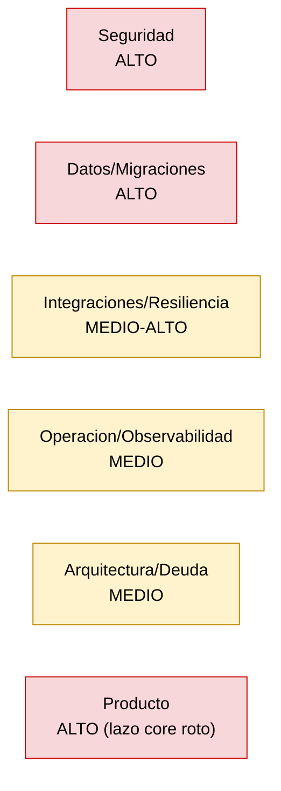

# 17 - Riesgos Técnicos/de Producto y Deuda Técnica

> Documento de auditoría (solo lectura). Consolida los riesgos detectados en las auditorías por área (docs 01-13) y agrega riesgos sistémicos verificados directamente sobre el código. Cada hallazgo incluye descripción, severidad, evidencia (path + símbolo), impacto y mitigación sugerida (recomendación; **no implementada**). Cada afirmación se etiqueta como `[Confirmado por codigo]`, `[Inferido razonablemente]` o `[Necesita validacion humana]`.

## Resumen ejecutivo

Qora es una plataforma de call-center outbound asistida por IA (ElevenLabs Conversational AI + custom-LLM GPT-4o + FastAPI + React 19 + SQLite/SQLAlchemy), multi-tenant vía `backend/clients/*`. La auditoría de riesgos arroja tres conclusiones estructurales:

1. **Superficie de voz y admin abierta por defecto.** La autenticación de webhooks está apagada (`qora_webhook_auth_enabled=False`), el CORS es `*`, varios endpoints sensibles no exigen credenciales y la clave admin es un secreto estático horneado en el bundle JS. Es el bloque de riesgo más severo y transversal.
2. **Deuda de migraciones y persistencia frágil.** Conviven 14 scripts ad-hoc `migrate_*.py` con Alembic; `alembic/env.py` no importa el modelo `background_jobs` (autogenerate produciría `DROP TABLE`); las FKs declarativas no se aplican en runtime (sin `PRAGMA foreign_keys=ON`); y SQLite single-file es el motor de una plataforma que aspira a outbound a escala.
3. **Producto incompleto en su lazo core.** El scheduler de seguimientos nunca disca: marca `in_progress` y ahí termina el flujo (Twilio dialing rotulado como "Phase 8" no implementado). El "outbound call center" no cierra su ciclo end-to-end de forma automática.

> **Nota de revisión temporal (2026-06-26).** Las tres conclusiones estructurales describen correctamente el *estado de código* auditado, pero deben leerse con su contexto de intención y fecha (ver doc `20-historia-y-evolucion.md`). Esta nota **no modifica** ningún hecho de código; solo agrega datación e intención y suaviza el *framing* de severidad:
> - **Defaults de seguridad abiertos:** la *capacidad* de cierre (auth admin, secreto de webhook opt-in, CORS configurable) **ya fue construida** en B5/B6/B7 (PRs #107/#109/#111, 2026-06-22/23). Los valores abiertos son *defaults de desarrollo*; el producto **aún no está desplegado** (B2 "do last after security hardening", `[ ]` en `docs/ROADMAP.md`). Es **postura previa al deploy** con un flip requerido antes de B2, no una superficie abierta en producción (detalle en S-1, S-6).
> - **Producto incompleto en el lazo core:** el dialing outbound es **Phase C del roadmap** (ítems C1–C8 todos `[ ]`, "after B deployed"). Es una brecha **deliberadamente secuenciada**, no un defecto oculto ni una pregunta sin responder (detalle en P-1).
> - **Durabilidad / migraciones:** la durabilidad post-llamada **está implementada** (B10, PRs #119–#122, 2026-06-25) y los 14 scripts `migrate_*.py` quedaron **DEPRECATED** el 2026-06-19 (#103). Lo pendiente es activación/limpieza, no construcción (detalle en I-1, D-7).
>
> Fuentes: `docs/ROADMAP.md` (tabla de fases, vigente), Engram #2139/#2142 (2026-06-25), doc 20 §5–§6.

### Conteo por severidad

| Severidad | Cantidad aprox. |
|-----------|-----------------|
| Alta      | 14 |
| Media     | 21 |
| Baja      | 12 |

> Nota: varias áreas reportaron el mismo riesgo (p. ej. webhook auth off) desde ángulos distintos; aquí se consolidan en un único hallazgo con referencias cruzadas.

### Mapa de calor por categoría

---

## 1. Seguridad

El cluster de mayor severidad. La causa raíz común es que **los defaults de seguridad están abiertos** y la autorización multi-tenant no es un límite real en la capa admin.

### S-1. Autenticación de webhooks de voz apagada por defecto

- **Descripción:** `qora_webhook_auth_enabled` es `False` por defecto. Con ello, `require_webhook_secret` se vuelve no-op y los endpoints `/voice/{client_id}/custom-llm/chat/completions` (streaming GPT-4o) y `/voice/initiation` (inyecta PII de lead en `dynamic_variables`) quedan invocables por cualquiera que conozca un `client_id`.
- **Severidad:** **Alta**
- **Evidencia:** `backend/app/core/config.py:135` (`qora_webhook_auth_enabled: bool = False`); `backend/app/core/auth.py:292-294` (`require_webhook_secret`); `backend/app/voice/webhook.py:539,614-620`. `[Confirmado por codigo]`
- **Impacto:** Gasto descontrolado en OpenAI/ElevenLabs por invocación de GPT-4o de terceros; exfiltración de PII de leads vía `/voice/initiation`; posible inyección de contexto de tenant. Es el riesgo con mayor superficie de explotación de toda la plataforma.
- **Mitigación sugerida:** Forzar `qora_webhook_auth_enabled=True` en producción (fail-fast si no hay secreto en entornos no-dev). Reportado también en docs 02, 03, 04, 06, 08, 10, 13.

> **Nota de revisión temporal (2026-06-26).** El hecho de código se mantiene verbatim: `qora_webhook_auth_enabled=False` por defecto. **Contexto de intención:** los PRs #107/#109/#111 (B5/B6/B7, 2026-06-22/23, `61c8918`) **construyeron deliberadamente** la auth de API admin, el secreto de webhook **opt-in** (`require_webhook_secret` con comparación de tiempo constante) y el CORS configurable. El default apagado es **postura de desarrollo**, elegida para no romper agentes ElevenLabs existentes hasta coordinar el dashboard (doc 20 §6). El producto **no está desplegado** (B2 `[ ]`, "do last after security hardening"). El riesgo real es **recordar forzar `True` antes de B2**, no una brecha activa en producción: la *capability* de cierre existe, falta el *flip* pre-deploy. Fuentes: PR #111, `docs/ROADMAP.md`, doc 20 §6.

### S-2. Clave admin estática horneada en el bundle JS

- **Descripción:** La API key admin es un único secreto compartido, embebido en build (`VITE_API_KEY`) dentro del bundle JS del panel admin; extraíble por cualquiera que cargue `/admin`. No hay clave por usuario ni mecanismo de revocación. La mitigación JWT figura como "Phase C" futura, no implementada.
- **Severidad:** **Alta**
- **Evidencia:** `frontend/src/api/client.ts:17,52` (`API_KEY`); `frontend/.env.example:13-26`; `docs/ops/secrets-management.md:137`. `[Confirmado por codigo]`
- **Impacto:** Cualquier visitante del panel obtiene la credencial admin global. Sin rotación granular ni revocación por usuario.
- **Mitigación sugerida:** Mover a autenticación basada en sesión/JWT con login real; nunca exponer secretos de servidor en el bundle del cliente. Reportado en docs 04, 05, 08, 11.

### S-3. `client_id` no es un límite de autorización en la API admin

- **Descripción:** La única key global concede lectura/escritura cross-tenant cambiando el `client_id` del path o del body. `CallerIdentity` no porta `allowed_client_ids`, por lo que no hay enforcement de pertenencia de tenant.
- **Severidad:** **Alta**
- **Evidencia:** `backend/app/core/auth.py:90-157`; `backend/app/analytics/router.py:71-78`. `[Confirmado por codigo]`
- **Impacto:** Un tenant (o un atacante con la key) accede a datos/configuración de cualquier otro tenant. Rompe el aislamiento multi-tenant a nivel admin.
- **Mitigación sugerida:** Incorporar `allowed_client_ids` a la identidad y validar pertenencia en cada endpoint scopeado por tenant.

### S-4. `GET /api/v1/tenants/{client_id}` sin `require_api_key`

- **Descripción:** El endpoint devuelve configuración del tenant (`voice_id`, `model`, `tools_enabled`, `is_active`) para cualquier `client_id` sin credenciales. Contradice la lista de exclusiones de auth de la spec.
- **Severidad:** **Alta** (doc 08) / **Media** (doc 13) → se consolida en **Alta** por enumerabilidad sin credenciales.
- **Evidencia:** `backend/app/tenants/router.py:10,24-52`; `backend/app/main.py:288`. `[Confirmado por codigo]`
- **Impacto:** Enumeración de tenants y divulgación de su configuración (modelo, tools, estado). Facilita ataques dirigidos a S-1.
- **Mitigación sugerida:** Aplicar `require_api_key` y scope por tenant. Reportado en docs 06, 08, 13.

### S-5. `GET /api/v1/voice/signed-url` totalmente sin auth

- **Descripción:** Endpoint sin autenticación que usa la `ELEVENLABS_API_KEY` global para acuñar signed URLs; cualquiera puede generarlas y quemar cuota de ElevenLabs. Además usa `settings.elevenlabs_agent_id` global (no el agente por tenant), con riesgo cross-tenant.
- **Severidad:** **Alta** (consumo de cuota + cross-tenant)
- **Evidencia:** `backend/app/voice/webhook.py:76-110` (`get_signed_url`), `:85-100`. `[Confirmado por codigo]`
- **Impacto:** Abuso de cuota/billing de ElevenLabs; el uso del agente global puede mezclar contextos de tenants.
- **Mitigación sugerida:** Exigir auth y resolver el `agent_id` por tenant. Reportado en docs 06, 08, 09, 10, 13.

### S-6. CORS abierto (`allow_origins=['*']`) por defecto

- **Descripción:** `qora_allowed_origins='*'` con `allow_methods`/`allow_headers='*'`. Combinado con webhook auth off (S-1), deja la superficie de voz invocable desde cualquier origen de navegador.
- **Severidad:** **Media**
- **Evidencia:** `backend/app/core/config.py:141`; `backend/app/main.py:379-387`. `[Confirmado por codigo]`
- **Impacto:** Cualquier sitio puede invocar la API desde el browser de una víctima autenticada; amplifica S-1/S-2.
- **Mitigación sugerida:** Lista blanca explícita de orígenes en producción; fallar si queda en `*` fuera de dev. Reportado en docs 02, 03, 06, 08, 11, 13.

> **Nota de revisión temporal (2026-06-26).** El hecho de código se mantiene: `qora_allowed_origins='*'` por defecto. **Contexto:** el PR #111 (B7, 2026-06-23, `61c8918`) reemplazó el allow-all **hardcodeado** anterior por `QORA_ALLOWED_ORIGINS` configurable para producción (ver doc 20 §7.6). El `*` es default de desarrollo; la lista blanca es la vía soportada para el deploy, con flip requerido antes de B2. Es postura pre-deploy, no configuración final. Fuentes: PR #111, `docs/ROADMAP.md` (B7 `[x]`).

### S-7. Endpoints `/demo` y `/api/v1/demo/*` exentos de auth exponen PII

- **Descripción:** Las rutas demo son auth-exempt y `GET /api/v1/demo/leads` devuelve PII (`name`, `phone`, `notes`, `custom_fields`) del cliente demo a cualquiera con la URL.
- **Severidad:** **Media**
- **Evidencia:** `backend/app/demo/router.py:1-20,142-195` (`get_demo_leads`). `[Confirmado por codigo]`
- **Impacto:** Fuga de PII de leads del tenant demo. Si el demo se puebla con datos reales, escala a alta.
- **Mitigación sugerida:** Limitar el demo a datos sintéticos y/o requerir token de sesión efímero. Reportado en docs 03, 04, 13.

### S-8. `crm_config_router` muta el filesystem con `client_id` del path sin sanitización visible (posible path traversal)

- **Descripción:** Escribe/borra `clients/{client_id}/crm.yaml` directo al filesystem del backend usando el `client_id` del path. No se observa sanitización del segmento, lo que abre posible path traversal; además, en Docker el archivo puede no persistir.
- **Severidad:** **Alta** (traversal) — la dimensión de persistencia se trata en I-2.
- **Evidencia:** `backend/app/integrations/crm_config_router.py:52,438,541,622,656`. `[Confirmado por codigo]` para la escritura directa; `[Necesita validacion humana]` para confirmar ausencia total de sanitización aguas arriba.
- **Impacto:** Escritura/borrado fuera del directorio del tenant si `client_id` contiene `../`; corrupción de config de otros tenants.
- **Mitigación sugerida:** Validar `client_id` contra una whitelist de tenants conocidos antes de tocar el filesystem; nunca derivar paths de input crudo.

### S-9. Guard de scope de tools se saltea cuando `authorized_session is None` (camino legacy)

- **Descripción:** `_check_scope` retorna `None` (sin bloquear) cuando `authorized_session is None`, debilitando el guard de tenant en llamadas sin sesión autenticada.
- **Severidad:** **Media**
- **Evidencia:** `backend/app/tools/dispatcher.py:80-93`. `[Confirmado por codigo]`
- **Impacto:** Ejecución de tools sin enforcement de scope de tenant por el camino legacy.
- **Mitigación sugerida:** Tratar `authorized_session is None` como fallo cerrado (deny-by-default). Reportado en docs 02, 03, 08.

### S-10. Verificación de webhook por shared-secret header, no firma HMAC del body

- **Descripción:** Cuando la auth de webhook se activa, valida un header `X-Webhook-Secret` en vez de firma HMAC del payload. No hay protección anti-replay ni de integridad del cuerpo.
- **Severidad:** **Baja-Media**
- **Evidencia:** `backend/app/core/auth.py:309-329`. `[Confirmado por codigo]`
- **Impacto:** Replay de payloads y ausencia de garantía de integridad si el secreto se filtra.
- **Mitigación sugerida:** Validar firma HMAC del body con ventana temporal, alineado al esquema de ElevenLabs.

### S-11. `_TESTING_BYPASS` global desactiva toda la auth admin

- **Descripción:** Flag global de módulo que, si se setea en runtime, desactiva toda la autenticación admin.
- **Severidad:** **Baja** (depende de que no se active en prod)
- **Evidencia:** `backend/app/core/auth.py:50,110-115`. `[Confirmado por codigo]`
- **Impacto:** Un seteo accidental o malicioso del flag abre completamente la API admin.
- **Mitigación sugerida:** Restringir el bypass a entorno de test (assert de `ENV=test`) y prohibirlo en producción.

### S-12. `CustomLLMRequest` usa `extra='allow'`

- **Descripción:** Acepta cualquier campo extra de ElevenLabs sin validación.
- **Severidad:** **Baja**
- **Evidencia:** `backend/app/voice/webhook.py:150`. `[Confirmado por codigo]`
- **Impacto:** Campos no esperados podrían propagarse sin control; superficie de validación laxa.
- **Mitigación sugerida:** Restringir a `extra='ignore'`/`forbid` y modelar explícitamente los campos requeridos.

### S-13. Mensaje de excepción de tool puede llegar al contexto del LLM

- **Descripción:** Errores de tool se devuelven como `{error: str(exc)}`, exponiendo potencialmente detalles internos al contexto del modelo.
- **Severidad:** **Baja**
- **Evidencia:** `backend/app/voice/webhook.py:248-249,465`. `[Confirmado por codigo]`
- **Impacto:** Fuga de detalles internos (paths, stack, nombres) hacia el LLM/transcript.
- **Mitigación sugerida:** Mensajes de error genéricos hacia el LLM; loguear el detalle solo server-side.

---

## 2. Datos / Migraciones

Bloque de **deuda de persistencia** con riesgo de pérdida/corrupción de datos. La causa raíz: dos linajes de migración (Alembic + 14 scripts ad-hoc) y un `target_metadata` desincronizado del baseline real.

### D-1. `background_jobs` no se importa en `alembic/env.py` → autogenerate generaría `DROP TABLE`

- **Descripción:** `env.py` importa `tenants/leads/calls/scheduler` pero **no** `app.jobs.models`, mientras que `database.py` sí lo importa en runtime. Como `target_metadata=Base.metadata` no incluye la tabla, `alembic revision --autogenerate` la vería como tabla huérfana y propondría `DROP TABLE background_jobs`.
- **Severidad:** **Alta**
- **Evidencia:** `backend/alembic/env.py:35-38` (sin `jobs`; verificado: `rg jobs env.py` = 0 matches), `:58` (`target_metadata=Base.metadata`); `backend/app/core/database.py:80`. `[Confirmado por codigo]`
- **Impacto:** Un autogenerate descuidado borraría la tabla de jobs durables (toda la durabilidad post-llamada). Pérdida de datos de jobs.
- **Mitigación sugerida:** Importar `app.jobs.models` en `env.py` junto al resto de modelos. **Documentar, no corregir** (auditoría read-only).

### D-2. FKs declarativas pero NO aplicadas en runtime (sin `PRAGMA foreign_keys=ON`)

- **Descripción:** El bootstrap de conexión solo emite `PRAGMA journal_mode=WAL` y `busy_timeout=5000`; SQLite por defecto NO aplica FKs salvo que se active explícitamente por conexión. Las `ForeignKey` del ORM son decorativas en runtime.
- **Severidad:** **Alta**
- **Evidencia:** `backend/app/core/database.py:84-87` (verificado: solo `journal_mode=WAL` y `busy_timeout`; sin `foreign_keys`). `[Confirmado por codigo]`
- **Impacto:** Filas huérfanas, integridad referencial no garantizada (leads/calls/analyses sin padre válido). Corrupción silenciosa.
- **Mitigación sugerida:** Activar `PRAGMA foreign_keys=ON` en cada conexión vía listener de SQLAlchemy.

### D-3. `stamp head` en baseline legacy sella 0002/0003 sin crear sus objetos

- **Descripción:** `migrate.py` ejecuta `command.stamp(cfg,'head')` sobre DBs legacy compatibles, marcando 0002/0003 como aplicadas sin crear `background_jobs` ni `transcript_finalized_at`/`turn_count`. El validador `_is_qora_compatible` solo verifica las 10 tablas baseline.
- **Severidad:** **Alta**
- **Evidencia:** `backend/scripts/migrate.py:426` (`command.stamp(cfg,'head')`), `:166-247` (`_is_qora_compatible`). `[Confirmado por codigo]`
- **Impacto:** DBs que creen estar "al día" carecen de columnas/tabla reales → errores en runtime de jobs y finalización de transcript.
- **Mitigación sugerida:** Stampear a la revisión realmente presente y aplicar las migraciones faltantes, o validar columnas/tabla además de las 10 tablas base.

### D-4. `alembic revision --autogenerate` NO es seguro hoy

- **Descripción:** Combinación de D-1, D-3, D-5, D-6: autogenerate produciría migraciones destructivas (`DROP` de `background_jobs`, `broker_name`) y ruido de tipos por divergencias modelo/baseline.
- **Severidad:** **Alta**
- **Evidencia:** doc 07 sección 8 (D1-D6); `backend/alembic/env.py:58`. `[Inferido razonablemente]` (deriva de los hallazgos confirmados D-1/D-5/D-6).
- **Impacto:** Cualquier desarrollador que confíe en autogenerate introduce migraciones que destruyen datos.
- **Mitigación sugerida:** Sincronizar `target_metadata` con todos los modelos y reconciliar baseline antes de habilitar autogenerate; mientras tanto, escribir migraciones a mano.

### D-5. `clients.broker_name` existe en baseline/DB pero no en el modelo ORM

- **Descripción:** La columna está en el baseline pero no en `models.py` (verificado: 0 matches de `broker_name` en modelos). Autogenerate intentaría dropearla.
- **Severidad:** **Media**
- **Evidencia:** `backend/alembic/versions/20241201_0001_baseline.py:49-52`; `rg broker_name models.py = 0`. `[Confirmado por codigo]`
- **Impacto:** Pérdida de la columna en un autogenerate; divergencia modelo/DB.
- **Mitigación sugerida:** Reflejar `broker_name` en el modelo o eliminarla deliberadamente con una migración explícita.

### D-6. Índices y FKs divergentes entre baseline y modelo

- **Descripción:** Índices presentes en baseline ausentes del modelo (`ix_scheduled_calls_status_scheduled_at`, `ix_call_analyses_session_id`) y FKs presentes en el modelo ausentes del baseline (`lead_profile_facts`/`lead_interest_history.source_call_id`).
- **Severidad:** **Media** (índices) / **Baja** (FKs)
- **Evidencia:** `baseline.py:298,410-414` vs `calls/models.py:175-180`, `scheduler/models.py:80-83`; `leads/models.py:151,242` vs `baseline.py:318,370`. `[Confirmado por codigo]`
- **Impacto:** Ruido en autogenerate; performance degradada si los índices no existen en alguna DB; integridad no declarada.
- **Mitigación sugerida:** Reconciliar baseline y modelo en una migración de alineación.

### D-7. (Sistémico) 14 scripts ad-hoc `migrate_*.py` coexisten con Alembic

- **Descripción:** Además de las 3 revisiones Alembic, `backend/scripts/` contiene 14 scripts `migrate_*.py` (más `seed`/`smoke`/`check-secrets`, 18 `.py` en total). Dos linajes de migración sin una fuente de verdad única.
- **Severidad:** **Alta** (deuda estructural)
- **Evidencia:** verificado: `fd migrate_ backend/scripts -e py | wc -l` = 14; total `fd -e py backend/scripts` = 18. Listado incluye `migrate_analysis_v2.py`, `migrate_next_action_engine.py`, `migrate_call_scheduler.py`, etc. `[Confirmado por codigo]`
- **Impacto:** Orden de aplicación ambiguo, imposibilidad de reproducir el esquema de forma determinista, riesgo de aplicar/omitir pasos. Es la raíz de D-3/D-4.
- **Mitigación sugerida:** Consolidar todo el historial en Alembic y deprecar los scripts ad-hoc (archivarlos como referencia, no como mecanismo de migración).

> **Nota de revisión temporal (2026-06-26).** El hecho de código se mantiene: 14 scripts `migrate_*.py` coexisten en `backend/scripts/`. **Contexto:** fueron marcados **DEPRECATED el 2026-06-19** en el PR #103 (commit `177819b` "docs(db): deprecate legacy scripts"), cuando aterrizó la fundación Alembic (B4). Se conservan como referencia histórica, **superados por el baseline Alembic + `backend/scripts/migrate.py`**, que es el camino de migración vigente. La consolidación que sugiere la mitigación **ya fue decidida y ejecutada en su parte estructural** (Alembic es source-of-truth); resta el archivado físico de los scripts deprecados. Fuentes: PR #103, doc 20 §5.

### D-8. (Sistémico) SQLite single-file como motor de una plataforma outbound

- **Descripción:** El motor es SQLite single-file con WAL. No soporta escritura concurrente real entre procesos ni escala horizontal; combinado con singletons in-process (ver A-1) impide múltiples workers seguros.
- **Severidad:** **Alta** (para el objetivo "outbound call center")
- **Evidencia:** `backend/app/core/database.py:84-87` (SQLite + WAL); ausencia de driver de Postgres/MySQL. `[Confirmado por codigo]` para el motor; `[Inferido razonablemente]` para la implicación de escala.
- **Impacto:** Techo de concurrencia/throughput; punto único de fallo en un solo archivo; backups y HA complejos. Inadecuado para volumen de llamadas outbound.
- **Mitigación sugerida:** Plan de migración a un RDBMS cliente-servidor (p. ej. Postgres) antes de escalar el dialer.

### D-9. (Sistémico) Artefacto de DB local fuera de control de versiones

- **Descripción:** `backend/qora.db` (~758KB) y `.bak` viven en el working tree; están gitignored (verificado: `git check-ignore backend/qora.db` OK, no trackeada), pero contienen datos locales fuera de versionado y backup formal.
- **Severidad:** **Baja**
- **Evidencia:** verificado: `git ls-files` no lista `.db/.bak`; `git check-ignore backend/qora.db` retorna match. `[Confirmado por codigo]`
- **Impacto:** Datos de desarrollo sin respaldo; riesgo de pérdida y de divergencia de esquema entre desarrolladores.
- **Mitigación sugerida:** Mantener gitignored (correcto) y documentar un seed/reset reproducible para no depender del archivo local.

---

## 3. Integraciones / Resiliencia

Durabilidad post-llamada y sincronización con sistemas externos. Causa raíz: caminos legacy fire-and-forget activos por defecto y flags de integración definidos pero no consultados.

### I-1. Durabilidad post-llamada desactivada por defecto (`enable_job_executor=False`)

- **Descripción:** `summarize`/`crm_sync`/`transcript_flush` corren fire-and-forget por el camino legacy. Un crash entre fin de llamada y persistencia del análisis pierde el trabajo. Además, `ENABLE_JOB_EXECUTOR` no aparece en `.env.example` ni en la doc, así que el operador no puede descubrir cómo activarlo.
- **Severidad:** **Alta**
- **Evidencia:** `backend/app/core/config.py:152` (verificado: `enable_job_executor: bool = False`); `backend/app/calls/service.py:590-599`; `backend/app/summarizer.py:1185-1196`; uso en `main.py:198,226`. `[Confirmado por codigo]`
- **Impacto:** Pérdida silenciosa de summarize/análisis/sync de CRM ante crash o deploy; sin reintentos ni visibilidad en `background_jobs`.
- **Mitigación sugerida:** Activar el executor por defecto en producción y documentar el flag en `.env.example`. Reportado en docs 02, 03, 11.

> **Nota de revisión temporal (2026-06-26).** El hecho de código se mantiene: `enable_job_executor=False` por defecto, con el camino legacy fire-and-forget activo. **Contexto de intención:** la durabilidad post-llamada **fue implementada** en B10 — 4 PRs apilados #119–#122 (2026-06-25): tabla `background_jobs` respaldada por DB, retry con backoff+jitter (máx 3 → dead), dead-lettering y `recover()` en arranque. El flag apagado es un **rollout gateado por diseño**: Engram #2142 (2026-06-25) registra el next step explícito "set `ENABLE_JOB_EXECUTOR=true` in `.env` after merge & deploy". La durabilidad **está construida y pendiente de activación**, no rota ni ausente. El riesgo real es **recordar activar el flag al/antes del deploy** (B2). Fuentes: PRs #119–#122, Engram #2139/#2142, `docs/ops/background-jobs.md`, doc 20 §6 y Capítulo VI.

### I-2. Jobs en `failed` (mid-backoff) quedan huérfanos tras crash

- **Descripción:** `recover()` solo selecciona `pending`/`running`, no `failed`. Un job que crasheó a mitad de backoff queda huérfano, contradiciendo la doc que afirma resumir "todo trabajo incompleto".
- **Severidad:** **Alta**
- **Evidencia:** `backend/app/jobs/executor.py:405` vs `docs/ops/background-jobs.md:87`. `[Confirmado por codigo]` (discrepancia código vs doc; gana el código).
- **Impacto:** Pérdida permanente de jobs en estado `failed` tras reinicio; la doc da una falsa sensación de durabilidad total.
- **Mitigación sugerida:** Incluir `failed` recuperables en `recover()` o documentar explícitamente que `failed` es terminal.

### I-3. `shutdown()` del executor cancela jobs en vuelo sin drain

- **Descripción:** El shutdown cancela jobs en proceso sin esperar drain; trabajo en curso se pierde en cada deploy.
- **Severidad:** **Media**
- **Evidencia:** `backend/app/jobs/executor.py:441`. `[Confirmado por codigo]`
- **Impacto:** Pérdida de trabajo en cada despliegue/reinicio planificado.
- **Mitigación sugerida:** Implementar graceful drain con timeout antes de cancelar.

### I-4. Sweeper de sesiones abandonadas ignora `ENABLE_JOB_EXECUTOR`

- **Descripción:** El sweeper usa siempre `_schedule_summarize` (legacy fire-and-forget), ignorando el flag de executor; esas summarizaciones nunca son durables ni visibles en `background_jobs`.
- **Severidad:** **Media**
- **Evidencia:** `backend/app/sweeper.py:80`. `[Confirmado por codigo]`
- **Impacto:** Incoherencia: aun con durabilidad activada, el camino del sweeper sigue siendo no durable.
- **Mitigación sugerida:** Enrutar el sweeper por el executor cuando el flag esté activo.

### I-5. Flag `CRMConfig.enabled` definido pero nunca consultado

- **Descripción:** El flag B8 `enabled` existe pero no se consulta: `enabled:false` NO desactiva ni el sync ni el import.
- **Severidad:** **Media**
- **Evidencia:** `backend/app/integrations/crm_config.py:110`; sin uso en `crm_sync_service.py`/`crm_import_service.py`. `[Confirmado por codigo]`
- **Impacto:** Un operador que cree haber desactivado el CRM sigue sincronizando/importando datos. Comportamiento contrario a la expectativa.
- **Mitigación sugerida:** Consultar `enabled` como guard en sync e import, o eliminar el flag si es muerto.

### I-6. `crm_config_router` escribe `crm.yaml` al filesystem (no persistencia en Docker)

- **Descripción:** La config de CRM se escribe directo al filesystem del backend. En Docker, sin volumen montado para `clients/`, los cambios se pierden al recrear el contenedor. (La dimensión de traversal se trata en S-8.)
- **Severidad:** **Media**
- **Evidencia:** `backend/app/integrations/crm_config_router.py:438,541,622`. `[Confirmado por codigo]` para la escritura; `[Necesita validacion humana]` para confirmar el montaje de volumen real en el deploy.
- **Impacto:** Pérdida de configuración de CRM por tenant tras redeploy.
- **Mitigación sugerida:** Persistir la config en DB o en un volumen montado garantizado.

### I-7. Sync programático de ElevenLabs cubre solo `soft_timeout`

- **Descripción:** El único parámetro sincronizado programáticamente es `soft_timeout`; el resto de la config del agente se gestiona manualmente en el dashboard de ElevenLabs (drift posible).
- **Severidad:** **Baja**
- **Evidencia:** `backend/app/elevenlabs/service.py` (`sync_soft_timeout`). `[Confirmado por codigo]`
- **Impacto:** Divergencia entre config esperada en código y la real en el dashboard; difícil de auditar.
- **Mitigación sugerida:** Documentar qué parámetros son source-of-truth de Qora vs manuales, o ampliar el sync.

### I-8. Defaults hardcodeados de `elevenlabs_agent_id`/`voice_id` (agente demo)

- **Descripción:** Defaults del agente demo en config; podrían usarse en producción si no se sobreescriben por env.
- **Severidad:** **Baja**
- **Evidencia:** `backend/app/core/config.py:81-82`. `[Confirmado por codigo]`
- **Impacto:** Llamadas de producción contra el agente/voz demo si falta el override.
- **Mitigación sugerida:** Sin default funcional en prod; fallar si no se setea explícitamente.

---

## 4. Operación / Observabilidad

Capacidad de diagnosticar y operar en producción multi-tenant. Causa raíz: falta de instrumentación transversal (correlation id, handlers globales, health real) y guards de operación deshabilitados.

> **Nota de revisión temporal (2026-06-26).** Las brechas de instrumentación transversal de esta sección (O-2 manejadores globales, O-3 correlation id, y parte de O-4 readiness) corresponden a **B9 — Structured logging + error monitoring**, el **próximo ítem planificado** del roadmap tras B10 (`[ ]` marcado NEXT; Engram #2142, 2026-06-25; `docs/ROADMAP.md`). `jobs/queries.py` (#121, 2026-06-25) es groundwork de B9. Los health checks/readiness y el incident playbook también figuran en **Phase E** (Production Operations, `[ ]`). No es un olvido de instrumentación sino trabajo **secuenciado y pendiente**; el hecho de código (ausencia actual) se mantiene. Fuentes: `docs/ROADMAP.md` (B9, Phase E), Engram #2142, doc 20 §6.

### O-1. Gate de backup pre-migración deshabilitado en contenedor

- **Descripción:** `docker-compose.yml` fija `QORA_SKIP_BACKUP_CHECK=1`, saltando el guard de backup pre-migración en cada restart. La protección de datos depende solo del volumen nombrado, sin snapshot previo a migrar.
- **Severidad:** **Media**
- **Evidencia:** `docker-compose.yml:35`; `backend/scripts/migrate.py:343`. `[Confirmado por codigo]`
- **Impacto:** Una migración defectuosa corrompe datos sin snapshot de recuperación.
- **Mitigación sugerida:** Habilitar el backup check en producción o automatizar snapshot del volumen antes de migrar. Reportado en docs 01, 11.

### O-2. Sin manejadores de excepción globales

- **Descripción:** No hay `exception_handler` registrados; errores no controlados degradan a un 500 plano de Starlette, sin forma de error unificada.
- **Severidad:** **Media**
- **Evidencia:** `rg exception_handler` vacío en `backend/app`; `backend/app/main.py:95-106`. `[Confirmado por codigo]`
- **Impacto:** Respuestas de error inconsistentes; difícil distinguir fallos esperados de inesperados; posible fuga de stack traces.
- **Mitigación sugerida:** Registrar handlers globales con un esquema de error estándar.

### O-3. Sin request/correlation ID

- **Descripción:** Los logs del mismo request no comparten un id; la trazabilidad end-to-end es deficiente en producción multi-tenant. Hay `merge_contextvars` pero sin binding de `request_id`.
- **Severidad:** **Media**
- **Evidencia:** `backend/app/core/logging.py:21-36`. `[Confirmado por codigo]`
- **Impacto:** Imposible correlacionar la cadena webhook→tool→job de una llamada en los logs; debugging de producción muy costoso.
- **Mitigación sugerida:** Middleware que genere y bindee un `request_id`/`call_id` a `contextvars`.

### O-4. Health endpoint es solo liveness

- **Descripción:** `/health` reporta `status/uptime/version` (versión hardcodeada) y no verifica DB ni dependencias externas.
- **Severidad:** **Baja**
- **Evidencia:** `backend/app/main.py:259-267`. `[Confirmado por codigo]`
- **Impacto:** El orquestador cree que el servicio está sano aunque la DB o ElevenLabs estén caídas. Sin readiness real.
- **Mitigación sugerida:** Añadir un readiness check que valide DB y dependencias críticas.

### O-5. `QORA_DOCS_ENABLED=True` por defecto expone `/docs` y `/redoc`

- **Descripción:** Documentación interactiva expuesta por defecto.
- **Severidad:** **Media** (en conjunto con superficie de auth abierta)
- **Evidencia:** `backend/app/core/config.py:121` (`qora_docs_enabled: bool = True`). `[Confirmado por codigo]`
- **Impacto:** Mapa completo de la API disponible para reconocimiento de atacantes; potencia S-1..S-7.
- **Mitigación sugerida:** Deshabilitar docs en producción por defecto.

### O-6. `ENABLE_JOB_EXECUTOR` ausente de `.env.example` y de la doc

- **Descripción:** El flag que controla la durabilidad post-call (ver I-1) no está documentado en ningún lado; el operador no puede descubrir cómo activar reintentos/recovery.
- **Severidad:** **Media**
- **Evidencia:** `backend/app/core/config.py:152`; usado en `main.py:198,226` y `summarizer.py:1174`. `[Confirmado por codigo]`
- **Impacto:** La durabilidad queda apagada de facto porque nadie sabe activarla.
- **Mitigación sugerida:** Documentar el flag en `.env.example` y en la guía de ops.

> **Nota de revisión temporal (2026-06-26).** El hecho de código (el flag controla la durabilidad de I-1) se mantiene. **Posible desactualización del hallazgo:** desde el 2026-06-25, `docs/ops/background-jobs.md` (commit `d9afe17`) **documenta** `ENABLE_JOB_EXECUTOR` (default `false`), los 3 `job_type` y el ciclo de vida. Por tanto la afirmación "ausente de la doc / no documentado en ningún lado" puede haber quedado **stale** si se redactó antes de ese commit; resta verificar por separado si sigue ausente de `.env.example`. Esta posible corrección de hecho se registra para revisión humana en `21-revision-temporal-y-ajustes.md` (no se edita el hallazgo aquí). Fuentes: `docs/ops/background-jobs.md`, doc 20 (línea de tiempo 2026-06-25).

---

## 5. Arquitectura / Deuda

Decisiones estructurales que limitan escala y mantenibilidad. Causa raíz: estado in-process (singletons) + duplicación de superficies + desfases doc/código.

### A-1. No escala horizontalmente: singletons in-process + SQLite single-file

- **Descripción:** `session_store` y `JobExecutor` son singletons in-process; con SQLite single-file (D-8), múltiples workers fragmentan sesiones y arriesgan doble procesamiento en `recover()` (toma todos los `pending`/`running` sin particionar).
- **Severidad:** **Media** (estructural; sube a Alta si se intenta escalar)
- **Evidencia:** `backend/app/voice/session.py:204` (singleton); `backend/app/jobs/executor.py:463` (singleton), `recover()` sin partición. `[Confirmado por codigo]`
- **Impacto:** Imposible correr múltiples instancias seguras; sesiones perdidas y jobs procesados dos veces si se escala.
- **Mitigación sugerida:** Externalizar estado de sesión y jobs a un store compartido (Redis/DB) con locking/particionado antes de escalar.

### A-2. Doble juego de rutas del scheduler (canónica + alias)

- **Descripción:** Decoradores de ruta duplicados (canónica + alias) amplían la superficie y el riesgo de divergencia entre ambas.
- **Severidad:** **Baja**
- **Evidencia:** `backend/app/scheduler/router.py` (decoradores duplicados). `[Confirmado por codigo]`
- **Impacto:** Mantenimiento doble; comportamientos que divergen si solo se actualiza una ruta.
- **Mitigación sugerida:** Mantener una ruta canónica y redirigir/deprecar el alias.

### A-3. Tipos API del frontend mantenidos a mano (espejo de Pydantic)

- **Descripción:** Los tipos del frontend son un espejo manual de los modelos Pydantic; las dimensiones de análisis se tipan como `Record<string, unknown>` con acceso por índice string. Riesgo de drift backend/frontend.
- **Severidad:** **Media**
- **Evidencia:** `frontend/src/api/types.ts:5-6`; `frontend/src/features/calls/call-analysis-panel.tsx`. `[Confirmado por codigo]`
- **Impacto:** Cambios de contrato en backend no detectados en compile-time del frontend; bugs en runtime.
- **Mitigación sugerida:** Generar tipos desde el schema OpenAPI del backend.

> **Nota de revisión temporal (2026-06-26).** El hecho de código se mantiene: los tipos del frontend son un espejo manual de Pydantic. **Cross-referencia:** este punto ya está **rastreado como known-issue P4** en `docs/ROADMAP.md` ("generated API types instead of manual TS sync"), de prioridad diferida. No es un hallazgo novel sino deuda **ya registrada y priorizada** por el equipo. Fuente: `docs/ROADMAP.md` (Known Issues, P4).

### A-4. Mecanismo de carga dual de `.env` (cwd-relativo)

- **Descripción:** `env_file='.env'` es cwd-relativo; si uvicorn corre desde `backend/`, reintroduciría un `backend/.env` legacy pese a la política B8 root-only.
- **Severidad:** **Baja**
- **Evidencia:** `backend/app/core/config.py:155` vs `backend/app/main.py:48`. `[Confirmado por codigo]`
- **Impacto:** Config impredecible según el cwd de arranque; un `.env` legacy podría sobreescribir el oficial.
- **Mitigación sugerida:** Resolver el path del `.env` de forma absoluta respecto a la raíz del repo.

### A-5. Dos flujos de dependencias coexistiendo (pip install -e vs uv sync --frozen)

- **Descripción:** La doc usa `pip install -e` (resolución libre) y el Dockerfile usa `uv sync --frozen` (uv.lock), con riesgo de versiones distintas dev vs prod.
- **Severidad:** **Media**
- **Evidencia:** `docs/running-locally.md:27` vs `Dockerfile:45-58`. `[Confirmado por codigo]`
- **Impacto:** "Funciona en dev, falla en prod" por divergencia de versiones de dependencias.
- **Mitigación sugerida:** Unificar en uv con lockfile como fuente de verdad también en dev.

### A-6. Desfase docs vs código

- **Descripción:** El README declara Phase B7 mientras el código corre Phase B10; las docs no son confiables como fuente de verdad (también I-2, donde la doc de jobs contradice el código).
- **Severidad:** **Baja** (pero erosiona confianza en toda la doc)
- **Evidencia:** `README.md:11` vs `backend/app/main.py:195`. `[Confirmado por codigo]`
- **Impacto:** Decisiones basadas en docs desactualizadas; onboarding engañoso.
- **Mitigación sugerida:** Sincronizar README/doc con la fase real o derivar la fase desde una única constante.

> **Nota de revisión temporal (2026-06-26).** El hecho se mantiene: `README.md:11` declara una fase desactualizada. **Matiz de datación:** esto es **capas temporales**, no una contradicción de comportamiento. La **tabla de fases** de `docs/ROADMAP.md` es la fuente de verdad vigente (B5/B6/B7/B10 = `[x]`); su **prosa "Current State"** ("No authentication") quedó **stale** tras B5 (auth completada 2026-06-22/23), y `README.md:11` también rezaga. La causa es higiene de proceso de la era Phase B: los PRs de feature excluyeron intencionalmente ediciones a `docs/ROADMAP.md`/`.atl/*`, y el roadmap se actualizó en commits docs separados (`d9afe17`). Severidad de *framing* **baja**, como ya indica el hallazgo. Fuentes: `docs/ROADMAP.md` (capas temporales), doc 20 Apéndice.

### A-7. `FRONTEND_URL` default hardcodeado a `http://localhost:5173`

- **Descripción:** Default no documentado; el redirect a `/admin` apuntaría a localhost en prod si no se setea.
- **Severidad:** **Baja**
- **Evidencia:** `backend/app/core/config.py:100`; `backend/app/main.py:423`. `[Confirmado por codigo]`
- **Impacto:** Redirects rotos en producción si el operador no conoce el env.
- **Mitigación sugerida:** Sin default funcional en prod; documentar el env y fallar si falta.

---

## 6. Producto

Riesgos sobre el valor entregado al usuario: features incompletas, UI que miente sobre el estado, y desincronización admin/backend.

### P-1. (Crítico) El scheduler de seguimientos no disca: lazo outbound roto end-to-end

- **Descripción:** `mark_due_calls_in_progress` solo marca `pending -> in_progress`; ningún componente coloca la llamada saliente real. El dialing por Twilio está rotulado como "Phase 8" no implementado. Una `ScheduledCall` promovida a `in_progress` nunca se ejecuta ni se cierra: el auto follow-up no se cumple end-to-end. Para un producto que se vende como "outbound call center", el lazo core está incompleto.
- **Severidad:** **Alta**
- **Evidencia:** `backend/app/scheduler/service.py:505-537` (`mark_due_calls_in_progress`); `backend/app/scheduler/models.py:43` ("Phase 6: Queue-only. Actual Twilio dialing is Phase 8"); sin módulo `twilio`/`batch_call` en `backend/app`; `ElevenLabsService` solo `sync_soft_timeout`. `[Confirmado por codigo]`
- **Impacto:** Las llamadas agendadas quedan "colgadas" en `in_progress` sin ejecutarse; promesa de producto no cumplida; filas que nunca se consumen.
- **Mitigación sugerida:** Implementar el dialer (Twilio/ElevenLabs batch call) que consuma las filas `in_progress`, o ajustar el discurso de producto a "cola de seguimientos manual". **Documentar, no implementar.** Reportado en docs 02, 03, 04, 10.

> **Nota de revisión temporal (2026-06-26).** El hecho de código se mantiene verbatim: `mark_due_calls_in_progress` no disca y el comentario `scheduler/models.py:43` rotula el dialing como "Phase 8". **Contexto de intención:** "Phase 8" mapea a **Phase C del roadmap (Real Outbound Calls)**, cuyos ítems **C1–C8 están todos `[ ]` no iniciados**, explícitamente "after B deployed": C1 elegir telefonía (Twilio-native vs SIP vs ElevenLabs Batch API — **aún sin elegir**), C2 dialer worker que consume la `ScheduledCall` pendiente, C3 extender la máquina de estados (`pending→dialing→ringing→connected/no_answer/...`), C4–C8 gestión de números, voicemail, retry, metadata de telefonía y E2E. El propio `docs/ROADMAP.md` declara "Scheduler queue (creates scheduled calls, **does not dial**)" y "No real phone calls yet". La pregunta abierta del audit "¿quién marca?" **está respondida por el roadmap: nadie todavía, por diseño** — es una brecha **deliberadamente secuenciada**, no un defecto oculto ni una pregunta sin responder. La secuencia es intencional: el dialer va **después** de B (deploy/seguridad). Fuentes: PR #26 (`1c3bb06`, 2026-04-23), `docs/ROADMAP.md` (Phase C), doc 20 §6 y §4.

### P-2. Selector de tools del admin desincronizado con el backend

- **Descripción:** El selector ofrece 3 tools ya removidas del backend y omite `capture_data`/`get_lead_profile`/`history`/`pain_points`/`load_skill` que sí existen en el registry.
- **Severidad:** **Media**
- **Evidencia:** `frontend/src/features/admin/agents-section.tsx:45-50` vs `backend/app/tools/registry.py:58-67`. `[Confirmado por codigo]`
- **Impacto:** El admin habilita tools inexistentes (sin efecto) y no puede habilitar tools reales; configuración engañosa.
- **Mitigación sugerida:** Derivar la lista de tools del admin desde el registry del backend (endpoint), no hardcodearla.

### P-3. `ActiveIntegrationsCard` hardcodea "Airtable Connected" sin consultar la API

- **Descripción:** El dashboard muestra "Airtable Connected" de forma estática, sin consultar el estado real de la integración. Puede mostrar estado falso.
- **Severidad:** **Media**
- **Evidencia:** `frontend/src/features/dashboard/page.tsx:192-219`. `[Confirmado por codigo]`
- **Impacto:** El usuario cree que la integración está conectada cuando puede no estarlo; decisiones operativas erróneas.
- **Mitigación sugerida:** Consultar el estado real de integración por tenant antes de renderizar.

### P-4. Analytics `PeriodSelector` ofrece "custom" sin date pickers

- **Descripción:** El selector ofrece la opción "custom" pero no hay date pickers; envía `period=custom` sin `start_date`/`end_date`.
- **Severidad:** **Media**
- **Evidencia:** `frontend/src/features/analytics/period-selector.tsx`; `frontend/src/features/analytics/page.tsx:37-42`. `[Confirmado por codigo]`
- **Impacto:** Request inválido/sin rango; analítica rota o vacía para "custom".
- **Mitigación sugerida:** Ocultar "custom" hasta implementar los date pickers, o añadirlos.

### P-5. Sin autenticación real en el frontend (ruta `/admin` sin guard)

- **Descripción:** No hay `ProtectedRoute` ni login; la ruta `/admin` queda accesible y depende solo del bearer estático del bundle. (Se cruza con S-2.)
- **Severidad:** **Alta** (visión producto/seguridad combinada)
- **Evidencia:** `frontend/src/router.tsx` (sin `ProtectedRoute`); `frontend/src/api/client.ts:17,52`. `[Confirmado por codigo]`
- **Impacto:** El panel admin es accesible sin login; en dev sin `VITE_API_KEY` la API queda abierta.
- **Mitigación sugerida:** Implementar login + guard de ruta + sesión real.

### P-6. `demo-client` hardcodeado como tenant por defecto

- **Descripción:** `demo-client` se usa como tenant por defecto en el redirect raíz, el catch-all y el `AppLayout`: cualquier URL desconocida cae en ese tenant.
- **Severidad:** **Baja**
- **Evidencia:** `frontend/src/router.tsx:41,94`; `frontend/src/app-layout.tsx:15`. `[Confirmado por codigo]`
- **Impacto:** Navegación accidental al tenant demo; potencial confusión y exposición del demo (ver S-7).
- **Mitigación sugerida:** Resolver el tenant desde la sesión autenticada en lugar de un default hardcodeado.

### P-7. Frontend depende de `VITE_API_KEY` estático en build

- **Descripción:** Si no se setea, no se envía auth (admin abierto en dev). Misma raíz que S-2/P-5; se lista en producto por su impacto operativo en entornos dev.
- **Severidad:** **Media**
- **Evidencia:** `frontend/src/api/client.ts` (`API_KEY`). `[Confirmado por codigo]`
- **Impacto:** Comportamiento de auth dependiente de un build var; fácil de olvidar y dejar abierto.
- **Mitigación sugerida:** No depender de build vars para auth; usar sesión runtime.

### P-8. Launcher `./Qora` exige ngrok obligatorio

- **Descripción:** El launcher de dev falla si ngrok está ausente, acoplando el desarrollo local a un túnel público para webhooks de ElevenLabs.
- **Severidad:** **Baja**
- **Evidencia:** `Qora:256` (fail si ngrok ausente). `[Confirmado por codigo]`
- **Impacto:** Fricción de onboarding; imposible desarrollar offline.
- **Mitigación sugerida:** Hacer ngrok opcional para flujos que no requieran webhooks entrantes.

---

## Apéndice A — Top 10 riesgos priorizados

Priorización por probabilidad × impacto (criterio del auditor; `[Inferido razonablemente]`).

| # | ID | Riesgo | Categoría | Severidad |
|---|----|--------|-----------|-----------|
| 1 | S-1 | Webhook auth off por defecto (GPT-4o + PII abiertos) | Seguridad | Alta |
| 2 | S-3 | `client_id` no es límite de autorización admin | Seguridad | Alta |
| 3 | P-1 | Scheduler no disca: lazo outbound roto | Producto | Alta |
| 4 | D-2 | FKs no aplicadas en runtime (sin `foreign_keys=ON`) | Datos | Alta |
| 5 | D-1 | `background_jobs` ausente de `env.py` (`DROP TABLE`) | Datos | Alta |
| 6 | S-2 | Clave admin estática en el bundle JS | Seguridad | Alta |
| 7 | I-1 | Durabilidad post-call off por defecto | Resiliencia | Alta |
| 8 | D-7 | 14 scripts ad-hoc vs Alembic (deuda de migraciones) | Datos | Alta |
| 9 | S-5 | `/voice/signed-url` sin auth (quema cuota ElevenLabs) | Seguridad | Alta |
| 10 | D-8 | SQLite single-file como motor de una plataforma outbound | Datos | Alta |

## Apéndice B — Riesgos sistémicos verificados directamente

Hallazgos agregados por el auditor (no solo provenientes de las áreas), confirmados con comandos read-only:

1. **Deuda de migraciones (D-7):** 14 scripts `migrate_*.py` + 3 revisiones Alembic. Verificado por conteo de archivos.
2. **`env.py` desincronizado (D-1):** 0 referencias a `jobs` en `alembic/env.py`. Verificado por `rg`.
3. **FKs sin enforcement (D-2):** `database.py` solo emite `journal_mode=WAL` y `busy_timeout`; sin `foreign_keys`. Verificado por `rg`.
4. **Defaults abiertos (S-1/S-6/O-5):** `qora_webhook_auth_enabled=False`, `qora_allowed_origins='*'`, `qora_docs_enabled=True`, `enable_job_executor=False`. Verificado por `rg` sobre `config.py`.
5. **Artefacto DB local (D-9):** `qora.db` gitignored y no trackeada. Verificado por `git ls-files` / `git check-ignore`.

---

> **Recordatorio de alcance:** este documento es un entregable de auditoría de solo lectura. Todas las "mitigaciones sugeridas" son recomendaciones; **no se modificó ningún archivo del producto**. Code wins over docs: donde la documentación existente contradice el código (p. ej. `docs/ops/background-jobs.md` vs `executor.py`, o README Phase B7 vs B10), se documentó la discrepancia y prevaleció el código.
