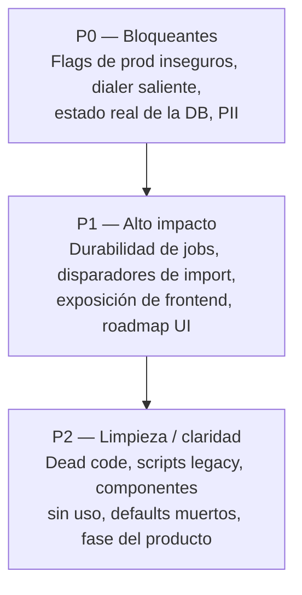

# Área 18 — Preguntas Abiertas

> **Propósito.** Consolidar, de-duplicar y priorizar todas las preguntas que **no pueden resolverse desde el repositorio** y que requieren validación del responsable de producto, del operador de despliegue o de la persona con acceso a los dashboards externos (ElevenLabs, Airtable) y al entorno de producción (`.env`, base de datos, infraestructura). Cada pregunta indica **por qué importa** y **qué decisión o información desbloquea**. Esta es una auditoría de solo lectura: no se ejecutó la app, ni tests, ni se inspeccionaron valores de `.env`; solo se conocen nombres de variables y defaults del código.

Repo raíz: `/Users/mati/Desktop/Qora`. Las preguntas provienen de las áreas 01–13. Donde varias áreas plantearon la misma duda, se consolidó en una sola entrada citando los documentos de origen.

> **Nota de revisión temporal (2026-06-26).** Esta capa de revisión es **aditiva**: no modifica ningún hecho de code-state de las áreas 01–13. Solo añade contexto temporal/intención (con fecha + fuente) y, donde aplica, suaviza el *framing* de riesgo. Tras reconstruir la historia datada (ver `20-historia-y-evolucion.md`), varias de estas "preguntas abiertas" resultan **ya respondidas por `docs/ROADMAP.md` o por Engram** — no son defectos ocultos sino brechas conocidas y deliberadamente secuenciadas. Cada entrada afectada lleva abajo un bloque marcado. La más relevante: **A1 (¿quién disca?) queda RESUELTA POR ROADMAP** (Phase C, no iniciada por diseño). Se re-priorizó en §9.

---

## 1. Cómo leer este documento

- **Prioridad**: `P0` (bloqueante / riesgo de seguridad o costo en producción), `P1` (alto impacto en operación o roadmap), `P2` (limpieza, deuda o claridad).
- **Tema**: Producto, Arquitectura, Datos, Integraciones, Seguridad, Operación.
- Cada entrada cita las áreas de origen entre paréntesis (p. ej. *02, 06, 13*).
- Las respuestas a estas preguntas deberían volcarse luego al inventario y a la matriz de riesgos correspondientes.

### Mapa de prioridades

---

## 2. Seguridad (máxima prioridad)

Estas preguntas determinan si la superficie expuesta hoy en producción es segura. Los **defaults del código son inseguros**, por lo que la postura real depende enteramente de la configuración del despliegue, que no es observable desde el repo.

> **Nota de revisión temporal (2026-06-26) — postura pre-deploy, no defecto.** Los hechos de código se mantienen verbatim (webhook auth `false` por default, CORS `*` por default). Matiz de *framing*: estos **no son agujeros olvidados** sino **defaults de desarrollo**, y la **capacidad de cerrarlos YA EXISTE y fue construida deliberadamente** en la **fase B5/B6/B7 (2026-06-22/23)**: PR **#107/#109** (auth de API admin, `require_api_key`, demo fail-closed), PR **#111** (webhook secret **opt-in** vía `QORA_WEBHOOK_AUTH_ENABLED`, y `QORA_ALLOWED_ORIGINS` configurable que **reemplaza el allow-all hardcodeado** para producción). El producto **aún no está desplegado** (B2 "do last after security hardening", `[ ]`). Por eso S1/S2/S3/S4 siguen siendo **`P0` legítimos**, pero re-enmarcados como **flip obligatorio pre-B2**, no como vulnerabilidad activa en un sistema en producción. La auth de webhook se dejó opt-in a propósito para **no romper agentes ElevenLabs existentes** hasta coordinar el dashboard (Engram/Historia §6: *capability ≠ enforcement*). Fuentes: PRs #107/#109/#111; `docs/ROADMAP.md` (B5–B7 `[x]`, B2 `[ ]`); `20-historia-y-evolucion.md` §6.

### S1 — `[P0]` ¿`QORA_WEBHOOK_AUTH_ENABLED=true` con secreto configurado en producción? *(02, 03, 06, 08, 10, 13)*
- **Por qué importa.** El webhook custom-LLM (`POST /api/v1/voice/.../custom-llm/...`) dispara streaming de GPT-4o, lo que genera **gasto directo en OpenAI** y escrituras de transcript. El default `qora_webhook_auth_enabled = false` deja ese endpoint **abierto**: cualquiera que conozca o adivine un `client_id` puede invocarlo. **[Confirmado por codigo]** (`backend/app/voice/webhook.py`, `backend/app/core/auth.py` `require_webhook_secret`, default en `config.py`).
- **Qué desbloquea.** Confirmar si la superficie más cara está protegida o si hay riesgo de abuso/costo activo. Si está en `false`, es una acción correctiva inmediata.
- **Relacionado.** Cuando se habilita, la verificación es por **secreto compartido** (`X-Webhook-Secret` con `compare_digest`), **no** firma HMAC del body → ¿ElevenLabs está configurado para enviar ese header? ¿Se requiere HMAC/anti-replay?

### S2 — `[P0]` ¿`QORA_ALLOWED_ORIGINS` está restringido en producción, o sigue en `*`? *(03, 06, 08, 13)*
- **Por qué importa.** El default de CORS es `*`. Combinado con un frontend que embebe la API key, un origen permisivo amplía la superficie de abuso. **[Confirmado por codigo]** (`config.py`).
- **Qué desbloquea.** Decidir si hay que endurecer CORS antes de exponer el producto.

### S3 — `[P0]` ¿El frontend admin (con `VITE_API_KEY` embebido) está expuesto públicamente o solo en red interna? *(05, 08)*
- **Por qué importa.** `VITE_API_KEY` se hornea en el bundle de Vite (es un bearer estático). Si el bundle es público, la API key admin queda expuesta a cualquiera. Si el frontend corre solo en red privada/VPN, la severidad baja. **[Confirmado por codigo]** (uso de `VITE_API_KEY` en el cliente HTTP del frontend).
- **Qué desbloquea.** Define la severidad real (crítica vs. aceptable) y si se necesita un modelo de auth distinto (login/sesión) para el panel admin.

### S4 — `[P0]` ¿Hay un proxy inverso / WAF / red privada delante del backend? *(08, 13)*
- **Por qué importa.** No hay rate-limiting ni WAF en el código. Endpoints abiertos a nivel aplicación (`/api/v1/tenants/{client_id}`, `/voice/signed-url`, webhook por default) dependen de una capa externa para mitigar abuso/enumeración. **[Confirmado por codigo]** (ausencia de rate-limiting; `tenants/router.py` sin `require_api_key`).
- **Qué desbloquea.** Saber si los hallazgos de endpoints abiertos están mitigados en infraestructura o son explotables tal cual.

### S5 — `[P1]` ¿A qué cliente apunta `QORA_DEMO_CLIENT_ID` en producción? *(13)*
- **Por qué importa.** `GET /api/v1/demo/leads` expone PII (nombre, teléfono, notas) **sin auth**. Si `QORA_DEMO_CLIENT_ID` apunta a un tenant real, se está filtrando PII real de clientes. **[Confirmado por codigo]** (router demo sin `require_api_key`).
- **Qué desbloquea.** Confirmar que el demo apunta a datos sintéticos y no a un tenant productivo.

### S6 — `[P1]` ¿El alias `GET /api/v1/tenants/{client_id}` (sin auth) debería deprecarse o protegerse? *(06, 08)*
- **Por qué importa.** Divulga configuración por tenant (`agent_name`, `voice_id`, `model`, `temperature`, etc.) para cualquier `client_id`, enumerable y sin credenciales. Está marcado como "backward-compat read-only alias". **[Confirmado por codigo]** (`backend/app/tenants/router.py`).
- **Qué desbloquea.** Decidir entre proteger, deprecar o aceptar el alias.

### S7 — `[P1]` ¿`client_id` en `crm_config_router` está saneado contra path traversal a nivel deploy/proxy? *(06)*
- **Por qué importa.** El router concatena `client_id` a `CLIENTS_ROOT/{client_id}/crm.yaml` sin sanitización visible → posible path traversal. **[Inferido razonablemente]** (`backend/app/integrations/crm_config_router.py`).
- **Qué desbloquea.** Saber si hay riesgo de lectura/escritura fuera del directorio del tenant.

### S8 — `[P1]` ¿`backend/qora.db` (versionado/presente en el repo) contiene PII real o datos de prueba? *(13)*
- **Por qué importa.** Si la DB que acompaña el repo tiene PII real, hay exposición de datos. **[Necesita validacion humana]**.
- **Qué desbloquea.** Decidir si hay que purgar/excluir la DB y rotar datos.

---

## 3. Arquitectura

### A1 — `[~~P0~~ → RESUELTA POR ROADMAP]` ¿Quién/qué coloca la llamada saliente real una vez que el scheduler marca `in_progress`? *(02, 03, 04, 10)*
- **Por qué importa.** El scheduler marca llamadas como `in_progress` pero **el código no disca**: no hay integración de telefonía saliente (Twilio/ElevenLabs Batch) en el repo. El flujo outbound — el core del producto como "outbound call-center" — depende de algo **fuera del repositorio** (posible n8n / ElevenLabs Batch / Twilio / discado manual). Hay rastros de `.sdd/qora-n8n-orchestration` / `Plugin/n8n-mcp`. **[Confirmado por codigo]** (ausencia de cliente de discado; scheduler solo cambia estado).
- **Qué desbloquea.** Entender el sistema completo end-to-end; sin esto la auditoría no puede afirmar que el producto realice llamadas salientes. Define qué componente externo documentar y auditar por separado.

> **Nota de revisión temporal (2026-06-26) — RESUELTA POR ROADMAP.** El hecho de código se mantiene verbatim (el scheduler **no disca**, solo cambia estado). Lo que cambia es el *framing*: esto **no es una pregunta abierta ni un defecto oculto**, es una brecha **conocida y deliberadamente secuenciada**.
> - **Respuesta:** *nadie disca todavía, por diseño.* El discado saliente real es la **Phase C — Real Outbound Calls** del roadmap, con **todos los ítems C1–C8 `[ ]` no iniciados** y marcada explícitamente **"after B deployed"** (`docs/ROADMAP.md`). El propio roadmap declara *"Scheduler queue (creates scheduled calls, does not dial)"* y *"No real phone calls yet"*.
> - **El "external dialer" que la pregunta busca aún no existe ni se eligió:** C1 = *elegir la vía de telefonía* (Twilio-native vs SIP vs ElevenLabs Batch API), todavía **sin decidir**; C2 = dialer worker; C3 = extender la máquina de estados `ScheduledCall` (`pending→dialing→ringing→connected/no_answer/…`).
> - **Traza histórica:** el comentario de código *"Twilio dialing is Phase 8"* (`scheduler/models.py:43`) data del scheduler queue-only de **PR #26 (2026-04-23)** y **mapea a esta Phase C** del roadmap (`docs/ROADMAP.md`, creado 2026-06-10). El doc comparativo de 4 modos de telefonía (`pipeline-configs`, 2026-05-24) es **solo documental — 0 implementados**.
> - **Conclusión de re-ranking:** deja de ser `P0` bloqueante de auditoría. La acción real ya no es "investigar quién disca" sino, cuando se inicie Phase C, **elegir C1**. Fuentes: `docs/ROADMAP.md` (Phase C); `20-historia-y-evolucion.md` §6; PR #26.

### A2 — `[P1]` ¿`ENABLE_JOB_EXECUTOR=true` en producción, y con cuántos workers/procesos? *(02, 03, 06, 09, 10, 13)*
- **Por qué importa.** El default es `false` y un solo proceso. Con el flag apagado, el pipeline post-call (summarize, CRM sync) corre **fire-and-forget sin durabilidad ni reintentos**; con él encendido usa el executor durable sobre la tabla `background_jobs`. **[Confirmado por codigo]** (default en `config.py`; ejecutor durable introducido en commits B10).
- **Qué desbloquea.** Saber si el análisis post-llamada y la sincronización CRM tienen garantías de durabilidad o pueden perderse silenciosamente.

> **Nota de revisión temporal (2026-06-26) — respondida en parte por roadmap/Engram.** El hecho de código se mantiene (default `false`). Matiz de *framing*: la durabilidad **ya está IMPLEMENTADA**, no es una capacidad ausente. La fase **B10 (jobs durables)** se cerró el **2026-06-25** en 4 PRs apilados **#119–#122** (`background_jobs`, retry/backoff, dead-lettering, `recover()` en arranque). El flag apagado es un **rollout gateado por diseño**, no un defecto: Engram **#2142 (2026-06-25)** registra el next step explícito *"After merge and deploy: set `ENABLE_JOB_EXECUTOR=true` in `.env`"*. El riesgo real no es "pipeline roto" sino **operativo: acordarse de encender el flag en/antes del deploy (B2)**. Lo que sigue abierto (config no observable desde el repo): si en el entorno productivo concreto el flag ya está en `true` y con cuántos workers. Fuentes: PRs #119–#122; Engram #2139/#2142; `20-historia-y-evolucion.md` §6.

### A3 — `[P1]` ¿La migración pre-start (`scripts/migrate.py` → `alembic upgrade head`) se ejecuta siempre antes del proceso app en el deploy real? *(02)*
- **Por qué importa.** Si el contenedor arranca sin correr la migración, el esquema puede quedar desfasado (p. ej. sin `background_jobs`). **[Inferido razonablemente]** (`scripts/migrate.py`).
- **Qué desbloquea.** Confirmar la garantía de esquema al arranque.

### A4 — `[P2]` ¿Cuál es la fase/versión real del producto: README dice Phase B7, el código sugiere B10? *(01)*
- **Por qué importa.** El README está desactualizado frente al código (executor durable B10, finalización de transcript). Afecta la confianza en toda la documentación. **[Confirmado por codigo]** (commits recientes B10 vs. README).
- **Qué desbloquea.** Sincronizar docs con el estado real; saber qué doc creer.

> **Nota de revisión temporal (2026-06-26) — capas de fecha, severidad baja.** El hecho (docs vs. código desfasados) se mantiene. Matiz: es **layering temporal**, no una contradicción de hecho. La **tabla de fases de `docs/ROADMAP.md` es la fuente de verdad vigente** (B5/B6/B7 `[x]`, B10 `[x]` marcado 2026-06-25); lo que está **stale es la PROSA** "Current State" del mismo roadmap (afirma *"No authentication"*, cierta al **2026-06-10** pero superada por B5 el **2026-06-22/23**) y `README.md:11`. Qué doc creer: la **tabla**, no la prosa narrativa. Esto baja la severidad de A4: no hay que "averiguar la fase", hay que **actualizar prosa/README**. Fuentes: `docs/ROADMAP.md` (tabla vs. prosa); `20-historia-y-evolucion.md` Apéndice.

### A5 — `[P2]` ¿Por qué existen dos `skill_loader` (`app/tools` y `app/prompts`) y dos nociones de "clients" (`app/clients` vs `backend/clients`)? *(01)*
- **Por qué importa.** Duplicación conceptual que confunde el mapa mental del repo y puede indicar legado. **[Confirmado por codigo]**.
- **Qué desbloquea.** Decidir si consolidar/renombrar para reducir ambigüedad.

---

## 4. Datos

### D1 — `[P0]` ¿Cuál es el estado real de la `qora.db` de producción? ¿Qué revisión Alembic está sellada? *(07, 10)*
- **Por qué importa.** Si una DB legacy se sella a `head` saltando revisiones intermedias, podría quedarse **sin la tabla `background_jobs` ni las columnas de transcript finalization**, rompiendo el executor durable y la finalización off-call. **[Necesita validacion humana]** (riesgo de stamp-head detectado en revisiones `0002/0003`).
- **Qué desbloquea.** Confirmar que el esquema productivo soporta las features B10; decidir si hace falta una migración correctiva.

### D2 — `[P1]` ¿La capa de aplicación valida integridad referencial en todos los caminos de escritura? *(07)*
- **Por qué importa.** Las FK **no se aplican en runtime** en SQLite (PRAGMA no activado). Si la app no compensa, pueden quedar registros huérfanos. **[Confirmado por codigo]** (modelos sin enforcement de FK en runtime).
- **Qué desbloquea.** Saber si hace falta endurecer la validación o activar enforcement.

### D3 — `[P1]` ¿La unicidad de `Agent.is_default=True` por cliente se garantiza siempre a nivel de aplicación? *(07)*
- **Por qué importa.** No existe constraint en DB; si la lógica de app falla, un tenant podría tener dos agentes default. **[Confirmado por codigo]** (ausencia de unique constraint).
- **Qué desbloquea.** Decidir si agregar constraint o confiar en la app.

### D4 — `[P2]` ¿Hay importadores vivos de `app/analysis_schema.py` o de columnas/scripts deprecados antes de eliminarlos? *(07)*
- **Por qué importa.** Limpieza segura de código muerto sin romper consumidores ocultos. **[Inferido razonablemente]**.
- **Qué desbloquea.** Habilitar la eliminación de deuda.

---

## 5. Integraciones

### I1 — `[P1]` ¿Cómo se dispara hoy el import de Airtable si no hay UI? (`POST /clients/{id}/crm/import`) *(03, 04)*
- **Por qué importa.** No hay pantalla que lo dispare ni cron en el repo → el ingreso de leads depende de algo externo (curl/cron/n8n). **[Confirmado por codigo]** (endpoint sin consumidor de UI).
- **Qué desbloquea.** Documentar el mecanismo real de ingesta de leads.

### I2 — `[P1]` ¿El webhook post-call de ElevenLabs y la plantilla de `dynamic_variables` están configurados en producción? *(03, 10)*
- **Por qué importa.** Viven **fuera del repo** (dashboard de ElevenLabs). El análisis post-call depende del webhook post-call; las variables dinámicas alimentan el contexto del agente. **[Necesita validacion humana]**.
- **Qué desbloquea.** Confirmar que el pipeline post-llamada se dispara realmente.

### I3 — `[P1]` ¿La provisión completa del agente en ElevenLabs es manual? (Qora solo parchea soft-timeout) *(03)*
- **Por qué importa.** El código solo hace `PATCH` de `timeout_seconds`/`use_llm_generated_message`; el alta del agente parece manual. **[Confirmado por codigo]** (cliente ElevenLabs solo parchea campos puntuales).
- **Qué desbloquea.** Documentar qué parte del onboarding de un tenant es manual.

> **Nota de revisión temporal (2026-06-26) — ya rastreado como known-issue P4.** El hecho (Qora solo parchea campos puntuales; el alta parece manual) se mantiene. Matiz: completar la **provisión programática del agente ElevenLabs** ya está **registrado en el roadmap como known-issue P4** (`docs/ROADMAP.md`), igual que el "production runbook" que toca a **O3**. No es un hallazgo novedoso sino una mejora ya conocida y postergada. Fuentes: `docs/ROADMAP.md` (Known Issues P4).

### I4 — `[P1]` ¿Los nombres de campo/endpoints del `PATCH` a ElevenLabs siguen vigentes? (`timeout_seconds`, `use_llm_generated_message`, `convai/agents/{id}`) *(09)*
- **Por qué importa.** El código afirma verificación a 2026-05-24; las APIs externas cambian. **[Necesita validacion humana]**.
- **Qué desbloquea.** Saber si la integración sigue funcional contra la API actual.

### I5 — `[P1]` ¿Por qué el análisis usa `gpt-4o-mini` y no `gpt-4o` como sugiere la documentación de área? *(09)*
- **Por qué importa.** Discrepancia entre doc y código en el modelo de análisis (costo/calidad). **[Confirmado por codigo]** (modelo en el summarizer).
- **Qué desbloquea.** Confirmar si es decisión intencional o doc desactualizada.

### I6 — `[P2]` ¿El flag `enabled` de `crm.yaml` debería desactivar la integración? Hoy es no-op *(09)*
- **Por qué importa.** El flag existe pero no tiene efecto → expectativa incumplida. **[Confirmado por codigo]**.
- **Qué desbloquea.** Decidir si implementar el gating o eliminar el flag.

### I7 — `[P2]` ¿Se planea un segundo adaptador CRM (HubSpot/Salesforce)? Hoy `make_adapter` solo soporta `airtable` *(09)*
- **Por qué importa.** La factory está preparada para múltiples adaptadores pero solo hay uno. **[Confirmado por codigo]** (`make_adapter`).
- **Qué desbloquea.** Saber si la abstracción está justificada por roadmap o es sobre-ingeniería.

### I8 — `[P2]` ¿`crm.yaml` persiste en el contenedor de producción dado que se escribe al filesystem? *(03, 09)*
- **Por qué importa.** Si el contenedor es efímero, la config CRM escrita en runtime se pierde en cada redeploy. **[Inferido razonablemente]**.
- **Qué desbloquea.** Decidir si mover la config a un volumen/DB persistente.

---

## 6. Producto / Frontend

### PR1 — `[P1]` ¿Se planea UI de creación de leads, o los leads entran siempre vía sync de CRM (y `createLead` debe eliminarse)? *(04, 05)*
- **Por qué importa.** Existe `createLead` en el cliente API del frontend pero ninguna pantalla lo dispara; los leads parecen entrar solo por import CRM/API. **[Confirmado por codigo]** (API sin consumidor de UI).
- **Qué desbloquea.** Decidir entre construir la UI o eliminar código huérfano.

### PR2 — `[P1]` ¿El análisis post-llamada son 12 o 13 dimensiones? *(04)*
- **Por qué importa.** El summarizer dice ~13 coroutines y la UI/endpoint dice "all 12 dimensions" → inconsistencia que afecta la presentación de resultados. **[Confirmado por codigo]** (discrepancia summarizer vs. UI/endpoint).
- **Qué desbloquea.** Reconciliar el contrato real del análisis.

### PR3 — `[P1]` ¿El backend maneja `period=custom` sin `start_date`/`end_date`? ¿O la opción "Custom" de Analytics es un bug? *(05)*
- **Por qué importa.** La UI ofrece "Custom" pero podría no tener date pickers ni soporte backend → bug funcional. **[Inferido razonablemente]**.
- **Qué desbloquea.** Decidir si completar la feature u ocultar la opción.

### PR4 — `[P2]` ¿Import (CSV bulk) está en roadmap activo o el ítem del Sidebar debería ocultarse hasta tener backend? *(05)*
- **Por qué importa.** Ítem de navegación sin backend → expectativa muerta para el usuario. **[Confirmado por codigo]** (Sidebar con ítem sin endpoint).
- **Qué desbloquea.** Decidir ocultar vs. implementar.

### PR5 — `[P2]` ¿`Tabs`/`Select`/`CallAnalysisPanel`/`useUpdateIntegration` tienen consumidores reales, o son componentes anticipados sin uso? *(05)*
- **Por qué importa.** Posibles componentes del design system sin pantalla que los use (deuda/bundle). **[Inferido razonablemente]** (análisis estático de imports).
- **Qué desbloquea.** Limpieza de componentes muertos.

### PR6 — `[P1]` ¿Hay intención de gatear `/admin` con un rol/login antes de producción? *(05)*
- **Por qué importa.** Define el modelo de acceso al panel admin (hoy depende solo del bearer estático). **[Confirmado por codigo]**.
- **Qué desbloquea.** Roadmap de autenticación del frontend.

### PR7 — `[P2]` ¿Algún cliente externo consume `GET /voice/signed-url`? *(04, 06)*
- **Por qué importa.** Pudo quedar huérfano tras pasar a WebSocket directo en la demo → superficie muerta. **[Inferido razonablemente]**.
- **Qué desbloquea.** Decidir deprecar el endpoint.

### PR8 — `[P2]` ¿El scheduler REST API tiene consumidor externo, o es superficie muerta tras la auto-programación del summarizer? *(06)*
- **Por qué importa.** Si el summarizer auto-programa, los endpoints REST del scheduler podrían no tener consumidor. **[Inferido razonablemente]**.
- **Qué desbloquea.** Decidir deprecar o documentar el consumidor.

### PR9 — `[P2]` ¿Por qué la página demo estática referencia `/api/v1/calls/{id}/end` (admin) y `/api/v1/demo/sessions/{id}/end` (demo-scoped) cuando el diseño dice usar solo el demo-scoped? *(06)*
- **Por qué importa.** La demo podría estar llamando un endpoint admin protegido → inconsistencia. **[Confirmado por codigo]** (HTML demo referencia ambos).
- **Qué desbloquea.** Corregir la demo o el diseño.

---

## 7. Operación / Despliegue

### O1 — `[P0]` ¿Existe la tabla `background_jobs` en la DB activa? *(10)*
- **Por qué importa.** La doc exige migración Alembic previa al flag `ENABLE_JOB_EXECUTOR`. Sin la tabla, encender el flag rompe en runtime. **[Confirmado por codigo]** (migración requerida). Estrechamente ligada a **D1** y **A2**.
- **Qué desbloquea.** Confirmar que se puede activar el executor durable sin romper.

> **Nota de revisión temporal (2026-06-26) — migración existe, estado del deploy sigue abierto.** El hecho se mantiene. Matiz: la tabla `background_jobs` **se crea por la migración Alembic `0002`** introducida en PR **#119 (2026-06-25)**; las columnas de finalización de transcript (`transcript_finalized_at`/`turn_count`) por Alembic `0003` (PR #122). El **mecanismo de esquema está implementado**; lo que permanece **genuinamente abierto** (no observable desde el repo) es si la **DB activa concreta** corrió esas migraciones (ligado a **D1** y **A3**). Es una verificación de despliegue, no una feature faltante. Fuentes: PRs #119/#122; `20-historia-y-evolucion.md` §1.

### O2 — `[P1]` ¿Los ~16/17 `backend/scripts/migrate_*.py` siguen en uso o son dead code post-Alembic? *(01, 02, 07)*
- **Por qué importa.** Tras adoptar Alembic, esos scripts de migración ad-hoc podrían ser legado borrable, o todavía usarse manualmente en entornos no migrados. **[Confirmado por codigo]** (coexistencia con Alembic).
- **Qué desbloquea.** Limpieza segura vs. mantener por compatibilidad operativa.

> **Nota de revisión temporal (2026-06-26) — ya deprecados con fecha.** El hecho de código (coexistencia con Alembic) se mantiene. Matiz: estos scripts fueron **marcados explícitamente DEPRECATED el 2026-06-19** en PR **#103** (commit `177819b`, *"docs(db): deprecate legacy scripts"*) cuando aterrizó la fundación Alembic. Se retienen por historia, **superseded por el baseline Alembic** (`backend/scripts/migrate.py` + `alembic/`). No es "deuda dudosa pendiente de clasificar": es legado deprecado a propósito, candidato a borrado cuando el equipo decida. Fuentes: PR #103; `20-historia-y-evolucion.md` §5 y §7.5.

### O3 — `[P1]` ¿El despliegue real en nube añade TLS / reverse-proxy / gestión de secretos del proveedor? *(11)*
- **Por qué importa.** El repo solo documenta single-container + ngrok local; la postura de producción depende de capas no versionadas. **[Confirmado por codigo]** (Dockerfile/compose + ngrok).
- **Qué desbloquea.** Completar el modelo de despliegue real para evaluar seguridad/disponibilidad.

### O4 — `[P2]` ¿Existe un CI/CD externo que invoque `check-secrets.py`? *(11)*
- **Por qué importa.** El runbook lo describe como "future" y no hay pipeline en el repo → el chequeo de secretos podría no correr nunca. **[Confirmado por codigo]** (sin workflows de CI).
- **Qué desbloquea.** Saber si el gate de secretos está activo.

### O5 — `[P2]` ¿`DEFAULT_COMPANY_NAME` y `DEFAULT_AGENT_NAME` tienen consumo dinámico no capturado por grep, o son defaults muertos? *(11)*
- **Por qué importa.** Variables de entorno potencialmente sin uso. **[Inferido razonablemente]**.
- **Qué desbloquea.** Limpieza de configuración.

### O6 — `[P2]` ¿Algún operador tiene un `backend/.env` residual que el `env_file` relativo de `config.py` podría cargar al correr `uvicorn` desde `backend/`? *(11)*
- **Por qué importa.** Riesgo de cargar configuración inesperada según el directorio de arranque. **[Confirmado por codigo]** (`env_file` relativo en `config.py`).
- **Qué desbloquea.** Estandarizar el arranque y evitar config fantasma.

### O7 — `[P2]` ¿`sdd/` top-level y `Plugin/n8n-mcp` (gitignored) son residuales/experimentos locales o stores activos de otra herramienta? *(01)*
- **Por qué importa.** Directorios no auditables desde el repo rastreado; podrían ser parte del sistema real (ver **A1**, orquestación n8n) o basura local. **[Necesita validacion humana]**.
- **Qué desbloquea.** Decidir eliminar o documentar como dependencia externa.

---

## 8. Tabla resumen priorizada

| ID | Prioridad | Tema | Pregunta (resumen) | Áreas |
|----|-----------|------|---------------------|-------|
| S1 | P0 | Seguridad | ¿Webhook auth activo en prod? (costo GPT-4o) | 02,03,06,08,10,13 |
| S2 | P0 | Seguridad | ¿CORS restringido o `*`? | 03,06,08,13 |
| S3 | P0 | Seguridad | ¿Frontend admin público con `VITE_API_KEY` embebido? | 05,08 |
| S4 | P0 | Seguridad | ¿WAF/proxy/red privada delante del backend? | 08,13 |
| A1 | ~~P0~~ → **RESUELTA (roadmap)** | Arquitectura | ¿Quién disca las llamadas salientes? → nadie aún, **Phase C** no iniciada por diseño | 02,03,04,10 |
| D1 | P0 | Datos | ¿Estado real de `qora.db` / revisión Alembic sellada? | 07,10 |
| O1 | P0 | Operación | ¿Existe la tabla `background_jobs` en la DB activa? | 10 |
| S5 | P1 | Seguridad | ¿`QORA_DEMO_CLIENT_ID` apunta a tenant real? (PII) | 13 |
| S6 | P1 | Seguridad | ¿Deprecar/proteger alias `/tenants/{id}` sin auth? | 06,08 |
| S7 | P1 | Seguridad | ¿Path traversal por `client_id` en CRM config? | 06 |
| S8 | P1 | Seguridad | ¿`qora.db` del repo tiene PII real? | 13 |
| A2 | P1 | Arquitectura | ¿`ENABLE_JOB_EXECUTOR` en prod? (durabilidad) | 02,03,06,09,10,13 |
| A3 | P1 | Arquitectura | ¿Migración pre-start siempre antes del app? | 02 |
| D2 | P1 | Datos | ¿Integridad referencial validada en la app? (FK no runtime) | 07 |
| D3 | P1 | Datos | ¿Unicidad `is_default` por cliente garantizada? | 07 |
| I1 | P1 | Integraciones | ¿Cómo se dispara el import de Airtable hoy? | 03,04 |
| I2 | P1 | Integraciones | ¿Webhook post-call y `dynamic_variables` configurados? | 03,10 |
| I3 | P1 | Integraciones | ¿Provisión del agente EL es manual? | 03 |
| I4 | P1 | Integraciones | ¿Campos del PATCH a EL siguen vigentes? | 09 |
| I5 | P1 | Integraciones | ¿`gpt-4o-mini` vs `gpt-4o` en análisis? | 09 |
| PR1 | P1 | Producto | ¿UI de creación de leads o eliminar `createLead`? | 04,05 |
| PR2 | P1 | Producto | ¿12 o 13 dimensiones de análisis? | 04 |
| PR3 | P1 | Producto | ¿`period=custom` soportado o bug? | 05 |
| PR6 | P1 | Producto | ¿Gatear `/admin` con login/rol? | 05 |
| O2 | P1 | Operación | ¿`migrate_*.py` dead code o uso manual? | 01,02,07 |
| O3 | P1 | Operación | ¿Cloud añade TLS/proxy/secret manager? | 11 |
| A4 | P2 | Arquitectura | ¿Fase real B7 vs B10? (docs desactualizadas) | 01 |
| A5 | P2 | Arquitectura | ¿Dos `skill_loader` / dos "clients"? | 01 |
| D4 | P2 | Datos | ¿Importadores vivos de `analysis_schema.py`? | 07 |
| I6 | P2 | Integraciones | ¿Flag `enabled` de `crm.yaml` no-op? | 09 |
| I7 | P2 | Integraciones | ¿Segundo adaptador CRM en roadmap? | 09 |
| I8 | P2 | Integraciones | ¿`crm.yaml` persiste en contenedor? | 03,09 |
| PR4 | P2 | Producto | ¿Import CSV en roadmap o ocultar Sidebar? | 05 |
| PR5 | P2 | Producto | ¿Componentes design system sin uso? | 05 |
| PR7 | P2 | Producto | ¿Consumidor de `/voice/signed-url`? | 04,06 |
| PR8 | P2 | Producto | ¿Consumidor del scheduler REST? | 06 |
| PR9 | P2 | Producto | ¿Demo referencia endpoint admin y demo-scoped? | 06 |
| O4 | P2 | Operación | ¿CI invoca `check-secrets.py`? | 11 |
| O5 | P2 | Operación | ¿`DEFAULT_*` son defaults muertos? | 11 |
| O6 | P2 | Operación | ¿`backend/.env` residual cargable? | 11 |
| O7 | P2 | Operación | ¿`sdd/` y `n8n-mcp` residuales o activos? | 01 |

> **Nota de revisión temporal (2026-06-26).** La tabla conserva las prioridades originales de code-state. Capa de revisión datada superpuesta (detalle en cada entrada): **A1** RESUELTA POR ROADMAP (Phase C, no iniciada por diseño); **A2/O1** durabilidad B10 **implementada** (#119–#122, 2026-06-25), flag OFF gateado a propósito → verificar/encender en deploy; **S1–S4** capacidad de cierre **ya construida** (B5–B7, #107/#109/#111) → flip obligatorio **pre-deploy B2**, no vulnerabilidad activa; **O2** scripts `migrate_*.py` deprecados con fecha (#103, 2026-06-19); **A4** layering de fechas, severidad baja (la tabla del roadmap manda, la prosa "No authentication" es stale); **I3/O3** ya rastreados como known-issues **P4**. El `n8n` que aparece en A1/O7 **nunca quedó en el producto** (descomisionado 2026-04-29, artefactos borrados en #89 2026-05-15/17). Fuente: `20-historia-y-evolucion.md`.

---

## 9. Las 7 preguntas que hay que responder primero

Si solo se pueden responder unas pocas, estas son las que más desbloquean — todas son `P0` y ninguna se resuelve desde el repo:

1. **S1 — ¿Webhook auth activo en prod?** Determina exposición de un endpoint de pago (GPT-4o).
2. **D1 / O1 — ¿Estado real de la DB y existe `background_jobs`?** Determina si las features B10 funcionan o están rotas en el entorno activo.
3. **S3 — ¿Frontend admin público?** Define la severidad de la API key embebida.
4. **S2 — ¿CORS en `*`?** Endurecimiento inmediato si aplica.
5. **S4 — ¿WAF/red privada?** Define si los endpoints abiertos son explotables.
6. **S5 / S8 — ¿Hay PII real expuesta (demo / `qora.db`)?** Riesgo de datos personales.

> **Nota de revisión temporal (2026-06-26) — re-ranking.** En la versión original esta lista abría con **A1 (¿quién disca?)** como pregunta #1. Tras la datación (ver bloque en A1), **A1 quedó RESUELTA POR ROADMAP** (Phase C, no iniciada por diseño; el "external dialer" aún no existe ni se eligió) y **sale de las 7 primeras**: ya no es una incógnita que desbloquear, sino una fase futura a planificar. Las 6 restantes siguen siendo `P0` de **configuración/infraestructura** y se mantienen. Observación transversal: S1–S4 son ahora **flip obligatorio pre-deploy (B2)**, no vulnerabilidades activas en producción (el producto **no está desplegado**). Fuente: `docs/ROADMAP.md`; `20-historia-y-evolucion.md` §6.

---

> **Nota metodológica.** Todas estas preguntas se marcaron en sus áreas de origen como **[Necesita validacion humana]** o dependen de configuración/infraestructura no observable desde el repositorio (valores de `.env`, dashboards de ElevenLabs/Airtable, estado de la base de datos de producción, capas de red). No se ejecutó la app, ni tests, ni se inspeccionaron valores de secretos (solo nombres). El código gana sobre la documentación: donde un doc afirmaba algo no verificable, se convirtió en pregunta abierta.
