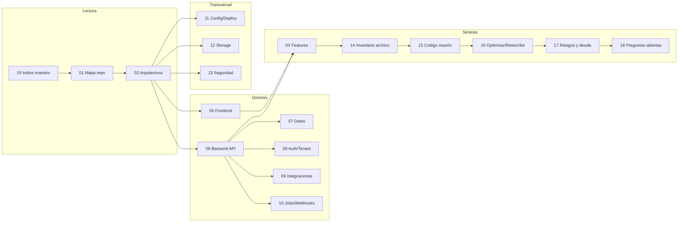

# 19 — Índice maestro de la auditoría Qora

Este documento es el punto de entrada (master index) de la auditoría técnica de **Qora**, una plataforma de call-center saliente impulsada por IA (ElevenLabs Conversational AI + custom-LLM GPT-4o + backend FastAPI + frontend React 19 + SQLite/SQLAlchemy, multi-tenant vía `backend/clients/*`).

La auditoría es **read-only**: describe el estado actual del producto tal como está implementado en el código, distingue intención de implementación y documenta hallazgos sin modificar el producto.

---

## 1. Índice de documentos

Inventario de todos los entregables presentes en `docs/Auditoria/`. Los enlaces son relativos a este directorio.

| # | Documento | Descripción en una línea |
|---|-----------|--------------------------|
| 01 | [01-mapa-del-repo.md](./01-mapa-del-repo.md) | Mapa general del repositorio: estructura de carpetas, stack, convenciones y puntos de entrada. |
| 02 | [02-arquitectura-general.md](./02-arquitectura-general.md) | Arquitectura del sistema: capas, componentes, flujo de una llamada y límites entre backend/frontend/integraciones. |
| 03 | [03-inventario-completo-de-features.md](./03-inventario-completo-de-features.md) | Inventario exhaustivo de features, distinguiendo lo implementado de lo parcial/dudoso/roadmap. |
| 04 | [04-flujos-de-usuario.md](./04-flujos-de-usuario.md) | Flujos de usuario principales (import de leads, lanzamiento de campañas, llamadas, análisis) de punta a punta. |
| 05 | [05-frontend-ui-rutas-pantallas.md](./05-frontend-ui-rutas-pantallas.md) | Frontend React: rutas, pantallas, áreas de `features/`, componentes de diseño y consumo de API. |
| 06 | [06-backend-api-servicios.md](./06-backend-api-servicios.md) | Backend FastAPI: routers, endpoints, servicios de dominio y organización de `app/`. |
| 07 | [07-modelo-de-datos.md](./07-modelo-de-datos.md) | Modelo de datos: entidades SQLAlchemy, schemas, relaciones y migraciones Alembic. |
| 08 | [08-auth-usuarios-roles-permisos.md](./08-auth-usuarios-roles-permisos.md) | Autenticación, gestión de usuarios, roles, permisos y aislamiento multi-tenant. |
| 09 | [09-integraciones-externas.md](./09-integraciones-externas.md) | Integraciones externas (ElevenLabs, OpenAI/GPT-4o, CRM y otros proveedores) y su estado de uso. |
| 10 | [10-webhooks-jobs-automatizaciones.md](./10-webhooks-jobs-automatizaciones.md) | Webhooks entrantes, jobs durables, scheduler y automatizaciones de fondo. |
| 11 | [11-configuracion-env-deployment.md](./11-configuracion-env-deployment.md) | Configuración, variables de entorno (solo nombres), settings y consideraciones de deployment. |
| 12 | [12-storage-archivos-uploads.md](./12-storage-archivos-uploads.md) | Storage, manejo de archivos, uploads (CSV de leads, audios) y artefactos estáticos. |
| 13 | [13-seguridad-observabilidad-errores.md](./13-seguridad-observabilidad-errores.md) | Seguridad, observabilidad, logging y manejo de errores transversal. |
| 14 | [14-inventario-archivo-por-archivo.md](./14-inventario-archivo-por-archivo.md) | Inventario narrativo archivo por archivo de los módulos clave (complementa el CSV). |
| 15 | [15-codigo-muerto-y-dudoso.md](./15-codigo-muerto-y-dudoso.md) | Código muerto, dead code probable, código dudoso, duplicado o legacy. |
| 16 | [16-cosas-a-sacar-optimizar-reescribir.md](./16-cosas-a-sacar-optimizar-reescribir.md) | Candidatos a remover, optimizar o reescribir, con justificación. |
| 17 | [17-riesgos-y-deuda-tecnica.md](./17-riesgos-y-deuda-tecnica.md) | Riesgos técnicos y de producto + deuda técnica priorizada. |
| 18 | [18-preguntas-abiertas.md](./18-preguntas-abiertas.md) | Preguntas abiertas que requieren validación humana o decisión de producto. |
| 19 | [19-indice-maestro.md](./19-indice-maestro.md) | Este documento: índice maestro, mapa módulo→documento y guía de lectura. |
| 20 | [20-historia-y-evolucion.md](./20-historia-y-evolucion.md) | Historia y evolución datada (2026-04-06 → 2026-06-25): línea de tiempo, decisiones clave, deprecaciones, reversiones/péndulos e intención vs. estado actual. |
| 21 | [21-revision-temporal-y-ajustes.md](./21-revision-temporal-y-ajustes.md) | Revisión temporal: reframes datados de hallazgos del audit (sin tocar el hecho de código) y "Posibles correcciones de hecho (revisión humana)". |
| — | [file-inventory.csv](./file-inventory.csv) | Inventario tabular machine-readable de archivos del repositorio (datos para el doc 14). |

> Nota de numeración: no existe un documento `00-*` en este directorio. La serie de contenido arranca en `01`. Ver la checklist de completitud (sección 4).

> **Nota de revisión temporal (2026-06-26):** los documentos **20** y **21** componen la **capa temporal/intención** que complementa la capa de **code-state** (docs 00–18). Los docs 00–18 describen lo que Qora **literalmente hace hoy** según el código; **20** lo fecha y reconstruye su evolución (PR#/commit/Engram/roadmap), y **21** reencuadra hallazgos del audit con su intención y secuencia de roadmap **sin modificar ningún hecho de código**. Donde un hallazgo de code-state parece alarmante, 20/21 aclaran si es defecto o decisión deliberada con fecha (p. ej. `ENABLE_JOB_EXECUTOR=false` apagado **por diseño**, B10 #119–#122 / Engram #2139, 2026-06-25). Fuente: `20-historia-y-evolucion.md` §0–§7; `docs/ROADMAP.md` (tabla de fases vigente).
>
> **Aviso de actualización (2026-06-26):** desde la redacción original de este índice se incorporó el documento **`00-resumen-ejecutivo.md`** (archivo presente en el directorio, 2026-06-26). La nota de numeración de arriba y la fila `00-*` de la checklist (sección 4) quedan **STALE** respecto a ese punto: la serie ya **incluye** un `00`. No se edita el texto original (additive-only); ver la fila de revisión en la sección 4. Adicionalmente, **`21-revision-temporal-y-ajustes.md`** se enlaza arriba como entregable de esta tanda; si aún no está presente en el directorio, su creación es parte de esta misma revisión temporal.

---

## 2. Mapa módulo → documento

Tabla de referencia cruzada para saltar desde un área de código hacia el/los documento(s) de auditoría que la cubren. Los módulos de backend corresponden a subdirectorios reales de `backend/app/` y `backend/clients/`; las áreas de frontend a `frontend/src/`. [Confirmado por codigo: estructura de directorios verificada vía `fd` sobre `backend/app` y `frontend/src`]

### Backend (`backend/app/`)

| Módulo / ruta | Responsabilidad inferida | Documento(s) primario(s) | Documento(s) de apoyo |
|---------------|--------------------------|--------------------------|-----------------------|
| `app/api/` | Routers y endpoints HTTP FastAPI | 06 | 02, 04, 08, 13 |
| `app/core/` | Config, settings, dependencias transversales | 11 | 02, 13 |
| `app/calls/` | Dominio de llamadas (orquestación, estado) | 06, 04 | 02, 03, 09 |
| `app/leads/` | Gestión de leads y campañas | 06, 04 | 03, 07, 12 |
| `app/clients/` (app) | Lógica por cliente / resolución de tenant | 08 | 02, 11 |
| `app/tenants/` | Multi-tenancy y aislamiento | 08 | 02, 07 |
| `app/elevenlabs/` | Integración ElevenLabs Conversational AI | 09 | 02, 10 |
| `app/ai/` + `app/agents/` + `app/prompts/` | Custom-LLM GPT-4o, agentes y prompts | 09 | 02, 03 |
| `app/analysis/` + `app/analytics/` | Análisis de llamadas y métricas | 03, 06 | 07 |
| `app/integrations/` | Integraciones externas (CRM, etc.) | 09 | 10 |
| `app/jobs/` | Jobs durables / executor de fondo | 10 | 02, 13 |
| `app/scheduler/` | Scheduling / cron | 10 | — |
| `app/voice/` | Procesamiento de voz/audio | 09, 12 | 03 |
| `app/tools/` | Tool-calling expuesto al LLM | 09 | 06 |
| `app/static/` | Activos estáticos servidos | 12 | — |
| `app/demo/` | Funcionalidad de demo | 03 | 15 |
| `backend/alembic/` | Migraciones de esquema | 07 | 11 |
| `backend/clients/*` | Configuración por tenant (`_template`, `qora-demo`, `quintana-seguros`) | 08, 11 | 02, 03 |
| `backend/scripts/` + `qora_cli.py` | Scripts operativos y CLI | 11 | 10, 15 |

### Frontend (`frontend/src/`)

| Área / ruta | Responsabilidad inferida | Documento(s) primario(s) | Documento(s) de apoyo |
|-------------|--------------------------|--------------------------|-----------------------|
| `src/features/dashboard/` | Pantalla principal / dashboard | 05 | 04 |
| `src/features/leads/` | Gestión de leads en UI | 05 | 04, 03 |
| `src/features/import/` | Import de leads (CSV) | 05 | 04, 12 |
| `src/features/calls/` | Vista de llamadas | 05 | 04 |
| `src/features/analytics/` | Analítica en UI | 05 | 03 |
| `src/features/admin/` | Administración / configuración | 05 | 08 |
| `src/api/` | Cliente HTTP y consumo de endpoints | 05 | 06 |
| `src/design/` + `src/design/components/` | Sistema de diseño y componentes | 05 | — |
| `src/hooks/` + `src/lib/` + `src/config/` | Hooks, utilidades y config de frontend | 05 | 11 |

### Temas transversales

| Tema | Documento(s) |
|------|--------------|
| Autenticación / roles / permisos / multi-tenant | 08 |
| Integraciones externas (ElevenLabs, OpenAI, CRM) | 09 |
| Webhooks / jobs / scheduler / automatizaciones | 10 |
| Configuración, env vars, deployment | 11 |
| Storage / uploads / archivos | 12 |
| Seguridad / observabilidad / logging / errores | 13 |
| Modelo de datos y migraciones | 07 |
| Código muerto / dudoso / legacy | 15 |
| Candidatos a remover/optimizar/reescribir | 16 |
| Riesgos y deuda técnica | 17 |
| Preguntas abiertas / validación humana | 18 |

---

## 3. Cómo leer esta auditoría

Recorrido recomendado según el objetivo del lector:

- **Entender el producto rápido**: 01 (mapa) → 02 (arquitectura) → 03 (features) → 04 (flujos de usuario).
- **Trabajar sobre backend**: 02 → 06 (API/servicios) → 07 (datos) → 09/10 (integraciones y jobs).
- **Trabajar sobre frontend**: 02 → 05 (UI/rutas) → 04 (flujos) → 06 (contratos de API).
- **Evaluar riesgo / decidir qué tocar**: 13 (seguridad) → 15 (código muerto) → 16 (optimizar) → 17 (riesgos y deuda) → 18 (preguntas abiertas).
- **Operación / despliegue**: 08 (auth/tenant) → 11 (config/env/deploy) → 12 (storage).
- **Búsqueda fina por archivo**: 14 (inventario narrativo) junto a `file-inventory.csv` (datos tabulares).
- **Fechar un hallazgo / distinguir intención de defecto**: 20 (historia y evolución datada) → 21 (revisión temporal y reframes). Antes de tratar un hallazgo de los docs 13/15/16/17/18 como "roto", verificar en 20/21 si es deuda real o decisión deliberada con fecha (PR#/roadmap/Engram).

> **Nota de revisión temporal (2026-06-26):** los docs 00–18 son la **capa de code-state** (qué hace Qora hoy según el código); 20 y 21 son la **capa temporal/intención** que la complementa **sin alterarla**. Si un hallazgo del audit parece alarmante, contrastarlo con 20 (`§6 Intención vs. estado actual`, `§7 Reversiones y péndulos`) y 21 antes de accionar. Ejemplos ya reencuadrados con fecha: el scheduler "no marca" = roadmap **Phase C** no iniciada por diseño (código #26 2026-04-23 "Twilio dialing is Phase 8" → ROADMAP Phase C); `ENABLE_JOB_EXECUTOR=false` = rollout **gateado por diseño** (B10 #119–#122, Engram #2139/#2142, 2026-06-25); defaults de seguridad abiertos = postura **pre-deploy** con B5/B6/B7 ya construidos (#107/#109/#111, 2026-06-22/23). Fuente: `20-historia-y-evolucion.md`; `docs/ROADMAP.md` (tabla de fases).

Principios de la auditoría:

- **El código manda sobre la documentación.** La carpeta `docs/` preexistente puede estar desactualizada; cada afirmación se verificó contra el código y se anotan discrepancias.
- **Se distingue intención de implementación.** Lo que está solo en comentarios, TODOs o código desconectado se marca como dudoso/parcial/posible dead code.
- **Cada afirmación relevante lleva evidencia** (ruta de archivo + símbolo, y línea cuando aporta) y una etiqueta de clasificación.

---

## 4. Checklist de completitud

Estado de los entregables requeridos (00–19 + `file-inventory.csv`).

| Entregable | Esperado | Presente | Observación |
|------------|----------|----------|-------------|
| `00-*` | Sí (según rango 00–18) | **No** | No existe documento `00`. La numeración de contenido inicia en `01`. **[Necesita validacion humana]**: confirmar si `00` se planeó como portada/resumen ejecutivo y se omitió, o si la serie arranca deliberadamente en `01`. |
| `01-mapa-del-repo.md` | Sí | Sí | — |
| `02-arquitectura-general.md` | Sí | Sí | — |
| `03-inventario-completo-de-features.md` | Sí | Sí | — |
| `04-flujos-de-usuario.md` | Sí | Sí | — |
| `05-frontend-ui-rutas-pantallas.md` | Sí | Sí | — |
| `06-backend-api-servicios.md` | Sí | Sí | — |
| `07-modelo-de-datos.md` | Sí | Sí | — |
| `08-auth-usuarios-roles-permisos.md` | Sí | Sí | — |
| `09-integraciones-externas.md` | Sí | Sí | — |
| `10-webhooks-jobs-automatizaciones.md` | Sí | Sí | — |
| `11-configuracion-env-deployment.md` | Sí | Sí | — |
| `12-storage-archivos-uploads.md` | Sí | Sí | — |
| `13-seguridad-observabilidad-errores.md` | Sí | Sí | — |
| `14-inventario-archivo-por-archivo.md` | Sí | Sí | — |
| `15-codigo-muerto-y-dudoso.md` | Sí | Sí | — |
| `16-cosas-a-sacar-optimizar-reescribir.md` | Sí | Sí | — |
| `17-riesgos-y-deuda-tecnica.md` | Sí | Sí | — |
| `18-preguntas-abiertas.md` | Sí | Sí | — |
| `19-indice-maestro.md` | Sí | Sí | Este documento. |
| `20-historia-y-evolucion.md` | Sí (capa temporal) | Sí | Historia datada 2026-04-06 → 2026-06-25. **Añadido 2026-06-26.** |
| `21-revision-temporal-y-ajustes.md` | Sí (capa temporal) | Ver nota | Reframes datados + correcciones de hecho para revisión humana. **Entregable de esta tanda (2026-06-26);** si aún no está en el directorio, su creación forma parte de esta revisión. |
| `file-inventory.csv` | Sí | Sí | ~107 KB; datos tabulares del inventario. |

**Resumen**: presentes 19 documentos Markdown (`01`–`19`) + `file-inventory.csv`. **Falta** únicamente un documento `00`; el resto del rango requerido está completo. [Confirmado por codigo: listado de directorio `docs/Auditoria/` vía `eza`]

> **Nota de revisión temporal (2026-06-26):** la fila `00-*` y el Resumen de arriba quedan **STALE** desde 2026-06-26. Un nuevo listado read-only del directorio (`eza -la docs/Auditoria/`, 2026-06-26) muestra **`00-resumen-ejecutivo.md` presente** (~14 KB). Por lo tanto **el documento `00` SÍ existe**: la afirmación original "Falta únicamente un documento `00`" y el "**No**" de la fila `00-*` ya no son ciertos. No se edita el texto original (revisión additive-only); esta nota lo supersede con fecha y fuente. Asimismo se incorporaron los documentos de capa temporal **20** (presente) y **21** (entregable de esta tanda). [Confirmado por codigo: `eza` sobre `docs/Auditoria/`, 2026-06-26]

---

## 5. Leyenda de clasificación de evidencia

Cada afirmación significativa en esta auditoría está etiquetada con una de las siguientes categorías:

- **[Confirmado por codigo]** — Verificado directamente leyendo el código fuente, configuración o salida de comandos read-only. Es un hecho del repositorio actual.
- **[Inferido razonablemente]** — Conclusión derivada de evidencia parcial (nombres, estructura, convenciones, fragmentos) con alta probabilidad, pero sin verificación completa de extremo a extremo.
- **[Necesita validacion humana]** — No se puede confirmar solo con el código (decisión de producto, intención, dato externo, comportamiento en runtime); requiere confirmación de una persona del equipo.

Marcadores cualitativos complementarios usados a lo largo de los documentos: `dudoso`, `parcial`, `posible dead code`, `legacy`, `duplicado`, `configurado pero sin uso`, `UI sin backend` / `API sin consumidor`.
