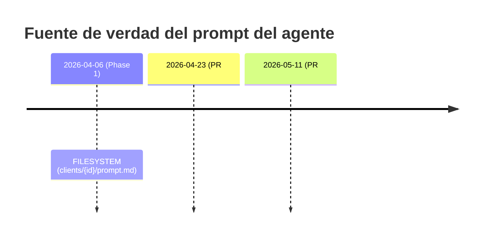

# 20 — Historia y evolución del proyecto Qora

> **Propósito de este documento.** Reconstruir la evolución de Qora desde su primer commit (2026-04-06) hasta el cierre de la fase B10 (2026-06-25), con **disciplina de datación estricta**: cada hito lleva su fecha (`YYYY-MM-DD`) y su fuente (PR#, hash de commit, ID de Engram o sección del roadmap). Cuando un cambio posterior **supersede o contradice** uno anterior, se citan **ambas fechas** de forma explícita.
>
> **Relación con la auditoría de code-state (docs 00–19).** Este documento **no modifica** ningún hecho de código de la auditoría. Solo **añade contexto temporal e intención** y, donde corresponde, suaviza el *framing* de riesgo (p. ej., un flag apagado por diseño no es un defecto). Si la historia revela que un hecho de code-state del audit es realmente **erróneo**, no se edita aquí: se registra en `21-revision-temporal-y-ajustes.md` bajo "Posibles correcciones de hecho (revisión humana)".

---

## Tabla de contenidos

1. [Línea de tiempo maestra](#1-línea-de-tiempo-maestra)
2. [Capítulos por época](#2-capítulos-por-época)
3. [La vista desde Engram](#3-la-vista-desde-engram)
4. [Decisiones clave y cuándo se tomaron](#4-decisiones-clave-y-cuándo-se-tomaron)
5. [Qué se eliminó o deprecó y cuándo](#5-qué-se-eliminó-o-deprecó-y-cuándo)
6. [Intención vs. estado actual](#6-intención-vs-estado-actual-planificado-pero-no-construido)
7. [Reversiones y péndulos (citando ambas fechas)](#7-reversiones-y-péndulos-citando-ambas-fechas)

---

## 1. Línea de tiempo maestra

> Fuente: `git log`, `gh pr view`, artefactos OpenSpec/SDD y `docs/ROADMAP.md`. Las entradas tempranas (abr–jun) referencian **hashes de commit / PR#** porque Engram no tiene memoria persistida de ese período (ver §3).

| Fecha | Hito | Fuente | Qué cambió |
|---|---|---|---|
| 2026-04-06 | Phase 0 — MVP AI call center (génesis del repo) | commit `6d76ecf` | Primer commit de QORA. ElevenLabs ConvAI por WebSocket + webhook Custom LLM (FastAPI/SSE) + GPT-4o como cerebro bajo control del backend. Agente Jaumpablo, CRM mock SQLite. Define la **arquitectura de capas** vigente. |
| 2026-04-06 | Phase 1 — fundación multi-cliente | commit `66f9e16` | `PromptLoader` desde `clients/{id}/prompt.md` (prompt en **filesystem**), KB por cliente, Client CRUD, CLI `qora_cli.py`. 2.º cliente piloto. 220 tests. |
| 2026-04-20 | Phase 2 — loop de memoria cross-call | commit `c4c0d89` | Resolución de tenant, continuidad de sesión vinculada a lead, inyección de memoria en el prompt. `app/memory.py`, summarizer, sweeper. 342 tests. |
| 2026-04-21 | Sistema de transcript + separación de *filler* | PR #16 | Schemas Pydantic, persistencia de turnos tool_call/tool_result, *filler* guardado como turno separado (`filler_detected=true`). **Nace el concepto "filler".** |
| 2026-04-23 | Call scheduler — agenda con retry, **SIN dialing** | PR #26 (`1c3bb06`) | `ScheduledCall` (ciclo `pending→ready→…`), auto-scheduling post-call, tool `schedule_followup`, tick en background. **Solo cola**; el dialing real se difiere a "Phase 8 (Twilio)". |
| 2026-04-23 | Entidad `Agent` (1 cliente → N agentes) | PR #28 | Agent de primera clase; **migra el prompt de filesystem → DB** (`Agent.system_prompt`). Backward-compatible. |
| 2026-04-28 / 04-29 | n8n agregado y descomisionado al día siguiente | `3758360` (add) / `6872f3f` (decommission) | n8n como capa de orquestación observable de post-call → reemplazado **1 día después** por pipeline GPT por-dimensión nativo. Artefactos muertos hasta #89. |
| 2026-05-11 | Prompts desde filesystem otra vez (revierte #28) | PR #75 | `clients/{id}/agents/{slug}/system-prompt.md` vuelve a ser fuente de verdad; DB queda como **fallback legacy**. |
| 2026-05-11 | Eliminación total del sistema filler/muletilla | PR #76 | −744 líneas. Borra `select_filler()` y `_persist_filler_turn()`; `filler.py→session.py`; −27 tests. Conserva la columna `filler_detected`. |
| 2026-05-11 | Cache de contexto por sesión + reestructura de prompt | PR #77 | Contexto de voz armado **una vez** por llamada (0 queries DB/turno; latencia 50–170ms → 12ms). Patrón "soul corto + skills modulares". 1538 tests. |
| 2026-05-12 | Naturalidad del demo Qora (Sofia, voz rioplatense) | PR #79 | Reescritura del SOUL, overrides browser-side GPT-4o + tuning TTS con fallback seguro. |
| 2026-05-13 | Carga dinámica de skills on-demand + tool `load_skill` | PR #80 | `registry.yaml` por agente (índice liviano), tool `load_skill` con allowlist (anti path-traversal). Elimina el glob-all. **Reintroduce filler SPEECH** (frase de espera antes de un tool). |
| 2026-05-13 | Extracción de tool definitions a módulos por-tool | PR #81 | Refactor puro. `app/tools/registry.py` ensambla `TOOL_DEFINITIONS`. 1692 tests, cero regresiones. |
| 2026-05-13 | Persistir skills entre turnos + pausa de filler | PR #83 | Cachea `loaded_skills` en `ConversationState` (ElevenLabs Custom-LLM es **stateless por turno**). Pausa 0.7s (`FILLER_PAUSE_SECONDS`). 1710 tests. |
| 2026-05-15/17 | MVP readiness — docs + limpieza de código muerto | PR #89 | −4.679 líneas: `app/ai/llm.py` (no usado), `app/voice/debug.py`, scripts stale y **todos los artefactos n8n**. Cierra el arco n8n. |
| 2026-05-19 | Vista de detalle de llamada + skill `qora-agent-designer` | PR #91 | `GET /api/v1/calls/{session_id}/analysis` (12 dimensiones), `CallDetailPage`/`CallAnalysisPanel`, fix `misc_notes` (dict vs list → 500 silenciosos). 1719 tests. |
| 2026-05-22 | Agente "Juanma" (Quintana) + selector de agente en demo | PR #96 (`0c4b0d1`) | Dropdown de agentes desde `GET /clients/{id}/agents`; `agent_slug` en dynamic_variables. Borra `knowledge.md`/`prompt.md` legacy. |
| 2026-05-23 | Tools configurables + contexto single-channel | PR #98 (`4365c6f`) | `tool_config` JSON por agente; **retira del runtime los tools de cambio de estado** (`register_interest`, `mark_not_interested`, `schedule_followup`) → transición a post-call (`apply_status_from_next_action`). Guards de aislamiento tenant. |
| 2026-05-24 | Docs comparativos de 4 modos de pipeline de voz | commit `ae15835` | Compara vapi/retell/self-hosted/hybrid. **Solo documental — ninguno implementado.** Mapea a Phase C. |
| 2026-05-26 | Config programática de agentes ElevenLabs | PR #99 (`b43b8b0`,`c4be932`) | `ElevenLabsService` (PATCH ConvAI), soft-timeout sync, `POST /{agent_id}/sync-elevenlabs`, background audio, `tts_model`. |
| 2026-05-26 | Quitar `broker_name`, deprecar `extracted_facts`, fix `car_model` | PR #100 (`8610a9e`,`b2ee389`) | `broker_name` → `client.name`; `call_sessions.extracted_facts` **DEPRECATED** (verdad → `call_analyses`). 55 archivos. |
| 2026-05-29 | Servicio sync CRM Airtable + dispatcher post-call | `dfefed0`,`8b4051b`,`2eccb92` | Mapeo de campos CRM, `AirtableService` (+2894 líneas), dispatcher **opt-in**, adapters per-provider, sandbox Quintana (`crm.yaml`). Único adapter real: **Airtable**. |
| 2026-05-30 | Import de leads Airtable + estado `quoted`/zona/`is_quote_ready` | `17bd1a1`,`a4dab68` | Import bidireccional con "status safety" (+1514 líneas). **Origen del known-issue P2** (`leads.status` mezcla CRM vs interno). |
| 2026-06-02 | SQLite WAL + `busy_timeout=5000ms` | commit `9e9a17c` | Lectura/escritura concurrente (sync CRM + webhooks + API). **Vigente.** |
| 2026-06-02 | `external_lead_id` para matching por ID de Meta | `3294f38` | Match en cascada `lead_id → external_lead_id → external_crm_id → email → skip`. 16 tests TDD. |
| 2026-06-08 | Rediseño de UI → Qora Design System | `0ede236`,`3d4a795` | Tokens, componentes, layout, tema light/admin. 45 archivos, +3293 líneas. |
| 2026-06-08 | API REST de config CRM + docs de producto | `a0666f5` | Configurar mapeo CRM por API/UI. `docs/Qora-Producto.md`, `docs/pricing.md`. |
| 2026-06-08 | `LeadCustomField` (key-value por cliente) | `0c3bcf8` (merge `76bbe09`) | Modelo de lead en **3 niveles**: `leads` + `lead_custom_fields` + `lead_profile_facts`. Migra las 6 columnas Quintana (no las borra). `register_interest` **eliminado por completo**. |
| 2026-06-10 | UI de mapeo Airtable + `capture_data` parcial | commit `7dd2526` | Cierra dynamic-lead-fields E2E. Quedan known-issues P3 (mapping UI polish, remount flicker). |
| 2026-06-10 | Se crea `docs/ROADMAP.md` (fases A–E) | commit `573ece3` | Plan de producción + known-issues P2–P4. **Prosa "Current State" con "No authentication"** (cierta a esta fecha, luego stale). |
| 2026-06-17 | Vista de detalle de lead orientada a inspección | commit `562fa4f` | Endpoint agregado de detalle (campos, custom fields, historial, analyses, profile facts, quote readiness). Cubre A1–A7. |
| 2026-06-17 | Dimensiones post-call BI-friendly (SDD Fases 1–2) | `36197e0` | `zona` como custom_field; `current_provider` → "sales blocker contextual"; "comparison" sale de pain_points; `NEED_TAGS` allowlist. |
| 2026-06-17 | Columnas denormalizadas BI + filtrado de profile facts | `97c297e` | 5 columnas en `CallAnalysis`, `analytics/service.py` usa columnas indexadas (no `json_each()`), reglas de exclusión en `profile_facts.py`. |
| 2026-06-17 | Vistas localizadas: registro de labels + paridad CRM | `35add23` | `crm_parity.py`, `dimension-labels.ts`. **Regla rectora:** códigos backend en **inglés estable**, labels de display por idioma. |
| 2026-06-18 | Rankings de dimensiones acumuladas (nivel lead) | `ec81102` | `GET /leads/{id}/dimension-rollups`. **Fix de bug:** el rollup leía `CallSession.extracted_facts` (deprecado el 05-26) → reapunta a `call_analyses`. |
| 2026-06-18 | Phase A marcada **COMPLETA** | `33d7866` | A1–A7 = `[x]`; header `Last updated` 06-10 → 06-18. (La prosa "No authentication" **siguió stale**.) |
| 2026-06-19 | **B4** — fundación de migraciones Alembic | PR #103 (`5fc58c3`,`d483023`) | Reemplaza el DDL de arranque + 14 scripts `migrate_*.py` (DEPRECATED). `backend/scripts/migrate.py`, `alembic/`. SQLite sigue siendo primaria. 2373 tests. |
| 2026-06-20 | **B1** — contenedorización Docker | PR #105 (`8518743`) | Dockerfile multi-stage (puerto único 8000, no-root), `docker-compose.yml` (volumen `qora-data`), entrypoint con migración Alembic. 2428 tests. |
| 2026-06-22/23 | **B5 PR#1** — auth de API admin | PR #107 (`08e215c`) | `core/auth.py`, `require_api_key` (Bearer), routers admin protegidos. Frontend inyecta `Authorization` si `VITE_API_KEY`. 2456 tests. |
| 2026-06-23 | **B5 PR#2** — auth de demo con alcance de sesión | PR #109 (`efd112c`) | `AuthorizedSession` (sin lookups de auth por turno), scope read/write, tools **fail-closed**. Endpoints demo sin exponer keys admin. 2488 tests. |
| 2026-06-23 | **B6/B7** — webhooks protegidos + CORS configurable | PR #111 (`61c8918`) | `require_webhook_secret` (comparación de tiempo constante), **opt-in** (`QORA_WEBHOOK_AUTH_ENABLED=false`). `QORA_ALLOWED_ORIGINS` reemplaza allow-all hardcodeado. 2527 tests. |
| 2026-06-24 | **B8 PR#1** — validación central de secretos | PR #113 (`d02752d`) | `config.py` rechaza secretos faltantes/placeholders en arranque. `core/credentials.py`, convención "enabled" en CRM. 2611 tests. |
| 2026-06-24 | **B8 PR#2** — preflight de secretos + docs de entorno | PR #115 (`91d9c97`) | `scripts/check-secrets.py` (JSON, placeholders, dead vars). `.env` raíz = fuente de verdad; `docs/ops/secrets-management.md`. 2650 tests. |
| 2026-06-24 | Higiene de warnings en la suite | PR #117 (`187f805`) | Reemplaza inspección SQLAlchemy deprecada, fija AsyncMock/ResourceWarnings. **Deuda residual reconocida:** `-W error` aún requiere limpieza sistémica de aiosqlite. |
| 2026-06-25 | **B10** — fundación del ejecutor durable | PR #119 (`17f1881`) | Módulo `app/jobs/`, tabla `background_jobs` (Alembic `0002`), `JobExecutor` (retry backoff+jitter, máx 3 → dead), `recover()` en arranque. +3294 líneas, 2684 tests. |
| 2026-06-25 | **B10 PR 2a** — jobs de summarization durables | PR #120 (`f633c43`) | `generate_summary_and_facts_durable()`; encola tras `ENABLE_JOB_EXECUTOR=true`, preserva legacy si false. 2696 tests. |
| 2026-06-25 | **B10 PR 2b** — jobs de CRM sync durables + visibilidad | PR #121 (`90e4103`) | `crm_sync.py` con clasificación transitorio vs config/permanente (`operator_review`), `jobs/queries.py` (groundwork B9). 2711 tests, 0 warnings. |
| 2026-06-25 | **B10 PR 3** — finalización de transcript **off-call** | PR #122 (`b3dd320`) | `transcript_flush.py`, columnas `transcript_finalized_at`/`turn_count` (Alembic `0003`). **Prohíbe jobs durables per-turn en llamada en vivo.** `max_attempts=2`. 2737 tests. |
| 2026-06-25 | B10 marcado completo + guía de operación | `d9afe17` + `docs/ops/background-jobs.md` | ROADMAP fila B10 = `[x]`. Documenta `ENABLE_JOB_EXECUTOR` (default false), los 3 job_type y el ciclo de vida. |
| 2026-06-25 | Engram registra B10 | Engram #2139, #2142 | Rollout **gateado por diseño** (`ENABLE_JOB_EXECUTOR=false` deliberado), latencia en vivo sagrada, próxima fase B9 → luego B2. |

---

## 2. Capítulos por época

### Capítulo I — Génesis (2026-04-06)

Qora (Quintana Operational Response Architecture) nace el **2026-04-06** con dos commits el mismo día: Phase 0 (`6d76ecf`, MVP de call center) y Phase 1 (`66f9e16`, fundación multi-cliente). La decisión arquitectónica que **sigue vigente** hoy se toma aquí: separar la **capa de voz** (ElevenLabs: STT/TTS/VAD/turn-taking) de la **capa de inteligencia** (backend FastAPI: LLM GPT-4o vía webhook Custom-LLM/SSE, lógica de negocio, CRM). El objetivo declarado era poder reemplazar cualquier componente sin tocar los demás.

**Gotcha estructural fundacional** (recurrente en toda la historia): el protocolo Custom-LLM de ElevenLabs es **stateless por turno**. Toda continuidad (sesión, skills cargadas, memoria) debe vivir en el backend. Esta característica es la causa raíz del bug que se fija en #83 (2026-05-13) y la razón de la regla off-call de #122 (2026-06-25).

Stack inicial: Python 3.11 + FastAPI + SQLite, OpenAI GPT-4o, ElevenLabs ConvAI, frontend vanilla JS (luego React 19 + Vite + Tailwind v4). **SQLite es una decisión sostenida**: el roadmap de junio confirma "quedarse en SQLite" (B3 Postgres deferido).

### Capítulo II — Voz y Skills (mayo 2026)

Tras construir la memoria cross-call (#16, #26, #28 en abril), mayo es la **era de la capa de voz y las skills dinámicas**. El hilo:

1. **Reestructura del prompt** (#77, 2026-05-11): el system prompt monolítico de 20.8K se parte en un "soul" corto + skills modulares; el contexto se cachea una vez por sesión (latencia 50–170ms → 12ms).
2. **Carga dinámica on-demand** (#80, 2026-05-13): inspirada en el lazy-loading de OpenCode, el agente carga la skill que necesita a mitad de conversación vía `load_skill`, con `registry.yaml` obligatorio por agente como guardrail (sin registry = sin skills, por diseño).
3. **Persistencia de skills entre turnos** (#83, 2026-05-13): se cachean en `ConversationState` porque ElevenLabs reejecutaba `load_skill` en cada turno (consecuencia directa del statelessness fundacional).

Esta era corre **en paralelo** a un track intenso de "dimensiones de análisis post-call" (PRs #34–#68, abr–may) que pertenece conceptualmente a la inteligencia de leads (Phase A) y aquí solo se referencia como contexto.

### Capítulo III — CRM y Custom Fields (fines de mayo – junio 2026)

Tema: pasar de un producto **hardcodeado para Quintana Seguros** a una base **multi-tenant configurable**. El hilo conductor es "sacar lo hardcodeado de seguros" en tres capas:

- **Tool runtime** (#98, 2026-05-23): tools configurables por agente; los tools de cambio de estado salen del runtime.
- **Datos de cliente** (`LeadCustomField`, 2026-06-08): las 6 columnas hardcodeadas de seguros (las del mayor bloqueante de multi-tenancy) se reemplazan por un modelo key-value de 3 niveles.
- **Mapeo CRM** (2026-06-08/06-10): la integración Airtable se vuelve configurable por API/UI.

En paralelo se construye el **sync CRM con Airtable** (#99 en adelante) — bidireccional, opt-in — y la nueva identidad visual (**Qora Design System**, 2026-06-08).

### Capítulo IV — Análisis BI y cierre de Phase A (mediados de junio 2026)

Viraje de UI "cards decorativas" hacia **analítica orientada a inspección/BI**. La decisión arquitectónica central de la era (2026-06-17, `35add23`): **códigos de backend en inglés estable** (un `GROUP BY` no debe romperse por idioma del cliente); los labels de display se resuelven vía registro por idioma. Se denormalizan columnas BI para evitar la gimnasia de `json_each()` y se corrige un bug encadenado: el `DimensionRollupsSection` leía `CallSession.extracted_facts` (deprecado el 2026-05-26) y salía vacío ~3 semanas, hasta el fix de `ec81102` (2026-06-18). **Phase A se marca COMPLETA el 2026-06-18** (`33d7866`).

Particularidad de proceso: estos cambios se mergearon **directo a main** (sin PR numerado), planificados vía dos changes OpenSpec (`post-call-analysis-bi-friendly`, `cubora-accumulated-dimension-rankings`). Por eso los refs son hashes, no PR#.

### Capítulo V — Phase B: fundación de infraestructura (2026-06-19 a 06-24)

Arco coherente de "production foundation" en orden deliberado: **esquema reproducible → empaquetado → endurecimiento de seguridad → validación de secretos**.

```
B4 Alembic (#103, 06-19) → B1 Docker (#105, 06-20)
  → B5/B6/B7 Auth+CORS (#107/#109/#111, 06-22/23)
  → B8 Secretos (#113/#115, 06-24) → limpieza (#117, 06-24)
```

**B2 (deploy a VPS/cloud) se deja a propósito para el final**, "después del endurecimiento de seguridad", y **no ocurre en esta era**. La auth se entrega como serie *stacked-to-main* y cierra la brecha "No authentication" que era el mayor bloqueante de seguridad.

### Capítulo VI — B10: durabilidad de jobs en segundo plano (2026-06-25)

En un solo día, **4 PRs apilados** (#119 → #120 → #121 → #122) reemplazan el patrón `asyncio.create_task` fire-and-forget (que perdía silenciosamente el trabajo post-call en cada reinicio) por **jobs durables respaldados por DB** que sobreviven reinicios, con retry, dead-lettering y barrido de recuperación en arranque.

La **regla de producto dura** confirmada por el usuario marca el diseño: **durante llamadas en vivo, Qora no debe agregar NADA nuevo** porque la latencia en tiempo real es una restricción innegociable. Por eso toda la durabilidad de transcript corre **off-call** (antes de iniciar, tras fin normal, o tras corte/desconexión) — nunca per-turn durante el streaming SSE.

Es además la **primera era con revisión adversarial sistemática** (fresh-context reliability/risk reviews por slice), que atrapó blockers reales (race de commit en el enqueue, errores de handler tragados, registro de handler faltante).

---

## 3. La vista desde Engram

> **Hallazgo explícito (para el lector del audit):**

**Engram tiene esencialmente CERO memoria persistida antes de ~2026-06-24.** Búsquedas amplias por arquitectura temprana, pipeline de análisis, CRM/Airtable, voz/skills, migraciones y auth/CORS devuelven todas "No memories found". Engram se adoptó sistemáticamente **recién en la era B10** (fines de junio 2026).

**Implicaciones:**

- "El proyecto visto a través de Engram" equivale **únicamente** al capítulo B10 (2026-06-25) más la disciplina de revisión que se volvió estándar entonces.
- **Toda la historia profunda (abril a mediados de junio 2026) vive solo en PRs/commits/SDD/OpenSpec/docs**, no en Engram. Para fechar correctamente cualquier afirmación de ese período hay que ir a `git log`/`gh pr view`/`openspec/changes/`, no a la memoria persistida.
- La memoria B10 (toda del 2026-06-25) incluye: `#2139` [architecture] (cierre de B10), `#2142` [session_summary] (preferencias del usuario + next steps), y ~15 observaciones de revisión adversarial.

No tratar la ausencia de Engram temprano como "no pasó nada": pasó casi todo el producto. Es una limitación de la herramienta de memoria, no del registro histórico (que sí existe en git).

---

## 4. Decisiones clave y cuándo se tomaron

| Decisión | Fecha | Fuente | Estado actual |
|---|---|---|---|
| Separación capa de voz / capa de inteligencia | 2026-04-06 | `6d76ecf` | **Vigente** — arquitectura fundacional. |
| Custom-LLM stateless → toda continuidad en el backend | 2026-04-06 | `6d76ecf` | **Vigente** — gotcha estructural permanente. |
| Scheduler queue-only; dialing diferido a "Phase 8" | 2026-04-23 | PR #26 | **Vigente** — "Phase 8" = Phase C del roadmap, no iniciada. |
| Eliminar sistema filler/muletilla automático | 2026-05-11 | PR #76 | **Vigente** — eliminado de raíz (−744 líneas). |
| Reintroducir filler **speech** antes de tools | 2026-05-13 | PR #80, #83 | **Vigente** — concepto distinto al #76 (ver §7). |
| Registry obligatorio por agente (sin glob-all) | 2026-05-13 | PR #80 | **Vigente** — sin registry = sin skills, por diseño. |
| Estado del lead se decide en **post-call**, no en runtime | 2026-05-23 | PR #98 | **Vigente** — `apply_status_from_next_action`. Profundizado el 06-08 (eliminación de `register_interest`). |
| `client.name` reemplaza `broker_name` | 2026-05-26 | PR #100 | **Vigente** — `{{broker_name}}` queda como variable deprecada. |
| `call_analyses` = única fuente de verdad (vs `extracted_facts`) | 2026-05-26 | PR #100 | **Vigente** — `extracted_facts` deprecado, no eliminado. |
| Modelo de lead en 3 niveles (key-value) | 2026-06-08 | `0c3bcf8` | **Vigente** — las 6 columnas viejas conviven deprecadas en sitio. |
| Códigos backend en inglés estable, labels localizados | 2026-06-17 | `35add23` | **Vigente** — decisión rectora de la era BI. |
| Alembic reemplaza el DDL de arranque | 2026-06-19 | PR #103 | **Vigente** — 14 scripts `migrate_*.py` DEPRECATED. Supersede el patrón "migración en arranque". |
| Auth opt-in / fail-closed por defecto seguro | 2026-06-23 | PR #107/#109/#111 | **Vigente** — capability ≠ enforcement por defecto (ver §6). |
| CORS configurable reemplaza allow-all (producción) | 2026-06-23 | PR #111 | **Vigente** — `QORA_ALLOWED_ORIGINS`. |
| Jobs durables **gateados OFF** por diseño | 2026-06-25 | PR #119–#122 | **Vigente** — `ENABLE_JOB_EXECUTOR=false`, activación post-deploy planificada. |
| Latencia en vivo sagrada → transcript solo off-call | 2026-06-25 | PR #122, Engram #2142 | **Vigente** — jobs durables per-turn prohibidos en llamada en vivo. |

---

## 5. Qué se eliminó o deprecó y cuándo

| Elemento | Acción | Fecha | Fuente | Nota |
|---|---|---|---|---|
| Runtime n8n | Descomisionado | 2026-04-29 | `6872f3f` | Reemplazado por pipeline GPT por-dimensión. |
| Artefactos n8n (compose, docs, workflows JSON) | **Borrados físicamente** | 2026-05-15/17 | PR #89 | Vivieron muertos ~17 días tras el descomisionado. **Si el audit menciona n8n como presente, es stale: nunca quedó en el producto.** |
| Sistema filler/muletilla automático | Eliminado de raíz | 2026-05-11 | PR #76 | −744 líneas, −27 tests. Columna `filler_detected` conservada (sin migración). |
| `app/ai/llm.py` (`GPT4oClient`, 313 líneas, 0 imports) | Borrado | 2026-05-15/17 | PR #89 | Código muerto. |
| `app/voice/debug.py` (endpoints debug temporales) | Borrado | 2026-05-15/17 | PR #89 | — |
| `quintana-seguros/knowledge.md` y `prompt.md` legacy | Borrados | 2026-05-22 | PR #96 | Ya migrados a DB. |
| `register_interest`, `mark_not_interested`, `schedule_followup` (runtime) | Retirados del runtime | 2026-05-23 | PR #98 | Transición de estado movida a post-call. |
| `register_interest` (por completo) | Eliminado | 2026-06-08 | `0c3bcf8` | Profundiza el giro de #98. |
| Columna `broker_name` (en `clients`) | Eliminada | 2026-05-26 | PR #100 | Reemplazada por `client.name`. |
| `call_sessions.extracted_facts` | **Deprecada (no eliminada)** | 2026-05-26 | PR #100 | Sigue escribiéndose con comentarios de deprecación. |
| 6 columnas Quintana (`car_make/car_model/car_year/current_insurance/age/zona`) | **Deprecadas en sitio (no dropeadas)** | 2026-06-08 | `0c3bcf8` | `DROP COLUMN` diferido. El esquema actual **aún las contiene**; conviven modelo viejo (columnas) y nuevo (key-value). |
| 14 scripts `migrate_*.py` | Marcados DEPRECATED | 2026-06-19 | PR #103 | Camino vigente: `backend/scripts/migrate.py` + Alembic. |
| DDL ad-hoc de arranque (`_ensure_startup_schema_compat`, `create_all()`) | Reemplazado | 2026-06-19 | PR #103 (`d483023`) | Supersede el patrón usado por toda la era CRM (zona, tool_config, soft_timeout, lead_custom_fields). |

> **Nota de framing (suavización autorizada).** Lo "deprecado en sitio pero no eliminado" (`extracted_facts`, las 6 columnas Quintana, `{{broker_name}}`) **no es deuda olvidada**: es deprecación deliberada con cleanup diferido. El esquema de código actual sigue conteniéndolas, lo cual es correcto a nivel código; el modelo **canónico** desde 2026-06-08 es el de 3 niveles.

---

## 6. Intención vs. estado actual (planificado pero no construido)

> **Separación crítica.** Lo siguiente está **planificado en el roadmap pero NO construido** al cierre de esta historia (2026-06-25). No confundir intención con capacidad existente.

| Fase | Ítem | Estado | Fuente | Aclaración temporal |
|---|---|---|---|---|
| **B2** | Deploy a VPS/cloud | `[ ]` no hecho | ROADMAP | Deliberadamente **el último**, "after security hardening". El ejecutor durable está construido pero **apagado por flag** hasta el deploy. |
| **B3** | Migrar a Postgres | `[ ]` deferido | ROADMAP | Decisión sostenida de **quedarse en SQLite**. |
| **B9** | Logging estructurado + error monitoring | `[ ]` NEXT | ROADMAP, Engram #2142 | Próxima fase tras B10. `jobs/queries.py` (#121) es groundwork. |
| **C1–C8** | **Real Outbound Calls** (elegir telefonía, dialer worker, máquina de estados de dialing, gestión de números, voicemail, retry, metadata, E2E) | **Todo `[ ]` no iniciado** | ROADMAP | **Esta es la respuesta a "¿quién marca?": nadie todavía, por diseño.** El comentario de código "Twilio dialing is Phase 8" (#26, 2026-04-23) mapea a esta Phase C — **no es deuda olvidada, es roadmap**. El doc `pipeline-configs` (2026-05-24) compara 4 modos pero ninguno se implementó. |
| **D** | Inbound Calls | Todo `[ ]` | ROADMAP | No iniciado. |
| **E** | Production Operations (billing, auditoría de aislamiento tenant, retención, dashboard ops, health checks, playbook de incidentes) | Todo `[ ]` | ROADMAP | No iniciado. |

**Alcance real vs. aparente:**
- **CRM:** la estructura per-provider (2026-05-29) sugiere multi-CRM, pero el **único adapter implementado es Airtable**. "Multi-CRM simultáneo" está marcado out-of-scope.
- **Voz/telefonía:** 4 modos comparados documentalmente (2026-05-24), **0 implementados**.

**Capability ≠ enforcement (matiz de #107/#109/#111, 2026-06-23):** la auth está *implementada* pero la auth de webhook está **deshabilitada por defecto** (`QORA_WEBHOOK_AUTH_ENABLED=false`) para no romper agentes ElevenLabs existentes hasta coordinar el dashboard. "Auth implementada" no equivale a "auth forzada en todos los entornos". Esto es **diseño con fecha**, no un bug.

---

## 7. Reversiones y péndulos (citando ambas fechas)

> Esta sección existe para que **ninguna decisión vieja se presente como vigente**. Cada entrada cita ambas fechas.

### 7.1 Péndulo de la fuente de verdad del prompt (filesystem ↔ DB)



- **2026-04-06** (Phase 1): prompt en **filesystem**.
- **2026-04-23** (#28): migrado a **DB**.
- **2026-05-11** (#75): **revierte a filesystem**; DB queda como fallback legacy.
- **Estado vigente:** filesystem = fuente de verdad, DB = legacy. **No presentar el "prompt en DB" de #28 como vigente.**

### 7.2 Doble significado de "filler" (riesgo de confusión en el audit)

Son **dos conceptos distintos** que **no se contradicen**:

- **(a) filler/muletilla** = palabras de relleno automáticas en cada respuesta. Introducidas con la separación de transcript en **#16 (2026-04-21)** y **ELIMINADAS de raíz en #76 (2026-05-11)** por sonar a spam.
- **(b) filler speech** = frase de espera **intencional** emitida por SSE **antes de ejecutar un tool** ("Dejame buscar esa información…"). **Reintroducida en #80 (2026-05-13)** y refinada con pausa de 0.7s en **#83 (2026-05-13)**.

La columna `filler_detected` sobrevive a todo esto (conservada en #76 sin migración). **El #76 no contradice al #80.**

### 7.3 Arco n8n (experimento corto y cerrado)

Agregado **#38 (2026-04-28)** → runtime descomisionado **al día siguiente (`6872f3f`, 2026-04-29)** → artefactos borrados en **#89 (2026-05-15/17)**. **n8n nunca quedó en el producto.** Si el audit lo menciona como presente, es stale.

### 7.4 Enmienda intra-era de B10: transcript per-turn → off-call

- **Proposal original de B10** (escrito junto a #119, **2026-06-25**): listaba en "In Scope" envolver la persistencia de turnos de usuario **per-turn** (riesgo MEDIUM), presumiblemente encolada desde la ruta en vivo.
- **PR #122** (mismo día, **2026-06-25**): **SUPERSEDE** esa estrategia. La durabilidad de transcript pasa a ser **estrictamente off-call** y se **prohíbe explícitamente** cualquier job durable per-turn durante la llamada en vivo. `design.md` y `spec.md` se actualizaron en el merge de PR 3.
- **Causa raíz:** confirmación del usuario de que la latencia en vivo es restricción de producto innegociable (Engram #2142).
- **Fuente de verdad vigente:** la enmienda off-call de #122. Quien lea solo el proposal verá la intención previa.

### 7.5 Migraciones en arranque → Alembic

Toda la era CRM usó "migración en arranque" vía `ALTER TABLE` idempotentes (zona 05-30, `tool_config` 05-23, `soft_timeout_*` 05-26, `lead_custom_fields` 06-08). Ese patrón fue **SUPERSEDIDO el 2026-06-19** por Alembic (#103, `d483023` "remove startup DDL"). **Una afirmación de auditoría que describa "migraciones DDL en el startup" es estado anterior al 2026-06-19.**

### 7.6 CORS allow-all → configurable

Antes de **#111 (2026-06-23)** el CORS era **allow-all hardcodeado**; #111 lo reemplaza por configuración de producción vía `QORA_ALLOWED_ORIGINS`. **Si un doc de código describe allow-all, fecharlo como pre-#111.**

---

## Apéndice — Capas temporales en `docs/ROADMAP.md` (advertencia de datación)

`docs/ROADMAP.md` tiene **capas de distintas fechas** dentro del mismo archivo:

- La **prosa narrativa** ("Current State" / "What does NOT work yet") afirma **"No authentication"**. Era cierta a su escritura (**2026-06-10**) pero quedó **STALE** tras B5 (auth completada **2026-06-22/23**).
- La **TABLA de fases** es la fuente de verdad vigente (B5/B6/B7 = `[x]`).

**No tratar la prosa vieja como estado actual.** Esta divergencia se explica por la higiene de proceso de la era Phase B: todos los PRs de feature excluyeron intencionalmente ediciones a `docs/ROADMAP.md` y `.atl/*`, por lo que el estado del roadmap se actualizó en commits docs separados (`d9afe17`, `56a7b75`, `1ec736a`).

---

### Sobre posibles correcciones de hecho

Durante la reconstrucción **no se detectó ningún hecho de code-state del audit (docs 00–19) que esta historia contradiga directamente**. Los matices identificados son de **framing/contexto temporal** (no de hecho) y ya están incorporados arriba. Dos puntos quedan señalados para eventual revisión humana en `21-revision-temporal-y-ajustes.md`:

1. Si algún doc (00–19) describe las columnas `car_make/car_model/age/...` como "modelo de datos de leads vigente" **sin mencionar `lead_custom_fields`**, no es falso a nivel código (las columnas siguen ahí) pero está **incompleto**: desde 2026-06-08 el modelo canónico es de 3 niveles y esas columnas están deprecadas en sitio. **No editar el hecho de código; anotar el contexto.**
2. Si en revisión humana se confirma que algún doc afirma que la durabilidad de transcript corre **durante la llamada en vivo**, sería un posible error de hecho a registrar: la regla off-call de #122 (2026-06-25) lo **prohíbe explícitamente**.
