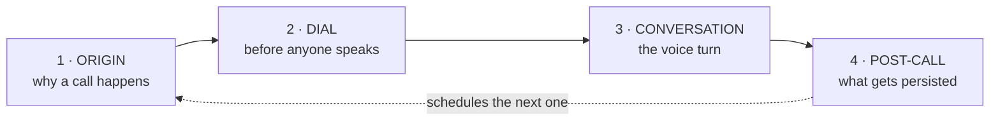
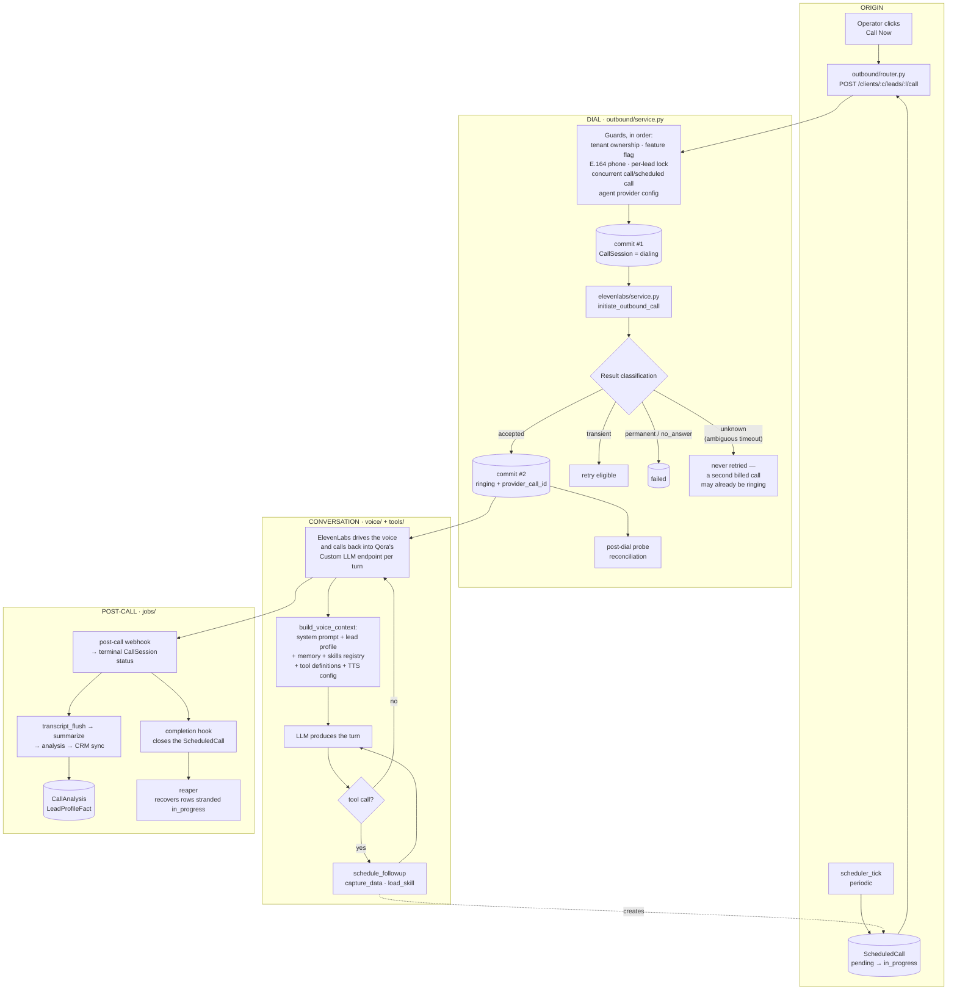

# Anatomy of a Qora Call

> **Orientation document, not a source of truth.** This file exists to answer
> "where am I?" when the codebase feels too big to hold in your head. For
> runtime architecture, configuration ownership, and implementation decisions,
> [`docs/architecture.md`](architecture.md) is canonical and wins on any
> disagreement. For a narrative deep dive with interactive diagrams, see
> [`docs/mapeo/`](mapeo/README.md) — note that it is anchored to an older
> `HEAD` and predates the C6b auto-dialer slices.

## The whole product in four boxes

Every call Qora makes is the same loop. Everything else is detail hanging off
one of these four stages.

The loop closes: a post-call outcome can schedule the next call, which re-enters
at ORIGIN. That closed cycle is the auto-dialer.

## The same loop, with the parts named

## The one thing to remember

`dial_outbound_call` in `backend/app/outbound/service.py` is where the money is
spent. Both entry points converge on it, and everything downstream depends on
its **two-commit flow**:

1. **commit #1** writes a durable `dialing` row *before* the provider is
   contacted. If the process dies mid-dial, the call is still traceable.
2. **commit #2** writes the provider outcome after the response arrives.

The error classification matters as much as the happy path. A read/write
timeout is classified `unknown`, not `transient`, because the request may have
already reached the provider — retrying would place a **second billed call while
the first is ringing**. That distinction is deliberate; do not "simplify" it.

## Where each stage lives

| Stage | Main modules |
|---|---|
| Origin | `app/outbound/router.py`, `app/scheduler/service.py` |
| Dial | `app/outbound/service.py`, `app/elevenlabs/service.py`, `app/phones/` |
| Conversation | `app/voice/`, `app/tools/`, `app/prompts/` |
| Post-call | `app/jobs/handlers/`, `app/analysis/`, `app/integrations/` |

## Flags that gate the loop

All default to `False` and are chained — enabling the auto-dialer is not one
switch:

- `ENABLE_OUTBOUND_CALLS` — requires `QORA_WEBHOOK_AUTH_ENABLED=true`
  (enforced by a settings validator).
- `ENABLE_AUTO_DIALER` — requires `ENABLE_OUTBOUND_CALLS`.
- `ENABLE_JOB_EXECUTOR` — without it the post-call stage does not run.

Phone numbers are normalized fail-closed for Argentina only
(`app/phones/normalization.py`). A non-AR number is rejected with HTTP 422
before any dial is attempted.
